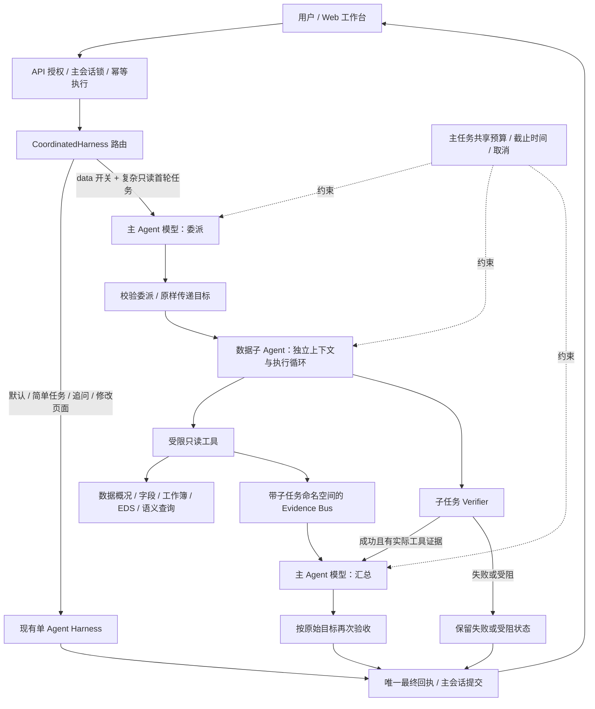
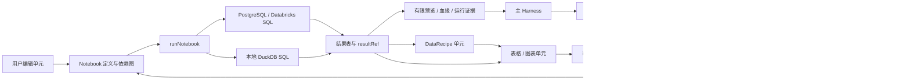

# AgentCanvas Agent 架构

最后更新：2026-09-13。此文档为 Agent 架构的唯一维护入口，随代码变化同步更新。

<!-- agent-architecture-source-sha256: c98262a98e93ccd62b25a0a01f3eb713199795386e90ebeddeda722cafb8376d -->

## 当前实现与启用状态

| 项目 | 状态 |
| --- | --- |
| 单 Agent Harness | 已有实现；默认执行路径 |
| 可视化测试页 | `/visualization-lab` 已实现，开发站通过交互与单次真实折线图生成验证；固定合成数据、独立预览、数值检查与人工评定，使用现有主 Agent；未发布稳定站 |
| 主 Agent + 数据子 Agent | 源码新增串行最小闭环；通过服务端开关选择 |
| 分析 / 可视化子 Agent | 规划中，尚未实现独立角色 |
| 可视化委派链条专项设计 | [设计 v1](./visualization-agent-design.md) 已完成；首阶段为一个可视化角色 + 折线图专项 Skill，热力图与动态能力分阶段扩展；尚未实现 |
| Hex 可视化技术路线研究 | [研究与接入建议](./hex-visualization-research.md) 已完成；优先验证 Vega-Lite，比较直接编译与 Flint；VegaFusion 后续评估，候选尚未接入 |
| 并发、子任务依赖图、递归委派 | 尚未实现；第一版每个主任务最多委派一次 |
| 稳定站部署 | 本次变更尚未发布到 3000；源码变更不代表稳定站已启用 |
| 本地项目 + Data Browser | 源码已实现，3001 本地浏览器验收通过；项目数据与定义持久化，临时模式保留；未发布稳定站 |
| SQL 连接 + Notebook DataRecipe + Agent 对接 | 第一阶段源码已实现，开发站可用；真实数据库联调与稳定站发布尚未执行 |

第一版验证角色隔离、真实工具执行、证据验收、共享预算、取消和统一交付。尚未通过真实模型的成本 / 时延对比评测，不能宣称多 Agent 比单 Agent 更快或更准确。

## 系统框图



## 模块与代码入口

以下路径相对 `site/`。

| 模块 | 代码 | 职责与边界 |
| --- | --- | --- |
| API | `app/api/ai/harness/handler.ts` | 身份和数据授权、上下文准备；主会话只进入并提交一次；JSON / SSE 复用 |
| 主 Agent 编排 | `core/harness/agents/coordinator.ts` | 路由、模型委派、独立子任务、验证后汇总、统一事件与结果 |
| 角色注册 | `core/harness/agents/registry.ts` | 数据角色说明、工具白名单、保守路由；当前只有数据子角色 |
| Agent 协议 | `core/harness/agents/contracts.ts` | Agent 身份、父子任务关系、子任务状态和证据引用 |
| 共享预算 | `core/harness/agents/budget.ts` | 主 / 子调用共享账本；调用前预留、实际用量结算，失败不能重置额度 |
| 子任务执行 | `core/harness/deepseek-harness.ts` | 复用原有循环与验证；子任务注入仅含 next 的模型接口，使用现有规则计划 |
| Context Runtime 相关能力 | `core/harness/context-selector.ts` | 上下文选择、压缩、工作记忆；角色隔离由 coordinator 组装受限请求 |
| 工具 | `core/harness/tool-registry.ts` | 参数校验、执行和数据范围；业务处理复用原有领域模块 |
| 证据 | `core/harness/evidence-bus.ts` | 增加可选命名空间，合并后可辨认子任务证据 |
| 规划与验证 | `execution-planner.ts`、`task-verifier.ts`、`visual-verifier.ts`（均在 `core/harness/`） | 计划完成度、工具证据、产物、页面保护及视觉验收 |
| 会话 | `core/harness/server/conversation-store.ts` | 身份 / 会话 / 页面隔离；最近 10 轮、滚动摘要、工作记忆与可配置本地持久化 |
| 事件与显示 | `core/harness/stream.ts`、`components/studio/HarnessTrace.tsx` | 保持一条主任务 SSE 流；事件包含 Agent 归属，消息显示角色前缀 |
| 可视化测试 | `app/visualization-lab`、`components/visualization-lab`、`core/visualization-lab`、`app/api/ai/visualization-lab/stream` | 独立题目与预览、固定数据与独立汇总校验、SSE 实际回执、人工评价和报告；不改变正式看板 |
| 数据与外部能力 | `core/notebook`、`core/semantic`、`core/wecom`、`core/harness/mcp` | 保留原实现；数据子 Agent 不调用 Notebook 执行、导出或外部 MCP |
| 本地项目存储 | `core/projects/contracts.ts`、`server/store.ts`、`server/request.ts` | 有界项目清单、不可覆盖的数据快照、项目句柄、同源限制及 DatasetRepository 适配 |
| 本地项目 API | `app/api/projects`、`app/api/datasets`、`app/api/notebook/run` | 创建/打开、原件下载、保存、回收站；已有导入和 Notebook 请求按项目选择仓库 |
| Data Browser | `components/studio/projects`、`core/projects/client.ts` | 资源分类、项目切换、自动保存队列、冲突提示；StudioWorkspace 保持组合和显式确认 |
| 工作台视觉 | `app/studio-theme.css`、`components/studio/AgentWorkspace.tsx`、`StudioArtwork.tsx` | 黑白灰与暖灰表面、建议入口、模式图标；纯界面呈现，建议仍仅填写共享草稿 |

上下文选择、工具注册、规划与验证仍包含具体业务判断。新增角色时需逐步整理这些边界；当前实现不等于全部能力已插件化。

## 工作台视觉与交互（2026-09-13）

源码新增统一浅色视觉层，覆盖 AI 工作台、Notebook、看板外框、Data Browser 与常用菜单。`StudioHeader` 将次要演示操作收进已有“更多”菜单；`AiBuilderAssistant` 简化界面说明，保留加载与授权状态的条件分支。`DataProductCanvas` 只对空白看板添加自适应布局，已有图表的显式样式仍按原定义渲染。灰度 SVG 是装饰，不代表运行结果或证据。

二轮复核修正了首轮仅用空白页面验收造成的覆盖不足。`globals.css`、`semantic-models.css`、`notebook.css`、`data-browser.css`、聊天 / 上下文 / 执行轨迹及企业微信样式改用统一 `--studio-*` 色板，包含有数据的表格、语义编辑与预览、Notebook 编辑与执行结果、EDS、原始工作簿及历史记录。`studio-theme.css` 对接 Puck 的 root 主题变量，覆盖编辑器、浮层和同步样式的预览 iframe；预览定位说明改成“边框标记区域”。成功、错误和授权提示保留状态含义，图表数据系列的显式颜色独立于界面主题。没有新增运行开关或改变数据、Agent 和确认接口。

接口和运行条件：无新增配置开关；`onSuggestion` 仍只更新同一个指令输入框，模式切换继续复用聊天、附件、上下文选择和确认操作。角色、委派、模型调用、工具、预算、数据授权、Notebook 运行及持久化接口未调整。主题默认随当前源码载入，不把黑色选中态当作权限、发布或任务成功的证明。

启用状态：开发站 3001 已载入，稳定站 3000 和便携包未发布。桌面与移动端视觉及交互验证通过；没有运行真实模型或数据库任务。最终结果见验证记录。视觉规范见 [网站视觉设计规范](../visual-design.md)，每次实际修改见根目录 `TASK-LOG.md`。

## 路由与权限

服务端配置 `HARNESS_MULTI_AGENT_MODE=single|data`，默认 `single`，只有 `data` 尝试委派。

条件：现有规则判为多步骤；所需工具全部属于数据角色；不包含写操作、页面 / 视觉检查、配方执行、导出、Notebook、分析计划或外部调用；没有待承接的历史消息 / 工作记忆。模型调用上限小于 4 时沿用单 Agent。Live 评测保持单 Agent 路径。

首轮示例：`检查零售数据，进行字段分析并核对空值，给出具体结论。`

白名单：`inspectDataset`、`inspectFields`、`querySemanticModel`、`analyzeEdsReports`、`scanEdsRawWorkbook`、`queryEdsRawWorkbook`、`inspectEdsRawWorkbook`、`readEdsRawRows`。

工具目录与执行入口都检查角色范围。子请求固定为 viewer，按本轮相关数据源缩小元数据、配方和运行数据，保留已授权的原始工作簿。没有外部运行时或页面变更工具。语义查询的只读表格产物允许保留。

委派仅接受 `delegateDataTask` 和空参数对象；目标来自原始请求。模型不能通过参数改写目标、提高权限或替换数据范围。

## 上下文、身份和证据

- 主 Agent 获得原始目标、范围内的数据源描述及精简回执，不获得整份原始数据。
- 子任务使用独立任务标识和工作记忆，清除 conversation_id / conversationContext，不进入主会话存储。
- 每次模型请求均重新执行原有数据授权检查，保留授权撤回机制。
- 主 / 子可共用模型适配器，但输入各自组装；子 Agent 不继承主 Agent 执行对话。
- 子工具调用和证据 ID 带子任务命名空间；上报精简工具观察、工作记忆和来源引用。
- 子任务 completed 必须同时有 Verifier passed 和实际工具观察，才能进入主 Agent 汇总。
- 汇总再次通过原始目标的任务级校验。现有 Verifier 主要检查完成条件、工具覆盖、模型版本与页面保护，尚不能完备证明所有自然语言数值或因果声明。

## 预算、终态与事件

主 / 子共享模型与工具次数、输入字符、Prompt Token、输出额度，并预留一次主 Agent 汇总调用。未知用量失败按预留额度记账；实际超限拒绝继续执行。调用前输入额度为保守估计，成功后使用提供方实际用量结算。

主任务有统一截止时间，同时保留单次请求和工具超时。取消传播到子任务，即使模型忽略信号，也通过有界等待结束主任务；迟到结果不能生成事件或修改最终状态。

对外保留原有 `HarnessTaskSummary` 与终态；新增可选 `delegation` 表达父子关系和验收状态，Trace 新增可选 `agent`。SSE 的 taskId 始终是主任务 ID，sequence 连续，只有一个含最终任务的 completed 事件；子任务终态不提前结束用户会话。

## 本地项目、数据范围与持久化

本地模式以用户选择的专用空文件夹为项目库；详细用法和容量边界见 [本地项目与 Data Browser](../local-projects.md)。`agentcanvas.project.json` 保存元数据、AppSpec、DataRecipe、语义模型及工作界面选择、Notebook DAG、ChangeSet 和最近聊天/任务状态；`files/` 保存原件，`tables/` 保存有类型数据与结果快照。仅使用稳定 ID 和相对文件名，不将模型密钥及服务端运行配置写入项目。

客户端按标签页维护当前项目，在数据、Notebook、Harness JSON/SSE 和清除会话请求中传递 `x-agentcanvas-project`。服务端用私有运行目录登记的随机句柄解析项目，不允许模型参数指定任意文件系统路径。Harness 上下文和执行时授权检查均使用本次项目的 DatasetRepository；会话存储与幂等命名空间追加项目句柄，防止同页面/会话 ID 跨项目串用。已有多 Agent 调度、预算、证据和确认机制不变。

项目数据表标记 `storageMode=project`、`ephemeral=false`，不设置临时 TTL；在项目内各工作界面共享。同名表可以有不同 ID，重命名不改变引用；重新载入描述符不会重置用户保存的 DataRecipe。无项目句柄时保留原临时导入/过期路径。敏感字段仍要求用户选择 AI 访问策略，持久化不表示自动授权。Notebook 显式生成看板预览时将结果表存入项目；AppSpec 仍需确认，运行缓存并不全量持久化。

原子清单写入和 `stateRevision` 检查保护保存冲突，发生错误暂停自动保存并保留浏览器中的未保存定义。数据表删除是可恢复归档，服务器复查正式看板、撤销历史、Notebook、语义模型和处理配方引用。路径拒绝符号链接/目录联接与网络目录，文件有容量和摘要校验；项目 API 限制本机回环及同源请求。这不是多用户授权或加密存储，项目中的数据和聊天仍需按私有资料保管。

运行条件：现有 `STUDIO_LOCAL_STATE_DIR` 已配置即可启用本地项目登记；不新增默认开启的模型调用、数据库连接或外部 MCP。源码接入不代表 3000 或便携包已更新。本版未实现原件自动重建浏览器 File、任意目录自动扫描、完整服务端长期会话迁移、多人协作或永久清空回收站。

## Hex 风格 Notebook 与 Agent 共用执行链路（2026-09-13）

本节是当前唯一维护入口中的新增实现说明。源码已实现，尚未发布到 3000；连接器的协议测试不能代替真实数据库联调。



### 当前实现

- 手动编辑与 Agent `createNotebookDraft` 使用同一个单元契约和 `runNotebook`。新增 `warehouseSql`（connectionId、sql、outputName）与 `transform`（inputCellId、outputName、DataRecipe steps）。DataRecipe 处理上游完整结果，输出可继续进入本地 SQL、表格或图表，不要求先保存 Dataset。
- `core/connections/contracts.ts` 定义公开连接目录；`server/config.ts` 从服务端 `STUDIO_SQL_CONNECTIONS` 读取连接及项目范围；`server/query.ts` 适配 PostgreSQL 和 Databricks。`GET /api/connections` 列出项目连接，`POST` 提供连接测试 / 字段目录；手动查询从 `/api/notebook/run` 进入同一运行时。
- `inspectConnectionSchema` 是主 Harness 的只读工具，读取已经授权给 Agent 的表 / 列目录；`createAnalysisPlan` 支持 warehouseSql / transform，Notebook 编译校验不允许更换计划连接。API 丢弃客户端声明的连接权限，重新注入服务端目录；工具执行与模型调用前检查授权。数据子 Agent 白名单未扩大，Notebook / 数据库流程仍由主 Harness 完成。
- 连接目录读取在计划 / 草稿期间可继续分页或查询其他已授权连接，仍占用原任务调用与时间预算。模型侧 Notebook / Plan 参数目录压缩重复的类型与长度约束以适配既有单次输入预算；执行入口继续使用完整 Zod Schema，未放宽运行校验。
- `NotebookCellRun.resultRef` 包含 resultId、runId、cellId、revision、inputResultIds、rowCount、complete、dataSignature、accessMode。Agent 有限结果预览和用户界面共用此契约；AI 授权试运行与人工运行分别标记，不声称两次运行具有相同身份或敏感字段处理结果。该引用目前是运行证据，不是可跨会话下载数据的地址。
- SQL / DataRecipe / warehouseSql 草稿必须实际试运行；采用草稿仍检查 revision，人工采用后重新运行。API 运行与 Agent 运行共用执行器。结果存在页面内存；上游编辑或重跑使受影响结果失效，取消后的迟到结果不生成成功输出。
- `/api/notebook/run` 的 `dataset` action 可选保存完整结果，复用项目数据集存储并记录 Notebook 运行来源。`snapshot` action 保留原看板 ChangeSet 预览流程；外部 SQL 的人工保存结果重新要求 AI 数据授权，避免列别名掩盖敏感来源。

### 开关、权限与能力边界

- 默认无外部连接。`STUDIO_SQL_CONNECTIONS` 是服务端 JSON 配置，连接凭据引用独立环境变量；projects 明确列出 `local` 或本机项目 handle，allowAi 默认 false。凭据、主机与配置路径不进入 Agent 上下文、浏览器连接目录或结果引用。当前连接管理是服务端配置加界面浏览 / 测试，没有图形化凭据编辑。
- PostgreSQL 使用独立连接和 `BEGIN READ ONLY`，远端账户还必须按最小权限配置；SQL 关键词检查只是提前报错，不是权限边界。Databricks 使用只读授权的 Warehouse 身份和 Statement Execution API。后端限制两个并发查询、单次 12 秒、1000 行 / 2 MiB，具体配置见 `docs/sql-connections.md`。
- 第一阶段只支持受限表结果模式。远端大表先执行 SQL 筛选 / 聚合；截断 / 多块未取全的结果不能进入 DataRecipe 或下游 SQL。尚未实现远程 Query 引用、SQL 下推编译、远端 Chained SQL、Python 内核、缓存复用、后台自动重算、参数单元或 App 版本发布。这些属于后续规划，不能将当前快照看板描述为 Hex 的响应式已发布 App。
- 当前系统仍是本机单用户身份；连接 API 要求本机同源访问。项目范围是本机项目隔离配置，不是多人 RBAC。数据库查询预算是确定性并发 / 时间 / 行数限制，尚无数仓费用估算与账单预算。Databricks 在拿到 statement ID 后取消，提交响应丢失时不能保证远端查询已终止，需结合数仓超时管理。

### 验证状态

本地真实 SQL / DataRecipe 与连接器协议测试通过；脚本模型通过连接目录 → 计划 → Notebook 配方 / 图表草稿的完整 Harness 流程。浏览器验证通过手动配方编辑、直接绘图、重跑失效、可选 Dataset 保存及移动端控件不重叠。真实 PostgreSQL / Databricks 凭据未配置，数据库联调仍未验证。

2026-09-13 后续使用已有数据进行真实模型验收：48 行零售示例的手动 SQL → DataRecipe → 图表 → Dataset → 看板预览与确认操作通过，独立核对总收入为 3,248,000；21 行已有导入表的行数与各列空值统计通过。快照看板的柱形与分类标签错位，视觉验收未通过。真实 `deepseek-flash` 的 Notebook 生成在首次业务工具调用前触发 10,000 字符上下文限制，未生成草稿；导入表质量检查在两个读取工具成功后误入数据处理工具并以 `protocolViolation` 结束。因此真实 Agent 端到端验收未通过，不能以此前脚本模型或手动结果替代。详见 [已有数据验收报告](../verification/notebook-existing-data-2026-09-13.md)；本次只增加验收脚本和记录，未修改运行路径、预算或授权。

## 持续维护与检查（命令）

根目录 `AGENTS.md` 要求每次 Agent 变化同步更新本文件：实现状态、受影响模块、接口、边界、验证结果和下方变更记录。正文审核后执行：

```text
npm run docs:agent:sync
npm run docs:agent:check
npm test
npm run typecheck
npm run build
```

测试与构建前自动检查源码指纹。覆盖 `core/harness`、`app/api/ai/harness`、`core/notebook`、`core/semantic`、`core/wecom`、`core/projects`、`app/api/projects`、`core/connections`、`app/api/connections`、`app/api/notebook` 的实现和 Skill 文档，排除测试 / 夹具。源码变更而指纹未更新时检查失败。

指纹只能检测维护状态是否过期，不能证明正文准确。禁止只刷新指纹而不审核正文。范围外的模型、权限、UI、数据层变化若影响 Agent 架构，同样必须人工更新。

本机运行与发布遵守 [STABLE-RUNTIME.md](../../STABLE-RUNTIME.md)。

## 验证记录

- 2026-09-13 已有数据专项：手动浏览器 8 项操作检查通过，页面异常 0；已有项目全行数及逐列空值独立核对通过，只读复核前后数据、项目清单与 AI 策略不变。两个真实 Agent 用例均未通过：Notebook 为 `contextBudgetExceeded`，字段检查后为 `protocolViolation`。最终浏览器结果 `.runtime/notebook-existing-2026-09-13T14-53-27-850Z/report.json` 明确 `manualPassed=true`、`dashboardVisual.passed=false`、`passed=false`：快照看板四根柱形与标签中心偏差约 25–159 像素。导入表报告 `.runtime/existing-project-check-2026-09-13T14-49-46-793Z/report.json` 明确 `localPassed=true`、`passed=false`。详细范围、原始失败回执与复测方法见专项报告。未发布稳定站，未执行真实数据库联调或全量应用回归。

- 2026-09-13 视觉遗漏复核：隔离 Edge 完成 30 个桌面 / 手机页面状态，真实导入合成 CSV、语义求和预览、Notebook 本机 SQL 得到 150 / 80、图表渲染、看板预览 / 确认 / 编辑选中态、历史和发布准备弹窗；浏览器异常 0，模型调用 0，创建的临时 Dataset 已按 ID 删除。本地项目既有浏览器脚本 10 项检查、可视化测试页的合成 SSE 回放 8 项检查通过；另验证聊天流的成功 / 失败 / 取消，以及企业微信的模拟授权状态。界面配色检查保留明确状态色，预览边框的最后一处紫色已修正。证据在 `.runtime/visual-audit-2026-09-13/`，详见视觉规范；不代表真实模型、企业账号或外部数据库验收，未发布稳定站。
- 同轮交付检查：11 个现有组件测试文件、50 项测试通过；类型检查、`DataProductCanvas.tsx` ESLint、架构同步 / 检查及生产构建通过。另重新通过六种尺寸的导航、共享草稿 / 附件、上下文与侧栏浏览器检查。Data Browser 主按钮悬停对比度约 12.08:1；构建保留大 chunk 提示，三个受管服务健康且未启停。

- 2026-09-13 黑白灰视觉优化：6 个现有组件测试文件、18 项测试通过；类型检查、修改 TSX 文件的 ESLint、架构维护检查和包含主题的生产构建通过。隔离 Edge 在六种屏幕尺寸下检查共享草稿与附件、三种模式、键盘切换、菜单、手机侧栏、刷新及布局；浏览器异常 0、模型请求 0，未执行真实数据写入。已人工复核截图。验收证据在 `.runtime/visual-refresh/`，详见视觉规范。稳定站未发布，构建仍有客户端大 chunk 提示；这轮验证不能替代 Notebook 执行或真实模型质量验收。

- 2026-09-13 SQL / Notebook 第一阶段最终验证：当前工作区全量离线测试 888 通过、3 跳过，另有 14 项 Node 工具测试通过；类型检查、相关 ESLint、生产构建与架构检查器测试通过。构建仅保留客户端 chunk 超过 500 kB 提示。此前连接测试缺少 NODE_ENV 的类型问题已修正。日志为 `evidence/sql-notebook-offline-tests.log`、`evidence/sql-notebook-build.log`。
- 浏览器：`scripts/notebook-browser-acceptance.mjs` 既有完整流程通过；`scripts/notebook-transform-browser-acceptance.mjs` 新增配方编辑 → 图表 → Dataset / 失效 / 窄屏验证通过。证据位于 `evidence/notebook-2026-09-13T13-07-01-159Z` 与 `evidence/notebook-transform-2026-09-13T13-16-41-778Z`。已人工检查截图并修复窄屏控件重叠，增加控件不重叠检测。测试使用隔离浏览器与合成数据，已清理自身上传 ID。并发全量测试期间曾触发本地 SQL 的 8 秒保护超时，串行浏览器复测通过，未提高生产超时。
- 服务：为加载新的数据集校验契约，通过受管命令重启开发站一次；稳定站未发布、未重启。真实外部数据库与真实模型尚未联调。

- 2026-09-13 本地项目与 Data Browser：新增 27 项测试覆盖独立目录创建、重新打开及复制、内容校验、并发版本、原件关联、共享资源、配方保留、引用/回收站保护、请求大小/取消、同源与项目会话隔离。全量 `npm test` 888 项通过、3 项跳过，另有 14 项 Node 工具测试通过；报告为 `.runtime/local-project-vitest.json`。
- 本地项目浏览器验收：`node scripts/local-project-browser-acceptance.mjs` 的 10 项检查通过。真实导入合成 CSV / XLSX、重命名/归档/恢复、语义模型创建与刷新、真实本地 SQL 聚合得到 15 / 20、图表渲染、结果快照、Notebook 刷新与退出项目保留临时定义；没有调用付费模型或真实数据库。浏览器异常和控制台 error 均为 0，桌面、窄屏、语义计算及 Notebook 图表截图已人工检查。证据：`.runtime/local-project-browser-2026-09-13T13-23-42-437Z/`。合成项目与截图保留用于复核，不包含用户原始文件。
- 本地项目阶段：全量类型检查、相关 ESLint、生产构建、架构指纹及检查器测试通过；构建仍有大于 500 kB 的客户端 chunk 提醒。本阶段补齐连接器测试环境的 `NODE_ENV` 和工具目录新增项的预期，没有修改连接逻辑；下方旧阶段的两项类型错误已在此次全量检查中消除。未发布 3000、未重新打包便携版；最终三个服务健康，稳定站 PID 与版本未改变。

> 此前补充委派策略时，Notebook 等模块的后续修改曾导致源码指纹检查未通过。本次可视化链条设计交付时，维护检查已通过（71 个文件）；这只证明指纹一致，不替代对后续代码修改的运行验证，下方旧测试结果仍属于当时的实现基线。

- 2026-09-13：新增 14 项离线测试通过，覆盖串行闭环、真实数据工具、API、主会话单次提交、非法委派、越权、假完成、范围隔离、授权撤回、共享预算、取消、迟到结果与 SSE 顺序。
- 全量 `npm test`：838 项通过、3 项跳过，另有 14 项 Node 工具测试通过。最后的取消信号调整后，相关 23 项测试再次通过。
- `npm run typecheck`、新增模块的 ESLint 检查、`npm run build` 均通过。构建仅提示部分客户端 chunk 大于 500 kB。
- `npm run docs:agent:test` 通过：隔离临时目录验证源码变化会使检查失败、测试文件和 CRLF 变化不会误报、缺少指纹时拒绝同步。
- `npm run site:status`：稳定站、开发站和截图服务均为 ok；本轮未重启或停止服务。
- 真实模型协作质量、成本与时延：尚未评测。
- 稳定站发布：尚未执行。

## 变更记录

### 失败结果解释（2026-09-13）

Harness 保留失败状态、error 和 terminationCode，聊天正文优先显示 resultMessage。failure-response.ts 使用受控事实解释密钥、网络、权限、字段和预算问题；已完成进度仅来自成功工具事件和固定的工具说明，不发送原始工具错误或数据行。工具失败后的解释可使用一次无工具模型调用，仅在原任务时间、调用次数和上下文预算充足时执行，最多 5 秒，并再次核对数据授权。模型使用独立的失败解释系统提示词，contextUsage.requests 记录 failureExplanation 阶段，计入实际用量；无法取得用量时保留预算估算。接口异常、解释超时、格式错误或明显编造原因时回退本地说明，不重试解释；取消可以中断解释。恢复过程中模型接口失败也直接使用本地说明，不额外调用同一个异常接口。当前自然语言检查仅能拦截明显违规表述，不能作为完整的事实核验。

这轮不改变任务验收标准。审计与可展开的执行详情仍保留技术错误；聊天中的失败说明使用“当前看板没有改动”等用户可理解的措辞。已有 blocked 回复继续沿用原来的缺少条件说明；请求进入 Harness 之前的 HTTP、网络和认证错误由客户端转换为本地解释。相同错误已经出现在当前聊天回复时，不再重复显示红色错误卡，保留重试入口；其他操作的新错误仍单独显示。多 Agent 主任务异常也使用本地解释，子任务解释沿共享预算记账。未发布稳定站。

真实模型专项验收：使用合成数据和受控工具失败，分别验证未取得结果与前序步骤成功两种场景；解释阶段实际调用 deepseek-flash，执行阶段用脚本动作触发失败。最终两种场景的解释均被接受，耗时约 1.1 秒；失败状态和原始 AppSpec 保持不变，能说明已经读取概况但后续尚未完成。记录保存在本机忽略目录 `.runtime/failure-explanation/live-report.json`；这属于小样本质量验证，不代表所有任务和模型均已验证。`scripts/verify-harness-failure-ui.mjs` 在隔离浏览器回放真实回复，经过开发站的实际 SSE 解析与 React 界面，验证聊天只显示一次、详情可展开、重试可再次提交，以及断网和认证错误的本地回退；该浏览器步骤不调用模型。

本轮回归：全量离线测试 900 通过、3 跳过，另有 14 项 Node 工具测试通过；全局类型检查、相关 ESLint、浏览器回放均通过。整站构建在并行开发的 VisualizationLab 页面处中断：第一次缺少组件，组件出现后仍缺少 VisualizationLab.module.css；该未完成页面不属于失败解释改动。构建日志保存在 `.runtime/failure-explanation/build.log`。未发布或重启稳定站。

| 日期 | 变更 | 影响与状态 |
| --- | --- | --- |
| 2026-09-13 | 新增可视化测试页、固定示例数据的专用 SSE 入口、独立数值校验与人工报告；修正通用图表提示 Schema 强制筛选的问题 | 复用现有主 Agent 和 Recharts；隔离项目/会话/外部 MCP，候选在浏览器检查；10 项新增测试、浏览器回放和单次真实模型生成通过，未发布稳定站 |
| 2026-09-13 | 新增已有数据的 Notebook 浏览器与项目质量验收脚本，记录真实模型及快照图表问题 | 仅验收与文档；手动操作通过，真实 Agent 两个用例与看板标签对齐未通过；待修复上下文、质量检查路由与图表布局，未发布稳定站 |
| 2026-09-13 | 按用户参考图统一黑白灰视觉，更新工作台建议入口、空白看板、模式图标与用户提示 | 纯展示与布局；共享草稿、确认和 Agent 执行契约不变；组件、类型、构建及六种尺寸浏览器验收通过，未发布稳定站 |
| 2026-09-13 | 复核并补齐有数据页面、语义模型、Notebook 编辑与结果、EDS、历史和 Puck 编辑器的统一主题；提高详情文字可读性 | 修正首轮空白页验收覆盖不足；只改展示样式与预览定位文案，合成数据及模拟事件浏览器验收通过，稳定站未发布 |
| 2026-09-13 | PostgreSQL / Databricks 连接适配、项目与 Agent 授权、字段目录工具 | 源码已实现；默认无连接，allowAi 默认 false；协议测试通过，真实数据库未联调 |
| 2026-09-13 | Notebook warehouseSql / DataRecipe 单元、统一结果引用、可选 Dataset 保存、重跑失效 | 手动与 Agent 共用执行器；脚本模型 / 本地 SQL / 浏览器验证通过；未发布稳定站，Query 模式及响应式 App 发布仍为规划 |
| 2026-09-13 | 失败结果解释层与聊天错误展示 | 独立解释提示词、原任务预算、部分进度、本地回退与聊天去重；两类合成失败通过真实模型验收 |
| 2026-09-13 | 建立架构维护入口、AGENTS 同步规则、源码指纹检查 | 测试与构建前校验文档维护状态 |
| 2026-09-13 | 主 Agent → 数据子 Agent → 验证 → 汇总最小闭环 | 新增 data 开关；默认 single；尚未发布 |
| 2026-09-13 | 共享预算、子任务证据命名空间、公开 Agent 身份 | 不扩大权限；保留单会话与唯一最终回执 |
| 2026-09-13 | 完成离线回归、类型检查、构建及文档检查器验证 | 验证通过；真实模型评测与稳定站发布仍待后续执行 |
| 2026-09-13 | 本地项目库、Data Browser、项目范围的上传/Notebook/Harness、保存冲突及回收站 | 新增本机单用户路径；不扩大 AI 授权；单元/浏览器/类型/构建验证通过，未发布稳定站 |
| 2026-09-13 | 明确按专长与上下文开销委派、限长结构化回传及产物引用策略 | 设计补充；动态专家选择、上下文驱动拆分和可视化子角色尚未实现 |
| 2026-09-13 | 完成可视化委派链条专项设计 v1，细化专项 Skill、工具门控、回传协议和预览验收 | 文档设计；优先折线图，热力图 / 动态能力分阶段实现，未改运行代码 |
| 2026-09-13 | 核对 Hex 图表路线，新增 Vega-Lite / VegaFusion / Flint 与专项 Skill 研究、接口建议和验收顺序 | 研究与设计；尚未安装候选依赖或改动执行路径，生产选型待原型验证 |

## 按专长与上下文开销委派（下一阶段设计）

以下是目标设计，尚未替代第一版的固定规则、单次数据委派。

委派有两个独立动机：任务需要某个角色的专用工具、Skill 和验收方法；任务包含大量可以独立处理的局部细节，需要隔离这些细节对主会话的占用。主 Agent 应在规划时判断是否委派，不必等待自己执行失败或上下文超限。

| 触发条件 | 目标行为 | 当前差距 |
| --- | --- | --- |
| 可视化、专项分析等任务与某角色能力匹配 | 主 Agent 根据能力注册表选择合适角色，确定输入、目标、权限和完成条件 | 当前只有数据角色，未实现动态专家选择 |
| 预计读取或执行产生大量中间结果 | 将有清晰边界的子目标交给独立上下文执行，回传限长结果与引用 | 已有上下文隔离；尚无基于上下文开销的自动拆分策略 |
| 主 Agent 执行受阻，但已注册角色有对应工具或处理策略 | 根据失败证据重新委派，保留原目标和已完成工作 | 尚无跨角色的能力补足与重新委派 |

角色专长由可用工具、Skill、上下文选择和验收策略体现。角色可使用同一个模型；增加角色名称本身不能保证能力或准确率提升。主 Agent 保留整体目标和最终交付责任，确定性调度器负责验证委派、限制预算、取消及状态流转。

可视化示例（目标流程）：用户要求分析异常并制作看板 → 数据子 Agent 查询和聚合 → 可视化子 Agent 按结果引用生成图表与 ChangeSet 预览 → 统一验证 → 主 Agent 汇总交付。可视化子 Agent 尚未实现，当前可视化任务仍走原有单 Agent 路径。

子任务的目标回传协议应包含：状态、限长结论、关键发现及对应证据引用、结果表 / 图表 / 预览的产物引用、未解决问题和用量。大结果保存在受控数据或产物层，主 Agent 按需读取摘要、分页或聚合，不把子任务的完整对话与中间输出重新灌入主上下文。该通用产物引用读取协议尚未实现；当前数据子任务回传的是精简回复、工作记忆、最近工具观察及证据 ID。

大量原始数据应由查询、聚合等执行工具处理；子 Agent 同样受上下文上限约束。委派降低主上下文负担，但不会无限扩大上下文，也不保证减少总 Token 或总时间。主任务继续统一管理预算，并为验证和最终汇总保留额度。

## 可视化测试页（2026-09-13）

`/visualization-lab` 提供五种原生图表题、一道自主选图题和自定义指令；工作台顶部与手机“更多”菜单提供入口。测试页沿用 `--studio-*` 黑白灰色板，图表系列与检查状态保留语义颜色。每轮从含空 `DashboardGrid` 的独立画布开始，使用 `retail_orders` 的 48 行合成数据，不继承项目、Notebook 或历史会话。

客户端复用 Harness SSE 解析器，发送至专用 `POST /api/ai/visualization-lab/stream`。该路由只在服务端选择测试模式，重新构造标准 AppSpec、数据源和空配方，忽略客户端携带的其他上下文，拒绝项目请求头与附件。它复用现有身份、预算、幂等和主 Agent 执行循环，固定单 Agent，隔离幂等命名空间，关闭外部 MCP。测试运行时只提供固定零售数据；没有新增模型或渲染器依赖。通用图表工具的提示 Schema 同步允许 `filters: []`，与执行 Schema 的无筛选语义一致，避免强迫模型添加无关条件。

现有工作台截图服务打开的是独立工作台，不能证明测试候选的视觉质量。专用测试路由因此不注入该截图验证器；浏览器收到 ChangeSet 后，用现有 `previewChangeSet`、`executeChartBinding` 和 Recharts 渲染候选。此选择仅作用于固定合成画布，正式工作台的视觉配置与确认流程仍沿用原实现。测试页没有正式应用按钮。

预置题检查回执、单图结构、图表类型、指标与分组、独立汇总数值、分组覆盖及排序。数值标准从原始行独立汇总，不使用模型返回的配置生成标准答案。DOM 检查仅确认图形元素出现，不评定视觉质量；标题、单位、标签、配色、响应式及自定义需求由人工评价。修改预置提示词后自动转为人工需求核对，不套用原题答案。热力图、动态交互、Vega-Lite 及可视化子 Agent 仍未接入。

每轮使用独立随机幂等键，支持中途取消；当前标签页的 `sessionStorage` 保留最近 8 条记录，单次保存上限 2,000,000 字符。历史包括指令、模型回执、耗时、调用/Token 用量及人工备注，可下载 JSON 报告。报告不写入密钥，不代表正式看板已应用；这属于交互测试入口，不是自动评测所有模型的基准。

浏览器脚本 `scripts/visualization-lab-browser-acceptance.mjs` 默认回放明确标注的 SSE 响应，验证真实组件与交互；只有显式 `--live` 才请求当前配置模型。此模块及专用 API 已纳入架构指纹范围（当前共 80 个源码文件），界面变动仍须同步本文与视觉规范。

验证：新增 10 项测试通过，覆盖隔离请求、正确/错误图表、独立汇总、编辑提示词、真实工具执行、模型可用的容器/无筛选 Schema，以及服务端拒绝项目与上传。全量离线测试 910 通过、3 跳过，另有 14 项 Node 工具测试通过；类型检查、相关 ESLint、生产构建和架构检查器测试通过。浏览器回放的 8 项检查通过，包含渲染、记录刷新、报告、失败/取消和 390px 窄屏；页面异常为 0。证据：`evidence/visualization-lab-2026-09-13T14-59-41-049Z/`、`evidence/visualization-lab-offline-tests.log`、`evidence/visualization-lab-build.log`。

真实模型测试先后发现模型名称不匹配、空白页没有合法绘图容器，以及工作台截图与测试上下文不对应；失败回执保留，未当作成功。通过已有 AI 设置接口刷新模型列表后，开发进程当前模型由环境名称 `deepseek-v4-flash` 切换为提供方返回的 `deepseek-flash`，没有修改密钥或环境文件；此选择只保留在进程内，重启后如仍沿用旧环境名称，需在 API 设置中重新检测可用模型。补齐容器与隔离入口后，一次真实折线图生成返回 `awaitingConfirmation`，7 项规则均通过，12 个月数值和顺序一致；耗时约 7.8 秒，4 次模型调用、2 次工具调用，共 7,741 Token。回执与截图在 `evidence/visualization-lab-live-2026-09-13T14-57-23-774Z/`。这不代表所有题目或视觉质量均已通过真实模型验收；开启数据标签时仍应人工检查边缘裁切及窄屏可读性。

源码与开发站 3001 已可用；稳定站 3000 和便携包未发布。构建保留已有的客户端 chunk 大于 500 kB 提示。

## 可视化委派链条设计（规划）

专项方案见 [可视化子智能体委派链条 v1](./visualization-agent-design.md)。采用主智能体选择任务 → 可视化子智能体独立执行 → 基础 Skill + 图表专项 Skill → 受控工具生成与隔离渲染候选 → 数据 / 结构 / 视觉验证 → 限长结构化回传。

第一阶段以现有单序列折线图能力跑通预览链条；热力图需要新增类型、绑定与组件，动态能力需要分别实现时间播放、筛选联动和实时刷新。当前图表动画关闭，不能把现有图表组件或截图验证当成这些能力已经可用。

数据不足由主智能体安排受控数据准备，子智能体不递归委派。大数据留在执行与产物层，上报摘要、证据和版本化引用。图表变更停在 awaitingConfirmation，候选预览验收与确认后的最终页面验收分别记录。以上属于设计，现有角色、协议、配置和运行路径未改变。

## 后续演进

### Hex 可视化技术路线研究（2026-09-13）

详细来源、能力差距、目标框图与验收方案见 [Hex 可视化路线研究与接入建议](./hex-visualization-research.md)。Hex 公开介绍过内部图表配置编译到 Vega-Lite，以及可视化子智能体创建、检查和迭代图表的流程；没有查到其使用 AntV MCP 的公开证据。[Hex 图表说明](https://hex.tech/blog/making-ai-charts-go-brrrr/)、[子智能体说明](https://hex.tech/blog/cloned-visualization-team/)

建议为新图表能力优先验证 Vega-Lite，比较项目直接编译与 Microsoft Flint Chart 编译两种方式，保留人工与 Agent 共用的精简图表定义。Flint 是独立候选，不能称为 Hex 技术。VegaFusion 后续单独评估，不能将其旧版 DuckDB 接口或浏览器运行方式当成本项目已经实现的服务端数据优化。

当前 Recharts、只读数据子角色、Skill 注册方式和 HARNESS_MULTI_AGENT_MODE 均未改变。后续需补充图表定义与迁移、授权结果引用解析、渲染适配、专项 Skill 和交互验收；当前 Notebook resultRef 仍是运行证据，不是可直接赋给 Vega data.url 的下载地址。研究中的框选、热力图和时间播放不作为已启用能力。

本轮为文档研究，未安装依赖、连接外部 MCP、运行模型或发布。文档维护检查不能代替新渲染器的运行验收。

### 其他演进方向

依次考虑分析角色、可视化角色、独立读取任务的有限并发、依赖图、跨角色产物引用和变更冲突检查。先通过同任务单 / 多 Agent 评测，再决定默认范围与预算。

早期方案和图片位于工作区 `artifacts/data-agent-architecture/`，仅作为历史参考。
