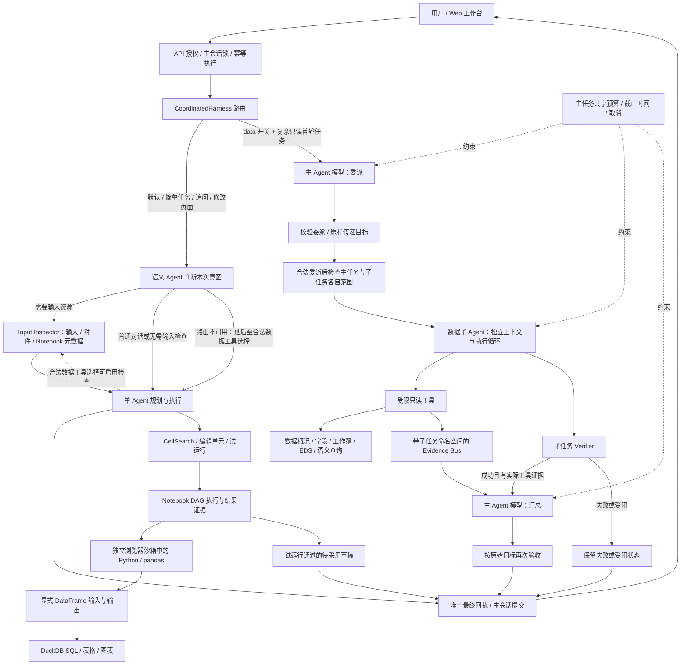
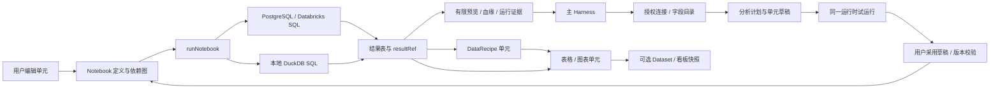

# AgentCanvas Agent 架构

最后更新：2026-09-16。此文档为 Agent 架构的唯一维护入口，随代码变化同步更新。

<!-- agent-architecture-source-sha256: d741c0a01a427f0977fae1b62fd684c2aa791da405e24138fdfed6c9ec681c14 -->

## 当前实现与启用状态

| 项目 | 状态 |
| --- | --- |
| 单 Agent Harness | 已有实现；默认执行路径 |
| 模型本地额度 | 正常网站分析不设单次 / 累计输入字符、Prompt Token、模型调用 / 循环次数或输出 Token 配额；保留服务商限制和执行保护，未发布稳定站 |
| Input Inspector | 已改为 Agent 判断后按需检查：对话跳过，数据 / Notebook 任务才进入；复用既有语义路由或合法工具 / 委派决策，不增加模型调用；未发布稳定站 |
| 可视化测试页 | `/visualization-lab` 已实现，开发站通过交互与单次真实折线图生成验证；固定合成数据、独立预览、数值检查与人工评定，使用现有主 Agent；未发布稳定站 |
| 主 Agent + 数据子 Agent | 源码新增串行最小闭环；通过服务端开关选择 |
| 分析 / 可视化子 Agent | 规划中，尚未实现独立角色 |
| 可视化委派链条专项设计 | [设计 v1](./visualization-agent-design.md) 已完成；首阶段为一个可视化角色 + 折线图专项 Skill，热力图与动态能力分阶段扩展；尚未实现 |
| Hex 可视化技术路线研究 | [研究与接入建议](./hex-visualization-research.md) 已完成；优先验证 Vega-Lite，比较直接编译与 Flint；VegaFusion 后续评估，候选尚未接入 |
| 语义层模块化设计 | [设计 v0.1](./semantic-layer-design.md) 已形成；领域定义、应用端口与适配器分离，先兼容单表，再扩展修订、SQL 和有限关系；本轮仅文档，尚未实现新路径 |
| 并发、子任务依赖图、递归委派 | 尚未实现；第一版每个主任务最多委派一次 |
| 稳定站部署 | 本次变更尚未发布到 3000；源码变更不代表稳定站已启用 |
| 本地项目 + Data Browser | 源码已实现，3001 本地浏览器验收通过；项目数据与定义持久化，临时模式保留；未发布稳定站 |
| SQL 连接 + Notebook DataRecipe + Agent 对接 | 第一阶段源码已实现，开发站可用；真实数据库联调与稳定站发布尚未执行 |
| CellSearch 结构检索 | TypeScript 单元 / 变量索引、上下游遍历、按需源码 / 有效输出和只读回答已实现；自动测试通过，未做真实模型验收或发布稳定站 |
| Notebook Python Runtime | Pyodide / CPython、pandas / NumPy / openpyxl、Python → SQL / 图表和两个 Agent 工具已实现；真实执行与开发站合成数据验收通过，未发布稳定站 |
| 数据目录与 Dataset 来源闭环 | 版本化目录快照、目录检索 / 同步、查询与 Dataset 步骤来源已实现；本地测试和 3001 合成数据验收通过，真实外部数据库尚未联调；未发布稳定站 |

第一版验证角色隔离、真实工具执行、证据验收、共享预算、取消和统一交付。尚未通过真实模型的成本 / 时延对比评测，不能宣称多 Agent 比单 Agent 更快或更准确。

## 系统框图


```mermaid
flowchart TB
  UI[用户 / Web 工作台] --> API[API 授权 / 主会话锁 / 幂等执行]
  API --> Router[CoordinatedHarness 路由]
  Router -->|默认 / 简单任务 / 追问 / 修改页面| Intent[语义 Agent 判断本次意图]
  Intent -->|需要输入资源| Inspector[Input Inspector：输入 / 附件 / Notebook 元数据]
  Intent -->|普通对话或无需输入检查| Single[单 Agent 规划与执行]
  Intent -->|路由不可用：延后至合法数据工具选择| Single
  Inspector --> Single
  Single -.合法数据工具选择可启用检查.-> Inspector
  Router -->|data 开关 + 复杂只读首轮任务| Main[主 Agent 模型：委派]
  Main --> Delegate[校验委派 / 原样传递目标]
  Delegate --> ScopedInspector[合法委派后检查主任务与子任务各自范围]
  ScopedInspector --> Worker[数据子 Agent：独立上下文与执行循环]
  Worker --> Tools[受限只读工具]
  Tools --> Data[数据概况 / 字段 / 工作簿 / EDS / 语义查询]
  Tools --> Evidence[带子任务命名空间的 Evidence Bus]
  Worker --> ChildCheck[子任务 Verifier]
  ChildCheck -->|成功且有实际工具证据| Summary[主 Agent 模型：汇总]
  Evidence --> Summary
  Summary --> FinalCheck[按原始目标再次验收]
  FinalCheck --> Receipt[唯一最终回执 / 主会话提交]
  ChildCheck -->|失败或受阻| Failure[保留失败或受阻状态]
  Failure --> Receipt
  Single --> Receipt
  Single --> NotebookTools[CellSearch / 编辑单元 / 试运行]
  NotebookTools --> NotebookRun[Notebook DAG 执行与结果证据]
  NotebookRun --> Python[独立浏览器沙箱中的 Python / pandas]
  Python --> Frames[显式 DataFrame 输入与输出]
  Frames --> SQL[DuckDB SQL / 表格 / 图表]
  NotebookRun --> Draft[试运行通过的待采用草稿]
  Draft --> Receipt
  Receipt --> UI
  Budget[主任务共享预算 / 截止时间 / 取消] -.约束.-> Main
  Budget -.约束.-> Worker
  Budget -.约束.-> Summary
```

## 模块与代码入口

以下路径相对 `site/`。

| 模块 | 代码 | 职责与边界 |
| --- | --- | --- |
| API | `app/api/ai/harness/handler.ts` | 身份和数据授权、上下文准备；主会话只进入并提交一次；JSON / SSE 复用 |
| 输入预处理 | `core/harness/input-inspector.ts` | 只处理已解析且经过入口校验的元数据，输出有界入口快照；不读文件正文、不执行代码、不作授权或业务验收 |
| 主 Agent 编排 | `core/harness/agents/coordinator.ts` | 路由、模型委派、独立子任务、验证后汇总、统一事件与结果 |
| 角色注册 | `core/harness/agents/registry.ts` | 数据角色说明、工具白名单、保守路由；当前只有数据子角色 |
| Agent 协议 | `core/harness/agents/contracts.ts` | Agent 身份、父子任务关系、子任务状态和证据引用 |
| 共享预算 | `core/harness/agents/budget.ts`、`model-limits.ts` | 主 / 子共享实际用量与工具预算；模型默认无本地配额，显式有限额度时预留并结算，失败不能重置额度 |
| 任务执行 | `core/harness/runtime.ts` | 供应商无关的 HarnessRuntime；复用原有循环、工具、预算与验证；子任务注入仅含 next 的模型接口 |
| 模型适配与组装 | `core/ai/server/deepseek-harness-model.ts`、`harness-composition.ts` | 服务端 DeepSeek HTTP、响应/用量/动作解析及凭据组装；通过 HarnessModel 接入执行器 |
| Context Runtime 相关能力 | `core/harness/context-selector.ts` | 上下文选择、压缩、工作记忆；角色隔离由 coordinator 组装受限请求 |
| 工具 | `core/harness/tool-registry.ts`、`tool-schema.ts` | 参数校验、执行和数据范围；模型目录保留格式规则并共享重复定义，业务处理复用原有领域模块 |
| 证据 | `core/harness/evidence-bus.ts` | 增加可选命名空间，合并后可辨认子任务证据 |
| 规划与验证 | `execution-planner.ts`、`task-verifier.ts`、`visual-verifier.ts`（均在 `core/harness/`） | 计划完成度、工具证据、产物、页面保护及视觉验收 |
| 会话 | `core/harness/server/conversation-store.ts` | 身份 / 会话 / 页面隔离；最近 10 轮、滚动摘要、工作记忆与可配置本地持久化 |
| 事件与显示 | `core/harness/stream.ts`、`components/studio/HarnessTrace.tsx` | 保持一条主任务 SSE 流；事件包含 Agent 归属，消息显示角色前缀 |
| 可视化测试 | `app/visualization-lab`、`components/visualization-lab`、`core/visualization-lab`、`app/api/ai/visualization-lab/stream` | 独立题目与预览、固定数据与独立汇总校验、SSE 实际回执、人工评价和报告；不改变正式看板 |
| 数据与外部能力 | `core/notebook`、`core/semantic`、`core/wecom`、`core/harness/mcp` | 保留原实现；数据子 Agent 不调用 Notebook 执行、导出或外部 MCP |
| Notebook 定义 | `core/notebook/definition.ts`、`contracts.ts` | Notebook 拥有人工编辑与 Agent 草稿共用的单元、草稿和运行结果契约；不依赖 Harness |
| Notebook 结构检索 | `core/notebook/search.ts`、`core/harness/notebook-cell-search.ts` | 纯 TypeScript 单元 / 输出变量索引及 DAG 遍历；Harness 适配按需视图、分页预算与任务内运行身份 |
| Notebook 执行与组装 | `core/notebook/server/execution.ts`、`runtime.ts`、`query-log.ts` | 单元执行依赖 query/python/log 端口；默认 SQL / Python 和文件日志由服务端入口组装，连接授权仍由调用方提供 |
| Python 执行环境 | `core/notebook/server/python-runtime.ts`、`python-program.ts`、`python-files.ts` | 本机浏览器沙箱承载固定 Python 包；原件按当前请求 / 项目解析，DataFrame 转换、取消与错误诊断 |
| Python 安装与状态 | `scripts/setup-python-runtime.mjs`、`python-runtime-lock.json`、`copy-notebook-runtime.mjs`、`app/api/notebook/python/route.ts` | 固定版本 / SHA-256 安装、独立产物复制、资源与浏览器可用性查询；这三个运行资源脚本 / 清单纳入架构指纹 |
| Notebook 界面组合 | `components/studio/notebook/NotebookPanel.tsx`、`NotebookChrome.tsx`、`NotebookCellEditor.tsx`、`NotebookResult.tsx` | 标题与单元编辑、起步入口、输入字段参考、运行结果与快照；问题草稿由 StudioWorkspace 共享，无第二条模型调用路径 |
| Notebook 代码与草稿审阅 | `components/studio/notebook/NotebookSource.tsx`、`NotebookDraftReview.tsx`、`cell-source.ts` | 带行号的 SQL / 规则编辑、源内容折叠、完整单元定义差异；纯展示和契约校验，不新增执行器或模型通道 |
| 数据目录 | `core/metadata/contracts.ts`、`catalog-service.ts`、`server/catalog-repository.ts`、`core/connections/server/catalog.ts` | 范围授权、版本化目录、同步时效 / 完整性、条件写入；通过连接适配器读取源结构 |
| Dataset 来源 | `core/datasets/provenance.ts`、`core/notebook/provenance.ts`、`components/studio/datasets/DatasetProvenance.tsx` | 成功步骤闭包与精确定义、目录 / 查询 / 结果引用，随 Dataset 保存及查看 / 下载 |
| 本地项目存储 | `core/projects/contracts.ts`、`server/store.ts`、`server/request.ts` | 有界项目清单、不可覆盖的数据快照、项目句柄、同源限制及 DatasetRepository 适配 |
| 本地项目 API | `app/api/projects`、`app/api/datasets`、`app/api/notebook/run` | 创建/打开、原件下载、保存、回收站；已有导入和 Notebook 请求按项目选择仓库 |
| Data Browser | `components/studio/projects`、`core/projects/client.ts` | 资源分类、项目切换、自动保存队列、冲突提示；StudioWorkspace 保持组合和显式确认 |
| 工作台视觉与导航 | `app/studio-theme.css`、`app/studio-layout.css`、`components/studio/StudioHeader.tsx`、`WorkspaceNavigation.tsx`、`WorkspaceSidebarRail.tsx`、`AgentWorkspace.tsx`、`StudioIcon.tsx`、`StudioArtwork.tsx` | 暖白表面、单行导航、功能菜单和窄工具栏；建议仅填写共享草稿，菜单连接现有工作区操作 |
| 原始文件侧栏 | `components/studio/files/FilesPanel.tsx`、`file-list.ts`、`app/files-panel.css` | 左侧文件目录、导入 / 下载 / 归档 / 恢复 / 数据预览与状态；复用本地项目 API，临时原件仅保留浏览器 File 引用，不加入 Agent 上下文或持久化正文 |

上下文选择、工具注册、规划与验证仍包含具体业务判断。新增角色时需逐步整理这些边界；当前实现不等于全部能力已插件化。

### Input Inspector（2026-09-16）

`inspectHarnessInput` 是确定性的 TypeScript 元数据检查层。当前顺序是：API 校验 / 授权和既有附件解析 → Agent 判断当前请求 → 按需进入 Inspector → 规划与执行。`handler.ts` 只发出“正在判断本次请求的处理方式”的早期回执，不再调用 Inspector。可选图片模型仍沿用既有前置图片理解流程，不属于本次 Inspector 检查；请求校验、连接目录服务端回填和权限复查也不依赖此门控。

`HarnessRuntime` 复用已有 `classifyIntent` 模型调用，在其成功返回后用 `shouldInspectHarnessInput` 判断：非 conversation 且需要数据、Notebook、分析计划、Excel 或 MCP 能力时才检查。提示要求依据当前请求及必要的历史指代判断，不能仅因项目有数据源、附件、Notebook 或过去做过分析而进入。语义路由契约与 DeepSeek 路由输入不再携带 inputInspection；没有新增独立模型调用或公开工具。普通对话发出“跳过输入检查”的轨迹；模型判断的准确性仍影响是否进入。

无 `classifyIntent` 或路由暂时失败时，规则兜底不触发 Inspector；保留 context_loaded 事件说明“输入检查尚未启用，等待 Agent 判断”，不报告检查完成。执行 Agent 实际返回允许的数据 / Notebook / 连接 / 导出 / MCP 工具后，先通过工具名称、当前目录和计划校验，再检查并执行。后续合法数据工具选择也可启用检查；直接完成、取消和非法工具不触发。多 Agent 模式由主 Agent 的合法 `delegateDataTask` 决策开启检查，服务端通过 `HarnessRuntimeOptions.inputInspectionApproved` 传递已判定状态；子 Agent 从裁剪后的请求重建元数据。委派前和无效委派时均不检查，不额外调用路由模型。

直接注入 Harness 的测试或服务端调用方仍负责提供已授权请求。浏览器不能提交 inputInspection 或 inputInspectionApproved，公开请求 Schema 严格拒绝；开关仅存在于当前服务端运行选项，不是持久化字段或环境配置。快照不进入工作记忆或 Evidence Bus，不满足工具成功 / Verifier 完成条件。

输出 `HarnessInputInspection` 包括输入字符数、范围内数据源描述数量 / 是否选中来源、允许 AI 的连接数量、是否选择语义模型；实际附带的 XLSX 名称 / SHA-256 / 工作表行列规模；图片数量和 MIME 类型；Notebook revision、单元种类与数量、声明的输出名及缺失来源 / 未附带文件计数。工作表行数是解析出的物理行数（可能含表头），不是逻辑记录数、完整扫描或数据分析结论。工作簿名称仅为标签，不授予路径访问；名称脱敏时明确标记，公开执行轨迹只输出计数，不输出文件名、路径、数据或凭据。

`inspectedModelContext(input, compact, enabled)` 默认关闭；`buildHarnessContextSelection` 也显式接收本轮门控状态，避免组装上下文时绕过 Agent 再次检查。仅开启后且有非空 Notebook、工作簿或图片时注入报告；只有 Dataset / 无附件空白 Notebook 的数据任务复用既有描述，避免重复目录。后续执行轮次和主 Agent 汇总使用紧凑投影，Planner 和首轮执行使用普通投影。每个任务重新判断，不沿用上轮启用状态；子 Agent 不能继承主任务其他数据目录。

普通 / 紧凑投影序列化后分别不超过 2,400 / 1,200 字符；最多展示 3 / 1 个工作表与 3 / 0 个声明输出名，进一步超限时按项省略，保留总数和 omitted 计数，必要时明确省略文件名。不截断 JSON，不将省略当成空文档。结果随原模型输入计入既有预算；只有实际启用后的 context_loaded 事件携带检查完成摘要，保持 SSE 协议、幂等和单个 completed 回执。

边界：名称是不可信数据，不作为指令；声明变量不是已执行的 DataFrame。不读取 Excel / CSV 正文到 LLM，不执行 SQL / Python，不扫描项目文件夹或连接数据库，不自动挂载缺失原件；仍由既有工作簿工具、CellSearch、Notebook 执行器和连接工具按需检查。未检查的项目原件目录、当前选中单元、实时内核 / 跨任务输出仍不是已知环境；第一版没有增加这些 UI 或存储字段。输入检查不替代服务端权限与逐次模型 / 工具授权复查，不改变看板 / Notebook 确认机制。

首次 Inspector 接入验证（门控调整前的历史结果）：新增 12 项测试覆盖元数据 / 隐私 / 缺失引用 / 转义后体积 / 模型调用时序 / 防假完成和依赖边界，扩展公开 JSON / SSE 合成附件及主子范围测试。修改前相关 38 项与类型检查通过；接入初轮发现 4 项普通任务预算回归，首份全量快照又发现 1 项空白 Notebook 预算回归和新测试的 2 项类型声明错误。改为避免重复空上下文并修正测试声明，未提高限额或弱化断言；相关 35 项复测通过。

最终 528 文件独立源码快照：`npm test -- --reporter=dot --maxWorkers=2` 为 1,089 项通过 / 3 项原有跳过，另 14 项 Node 工具测试通过；`npm run typecheck -- --incremental false`、12 个变更代码文件严格 ESLint、`npm run build` 和 `npm run docs:agent:test` 均通过。构建仍有已有客户端 chunk 超过 500 kB 的提示；源码比对无漂移。没有环形依赖或前端引入服务器实现。证据：[最终结果](../../.runtime/input-inspector-2026-09-16/validation-final/report.json)、[测试](../../.runtime/input-inspector-2026-09-16/validation-final/tests.log)、[首次失败与修复前记录](../../.runtime/input-inspector-2026-09-16/validation/report.json)。模型均为明确替身，不代表真实模型质量或用户原件端到端验收；未做网页交互验收。源码接入开发站热更新目录，稳定站 3000 未发布，服务未启停。

本次 Agent 前置判断验证（2026-09-16）：修改前相关 51 项通过；新增时序测试先复现 7 项失败。普通对话带附件 / 历史 / 非空 Notebook、数据读取、Notebook 变量追问、路由失败延后、取消、合法 / 无效委派和公开 JSON / SSE 路径共 62 项相关测试通过。初轮全量发现 next-only 模型路径缺少原有 context_loaded 事件，补回真实的等待判断状态后，25 项 Inspector / Stream 测试及 14 项 Node 工具测试通过；未恢复无条件检查或提高配额。

最终工作区全量离线测试 136 个文件通过 / 1 文件跳过，1,137 项通过 / 3 项原有跳过，另 14 项 Node 工具测试通过；全局类型检查、11 个变更代码 / 测试文件严格 ESLint（最终修改的 2 文件补充复查）、生产构建、架构检查器测试和源码指纹检查通过。构建保留已有部分客户端 chunk 超过 500 kB 的提示。证据：[全量复测](../../.runtime/input-inspector-gate-2026-09-16/tests-final.log)、[类型检查](../../.runtime/input-inspector-gate-2026-09-16/typecheck-final.log)、[构建](../../.runtime/input-inspector-gate-2026-09-16/build.log)。模型均为测试替身，未调用真实付费模型、读取用户原件或执行浏览器业务验收；这证明条件接线及事件 / 权限回归，不代表真实模型判断准确率。源码已更新到开发站工作目录，稳定站 3000 未发布，三个受管服务保持健康且未启停。详见根目录 [任务记录](../../../TASK-LOG.md)。

### Notebook 工具字段契约修复（2026-09-16）

模型目录的 `compactNotebookToolSchema` 保留字段与标识符 `pattern`，不再在提示端删除执行端必须满足的命名规则。工具组装完成后由 `tool-schema.ts` 把重复格式合并为该工具内部的标准 JSON Schema `$defs/$ref`，只有实际节省字符才替换；不提高上下文预算。`createAnalysisPlan` 说明明确区分上游 `fields.name` / 已定义的计算列别名和中文 `label/title`；不自动猜测、重命名或宽松接受非法字段。执行仍使用完整 Zod Schema，数据范围、依赖和字段存在性检查不变。

参数错误沿原 `HarnessToolArgumentsError.issueSummary` / `toolCorrection` 回传字段路径、错误码及 Schema 自身的正则要求；列字段另提示使用真实字段标识，不回显非法参数值或任意自定义错误文本。仍最多六项、每项 240 字符；原重试次数、时间 / Token 预算、任务终态不变。Notebook / 分析计划参数重试上下文重新提供当前任务范围内的最小字段名称 / 类型目录，不带表格行、文件字节或范围外数据，避免无成功观察时让模型猜列名。

本次为工具目录 / 纠错上下文修复，没有新增 API、工具、存储字段、运行开关、模型调用阶段或权限；不处理模型名称配置不匹配，不改变原件附件策略、聊天布局或通用失败说明。模型仍可能生成错误参数；一次纠正后再次失败仍保留失败终态，不能保证真实模型每次成功。

验证：新增 13 项测试覆盖格式引用的无损展开 / 自包含、语义 key 提示、非法参数不回显、重试字段目录、六个非法列纠正后真实本地 SQL / 表格 / 图表产物、原预算与人工确认、不修改正式定义及反复非法仍停止。修改前 28 项通过；新测试先复现三个缺口，首次直接恢复所有内联正则导致既有 Notebook 流程超出 10,000 字符，改为共享引用后通过，没有提高预算或弱化断言。修正新测试的嵌套匹配方式后相关 17 项通过，随后增加语义 key 专项并纳入全量。

最终 534 文件独立源码快照：全量 135 个测试文件通过、1 文件跳过，1,113 项通过 / 3 项原有跳过，另 14 项 Node 测试通过；类型检查、5 个变更源码 / 测试文件严格 ESLint、生产构建及架构检查器测试通过，源码比对无漂移。构建保留已有客户端 chunk 大于 500 kB 警告。证据：[验证报告](../../.runtime/plan-field-contract-2026-09-16/validation/report.json)、[全量测试](../../.runtime/plan-field-contract-2026-09-16/validation/tests.log)。测试模型均为脚本替身，实际 SQL 计算只用合成数据；未调用付费模型、操作用户原件或执行浏览器业务验收。源码已接入开发站 3001 热更新目录，稳定站 3000 未发布，三个受管服务保持健康且未启停。

### 原始工作簿默认访问（2026-09-15）

用户已确认导入后默认可按需读取完整 XLSX。普通 `CsvUploadDialog` 与 `EdsAnalysisDialog` 移除原始数据勾选项及布尔状态；`ImportedWorkbookAttachment` 只保存 File 和工作表名称，EDS 创建回调变为 results / activeResultIndex / source 三参数。`workspace/datasets.ts` 按所选数据源查找会话原件，分析时直接传递；`workspace/assistant.ts` 按原件是否存在与当前 / 追问是否需要原始工作簿决定 multipart 附件，不再检查 aiRawAccess。没有新增环境开关或浏览器授权偏好；会话内旧对象的多余布尔字段也不再限制读取。

`OriginalWorkbookDialog`、`PageStructurePanel` 和助手按原件是否可用显示说明。`context-selector.ts`、`tool-registry.ts` 与 `skills/workbook-analysis` 的运行指令及 SKILL 文档移除重新勾选要求：缺少原件时提示重新导入；有原件时继续 scan → query / 行列读取。默认可读不等于每条聊天都附带原件，也不把整份工作簿直接注入模型：现有服务端文件解析、摘要 / 哈希 / 工作表清单校验、完整扫描、聚合及最多 30 条可溯源查询结果保持原实现。原始文件内容仍是数据，不能作为额外工具指令。

文件引用仍仅在浏览器会话内保存，不进入 localStorage、聊天正文或工作区备份；本地项目原件仍由既有项目文件接口保存到用户选择的目录。刷新或切换项目后未重新挂载原件时，已有数据源可继续查询，完整 XLSX 分析需要重新导入原件。没有新增项目原件自动挂载或访问外部目录能力，也不改变 Dataset 敏感字段策略、数据库 allowAi、工具预算、SSE、看板确认和服务端校验。

验证结果：14 个相关测试文件共 146 项通过，另 14 项 Node 工具测试通过；包含默认附件传递、原件缺失、指定来源、EDS 单 / 多班次与重新选择、原始分页预览、扫描 / 查询和 multipart API。API 用合成 XLSX 与模型替身执行真实完整扫描及行查询。最终类型检查、19 个变更代码 / 测试文件 ESLint、生产构建和架构检查通过；构建保留部分 chunk 超过 500 kB 的提示。开发站隔离 Edge 完成 6 组检查：1440×1000 / 390×844 导入无勾选项，未选中工作表的 45 行可预览，原件 multipart 字节与完整双工作表文件一致，普通请求不附带原件，刷新后不伪造附件，EDS 同步移除开关。4 张截图已人工复核导入桌面 / 手机和 EDS 页面；浏览器异常 0，AI 回复为明确 SSE 替身，没有真实模型或远程数据库请求。

证据：[浏览器报告](../../.runtime/default-workbook-access-2026-09-15/report.json)、[自动测试](../../.runtime/default-workbook-access-2026-09-15/tests.log)、[构建](../../.runtime/default-workbook-access-2026-09-15/build.log)。首轮发现 EDS 重新选择仍调用旧状态 setter，移除后复测通过，并更新过时测试文案 / 参数；浏览器脚本首次标签定位不匹配，修正后通过，保留初轮记录。源码与开发站 3001 已生效并验收，稳定站 3000 未发布；未新增持久原件自动挂载，本轮未跑全量业务测试或真实模型质量评估。

### 模型与执行的依赖边界（2026-09-14）

`HarnessRuntime` 和 `CoordinatedHarness` 依赖 `HarnessModel`，接收 `modelClient` 或惰性的 `createModelClient`；不创建 DeepSeek 客户端，也不接收供应商请求字段或凭据配置。`handler.ts` 用 `configureDeepSeekHarness` 组装现有服务配置，模型客户端仍在原执行边界创建；主子任务的身份、预算、授权复查和失败时序保持不变。

`core/ai/server/deepseek-harness-model.ts` 保留三类调用的原始请求、响应错误、模型 ID 一致性、可信 Token 校验及动作正规化。`model-policy.ts` 共享原有路由/规划提示与输入估算依据；`model-errors.ts` 定义供应商无关的致命协议错误和携带用量的格式错误。DeepSeek 的旧错误类仍保留名称并继承通用协议错误，换适配器不需要在执行循环里增加供应商错误判断。

`HarnessModel.next` 必需，`classifyIntent` / `plan` 可选；缺少可选能力时沿用已有明确标记的规则路径。当前文本适配器没有新增原生图片或 Token 流能力：图片依然经独立视觉验证器转换成证据，SSE 依然是结构化执行事件。没有将不同供应商能力假设为完全相同。

`deepseek-harness.ts` 暂保留旧服务端构造入口及原导出，内部只有组装和委托，不维护第二份执行实现；原调用方迁移后才可删除。浏览器继续通过 `client.ts` / `stream.ts` 和纯契约接入，不使用服务端兼容入口。模型实现目录已加入架构源码指纹检查；本轮验证状态及限制见 [重构记录](./refactor-2026-09-14.md)。源码变动不代表稳定站发布。

查询入口 `core/connections/server/query.ts` 现在只组装共享的 `ConnectionQueryService`。`query-service.ts` 通过 `ConnectionQueryDependencies` 读取授权配置、取得 `ConnectionDriver`，负责 SQL 提前校验、并发限制、超时信号、返回前配置复查与错误脱敏；不导入 `pg`、环境读取器或具体连接器。`drivers/postgres.ts` 保留只读事务、原始文本类型读取和逐行字节限制；`drivers/databricks.ts` 保留 Statement API、分页不完整标记及取消行为。Schema SQL 由连接器生成，结果共用 `result-table.ts`，仍返回原 `NotebookTable`，不新建数据格式或把远端大表全量载入内存。

`configuration.ts` 是连接配置定义，`server/config.ts` 是环境读取与项目授权入口；浏览器只能取得 `contracts.ts` 的公开描述符。查询服务在组装模块中保持单实例，两并发额度不因请求拆分而重置。查询日志仍由既有 Notebook 运行层维护；数据库最小权限、连接方式、默认无连接和 `allowAi=false` 都不变。

本轮依赖检查还将纯 Web 标准的有界 HTTP 读取实现移至 `core/http/bounded-body.ts`，六个浏览器客户端改用该中立入口；原服务端路径保留重导出，错误类身份和请求行为不变。没有将实际服务端私密能力放入浏览器。

### Notebook 定义与执行边界（2026-09-14）

Notebook 单元、草稿与产物定义现在由 `core/notebook/definition.ts` 维护，供人工编辑、图依赖、配方、运行请求和 Agent 共用。2026-09-14 解耦时保持八种单元与原协议；2026-09-16 增加 python 后共九种，草稿试运行证据与版本确认继续复用。`core/harness/notebook-contracts.ts` 只将同一 Schema 和类型重导出为旧名称，既有 Harness 调用方不需要同时迁移；不存在两套定义。Notebook 核心与其编辑器不再导入 Harness 契约。

`execution-contracts.ts` 定义输入、查询、连接查询与同步日志契约。服务端用例 `server/execution.ts` 执行原有依赖顺序、授权数据处理、结果血缘、大小限制、取消及失败传播；只接收显式 query/log 依赖，不加载 DuckDB 进程执行器或日志文件适配器。它仍使用 Node 加密函数生成 ID 与摘要，不是跨平台纯计算内核。

原 `server/runtime.ts` 保留 `runNotebook` 入口、每次调用的 query/log 替换以及 `NotebookSource` 类型导出；默认组装现有 `query-engine.ts` 与独立 `query-log.ts`。查询并发计数仍由唯一 query-engine 模块拥有；日志仍按写入时的私有配置读取 `notebook-query-log.json`，保留 v1 格式、最近 100 条、2 MiB 限制及同步写入失败语义。日志包含 SQL 文本，仍应作为私有资料保管。远端连接与授权继续从请求入口注入，不进入单元或浏览器。

本轮没有调整 Agent 规划、工具参数、预算、SSE、看板确认、存储格式或运行开关；也没有合并人工与 Agent 的不同校验规则。全量离线测试 957 项通过、3 跳过，另 14 项工具测试通过；类型、构建、架构检查及 3001 Notebook 浏览器 6 项验收通过。54 个变更代码文件 lint 有 1 项原有持久化 Effect 错误，在修改前快照复现，未新增；没有为通过检查改变持久化行为。源码变动不代表发布稳定站。详见 [Notebook 解耦记录](./notebook-refactor-2026-09-14.md)。

## 数据目录与 Dataset 来源（2026-09-14）

本轮实现连接 → 目录 → 查询 → 可追溯 Dataset 的首个切片。`core/metadata/contracts.ts` 拥有目录快照、字段 / 表 ID、结构指纹和同步版本；`catalog-service.ts` 通过授权、结构读取、仓库、摘要和时钟端口工作，不依赖连接器、Notebook、React 或文件系统。`server/catalog-repository.ts` 实现同步读取 / 条件写入，`core/connections/server/catalog.ts` 适配现有连接配置和查询服务。模块采用逻辑分层，未新建 PostgreSQL 应用库或独立数据库服务。

目录仍最多 500 列，截断时 `complete=false`，不推断未加载表的完整性、主外键或 Join 安全。每次成功同步产生新 revision；结构指纹只根据规范化目录内容和完整性计算，同结构重复同步不改变该指纹。表 / 字段 ID 在同一访问范围与连接身份下按完整名称生成；重命名或更换来源 / 凭据会产生新身份，不声称跟踪物理对象跨重命名的连续性。目录同步时间不代表业务数据更新时间。

`STUDIO_LOCAL_STATE_DIR` 已配置时，目录存于私有运行目录的 `connection-catalog.json`，复用原子 JSON 快照适配器；未配置时显式返回 memory 模式。最多保留 60 个当前目录快照、8 MiB，总数量满时淘汰最久同步项，不保存目录历史全集。读取与同步按项目、user / ai 模式、连接身份、凭据摘要隔离；配置撤权时不能读取旧目录，执行中配置变化 / 取消拒绝保存。并发同步使用预期 revision，迟到写入不覆盖较新版本；同步失败保留原快照。发现缓存以 15 分钟为新鲜期，不能感知数据库内权限或结构的即时变化，必要时需手动同步；真实 SQL 仍按当次数据库身份执行。不会保存凭据、主机或业务行到目录。

原 `POST /api/connections` 的 schema action 增加可选 `refresh`，响应兼容原 columns / truncated，并附 catalog 摘要及表 / 字段 ID。界面支持搜索和手动同步，失败保留上次目录并明确提示；临时请求随组件卸载取消，项目切换重新加载连接。Agent `inspectConnectionSchema` 增加可选 search，按筛选后结果分页，每次最多 15 列，并回传目录版本 / 完整性；上下文中不注入整库。工具权限、子 Agent 白名单、调用预算与 allowAi 默认值保持原约束。

连接查询在执行前记录已有目录引用，不自动额外扫描目录；允许没有目录记录的直接 SQL。Notebook 执行端口接收可选 catalogRef，结果引用及私有查询日志保存它，同时记录实际 runId、文档 revision、上游结果引用与声明的 Dataset 依赖闭包。目录引用是发现上下文，不是 SQL 物理表 / 列血缘证明；没有增加 SQL 解析器、业务数据版本或查询结果缓存。

`core/datasets/provenance.ts` 拥有可选来源回执协议；`core/notebook/provenance.ts` 只将目标结果的成功依赖步骤、精确单元 JSON 定义（含 SQL / 配方）、查询 ID、目录版本、结果摘要、完整性和执行身份转换到该协议。Dataset 模块不导入 Notebook 运行时。保存回执上限 160 KB，与原 Dataset 原子保存；没有另建双写的 Query 数据库。历史 Dataset 缺少详细步骤时仍可读，不补造历史。语义步骤保存模型 ID / 版本，未保存旧模型完整修订，因此本轮不提供自动重放或保证历史可复现。

Notebook 保存成功后及 Data Browser 的已保存结果中可查看 / 下载来源记录。来源含原查询文本，属于项目私有资料，不自动作为 Agent 输入。Notebook 按项目句柄和页面共同挂载，切换项目清除运行结果与最近保存回执。原 AI 敏感字段授权、结果截断限制、完整 Dataset 保存与看板确认继续生效。

本轮验证：14 项新增测试覆盖时效 / 结构指纹 / 对象身份、隔离与撤权、并发同步 / 取消 / 失败保留、真实文件仓库重建与损坏、来源闭包 / 版本 / 截断和 Agent 搜索分页；全量 991 项通过、3 项跳过，另 14 项工具测试通过。类型检查、涉及源码的 ESLint、架构检查器测试和生产构建通过。开发站隔离 Edge 的 6 组检查通过：目录 HTTP 替身验证搜索 / 同步 / 失败及手机生成 SQL；实际 CSV 导入和 DuckDB 得到 East=150、South=80，Dataset 来源随项目写入磁盘、刷新恢复、下载 JSON 一致。浏览器异常 0、AI 请求 0。初轮脚本选择器歧义和手机截图被原有侧栏遮挡已修正后复核；不把替身目录或历史测试当作真实数据库验收。证据见 `site/.runtime/data-foundation-2026-09-14/` 和根任务日志；未连接真实 PostgreSQL / Databricks，未发布稳定站。

## 语义层分层设计（规划，2026-09-14）

专项方案见 [语义层设计 v0.1](./semantic-layer-design.md)。当前仍使用 `core/semantic/contracts.ts` 的单 Dataset 模型、`model.ts` 的管理 / DataRecipe 编译、`bindings.ts` 的 AppSpec 绑定检查和 `privacy.ts` 的 AI 输出处理；`querySemanticModel` 与 Notebook 的 `semanticQuery` 接口没有改动。模型现行版本与页面选择内嵌于 DataProduct，尚无独立模型历史仓库或参数化语义 SQL。

目标采用模块化单体：纯领域定义和逻辑计划不依赖 UI、DataProduct、Notebook、Harness 或查询驱动；应用用例通过窄接口读取固定模型修订、授权元数据和数据策略，并调用执行适配器。现有 DataRecipe、工作区选择、Harness 证据及 Notebook 表格式分别在适配边界转换；服务器组装复用现有连接实例和预算，浏览器不导入服务器实现。规划路径为 `core/semantic/domain`、`application`、`adapters` 与 `server/composition.ts`，尚未创建这些代码模块。

目标接口包含 `validateModel`、`planSemanticQuery`、`querySemantic`，以及模型读写、元数据、权限与执行端口。新查询按模型 ID / 固定修订和成员 ID 表达，结果带来源字段、结构指纹、访问模式及完整性；v1 `measures` 经兼容适配映射到目标指标定义。首切片只拆分当前能力，保留旧函数签名、存储格式、严格空值规则及两条现行敏感数据处理路径：Harness 语义工具聚合后处理输出，Notebook AI 路径先处理输入，不在重构中改变两者的计算顺序。

后续依次实现修订 / 元数据 / 迁移、同连接单表或视图 SQL、有限 many-to-one 关系及派生指标。SQL 参数契约、关系唯一性与防重复计数、时间 / 精度、结构漂移和完整结果验证都是相应能力的启用前提；当前 500 列目录及连接器不能证明这些能力已具备。页面选择不成为业务定义，图表不能对已聚合指标错误地再次求和。现有用户 / AI 数据授权、项目范围、执行中撤权和原始结果保护继续生效，不增加 Agent 角色或权限。

运行和验证状态：本轮没有新增环境开关、工具、API、依赖或存储版本，没有迁移数据、修改网站界面或运行服务。仅核对源码、补充设计和维护文档，执行架构指纹同步 / 检查、文档链接 / 编码与日志历史完整性检查；未运行应用测试、构建、浏览器、真实模型或数据库。设计未在 3001 / 3000 启用，后续验收清单不代表实现通过。

## 工作台视觉与交互（2026-09-14）

2026-09-16 桌面布局收敛：按用户要求取消手机支持，工作台与可视化测试页以 1024 px 为最小桌面宽度。`StudioWorkspace` 删除 compactViewport 订阅、compactPanel 抽屉状态、遮罩和手机关闭按钮；页面结构 / 原始文件 / 助手统一使用桌面收放状态，`assistant-panel-layout` 按最小桌面宽度限制拖动范围。`DataProductCanvas` 移除未使用的手机 device 参数，`ComposerContextMenu` 始终使用并排子菜单并保留边缘定位及键盘返回，`VisualizationLab` 移除窄屏预览选项。应用及弹窗 CSS 删除手机宽度媒体规则，Notebook 容器查询继续适应电脑上侧栏展开后的编辑区。没有改变项目会话、草稿、导入 / 删除、数据授权、Notebook 执行、模型调用或保存格式，无新增开关。源码与开发站 3001 已验收，3000 未发布；无新增运行开关。

本轮验证：7 个相关测试文件 / 41 项及 14 项 Node 工具测试通过，7 个变更 TS / TSX 文件严格 ESLint、生产构建、CSS 语法与残留断点审计通过。初轮全局类型检查发现本轮未修改的 `app/api/ai/harness/route.test.ts:111` 存在 `body` 为 unknown 的错误；收尾时并行任务已修复该测试，本轮重新运行全局类型检查通过，结果见 `desktop-layout-2026-09-16/typecheck-closeout.log`。隔离 Edge 完成 20 组检查、28 张截图，覆盖 1024 / 1280 / 1440 / 1680 px 桌面、三种模式、并排文件 / Notebook / 助手、收放与焦点 / 调宽、站内删除弹窗、上下文子菜单、项目会话隔离 / 草稿恢复，以及真实合成 CSV / SQL 150 与 80、图表和说明保存。已有内容看板使用隔离浏览器的合成 PageHeader 快照，确认桌面画布宽度和内部滚动保持；测试页仅检查桌面外框与移除窄屏入口，不调用模型生成。浏览器异常与真实模型请求均为 0，最终截图已人工复核。没有手机验收、全量业务测试、真实模型 / 外部数据库或稳定站发布。构建仍有已有 chunk 超过 500 kB 提示。证据：[桌面交互](../../.runtime/desktop-layout-2026-09-16/browser-1789538978767/report.json)、[Notebook](../../.runtime/notebook-layout-2026-09-15/2026-09-16T06-01-11-135Z/report.json)、[项目会话](../../.runtime/project-conversations-2026-09-16/browser-1789538525592/report.json)、[检查日志](../../.runtime/desktop-layout-2026-09-16/)。


2026-09-16 文件删除确认界面：新增 `components/studio/files/FileDeleteDialog.tsx`，由文件侧栏和 Data Browser 原件分类共用，替换两处文件删除的 `window.confirm`。组件接收文件名、可恢复说明、禁用状态、备用焦点引用与异步确认 / 关闭回调；使用原生 HTML dialog 的 showModal 顶层模态能力，样式位于 `app/files-panel.css`，沿用暖白灰色板。默认焦点在取消，复用 containDialogFocus，阻止 Esc 继续关闭外层侧栏 / 数据浏览器；取消时返回原按钮，删除成功后返回备用面板焦点。请求期间禁止取消 / 重复提交，错误保留弹窗并提供重试；外层删除函数继续等待项目保存并调用原归档接口，失败由弹窗展示。没有修改原件保留、数据 / Notebook 定义、项目 API、存储、Agent 工具或运行开关；现有文件恢复入口保持可用。开发站 3001 已通过合成数据交互检查，稳定站 3000 未发布。

本次弹窗验证：既有文件列表 / 项目客户端 2 个测试文件共 14 项通过，另 14 项 Node 工具测试通过；3 个变更 TSX 的严格 ESLint、生产构建及 diff 检查通过。隔离 Edge 完成 5 组检查、8 张截图，覆盖取消默认焦点、Tab 循环、Esc / 遮罩取消、父面板保留、临时原件移除、长文件名与 820 / 390 / 360 px、项目归档等待中禁止重复提交 / 取消、Data Browser 错误内联与重试、刷新恢复和下载字节一致。HTTP 409 与请求延迟为明确测试替身，其余归档 / 恢复为真实本机接口；浏览器原生确认框、页面异常及模型请求均为 0。仅操作独立合成项目和本轮 Dataset ID，人工复核桌面 / 手机截图。最初类型检查通过；最终全局检查因共享工作区后续增加 Python 单元契约，在本轮未修改的 `NotebookChrome.tsx` 与 `NotebookPanel.tsx` 出现 2 项类型错误，不能记录为最终类型通过；本轮没有修改或验收该 Python 实现。未运行全量业务测试或真实模型 / 远程数据库。证据：[浏览器报告](../../.runtime/file-delete-dialog-2026-09-16/browser-1789524682917/report.json)、[最终类型结果](../../.runtime/file-delete-dialog-2026-09-16/typecheck-final.log)、[检查日志](../../.runtime/file-delete-dialog-2026-09-16/)。

2026-09-15 原始文件删除入口：`FilesPanel` 的下载旁新增常显垃圾桶按钮，确认后调用 `setProjectFileArchived(handle, fileId, true)`；Data Browser 原件分类复用同一接口，两处操作前均等待项目保存队列完成，文件栏底部可直达回收站。`POST /api/projects` 新增 `archiveFile` / `restoreFile` 两个严格 UUID 参数动作，沿用本机同源与指定项目句柄限制。`ProjectFile.deletedAt` 为可选字段，旧清单无需迁移；`LocalProjectStore` 使用原子清单写入做归档 / 恢复，不移动或永久删除文件、不改 stateRevision、数据表、Notebook、配方或看板定义。原件归档后不能下载，恢复前校验文件和哈希；重新导入相同原件会恢复同一文件 ID 并合并关联工作表。回收站同时展示文件与数据表，分别恢复；已无可用表的原件同样可以归档。

临时会话只移除内存 File / 工作簿引用，已导入 Dataset 保留；`removedOriginalDatasetIds` 防止同一会话内立刻生成替代文件行，不写入存储。项目归档成功也会释放当前窗口关联原件引用，停止将其用于后续完整工作簿请求；失败保留列表与引用，列表请求版本防止旧响应重新显示已归档文件。刷新后会话原件本就不可用，已有数据仍可显示为数据记录。恢复项目文件后可以下载，但尚不自动重建浏览器 File。查看者及已有 AI / Notebook / 导入忙状态禁用文件删除；没有新增 Agent 工具、模型权限、环境开关或后台服务。归档可恢复、不释放磁盘空间，仍计入原有容量上限。源码和开发站 3001 已验收，3000 未发布。

本轮验证：新增 10 项文件归档 / 恢复 / 范围 / 回执 / 列表测试，相关 6 个文件 65 项通过，另 14 项 Node 工具测试通过；类型检查、13 个变更代码 / 测试文件 ESLint、生产构建及架构指纹检查通过。构建保留部分客户端 chunk 超过 500 kB 提示。隔离 Edge 的 8 组验收覆盖真实 CSV / XLSX、取消、归档失败重试、刷新恢复、相同字节下载、孤立原件、查看者与编辑忙禁用、旧列表响应、保存失败阻止归档，以及 1440 / 820 / 390 / 360 px 布局。原件移除后真实 Notebook Data / SQL 仍可执行；页面异常 0、模型调用 0。HTTP 409 与延迟响应是明确测试替身，其余文件归档、恢复和查询使用本机真实接口。初轮脚本过早比较未保存定义、手机误用已隐藏的桌面工具栏，修正等待及菜单入口后通过；没有将首轮失败当作验收通过。使用独立合成项目，未删除用户文件；未运行全量业务测试、真实模型或外部数据库。证据见 [浏览器报告](../../.runtime/file-delete-2026-09-15/browser-1789485990501/report.json) 与 [检查日志](../../.runtime/file-delete-2026-09-15/)。

2026-09-15 看板清空默认展示：`DataProductCanvas` 以页面根节点是否有子组件判断空白状态，不再因选中了数据源而渲染空的 dashboard 外框或附加原始 / 配方表格。空页面显示纯暖白画布，移除默认欢迎标题、说明、插画与导入卡片；编辑器及已存在 / 待确认的 AppSpec 组件仍使用原渲染链路。导入数据、Notebook、文件与历史不被修改。`StudioWorkspace.spreadsheetResultPageId` 默认 null，只有从助手的处理结果菜单选择已有 tableArtifact 时才为当前页面打开 SpreadsheetWorkspace，模式切换后关闭，其他页面不继承这次展示；原聚焦修订继续支持重复选择结果。语义查询与表格处理工具说明、处理完成摘要同步指向该现有菜单，不再声称自动放到看板下方。没有新增工具、API、保存格式或模型通道；源码与开发站 3001 已验收，3000 未发布。

本轮验证：既有工具注册测试 18 项与 Node 工具测试 14 项通过，类型检查、3 个变更代码文件 ESLint、生产构建、架构指纹和 diff 检查通过；构建保留部分客户端 chunk 超过 500 kB 的提示。隔离 Edge 完成 5 组检查、4 张截图，涵盖新建 / 导入后空白、原始数据预览、Notebook / 模式切换、刷新后定义一致、1440×1000 / 820×900 / 390×844 无溢出，以及 AI 结果默认隐藏、显式查看与重复选择、返回后重新留白。AI 使用明确 SSE 替身，真实模型请求 0、页面异常 0。原 Notebook 浏览器执行 / 快照 / 草稿流程回归通过；没有把空白展示当作清空用户数据，也未运行全量业务测试或真实模型 / 外部数据库联调。[空白看板报告](../../.runtime/blank-dashboard-2026-09-15/report.json)、[Notebook 回归](../../evidence/notebook-2026-09-15T14-35-37-106Z/report.json)、[检查日志](../../.runtime/blank-dashboard-2026-09-15/)。首轮浏览器脚本误用不存在的 Notebook 单元 CSS 类，改为检查实际面板与已导入数据后通过，保留初轮报告；已人工复核桌面和手机截图。

2026-09-15 原始文件侧栏：`WorkspaceNavigation` 的 files 动作和 `WorkspaceSidebarRail` 的文件图标统一切换 `FilesPanel`，由 `StudioWorkspace.filesPanelOpen` 管理；桌面为 52 px 工具栏 + 286 px 文件面板，Notebook / 看板与右侧助手仍同时显示。与页面结构面板互斥；2026-09-16 起统一使用桌面展开 / 收起和关闭后焦点恢复，已移除移动端抽屉。打开 / 收起不重建 Notebook 或改变未保存编辑；上传与数据预览遵守原 Notebook / AI 运行及导入锁，查看者不能从面板导入。

文件模块接收当前来源、当前工作簿、会话 File 引用和项目会话；`file-list` 仅将当前工作界面已关联的临时文件组成目录，同一 File 对象多次引用合并，同名独立文件保留。项目模式读取既有 manifest.files，隐藏已归档的数据表入口但保留原件下载；导入对话框关闭或用户点击刷新后重新加载，失败显示原因并保留上次列表。`CsvUploadDialog.onUploaded` 的可选第四参数 originalFile 供文件栏保留原件；当前原始工作簿默认访问规则见上方同名章节。`StudioWorkspace` 在会话内保存其 File / Dataset 引用，恢复备份或删除关联数据时释放引用，项目切换重建工作区。File 不进入 localStorage、项目定义或聊天正文；需要原始工作簿分析时通过 multipart 发送到服务端工具。临时刷新后仅显示已有数据记录，不提供不存在的原件下载；项目原件仍经已有 `/api/projects/files` 下载。

侧栏支持点击 / 拖放进入原导入对话框、名称 / 时间排序、搜索、逐文件关联表展开、原始工作簿和数据预览；数据库入口继续打开原连接目录，项目管理仍使用 Data Browser。没有新增永久文件删除、外部连接器、后台服务、存储格式或 Agent 工具。本轮 4 个测试文件共 18 项通过（含 7 项新文件目录测试），另 14 项 Node 工具测试通过；最终类型、修改文件 lint、构建与 115 文件架构检查通过。隔离 Edge 完成文件面板 8 组 / 14 张截图、导航 5 组 / 23 张截图、原 Notebook 流程 10 项回归；验证真实 CSV / XLSX 导入与原件字节、数据预览、项目刷新 / 下载、失败保留列表、未保存编辑保留，以及 SQL 150 / 80 与文件栏并排。页面异常与真实模型调用为 0。仅使用合成数据，项目目录保留在本轮证据内，未操作用户项目。源码与开发站 3001 已验收，稳定站 3000 未发布；证据见 [视觉规范](../visual-design.md) 的本轮条目。

2026-09-15 代码单元模式：`NotebookPanel` 新增“步骤 / 代码”显示切换，初始为步骤，偏好以 `datacanvas-ai:notebook-view:v1` 保存在当前浏览器；存储不可用时仍可切换。步骤视图保留字段 / 配置 / 结果编辑区，代码视图改为纵向代码单元，代码默认展开，结果在下方；单个源内容可独立折叠。显示切换不修改 Notebook 定义、revision、结果新鲜度或执行状态，不自动调用模型和查询。`NotebookCellEditor.codeMode` 指定初始处理规则编辑方式；SQL 使用带行号的原生 textarea，DataRecipe 的 JSON / 表单通过 `cell-source.applyRecipeSource` 与既有严格 Schema 双向校验，非法规则留在编辑器，保存失败不修改文档。

`NotebookDraftReview` 接收现有 document / draft / disabled / onAdopt / onDismiss；`cellReviewSource` 展示完整单元定义，包括输入、连接和输出绑定，SQL 另保留原查询文本。线性差异对照保留公共首尾，中间区域按移除 / 新增展示，不执行审阅文本；React 转义代码内容。组件使用原 `adoptNotebookDraft` 做预检查，版本过期、无有效试运行或依赖不成立时禁用采用，点击后仍由原入口再次校验并整份采用。暂不采用不修改文档；看板需要另行确认；草稿试运行不直接替代本地实时结果。此展示改动在 2026-09-15 仅覆盖八类既有单元，未新增执行能力；2026-09-16 加入的 Python 单元复用该代码视图与审阅机制，具体运行边界见 Python 章节。新增展示样式位于 `app/notebook-cells.css`，在主题 / 布局样式后载入。

本轮代码模式验证：新增 18 项来源 / 差异 / 规则校验 / 转义 / 过期草稿审阅测试，连同既有 Notebook 测试共 51 项通过，另 14 项 Node 工具测试通过；类型、变更文件 lint、最终构建与 114 文件架构检查通过。`scripts/verify-notebook-code-cells.mjs` 完成 9 组检查、13 张截图，涵盖显示偏好刷新恢复、代码折叠、JSON / 表单双向编辑与非法输入、真实 SQL / DataRecipe 聚合 150 / 80、行号滚动、取消编辑、AI 差异 / 放弃 / 版本过期 / 整份采用及采用后真实重跑。既有 Notebook 完整流程 10 项、DataRecipe 6 项和布局 7 组通过；布局覆盖六种屏幕尺寸。浏览器异常为 0；AI 草稿使用明确 SSE 替身，没有真实模型或远程数据库调用。首次浏览器回归并发超过既有本地 SQL 两查询上限，受影响流程单独重跑通过，没有提高运行限额。源码和开发站 3001 已验收，稳定站 3000 未发布；[代码模式报告](../../.runtime/notebook-code-cells-2026-09-15/2026-09-15T07-04-32-421Z/report.json)、其余证据见 [视觉规范](../visual-design.md) 和根任务日志。

2026-09-15 Notebook 布局调整：`NotebookPanel` 通过 `NotebookChrome.tsx` 组合可重命名标题、起步页、数据快捷入口、字段参考和单元工具栏（2026-09-16 增加 Python 后共九类）。标题复用 `updateNotebook` 与原保存协议；“添加分析说明”创建既有 text 单元，不扩展文档 Schema。空白页的 `instruction/onInstructionChange` 与右侧 AI 输入共用 `StudioWorkspace` 的草稿，保持 1000 字限制；`onAskAi` 只展开并聚焦助手，保留非空草稿，仍由用户在助手发送。`onBrowseData` 进入现有数据浏览器，连接入口展开原目录，数据快捷项显式选择源 ID。编辑状态在宽屏并列字段、配置与已保存步骤的结果；长配置在自身区域滚动，窄屏堆叠，结果仍受原新鲜度检查约束。保存说明默认折叠，Dataset 来源、草稿采用与看板预览确认保留。Notebook 默认预览图表改用暖灰序列，不改变用户看板中显式指定的图表颜色。2026-09-15 该布局调整没有新增执行器或 Agent 工具；后续 Python 扩展见专项章节，Pivot 仍未实现。

本次 Notebook 验证：4 个既有测试文件共 38 项通过；类型、修改源码 lint、最终生产构建及 114 文件架构维护检查通过。新增浏览器脚本 `scripts/verify-notebook-layout.mjs` 在隔离 Edge 完成 7 组交互、13 张截图，覆盖六种屏幕尺寸、标题 / 说明保存、桌面和手机共享问题与焦点、实际 CSV 导入及 SQL 150 / 80、字段搜索和图表 / 表格并排。已有 Notebook 完整流程 10 项、DataRecipe 6 项通过，包含模拟 SSE 草稿采用、结果失效、Dataset 和看板预览。没有真实模型或远程数据库调用；首轮类型不匹配及过早检查异步焦点的脚本断言均已修正并复测。最终证据见 [视觉规范](../visual-design.md) 与根任务日志。源码和 3001 已生效，3000 未发布。

2026-09-15 展示调整：`AiBuilderAssistant` 移除聊天区的上下文标题、轮数和清除按钮。既有清除行为改由 `WorkspaceNavigation` 的 `clearConversation` 动作调用原 `handleClearAssistantConversation`，通过 `canClearConversation` 保留无对话/运行中禁用条件；入口收在“设置与备份”，支持菜单搜索。会话保存、服务端记忆清除和新会话 ID 规则未变，无新增运行开关。12 项既有组件测试、类型与修改文件 lint 通过；隔离浏览器验证六个桌面/手机/侧栏状态不渲染工具栏，并通过模拟 SSE 验证续聊、菜单清除和会话 ID 轮换。未调用真实模型、清除用户会话、运行全量业务测试或生产构建；本次仅为 UI 入口调整。源码在 3001 生效，未发布 3000；证据见视觉规范与任务记录。

源码采用统一浅色视觉层，覆盖 AI 工作台、Notebook、看板外框、Data Browser 与常用菜单。`StudioHeader` 将模式导航合并进单行 56 px 顶栏，`WorkspaceNavigation` 从左上角展开搜索、工具、最近界面、新建/导入、设置与备份，替代原顶部“更多”和“备份”入口。`AiBuilderAssistant` 在主工作台与右侧栏复用同一聊天、草稿和附件状态；无对话且无任务/错误/预览时显示简洁欢迎区。`DataProductCanvas` 只对空白看板添加自适应布局，已有图表的显式样式仍按原定义渲染。灰度 SVG 是装饰，不代表运行结果或证据。

二轮复核修正了首轮仅用空白页面验收造成的覆盖不足。`globals.css`、`semantic-models.css`、`notebook.css`、`data-browser.css`、聊天 / 上下文 / 执行轨迹及企业微信样式改用统一 `--studio-*` 色板，包含有数据的表格、语义编辑与预览、Notebook 编辑与执行结果、EDS、原始工作簿及历史记录。`studio-theme.css` 对接 Puck 的 root 主题变量，覆盖编辑器、浮层和同步样式的预览 iframe；预览定位说明改成“边框标记区域”。成功、错误和授权提示保留状态含义，图表数据系列的显式颜色独立于界面主题。没有新增运行开关或改变数据、Agent 和确认接口。

布局与接口：`WorkspaceNavigation.onAction` 分发到现有数据、原始文件、语义模型、数据库连接、历史、AI 设置、企业微信、导入、备份、恢复和撤销操作；不提供尚未实现的定时运行或变量管理。Notebook/看板有窄工具栏，连接入口切到 Notebook 并展开既有连接面板。“原始文件”现在统一展开上文的 FilesPanel；Data Browser 自身仍保留原件分类。设置组件支持可选受控 `open/onOpenChange/hideTrigger`，主站由菜单打开，独立测试页仍使用自身触发器；API 配置改为原生模态框，Tab、Escape 与关闭后的焦点返回经过检查，关闭时清除未提交的密钥输入。

运行条件：无新增服务端配置开关；首访默认 AI 工作台，已有 `datacanvas-ai:workspace-mode:v1` 的 agent/notebook/canvas 三种偏好均恢复。侧栏收放是当前窗口的桌面展示状态，助手收起时不可聚焦；不再订阅手机宽度媒体查询。`onSuggestion` 仍只更新共享指令输入框。角色、委派、模型调用、工具、预算、数据授权、Notebook 运行和数据持久化接口未调整。主题默认随当前源码载入，不把选中态当作权限、发布或任务成功的证明。

2026-09-14 验证：17 个组件/工作区测试文件、85 项通过；导航 23 个截图状态与六种尺寸、带数据页面 30 个状态、本地项目 10 项、原始文件新入口 3 项、模拟 SSE 11 项通过，浏览器异常 0。类型检查、构建和架构指纹检查通过。严格 lint 保留修改前已存在的持久化 Effect 同步 setState 错误，无新增诊断；构建后生成路由类型不匹配通过官方 typecheck 的类型生成步骤恢复。细节、首次失败和最终证据见视觉规范。

启用状态：开发站 3001 已载入，稳定站 3000 和便携包未发布。历史桌面与移动端验收见下方记录，当前仅维护桌面；未调用真实模型或远程数据库，仅使用本地合成数据和模拟事件。稳定、开发、截图服务均保持健康且未重启。视觉规范见 [网站视觉设计规范](../visual-design.md)，每次实际修改见根目录 `TASK-LOG.md`。

## 路由与权限

服务端配置 `HARNESS_MULTI_AGENT_MODE=single|data`，默认 `single`，只有 `data` 尝试委派。

条件：现有规则判为多步骤；所需工具全部属于数据角色；不包含写操作、页面 / 视觉检查、配方执行、导出、Notebook、分析计划或外部调用；没有待承接的历史消息 / 工作记忆。显式设置的有限模型调用上限小于 4 时沿用单 Agent；无本地配额不阻止委派。Live 评测保持单 Agent 路径。

首轮示例：`检查零售数据，进行字段分析并核对空值，给出具体结论。`

白名单：`inspectDataset`、`inspectFields`、`querySemanticModel`、`analyzeEdsReports`、`scanEdsRawWorkbook`、`queryEdsRawWorkbook`、`inspectEdsRawWorkbook`、`readEdsRawRows`。

工具目录与执行入口都检查角色范围。子请求固定为 viewer，按本轮相关数据源缩小元数据、配方和运行数据，保留已授权的原始工作簿。没有外部运行时或页面变更工具。语义查询的只读表格产物允许保留。

委派仅接受 `delegateDataTask` 和空参数对象；目标来自原始请求。模型不能通过参数改写目标、提高权限或替换数据范围。

## 上下文、身份和证据

- 主 Agent 获得原始目标、范围内的数据源描述及精简回执，不获得整份原始数据。
- 子任务使用独立任务标识和工作记忆，清除 conversation_id / conversationContext，不进入主会话存储。
- 每次模型请求均重新执行原有数据授权检查，保留授权撤回机制。
- 主 / 子可共用模型适配器，但输入各自组装；子 Agent 不继承主 Agent 执行对话。
- 子工具调用和证据 ID 带子任务命名空间；上报精简工具观察、工作记忆和来源引用。
- 子任务 completed 必须同时有 Verifier passed 和实际工具观察，才能进入主 Agent 汇总。
- 汇总再次通过原始目标的任务级校验。现有 Verifier 主要检查完成条件、工具覆盖、模型版本与页面保护，尚不能完备证明所有自然语言数值或因果声明。

## 预算、终态与事件

正常网站分析的模型本地额度已取消（2026-09-16）。`model-limits.ts` 以 `null` 明确表示没有应用层配额；`context-selector.ts` 和 `runtime.ts` 不再默认限制单次 / 累计输入字符、累计 Prompt Token、模型调用次数或执行循环次数，也不根据简单 / 多步分类重新收紧模型次数。上下文仍按任务选择最小元数据和工具摘要，不自动发送全部原始数据。工具调用次数、工具输出体积、上传 / HTTP 响应体大小、输入结构与授权、有限错误修复及取消 / 超时保护保持原有规则。

DeepSeek 适配器的语义路由、规划、执行和失败解释默认不发送 `max_tokens`，不再以原先的 600 / 1,000 / 2,000 输出 Token 或 12,000 输入 Token 拒绝响应。Harness 的可选图片分析、页面感知和视觉验收同步移除 2,400 / 6,000 输出 Token 配额，保留原证据解析、图片与响应体保护。提供方自身的上下文、默认输出、限流和账户额度仍有效；这不是无限模型容量。文本响应仍必须提供结构正确、总数相符的可信 Token 用量和匹配的模型身份；视觉用量沿原逻辑可选回传。独立的旧 `/api/ai/plan` 不是 Harness 链路，本轮不改它的配额。

主 / 子通过同一 `AgentBudget` 统计模型与工具次数、输入字符和实际用量，不另设隐藏模型配额。仅专用 Live 付费评测或显式服务端注入有限额度时才预留并执行模型预算；没有把有限的评测预算取消，也不允许浏览器请求指定额度。普通 API 不再读取 `HARNESS_MAX_MODEL_CALLS`、`HARNESS_MAX_TOTAL_INPUT_CHARS`、`HARNESS_MAX_TOTAL_PROMPT_TOKENS`，无需修改私有环境文件。未知用量保留输入预估；未设输出额度时不虚构未知输出的 Token 数。

任务 `contextUsage.limits` 的三个模型输入限制兼容旧的正整数，并允许 `null`；用量记录与工作记忆轮次不再有八轮模型配额。原任务和备份保持可读，不改写历史失败。任务历史对 `null` 显示“不设本地限额”及实际消耗，不计算虚假的预算进度条；旧任务继续显示原预算。该变更未新增运行开关或第二条模型链路。

本轮新增 10 项测试，扩展原配额测试以同时覆盖无额度与显式有限额度：超过 10,000 字符的非空 Notebook 完成字段纠错、真实本地 SQL / 图表试运行并等待确认；9 次模型循环和完整任务往返；64,000 Prompt Token 的文本适配与 JSON / SSE API；主子共享累计 150,000 Prompt Token、账本多调用、可信用量、历史显示与保留的有限预算。视觉适配三类请求均检查未发送 max_tokens。修改前 146 项通过；首轮 10 项旧默认配额断言按新要求调整，第二轮发现工作记忆仍截为 8，已修正。首份全量快照又发现既有 Notebook 用例对默认 10,000 字符的断言及新增 API 测试的 unknown 类型错误；保留旧断言为显式额度分支、增加默认无额度分支并用响应 Schema 解析后，相关 44 项通过。

最终 536 文件独立源码快照：`npm test -- --reporter=dot --maxWorkers=2` 为 135 文件 / 1,123 项通过，1 文件 / 3 项原有跳过，另 14 项 Node 测试通过；`npm run typecheck -- --incremental false`、21 个相关代码文件严格 ESLint、生产构建及架构检查器测试通过。构建保留已有大于 500 kB 的客户端 chunk 提示。本轮代码与快照无漂移；构建期间其他任务修改 `app/globals.css`、`app/studio-theme.css`，不归为本次变更或验收。证据：[最终验证](../../.runtime/harness-model-quotas-2026-09-16/validation-final/report.json)、[首轮检查](../../.runtime/harness-model-quotas-2026-09-16/validation/report.json)。

开发站隔离 Edge 用两份合成 SSE 回执完成四组显示 / 旧额度兼容 / 保存刷新检查，页面异常和真实模型请求均为 0；桌面截图已复核。390px 的历史面板仍受原 310px 双栏布局挤压，新旧记录详情宽均为 54px，因此手机视觉不记为通过，本轮没有修改响应式 CSS。证据：[浏览器报告](../../.runtime/harness-model-quotas-2026-09-16/browser-final/report.json)。没有操作用户原件、调用付费模型或远端数据库；真实模型质量与服务商默认输出能力未验收。源码接入 3001，3000 未发布；三个受管服务健康、进程及启动时间未改变。

主任务有统一截止时间，同时保留单次请求和工具超时。取消传播到子任务，即使模型忽略信号，也通过有界等待结束主任务；迟到结果不能生成事件或修改最终状态。

对外保留原有 `HarnessTaskSummary` 与终态；新增可选 `delegation` 表达父子关系和验收状态，Trace 新增可选 `agent`。SSE 的 taskId 始终是主任务 ID，sequence 连续，只有一个含最终任务的 completed 事件；子任务终态不提前结束用户会话。

## 本地项目、数据范围与持久化

2026-09-16 项目会话切换：`core/harness/assistant-sessions.ts` 定义项目内会话列表、当前选择、独立上下文 ID、标题、文字草稿、页面范围及最近 20 轮消息；最多 50 条会话，不自动淘汰其他会话。`StudioPersistedState` 升为 v6，v5 及旧版迁移时保留原聊天；客户端首次恢复为一条会话，之后随当前项目清单或临时工作区快照保存，备份包含所有会话与选择。旧 `assistantConversation` 仅为当前会话兼容投影，恢复优先读取会话列表。列表不查询其他项目，项目切换继续经保存队列 flush 并重建工作台实例。

`workspace/assistant.ts` 从当前会话派生消息和输入稿，切换时恢复该会话最近任务 / 待预览变更，图片仅按会话保留在当前内存，不写项目。请求的 conversation_id 使用当前 contextId，服务端仍按身份 + 项目句柄 + 会话 ID + pageId 隔离；追问只携带选中会话当前页面的历史 / 工作记忆。清除上下文只清除当前会话涉及页面并轮换 contextId，不清空其他会话或任务审计。会话保存 pendingTaskId，刷新时将既有任务恢复器的取消回执放回原会话，不自动重跑；恢复备份为所有会话轮换 contextId，避免服务端较新记忆覆盖较旧备份。AI 在途、变更预览、Notebook 编辑 / 导入及恢复期间禁用切换。`ConversationSwitcher.tsx` 在 AI 工作台与侧栏共用标题下拉和新建按钮，支持当前项标记、键盘与窄屏；`app/conversations.css` 负责浅色样式。临时自动保存增加会话变化触发，仍由原可取消调度器处理；项目状态写入与冲突保护不变。未增加 API、模型调用或授权；源码及 3001 已验收，3000 未发布。

本次会话验证：新增 11 项测试，覆盖旧版迁移、会话状态 / 备份往返、非法选择与 ID 重复、刷新中断归属、备份上下文轮换、客户端清除范围、服务端项目 / 会话隔离、切换时任务 / 草稿恢复、在途 / 预览锁及临时草稿保存。全量 134 文件 / 1,103 项通过，1 文件 / 3 项跳过，另 14 项 Node 工具测试通过；类型、15 个变更 TS 文件 ESLint、构建与指纹检查通过。隔离 Edge 6 组 / 7 张截图通过，使用两个真实本地合成项目验证保存、切换与刷新；SSE / 清除为明确替身，服务端隔离由实际 Store 单测覆盖，无模型请求与页面异常。首轮快照比较暴露相同消息重新序列化不应改变更新时间，已修正；测试夹具的过短 idempotencyKey 和浏览器等待恢复 / 已打开保存状态的断言已修正后复测通过。未执行真实模型、用户业务文件或外部数据库验收；没有实现会话重命名 / 删除或跨项目切换。证据见 [浏览器报告](../../.runtime/project-conversations-2026-09-16/browser-1789536057811/report.json)、[全量测试](../../.runtime/project-conversations-2026-09-16/full-tests.log)、[类型与构建等日志](../../.runtime/project-conversations-2026-09-16/)。

本地模式以用户选择的专用空文件夹为项目库；详细用法和容量边界见 [本地项目与 Data Browser](../local-projects.md)。`agentcanvas.project.json` 保存元数据、AppSpec、DataRecipe、语义模型及工作界面选择、Notebook DAG、ChangeSet 和最近聊天/任务状态；`files/` 保存原件，`tables/` 保存有类型数据与结果快照。仅使用稳定 ID 和相对文件名，不将模型密钥及服务端运行配置写入项目。

客户端按标签页维护当前项目，在数据、Notebook、Harness JSON/SSE 和清除会话请求中传递 `x-agentcanvas-project`。服务端用私有运行目录登记的随机句柄解析项目，不允许模型参数指定任意文件系统路径。Harness 上下文和执行时授权检查均使用本次项目的 DatasetRepository；会话存储与幂等命名空间追加项目句柄，防止同页面/会话 ID 跨项目串用。已有多 Agent 调度、预算、证据和确认机制不变。

项目数据表标记 `storageMode=project`、`ephemeral=false`，不设置临时 TTL；在项目内各工作界面共享。同名表可以有不同 ID，重命名不改变引用；重新载入描述符不会重置用户保存的 DataRecipe。无项目句柄时保留原临时导入/过期路径。敏感字段仍要求用户选择 AI 访问策略，持久化不表示自动授权。Notebook 显式生成看板预览时将结果表存入项目；AppSpec 仍需确认，运行缓存并不全量持久化。

原子清单写入和 `stateRevision` 检查保护保存冲突，发生错误暂停自动保存并保留浏览器中的未保存定义。数据表删除是可恢复归档，服务器复查正式看板、撤销历史、Notebook、语义模型和处理配方引用。路径拒绝符号链接/目录联接与网络目录，文件有容量和摘要校验；项目 API 限制本机回环及同源请求。这不是多用户授权或加密存储，项目中的数据和聊天仍需按私有资料保管。

删除链路修正（2026-09-15）：全局项目缓存跨开发热更新保留句柄，但 `projectByHandle` 遇到旧类实例时重建当前实现，沿用原目录 dev / ino 身份，不将被替换目录重新视为可信；避免陈旧方法、Schema 与错误类导致可处理错误退化为 500。数据源详情与 Data Browser 一样先等待项目保存，再请求归档；前端补充 Notebook 和待确认预览引用检查，服务端保留最终引用保护。删除接口的空 404 仍表示数据已不存在；带错误正文的项目 404 必须显示失败，不能移除本地数据引用。没有永久删除、强制解除引用、新 API、存储格式、Agent 权限或运行开关变化。源码验证与启用状态见本次任务记录，未发布稳定站。

本次新增 13 项删除链路回归，修复前先复现热更新后引用冲突错误返回 500 而非 409。独立源码快照全量 1,041 项通过、3 项跳过，另 14 项 Node 工具测试通过；类型、7 个相关源码 / 测试文件 ESLint 与构建通过。3001 隔离浏览器用合成 CSV 验证归档、保存状态与原件保留、刷新恢复、明确 409 替身提示和真实重试归档；错误展示使用替身，服务端真实引用保护由 API 测试验证。没有试删用户原表，不能将合成验收视为其历史 500 的唯一原因已证实。检查日志与浏览器报告见 `site/.runtime/dataset-delete-2026-09-15/`；未调用真实模型、连接外部数据库或发布稳定站。

保存职责（2026-09-14）：`StudioWorkspace` 持有文档与恢复入口；`workspace/persistence.ts` 绑定 React 生命周期，`persistence-controller.ts` 仅持有可取消的待保存标记及临时查询记录标记。恢复完成后自动保存经微任务执行，取消旧任务可防止覆盖更新的显式保存或备份恢复；验证失败显示警告，不产生未捕获的异步异常。临时工作区仍按查询记录变化自动保存，项目工作区按文档变化保存；显式操作保持原同步 `StudioSaveResult` 和 v5 快照格式。

`core/projects/state-repository.ts` 的 `ProjectStateRepository` 通过 `ProjectStateWriter` 注入实际写入；队列拥有 400 ms 合并、串行 `stateRevision`、dirty/冲突冻结状态，不引用 React、HTTP 或当前项目全局变量。`core/projects/client.ts` 保留原 `ProjectStudioRepository(session, report)` 构造入口并组装 HTTP writer；写入始终携带所属会话句柄。`LocalProjectsProvider` 继续拥有当前会话、异步保存状态、切换前 `flush` 和明确放弃操作。`save()` 接受本地快照不表示已完成磁盘写入，没有新增第二份文档真相或隐藏冲突。具体范围和本轮验证见 [持久化解耦记录](persistence-refactor-2026-09-14.md)。

运行条件：现有 `STUDIO_LOCAL_STATE_DIR` 已配置即可启用本地项目登记；不新增默认开启的模型调用、数据库连接或外部 MCP。源码接入不代表 3000 或便携包已更新。本版未实现原件自动重建浏览器 File、任意目录自动扫描、完整服务端长期会话迁移、多人协作或永久清空回收站。

## Notebook 单元工具第一批（2026-09-15）

源码新增 `core/harness/notebook-cell-tools.ts`。已有 Notebook 上下文且任务涉及单元、CellSearch、变量、血缘、上下游或 Python / pandas / NumPy 时，明确编辑任务使用 `cellSearch → editNotebookCells / createPythonCell → runNotebookCells → submitNotebookDraft`；只读查找走下节的独立检索流程，语义路由判为闲聊时不进入任务链。其他 Notebook 请求保留 Analysis Planner / 整稿生成路径。2026-09-16 增加的 Python 执行与安装边界见专项章节；没有新增后台作业或外部连接权限。

- `cellSearch` 返回匹配单元、相邻索引和分页定义、`editVersion`，并已扩展变量锚点、DAG 遍历、声明血缘与有效输出视图，见下节接口。保留原 `query/cellId/offset/sourceOffset` 调用和默认 source 视图；没有浏览器选中区域的自动定位。未匹配不等于整个文档为空；定义不作为计算结果证据。
- `editNotebookCells({editVersion, cells, removeCellIds?, afterCellId?})` 在任务内副本中新增 / 完整替换单元，保留未涉及单元。最多同批 10 个单元；新增位置可指定锚点，替换保持位置，移除需显式列出。整批通过九类单元 Schema、源授权、SQL 和依赖校验才更新副本；编辑后清除旧运行证据。SQL 与图表可同批创建；Python 在模型目录使用单独的 `createPythonCell` 紧凑参数，底层仍复用同一编辑校验。
- `runNotebookCells({editVersion})` 使用 API 注入的同一 `notebookRunner` 完整试运行当前草稿；返回每个失败 / 阻断单元、有限结果、来源和完整性。失败可在预算内编辑再跑。它等待本次执行返回，不是 `WaitForCell` 后台轮询接口；沿用工具 / 任务超时及 6 次工具预算，不能保证任意长修复循环完成。
- `submitNotebookDraft({editVersion})` 仅接受当前版本完整运行成功的回执，返回原 NotebookArtifact（baseRevision、executionEvidence）；Verifier 接受该提交工具的证据，任务停在 awaitingConfirmation。复用已有完整修改对照与采用时 revision 检查，采用后仍需人工运行，看板另行确认。

`HarnessRuntime` 为每个任务创建独立 `NotebookCellSession`，不跨任务 / 项目持久化；取消或草稿版本变化后的迟到运行回执不能入库。工具目录 / 执行路由、计划、工作记忆与 Verifier 同步登记单元工具（原四个，Python 扩展新增两个），数据子 Agent 白名单保持原范围。模型上下文按需搜索当前单元定义，避免反复携带整份文档；CellSearch 按实际工具预算调整分页并返回真实后续偏移。编辑工具复用按连接 / 语义模型裁剪的参数目录，DataRecipe 完整参数仅在已有 transform 单元或明确配方 / 处理规则 / 清洗 / 派生 / 转换目标时携带。运行回执压缩时仅保留首项结果的 3 行并注明省略数量；完整任务 Evidence Bus 仍保留。工具观察仍按原预算截断，不将截断预览当完整数据。SQL 数据来源、敏感字段策略及模型调用授权沿用当前执行边界。

本次验证：新增 10 项测试通过，包括真实 DuckDB SQL → 图表（合成数据华东 150、华南 80）、失败修复 / 证据失效、整批回滚、源范围 / 依赖校验、任务隔离、取消后迟到回执、源定义预算分页，以及公开 SSE API 注入真实 Notebook 执行器后提交草稿。脚本路由 / 计划 / 四次工具的主链共 6 次模型调用；另一个脚本模型在 6 次工具内修复 SQL 后提交。模型为测试替身，不代表真实模型准确率或所有修复都能在预算内完成。

全量 1,019 项应用测试通过、3 跳过，另 14 项 Node 工具测试通过；最终使用 `--maxWorkers=2`，首轮默认并发时一个既有 EDS 工作簿保护测试超时，单独及最终全量复测通过，没有提高超时限额。类型检查、变更文件 ESLint、构建、115 文件架构检查和 diff 格式检查通过；构建仍提示部分 chunk 超过 500 kB。[自动检查日志](../../.runtime/notebook-cell-tools-2026-09-15/) 与 [浏览器报告](../../evidence/notebook-2026-09-15T08-04-40-750Z/report.json) 保存本次证据。浏览器 10 组既有流程回归通过，真实双表 SQL 得到 East=300、South=240；草稿交互使用明确 SSE 替身，人工检查图表与修改对照截图。新工具的 API 验证由上述路由集成测试执行，未把浏览器替身当作真实模型验收。

源码和开发站 3001 已更新，稳定站 3000 未发布。第一批覆盖既有数据 → SQL / 处理规则 → 图表的单元编辑和执行；2026-09-16 补充 Python Excel 读取、固定环境信息和 DataFrame 与 SQL 衔接。任意包安装、持久后台任务及横向堆叠 / 分色图表规格仍未实现；用户示例中的 4,651 行或工站排名不是本项目已核实结果。真实模型和远端数据库联调留待相应任务。

## Python Runtime 与 Python 单元（2026-09-16）

当前实现使用本机独立 Chromium / Edge 沙箱进程中的 Pyodide 314.0.7 / CPython 3.14.2。不是主机原生 Python 子进程，也不调用模型完成计算。固定 pandas 3.0.2、NumPy 2.4.6 和 openpyxl 3.1.5 及依赖由 `npm run python:setup` 按 SHA-256 安装到 `vendor/python`，代码执行阶段禁用网络 / WebSocket，不挂载主机目录或传入 API 密钥；不开放 pip / uv 安装。构建 / 发布通过 `copy-notebook-runtime.mjs` 将资源复制到独立产物，缺失资源明确报错。Pyodide / 包加载机制参考 [官方文档](https://pyodide.org/en/stable/usage/loading-packages.html)，浏览器隔离接口参考 [Playwright 文档](https://playwright.dev/docs/api/class-browsercontext)。

接口与数据流：

- `pythonCellSchema` 包含 `id/kind/title/code/outputName/inputCellIds/fileNames`；最多 10 个输入表和 3 个原件，代码最多 20,000 字。依赖图、审阅、保存、CellSearch 与来源协议识别 python，旧文档仍兼容。`createAnalysisPlan` 可包含 Python transformation 步骤；编译后的 Python / SQL 草稿必须实际运行。
- `NotebookExecutionDependencies.python(signal)` 返回 `execute({code,outputName,tables,files},signal)` / `close()` 会话端口；Notebook 执行器按需创建，在 finally 释放。每次运行新建 Python 环境，每个单元在独立局部命名空间中执行，跨单元以声明的 DataFrame 表为接口；模块和虚拟文件可在同一次运行内存在，不提供长期内核状态或缓存复用。
- `pd` / `np` 为预置库，`files[文件名]` 为显式原件路径。输出必须是 1–30 列、最多 50,000 行 / 16 MiB 的 DataFrame；仅标量列，超大整数转文本、日期转 ISO、非有限值转空值。展示最多 1,000 行，运行内下游 SQL / Python 使用完整输出；被上游引擎实际截断的结果仍拒绝继续计算。stdout / stderr 各 2,000 字，失败保留诊断，后续依赖阻断。
- `/api/notebook/run` 兼容原 JSON，也接受 multipart 的 `payload` 和最多 3 个 `file`。文件按当前请求优先、当前项目未归档原件后备解析，同名歧义拒绝；单文件 10 MiB，请求和编码后的执行输入各限 16 MiB。路径穿越与重复文件名拒绝。界面传递当前内存 Excel 原件；项目 CSV / XLSX 可从当前项目解析，临时 CSV 可经 Data 单元作为输入。
- Agent 仅获得当前 Harness 请求附带的工作簿字节；字节只进入 Python 执行端口，不进入原工作簿工具对象或模型上下文。原件内容不自动脱敏，导入 Dataset 仍先执行现有 AI 敏感字段策略。人工原件分析保存的新 Dataset 重新要求 AI 使用确认。`resultRef.sourceFiles` 及 Dataset lineage 保留名称 / SHA-256、Python 源码、运行身份和上游依赖；没有将原始文件写入回执。
- `createPythonCell({editVersion,cell,afterCellId?})` 复用批量编辑校验并使旧结果失效；`getKernelPackagesInfo({})` 返回固定版本、资源校验、浏览器可用性与限额。前者在计划 / Verifier 中按编辑步骤验收，事件仍记录实际工具名。两者仅在 Notebook 工具范围提供，Python 意图按需加入模型目录；不扩大数据子 Agent 白名单。仍需 `runNotebookCells` 成功后 `submitNotebookDraft` 待人工采用。
- `GET /api/notebook/python` 是同源本机状态接口，校验每个资源文件的大小和摘要及浏览器路径。默认寻找 Edge / Chrome / Chromium，`NOTEBOOK_PYTHON_BROWSER` 可指定路径，兼容既有 `PLAYWRIGHT_CHROMIUM_EXECUTABLE_PATH`。没有新增启停网站服务的操作；运行器只管理自己创建的浏览器进程。

边界：最多两个 Python 会话并发，单元计算限 10 秒，Notebook 总期限仍为 30 秒。预览 / 保存 Dataset / 看板继续使用原行数、体积与确认限制；不提供 Jupyter 持久内核、任意原生包、后台任务、Python 图片输出或多租户服务。网页 Python 计算无需 AI Key，Agent 自动编写仍需模型；完整用法和迁移条件见 [Python Runtime 使用说明](../python-runtime.md)。

本轮验证：新增 12 项应用测试，全量 132 个测试文件通过、1 文件跳过，1,077 项通过 / 3 跳过，另 14 项 Node 工具测试通过；生产构建将 Playwright 改为按需加载后，相关 5 文件 27 项及 14 项 Node 工具复测通过。类型检查、相关严格 ESLint、架构检查器测试、生产构建与 diff 检查通过；独立产物 13 项 Python 资源摘要 / 大小核对一致，Playwright 在产物内解析。构建保留大于 500 kB 的客户端 chunk 提示。真实执行覆盖 pandas / openpyxl、双表 Excel 合并、完整 DataFrame → SQL / 图表、类型与大整数、诊断 / 下游阻断、网络与主机不可访问、超时取消、敏感字段、原件来源及 Dataset 再授权。脚本模型经公开 SSE 完成环境查询、Python 创建 / 执行 / 提交和附件读取；没有真实模型质量验收。开发站隔离浏览器最终 5 组通过，覆盖人工编辑 / stdout、SQL / 图表、失败修复、刷新保存及 1440 / 390 px，截图已查看，页面异常和模型调用均为 0。第二次浏览器复测期间共享源码热更新，等待请求超时；保留失败日志，重开隔离会话后全部通过。证据：[全量测试](../../.runtime/python-runtime-2026-09-16/full-tests-initial.log)、[最终专项测试](../../.runtime/python-runtime-2026-09-16/targeted-final.log)、[构建](../../.runtime/python-runtime-2026-09-16/build-final.log)、[最终浏览器报告](../../.runtime/python-runtime-2026-09-16/browser-1789527246929/report.json)、[独立产物资源](../../.runtime/python-runtime-2026-09-16/standalone-assets.json)。源码与 3001 已启用；3000 未发布，未操作用户业务文件或真实 Input 分析。交付期间其他会话继续修改 Harness 入口，以上全量结果对应本轮执行时源码，不替代并行功能验收。

## CellSearch 结构检索（2026-09-15，2026-09-16 补充 Python）

源码以现有 TypeScript / Node.js 实现，不依赖 Python 服务。`core/notebook/search.ts` 的 `buildNotebookSearchIndex(document)` 校验原单元定义与 DAG，建立单元 ID、输出名、声明输入、直接上下游、源 Dataset / 连接 / Python 原件依赖闭包及源码索引；不导入 Harness 或服务器实现。`searchNotebookIndex(index, query)` 支持元数据 / 源码关键词、输出变量定位、单元类型筛选和有界 BFS，按文档顺序返回方向与最短距离，菱形依赖去重。每次读取基于任务当前草稿重建，文档上限仍为 30 个单元，没有另设持久索引或数据库。

`core/harness/notebook-cell-search.ts` 拥有严格工具 Schema 和结果适配。定位参数 `cellId` / `variable` 二选一；`query` 与 `kind` 进一步过滤命中。`direction=self|upstream|downstream|both`、`depth=1..30` 控制锚点范围；非 self 遍历必须提供锚点。`searchIn=metadata|source` 默认为元数据。过滤不改变锚点：cells 是过滤后的命中，source / lineage / output 仍读取指定锚点；无锚点则读取当前页首项。

- `view=summary` 只读命中摘要；`view=source` 读取精确单元 JSON，保留相邻单元信息，默认单页 2,000 字符。
- `view=lineage` 返回 `basis=declaredNotebookBindings`、本单元定义的输出变量、直接输入 / 消费者以及传递来源。它表达 Notebook 明确绑定，不解析 SQL 物理表 / 列或 Python 变量，也不将源码里出现的名字当成变量定义。
- `view=output` 只读取同一 Harness 任务中 `runNotebookCells` 返回的当前版本回执。文档 revision、editVersion、runId、cellId 和 `accessMode=ai` 必须匹配；未运行、过期、失败、阻断、无表格和真实空表分别表达。未自动读入浏览器旧回执或跨任务结果缓存，单独检索任务可能返回 notRun，需要明确执行任务才能取得新的计算结果。
- `offset/sourceOffset/linkOffset/rowOffset/fieldOffset` 提供单元、源码、依赖、行与字段分页；续读可携带返回的 `editVersion` / `runId`，变化即拒绝旧页。命中、链接、行、列默认各最多 5 项，长值截断有计数和长度上限；结果同时标注总行数、可读预览行数、完整性和下一页游标，预览结束不等于完整结果。按既有工具字符预算进一步缩页，不能装入时明确报错。

只读流程由 `isNotebookInspection` 识别明确查找 / 解释目标并排除编辑、执行动作；工具目录只开放 `cellSearch`，允许多次按需读取。主循环、上下文提示及输入预算估计共用 `notebookSearchContinuation`，至少取得一次真实工具观察后才能 complete，Verifier 检查工具覆盖。搜索依赖图表单元不触发视觉检查；明确渲染 / 布局检查仍按原规则处理。纯文字 / 空 Notebook 无数据源亦可查找。路由是有界文字规则并沿用语义路由的闲聊判断，不保证识别任意自然语言表述；编辑流程、采用确认、模型和工具预算、数据子 Agent 权限均保留。

本轮新增 14 项测试：纯索引 / 菱形 DAG / 深度与类型筛选 / 换源 / 非法依赖、工具读取 / 真实 SQL 回执 / 编辑及重跑失效 / 访问模式错配 / 空表与失败 / 分页预算，以及纯检索完成 / 提前完成拒绝 / 公开 SSE 接口。相关 4 文件 24 项通过；同时回归原有单元编辑、修复和提交流程。真实 DuckDB 使用合成数据，读取华东 150、华南 80；模型为明确脚本替身。首轮源码分页回归发现 Schema trim 改变末尾换行，改为保留原始单元 JSON，并按序列化后的实际预算寻找可容纳的最长源码页，复测通过；新增测试的类型引用错误已修正。

全量离线测试 1,065 项通过、3 跳过（`--maxWorkers=2`），另 14 项 Node 工具测试通过；类型检查、11 个变更代码 / 测试文件 ESLint、生产构建和 117 文件架构指纹检查通过。构建保留部分 chunk 超过 500 kB 的提示。[本轮自动验证日志](../../.runtime/cell-search-2026-09-15/) 保留初轮失败与最终结果。没有执行浏览器交互、真实模型或远端数据库联调；本轮只调整检索后端与 Harness 路由，以真实执行器和公开 API 集成测试验收，不操作用户正在手动验收的业务任务。

启用状态：工具已接入当前源码与开发站 3001。结构检索自身仍为 TypeScript 实现；2026-09-16 能识别 Python 单元和传递的原件名称，按需读取 Python 日志并标记预算截断，不解析任意 Python 变量或列级血缘。Python 执行见上节；稳定站 3000 未发布。

## Hex 风格 Notebook 与 Agent 共用执行链路（2026-09-13）

本节是当前唯一维护入口中的新增实现说明。源码已实现，尚未发布到 3000；连接器的协议测试不能代替真实数据库联调。


```mermaid
flowchart LR
  User[用户编辑单元] --> Doc[Notebook 定义与依赖图]
  Agent[主 Harness] --> Catalog[授权连接 / 字段目录]
  Catalog --> Draft[分析计划与单元草稿]
  Draft --> Trial[同一运行时试运行]
  Trial --> Review[用户采用草稿 / 版本校验]
  Review --> Doc
  Doc --> Runtime[runNotebook]
  Runtime --> Remote[PostgreSQL / Databricks SQL]
  Runtime --> Local[本地 DuckDB SQL]
  Remote --> Result[结果表与 resultRef]
  Local --> Result
  Result --> Transform[DataRecipe 单元]
  Transform --> Chart[表格 / 图表单元]
  Result --> Chart
  Chart --> Snapshot[可选 Dataset / 看板快照]
  Result --> Evidence[有限预览 / 血缘 / 运行证据]
  Evidence --> Agent
```

### 当前实现

- 手动编辑与 Agent `createNotebookDraft` 使用同一个单元契约和 `runNotebook`。新增 `warehouseSql`（connectionId、sql、outputName）与 `transform`（inputCellId、outputName、DataRecipe steps）。DataRecipe 处理上游完整结果，输出可继续进入本地 SQL、表格或图表，不要求先保存 Dataset。
- `core/connections/contracts.ts` 定义公开连接目录；`server/config.ts` 从服务端 `STUDIO_SQL_CONNECTIONS` 读取连接及项目范围；`server/query.ts` 适配 PostgreSQL 和 Databricks。`GET /api/connections` 列出项目连接，`POST` 提供连接测试 / 字段目录；手动查询从 `/api/notebook/run` 进入同一运行时。
- `inspectConnectionSchema` 是主 Harness 的只读工具，读取已经授权给 Agent 的表 / 列目录；`createAnalysisPlan` 支持 warehouseSql / transform，Notebook 编译校验不允许更换计划连接。API 丢弃客户端声明的连接权限，重新注入服务端目录；工具执行与模型调用前检查授权。数据子 Agent 白名单未扩大，Notebook / 数据库流程仍由主 Harness 完成。
- 连接目录读取在计划 / 草稿期间可继续分页或查询其他已授权连接，仍占用原任务调用与时间预算。模型侧 Notebook / Plan 参数目录压缩重复的类型与长度约束以适配既有单次输入预算；执行入口继续使用完整 Zod Schema，未放宽运行校验。
- `NotebookCellRun.resultRef` 包含 resultId、runId、cellId、revision、inputResultIds、rowCount、complete、dataSignature、accessMode。Agent 有限结果预览和用户界面共用此契约；AI 授权试运行与人工运行分别标记，不声称两次运行具有相同身份或敏感字段处理结果。该引用目前是运行证据，不是可跨会话下载数据的地址。
- SQL / DataRecipe / warehouseSql 草稿必须实际试运行；采用草稿仍检查 revision，人工采用后重新运行。API 运行与 Agent 运行共用执行器。结果存在页面内存；上游编辑或重跑使受影响结果失效，取消后的迟到结果不生成成功输出。
- `/api/notebook/run` 的 `dataset` action 可选保存完整结果，复用项目数据集存储并记录 Notebook 运行来源。`snapshot` action 保留原看板 ChangeSet 预览流程；外部 SQL 的人工保存结果重新要求 AI 数据授权，避免列别名掩盖敏感来源。

### 开关、权限与能力边界

- 默认无外部连接。`STUDIO_SQL_CONNECTIONS` 是服务端 JSON 配置，连接凭据引用独立环境变量；projects 明确列出 `local` 或本机项目 handle，allowAi 默认 false。凭据、主机与配置路径不进入 Agent 上下文、浏览器连接目录或结果引用。当前连接管理是服务端配置加界面浏览 / 测试，没有图形化凭据编辑。
- PostgreSQL 使用独立连接和 `BEGIN READ ONLY`，远端账户还必须按最小权限配置；SQL 关键词检查只是提前报错，不是权限边界。Databricks 使用只读授权的 Warehouse 身份和 Statement Execution API。后端限制两个并发查询、单次 12 秒、1000 行 / 2 MiB，具体配置见 `docs/sql-connections.md`。
- 第一阶段只支持受限表结果模式。远端大表先执行 SQL 筛选 / 聚合；截断 / 多块未取全的结果不能进入 DataRecipe 或下游 SQL / Python。已加入上述每次运行独立的 Python Runtime；尚未实现远程 Query 引用、SQL 下推编译、远端 Chained SQL、持久 Python 内核、缓存复用、后台自动重算、参数单元或 App 版本发布。不能将当前快照看板描述为 Hex 的响应式已发布 App。
- 当前系统仍是本机单用户身份；连接 API 要求本机同源访问。项目范围是本机项目隔离配置，不是多人 RBAC。数据库查询预算是确定性并发 / 时间 / 行数限制，尚无数仓费用估算与账单预算。Databricks 在拿到 statement ID 后取消，提交响应丢失时不能保证远端查询已终止，需结合数仓超时管理。

### 验证状态

本地真实 SQL / DataRecipe 与连接器协议测试通过；脚本模型通过连接目录 → 计划 → Notebook 配方 / 图表草稿的完整 Harness 流程。浏览器验证通过手动配方编辑、直接绘图、重跑失效、可选 Dataset 保存及移动端控件不重叠。真实 PostgreSQL / Databricks 凭据未配置，数据库联调仍未验证。

2026-09-13 后续使用已有数据进行真实模型验收：48 行零售示例的手动 SQL → DataRecipe → 图表 → Dataset → 看板预览与确认操作通过，独立核对总收入为 3,248,000；21 行已有导入表的行数与各列空值统计通过。快照看板的柱形与分类标签错位，视觉验收未通过。真实 `deepseek-flash` 的 Notebook 生成在首次业务工具调用前触发 10,000 字符上下文限制，未生成草稿；导入表质量检查在两个读取工具成功后误入数据处理工具并以 `protocolViolation` 结束。因此真实 Agent 端到端验收未通过，不能以此前脚本模型或手动结果替代。详见 [已有数据验收报告](../verification/notebook-existing-data-2026-09-13.md)；本次只增加验收脚本和记录，未修改运行路径、预算或授权。

## 持续维护与检查（命令）

根目录 `AGENTS.md` 要求每次 Agent 变化同步更新本文件：实现状态、受影响模块、接口、边界、验证结果和下方变更记录。正文审核后执行：

```text
npm run docs:agent:sync
npm run docs:agent:check
npm test
npm run typecheck
npm run build
```

测试与构建前自动检查源码指纹。覆盖 `core/harness`、`app/api/ai/harness`、`core/notebook`、`core/semantic`、`core/wecom`、`core/projects`、`app/api/projects`、`core/connections`、`app/api/connections`、`app/api/notebook` 的实现和 Skill 文档，排除测试 / 夹具。源码变更而指纹未更新时检查失败。

指纹只能检测维护状态是否过期，不能证明正文准确。禁止只刷新指纹而不审核正文。范围外的模型、权限、UI、数据层变化若影响 Agent 架构，同样必须人工更新。

本机运行与发布遵守 [STABLE-RUNTIME.md](../../STABLE-RUNTIME.md)。

## 验证记录

- 2026-09-14 Notebook 解耦：新增 24 项契约 / 端口 / 日志 / 含类型依赖边界测试；全量 957 项通过、3 跳过及 14 项 Node 工具测试通过。类型、生产构建、100 文件架构维护检查及开发站浏览器 6 项通过，3 张截图已查看。当前 lint 保留 `StudioWorkspace.tsx:541` 的 1 项已有错误，修改前快照同位置复现；详细证据见 [本轮记录](./notebook-refactor-2026-09-14.md)，不宣称 lint 全绿。未调用真实模型 / 数据库、未发布或启停服务。

- 2026-09-14 模块化重构：最终独立源码快照的类型检查、36 个变更代码文件的严格 ESLint、架构指纹/检查器及生产构建通过；离线测试 933 项通过、3 项跳过，另 14 项 Node 工具测试通过。新增 23 项覆盖模型替换、严格失败解释策略、数据库端口/并发/撤权/取消、结果精度与 HTTP 兼容身份及源码依赖边界。运行时值导入图未发现循环，客户端无法达服务端实现。
- 同轮开发站浏览器 SSE 回放 11 项、真实本地 SQL/配方/图表/Dataset 烟测 6 项通过，页面异常为 0，桌面/小屏截图已查看。首次并行全量检查的原有大型 Excel 用例发生 5 秒超时，单独 24 项及错开类型编译后的全量复测通过，未改超时或断言；详细过程和限制见 [重构报告](./refactor-2026-09-14.md)。没有调用付费模型、连接远端数据库、改动确认或持久化格式，也没有发布/重启稳定站。

- 2026-09-13 已有数据专项：手动浏览器 8 项操作检查通过，页面异常 0；已有项目全行数及逐列空值独立核对通过，只读复核前后数据、项目清单与 AI 策略不变。两个真实 Agent 用例均未通过：Notebook 为 `contextBudgetExceeded`，字段检查后为 `protocolViolation`。最终浏览器结果 `.runtime/notebook-existing-2026-09-13T14-53-27-850Z/report.json` 明确 `manualPassed=true`、`dashboardVisual.passed=false`、`passed=false`：快照看板四根柱形与标签中心偏差约 25–159 像素。导入表报告 `.runtime/existing-project-check-2026-09-13T14-49-46-793Z/report.json` 明确 `localPassed=true`、`passed=false`。详细范围、原始失败回执与复测方法见专项报告。未发布稳定站，未执行真实数据库联调或全量应用回归。

- 2026-09-13 视觉遗漏复核：隔离 Edge 完成 30 个桌面 / 手机页面状态，真实导入合成 CSV、语义求和预览、Notebook 本机 SQL 得到 150 / 80、图表渲染、看板预览 / 确认 / 编辑选中态、历史和发布准备弹窗；浏览器异常 0，模型调用 0，创建的临时 Dataset 已按 ID 删除。本地项目既有浏览器脚本 10 项检查、可视化测试页的合成 SSE 回放 8 项检查通过；另验证聊天流的成功 / 失败 / 取消，以及企业微信的模拟授权状态。界面配色检查保留明确状态色，预览边框的最后一处紫色已修正。证据在 `.runtime/visual-audit-2026-09-13/`，详见视觉规范；不代表真实模型、企业账号或外部数据库验收，未发布稳定站。
- 同轮交付检查：11 个现有组件测试文件、50 项测试通过；类型检查、`DataProductCanvas.tsx` ESLint、架构同步 / 检查及生产构建通过。另重新通过六种尺寸的导航、共享草稿 / 附件、上下文与侧栏浏览器检查。Data Browser 主按钮悬停对比度约 12.08:1；构建保留大 chunk 提示，三个受管服务健康且未启停。

- 2026-09-13 黑白灰视觉优化：6 个现有组件测试文件、18 项测试通过；类型检查、修改 TSX 文件的 ESLint、架构维护检查和包含主题的生产构建通过。隔离 Edge 在六种屏幕尺寸下检查共享草稿与附件、三种模式、键盘切换、菜单、手机侧栏、刷新及布局；浏览器异常 0、模型请求 0，未执行真实数据写入。已人工复核截图。验收证据在 `.runtime/visual-refresh/`，详见视觉规范。稳定站未发布，构建仍有客户端大 chunk 提示；这轮验证不能替代 Notebook 执行或真实模型质量验收。

- 2026-09-13 SQL / Notebook 第一阶段最终验证：当前工作区全量离线测试 888 通过、3 跳过，另有 14 项 Node 工具测试通过；类型检查、相关 ESLint、生产构建与架构检查器测试通过。构建仅保留客户端 chunk 超过 500 kB 提示。此前连接测试缺少 NODE_ENV 的类型问题已修正。日志为 `evidence/sql-notebook-offline-tests.log`、`evidence/sql-notebook-build.log`。
- 浏览器：`scripts/notebook-browser-acceptance.mjs` 既有完整流程通过；`scripts/notebook-transform-browser-acceptance.mjs` 新增配方编辑 → 图表 → Dataset / 失效 / 窄屏验证通过。证据位于 `evidence/notebook-2026-09-13T13-07-01-159Z` 与 `evidence/notebook-transform-2026-09-13T13-16-41-778Z`。已人工检查截图并修复窄屏控件重叠，增加控件不重叠检测。测试使用隔离浏览器与合成数据，已清理自身上传 ID。并发全量测试期间曾触发本地 SQL 的 8 秒保护超时，串行浏览器复测通过，未提高生产超时。
- 服务：为加载新的数据集校验契约，通过受管命令重启开发站一次；稳定站未发布、未重启。真实外部数据库与真实模型尚未联调。

- 2026-09-13 本地项目与 Data Browser：新增 27 项测试覆盖独立目录创建、重新打开及复制、内容校验、并发版本、原件关联、共享资源、配方保留、引用/回收站保护、请求大小/取消、同源与项目会话隔离。全量 `npm test` 888 项通过、3 项跳过，另有 14 项 Node 工具测试通过；报告为 `.runtime/local-project-vitest.json`。
- 本地项目浏览器验收：`node scripts/local-project-browser-acceptance.mjs` 的 10 项检查通过。真实导入合成 CSV / XLSX、重命名/归档/恢复、语义模型创建与刷新、真实本地 SQL 聚合得到 15 / 20、图表渲染、结果快照、Notebook 刷新与退出项目保留临时定义；没有调用付费模型或真实数据库。浏览器异常和控制台 error 均为 0，桌面、窄屏、语义计算及 Notebook 图表截图已人工检查。证据：`.runtime/local-project-browser-2026-09-13T13-23-42-437Z/`。合成项目与截图保留用于复核，不包含用户原始文件。
- 本地项目阶段：全量类型检查、相关 ESLint、生产构建、架构指纹及检查器测试通过；构建仍有大于 500 kB 的客户端 chunk 提醒。本阶段补齐连接器测试环境的 `NODE_ENV` 和工具目录新增项的预期，没有修改连接逻辑；下方旧阶段的两项类型错误已在此次全量检查中消除。未发布 3000、未重新打包便携版；最终三个服务健康，稳定站 PID 与版本未改变。

> 此前补充委派策略时，Notebook 等模块的后续修改曾导致源码指纹检查未通过。本次可视化链条设计交付时，维护检查已通过（71 个文件）；这只证明指纹一致，不替代对后续代码修改的运行验证，下方旧测试结果仍属于当时的实现基线。

- 2026-09-13：新增 14 项离线测试通过，覆盖串行闭环、真实数据工具、API、主会话单次提交、非法委派、越权、假完成、范围隔离、授权撤回、共享预算、取消、迟到结果与 SSE 顺序。
- 全量 `npm test`：838 项通过、3 项跳过，另有 14 项 Node 工具测试通过。最后的取消信号调整后，相关 23 项测试再次通过。
- `npm run typecheck`、新增模块的 ESLint 检查、`npm run build` 均通过。构建仅提示部分客户端 chunk 大于 500 kB。
- `npm run docs:agent:test` 通过：隔离临时目录验证源码变化会使检查失败、测试文件和 CRLF 变化不会误报、缺少指纹时拒绝同步。
- `npm run site:status`：稳定站、开发站和截图服务均为 ok；本轮未重启或停止服务。
- 真实模型协作质量、成本与时延：尚未评测。
- 稳定站发布：尚未执行。

## 变更记录

### 失败结果解释（2026-09-13）

Harness 保留失败状态、error 和 terminationCode，聊天正文优先显示 resultMessage。failure-response.ts 使用受控事实解释密钥、网络、权限、字段和预算问题；已完成进度仅来自成功工具事件和固定的工具说明，不发送原始工具错误或数据行。工具失败后的解释可使用一次无工具模型调用，仅在原任务时间、调用次数和上下文预算充足时执行，最多 5 秒，并再次核对数据授权。模型使用独立的失败解释系统提示词，contextUsage.requests 记录 failureExplanation 阶段，计入实际用量；无法取得用量时保留预算估算。接口异常、解释超时、格式错误或明显编造原因时回退本地说明，不重试解释；取消可以中断解释。恢复过程中模型接口失败也直接使用本地说明，不额外调用同一个异常接口。当前自然语言检查仅能拦截明显违规表述，不能作为完整的事实核验。

这轮不改变任务验收标准。审计与可展开的执行详情仍保留技术错误；聊天中的失败说明使用“当前看板没有改动”等用户可理解的措辞。已有 blocked 回复继续沿用原来的缺少条件说明；请求进入 Harness 之前的 HTTP、网络和认证错误由客户端转换为本地解释。相同错误已经出现在当前聊天回复时，不再重复显示红色错误卡，保留重试入口；其他操作的新错误仍单独显示。多 Agent 主任务异常也使用本地解释，子任务解释沿共享预算记账。未发布稳定站。

真实模型专项验收：使用合成数据和受控工具失败，分别验证未取得结果与前序步骤成功两种场景；解释阶段实际调用 deepseek-flash，执行阶段用脚本动作触发失败。最终两种场景的解释均被接受，耗时约 1.1 秒；失败状态和原始 AppSpec 保持不变，能说明已经读取概况但后续尚未完成。记录保存在本机忽略目录 `.runtime/failure-explanation/live-report.json`；这属于小样本质量验证，不代表所有任务和模型均已验证。`scripts/verify-harness-failure-ui.mjs` 在隔离浏览器回放真实回复，经过开发站的实际 SSE 解析与 React 界面，验证聊天只显示一次、详情可展开、重试可再次提交，以及断网和认证错误的本地回退；该浏览器步骤不调用模型。

本轮回归：全量离线测试 900 通过、3 跳过，另有 14 项 Node 工具测试通过；全局类型检查、相关 ESLint、浏览器回放均通过。整站构建在并行开发的 VisualizationLab 页面处中断：第一次缺少组件，组件出现后仍缺少 VisualizationLab.module.css；该未完成页面不属于失败解释改动。构建日志保存在 `.runtime/failure-explanation/build.log`。未发布或重启稳定站。

| 日期 | 变更 | 影响与状态 |
| --- | --- | --- |
| 2026-09-16 | Input Inspector 改为先由 Agent 判断再按需进入；移除 API、语义路由和主 Agent 委派前的无条件检查 | 对话跳过；路由不可用时延后至合法工具选择，子任务在合法委派后按自身范围检查；不增加模型调用，验证见 Input Inspector 章节，未发布稳定站 |
| 2026-09-16 | 取消手机布局、侧栏抽屉与窄屏预览，统一最小 1024 px 桌面；保留 Notebook 容器内排版 | 只调整前端布局 / 参数与验收范围，无数据或 Agent 运行变更；验证见工作台章节，未发布稳定站 |
| 2026-09-16 | 取消正常分析的 Harness 模型输入 / Token / 调用和循环配额，主子链路与历史展示同步支持无本地限额 | 保留服务商边界、授权、工具与时间保护及显式付费评测预算；验证见预算章节，未发布稳定站 |
| 2026-09-16 | 增加项目内会话切换 / 新建、独立上下文与草稿，快照升级 v6 并兼容旧聊天 | 当前项目清单保存列表，清除只针对当前会话；在途恢复归属、备份上下文轮换；验证见本地项目章节，未发布稳定站 |
| 2026-09-16 | 修复 Notebook 工具目录遗漏字段格式规则，参数纠错返回具体格式并重新提供范围内字段目录 | 保留严格执行校验、原预算 / 重试 / 授权与确认；验证结果见工具字段契约章节，未发布稳定站 |
| 2026-09-16 | 新增 Input Inspector，统一本次附件 / Notebook / 数据范围的有界元数据检查，接入路由、规划、执行及主子任务上下文 | 不新增模型调用、正文读取、授权或持久化；普通任务避免重复上下文，初轮预算回归已修正；验证见专项章节，未发布稳定站 |
| 2026-09-16 | 文件侧栏与 Data Browser 共用居中站内删除确认弹窗，增加焦点管理、提交锁与弹窗内重试 | 仅文件删除确认界面与错误呈现；沿用既有归档 / 会话移除语义及接口，验证见工作台章节，未发布稳定站 |
| 2026-09-16 | 补齐 Python Runtime、Python 单元 / 显式 DataFrame 依赖、Excel 原件输入、Agent 创建 / 环境工具和结果来源 | 固定离线包、浏览器沙箱、超时取消与原权限边界；开发站真实 Python → SQL → 图表和脚本 Harness 验证通过，未发布稳定站；最终检查见 Python 章节 |
| 2026-09-15 | CellSearch 增加结构索引、变量锚点、DAG 检索、声明血缘及按需源码 / 输出读取；纯检索可回答而无需提交草稿 | 沿用 TypeScript / Node.js，任务内有效 AI 回执与版本分页校验；不实现 Python 或 SQL 列级血缘；验证见结构检索章节，未发布稳定站 |
| 2026-09-15 | 文件行增加删除按钮，项目原件支持归档 / 恢复，清理会话原件引用并保留数据分析 | 新增可选 deletedAt 与两个项目动作；复用原子清单和同源项目范围，保存失败阻止归档，旧列表回执不覆盖新状态；验证见工作台章节，未发布稳定站 |
| 2026-09-15 | 看板改为纯空白起步，取消自动附加原始 / 配方表格与欢迎卡片，保留显式查看 AI 结果 | 不修改数据、Notebook 或 AppSpec；结果查看按页面临时开启，后续模式切换关闭，验证见工作台章节，未发布稳定站 |
| 2026-09-15 | 修正项目热更新缓存、详情归档前保存及 Notebook / 预览保护；区分幂等 404 与项目错误 | 保留目录身份与回收站恢复、原件不删除；针对删除链路验证，未发布稳定站 |
| 2026-09-15 | 普通 XLSX 与 EDS 导入默认开放完整工作簿按需读取，移除前端授权开关、布尔门控和过时 Skill 提示 | 原件可用时按需附带，缺少文件提示重新导入；原有扫描 / 查询与服务端校验保持，验证见默认访问章节，未发布稳定站 |
| 2026-09-15 | 原始文件改为 Hex 式左侧文件面板，增加导入 / 下载 / 关联数据与临时原件会话引用 | 复用原文件与 Dataset API，不新增 AI 授权或存储格式；18 项应用测试与开发站浏览器验收通过，未发布稳定站 |
| 2026-09-15 | 新增搜索、批量编辑、试运行和提交 Notebook 单元工具；任务内草稿版本与失败后修复，按需读取定义；同步工具目录、执行计划、上下文及 Verifier | 复用现有执行 / 修改对照 / 人工采用；不新增 Python 或后台作业；验证详见本次单元工具章节，未发布稳定站 |
| 2026-09-15 | 新增 Notebook 步骤 / 代码视图、带行号的 SQL 与规则 JSON 编辑、AI 单元定义差异审阅 | 复用严格契约、执行与整份草稿采用；显示偏好独立保存，不新增 Python 或模型通道；51 项应用测试与开发站浏览器验收通过，未发布稳定站 |
| 2026-09-15 | 参照 Hex 重排 Notebook 标题、空白起步页、数据入口、单元工具栏及字段 / 配置 / 结果工作区 | 复用八类单元及原执行 / 保存 / 确认；问题与 AI 共用草稿，无新增执行能力，未发布稳定站 |
| 2026-09-15 | 移除聊天内容区的上下文标题、轮数和清除工具栏，清除动作移到已有左上角菜单 | 只改 UI 入口与回调归属，保留会话/记忆规则；3001 生效，未发布稳定站 |
| 2026-09-14 | 新增可持久化的目录快照、范围隔离、检索 / 同步及 Dataset 步骤来源；扩展 Notebook 回执和目录工具，新增 metadata / datasets 指纹范围 | 首个数据底座切片；991 项应用测试和开发站本地数据链路通过；真实外部数据库与稳定站发布尚未执行 |
| 2026-09-14 | 工作区保存调度与主组件分离；项目保存队列通过 writer 隔离 HTTP；修复原自动保存 Effect 错误 | 保留快照/API/显式保存及冲突语义；新增取消、备份恢复和队列替身测试；不改布局、不发布稳定站 |
| 2026-09-14 | 借鉴 Hex 布局：单行顶栏、可搜索的左上角功能菜单、窄工具栏、居中 Agent 首页与可收起 AI 侧栏；补齐手机焦点和模式恢复 | 复用现有功能接口；合成数据与模拟 SSE 验证，详见视觉规范；3001 已载入，未发布稳定站 |
| 2026-09-14 | Notebook 自有定义与旧 Harness 别名兼容；执行用例与 SQL / 查询日志依赖分离 | 单元、草稿、保存与确认格式不变；补充契约、端口和含类型导入的依赖边界测试；未发布稳定站 |
| 2026-09-14 | 分离供应商无关 HarnessRuntime、DeepSeek 适配、模型错误契约及服务端组装 | 保留旧服务端入口、预算、确认及 SSE 行为；模型目录纳入维护检查；本轮验证见重构记录，未发布稳定站 |
| 2026-09-14 | 分离 SQL 查询用例/连接器/结果映射，校正共享 HTTP 读取入口，增加注入与依赖边界测试 | 保持连接 API、Notebook 返回、数据权限和确认；未连接真实数据库、未发布稳定站 |
| 2026-09-13 | 新增可视化测试页、固定示例数据的专用 SSE 入口、独立数值校验与人工报告；修正通用图表提示 Schema 强制筛选的问题 | 复用现有主 Agent 和 Recharts；隔离项目/会话/外部 MCP，候选在浏览器检查；10 项新增测试、浏览器回放和单次真实模型生成通过，未发布稳定站 |
| 2026-09-13 | 新增已有数据的 Notebook 浏览器与项目质量验收脚本，记录真实模型及快照图表问题 | 仅验收与文档；手动操作通过，真实 Agent 两个用例与看板标签对齐未通过；待修复上下文、质量检查路由与图表布局，未发布稳定站 |
| 2026-09-13 | 按用户参考图统一黑白灰视觉，更新工作台建议入口、空白看板、模式图标与用户提示 | 纯展示与布局；共享草稿、确认和 Agent 执行契约不变；组件、类型、构建及六种尺寸浏览器验收通过，未发布稳定站 |
| 2026-09-13 | 复核并补齐有数据页面、语义模型、Notebook 编辑与结果、EDS、历史和 Puck 编辑器的统一主题；提高详情文字可读性 | 修正首轮空白页验收覆盖不足；只改展示样式与预览定位文案，合成数据及模拟事件浏览器验收通过，稳定站未发布 |
| 2026-09-13 | PostgreSQL / Databricks 连接适配、项目与 Agent 授权、字段目录工具 | 源码已实现；默认无连接，allowAi 默认 false；协议测试通过，真实数据库未联调 |
| 2026-09-13 | Notebook warehouseSql / DataRecipe 单元、统一结果引用、可选 Dataset 保存、重跑失效 | 手动与 Agent 共用执行器；脚本模型 / 本地 SQL / 浏览器验证通过；未发布稳定站，Query 模式及响应式 App 发布仍为规划 |
| 2026-09-13 | 失败结果解释层与聊天错误展示 | 独立解释提示词、原任务预算、部分进度、本地回退与聊天去重；两类合成失败通过真实模型验收 |
| 2026-09-13 | 建立架构维护入口、AGENTS 同步规则、源码指纹检查 | 测试与构建前校验文档维护状态 |
| 2026-09-13 | 主 Agent → 数据子 Agent → 验证 → 汇总最小闭环 | 新增 data 开关；默认 single；尚未发布 |
| 2026-09-13 | 共享预算、子任务证据命名空间、公开 Agent 身份 | 不扩大权限；保留单会话与唯一最终回执 |
| 2026-09-13 | 完成离线回归、类型检查、构建及文档检查器验证 | 验证通过；真实模型评测与稳定站发布仍待后续执行 |
| 2026-09-13 | 本地项目库、Data Browser、项目范围的上传/Notebook/Harness、保存冲突及回收站 | 新增本机单用户路径；不扩大 AI 授权；单元/浏览器/类型/构建验证通过，未发布稳定站 |
| 2026-09-13 | 明确按专长与上下文开销委派、限长结构化回传及产物引用策略 | 设计补充；动态专家选择、上下文驱动拆分和可视化子角色尚未实现 |
| 2026-09-13 | 完成可视化委派链条专项设计 v1，细化专项 Skill、工具门控、回传协议和预览验收 | 文档设计；优先折线图，热力图 / 动态能力分阶段实现，未改运行代码 |
| 2026-09-13 | 核对 Hex 图表路线，新增 Vega-Lite / VegaFusion / Flint 与专项 Skill 研究、接口建议和验收顺序 | 研究与设计；尚未安装候选依赖或改动执行路径，生产选型待原型验证 |
| 2026-09-14 | 新增语义层 v0.1 设计：领域 / 用例 / 适配器边界、固定修订查询、元数据与权限端口、粒度 / 关联 / 完整性及分阶段迁移 | 仅设计与文档维护；现有单表契约、敏感数据策略和执行路径保持原实现，新功能未启用 / 发布 |

## 按专长与上下文开销委派（下一阶段设计）

以下是目标设计，尚未替代第一版的固定规则、单次数据委派。

委派有两个独立动机：任务需要某个角色的专用工具、Skill 和验收方法；任务包含大量可以独立处理的局部细节，需要隔离这些细节对主会话的占用。主 Agent 应在规划时判断是否委派，不必等待自己执行失败或上下文超限。

| 触发条件 | 目标行为 | 当前差距 |
| --- | --- | --- |
| 可视化、专项分析等任务与某角色能力匹配 | 主 Agent 根据能力注册表选择合适角色，确定输入、目标、权限和完成条件 | 当前只有数据角色，未实现动态专家选择 |
| 预计读取或执行产生大量中间结果 | 将有清晰边界的子目标交给独立上下文执行，回传限长结果与引用 | 已有上下文隔离；尚无基于上下文开销的自动拆分策略 |
| 主 Agent 执行受阻，但已注册角色有对应工具或处理策略 | 根据失败证据重新委派，保留原目标和已完成工作 | 尚无跨角色的能力补足与重新委派 |

角色专长由可用工具、Skill、上下文选择和验收策略体现。角色可使用同一个模型；增加角色名称本身不能保证能力或准确率提升。主 Agent 保留整体目标和最终交付责任，确定性调度器负责验证委派、限制预算、取消及状态流转。

可视化示例（目标流程）：用户要求分析异常并制作看板 → 数据子 Agent 查询和聚合 → 可视化子 Agent 按结果引用生成图表与 ChangeSet 预览 → 统一验证 → 主 Agent 汇总交付。可视化子 Agent 尚未实现，当前可视化任务仍走原有单 Agent 路径。

子任务的目标回传协议应包含：状态、限长结论、关键发现及对应证据引用、结果表 / 图表 / 预览的产物引用、未解决问题和用量。大结果保存在受控数据或产物层，主 Agent 按需读取摘要、分页或聚合，不把子任务的完整对话与中间输出重新灌入主上下文。该通用产物引用读取协议尚未实现；当前数据子任务回传的是精简回复、工作记忆、最近工具观察及证据 ID。

大量原始数据应由查询、聚合等执行工具处理；子 Agent 同样受上下文上限约束。委派降低主上下文负担，但不会无限扩大上下文，也不保证减少总 Token 或总时间。主任务继续统一管理预算，并为验证和最终汇总保留额度。

## 可视化测试页（2026-09-13）

`/visualization-lab` 提供五种原生图表题、一道自主选图题和自定义指令；工作台左上角功能菜单提供入口，当前仅维护桌面布局。测试页沿用 `--studio-*` 黑白灰色板，图表系列与检查状态保留语义颜色。每轮从含空 `DashboardGrid` 的独立画布开始，使用 `retail_orders` 的 48 行合成数据，不继承项目、Notebook 或历史会话。

客户端复用 Harness SSE 解析器，发送至专用 `POST /api/ai/visualization-lab/stream`。该路由只在服务端选择测试模式，重新构造标准 AppSpec、数据源和空配方，忽略客户端携带的其他上下文，拒绝项目请求头与附件。它复用现有身份、预算、幂等和主 Agent 执行循环，固定单 Agent，隔离幂等命名空间，关闭外部 MCP。测试运行时只提供固定零售数据；没有新增模型或渲染器依赖。通用图表工具的提示 Schema 同步允许 `filters: []`，与执行 Schema 的无筛选语义一致，避免强迫模型添加无关条件。

现有工作台截图服务打开的是独立工作台，不能证明测试候选的视觉质量。专用测试路由因此不注入该截图验证器；浏览器收到 ChangeSet 后，用现有 `previewChangeSet`、`executeChartBinding` 和 Recharts 渲染候选。此选择仅作用于固定合成画布，正式工作台的视觉配置与确认流程仍沿用原实现。测试页没有正式应用按钮。

预置题检查回执、单图结构、图表类型、指标与分组、独立汇总数值、分组覆盖及排序。数值标准从原始行独立汇总，不使用模型返回的配置生成标准答案。DOM 检查仅确认图形元素出现，不评定视觉质量；标题、单位、标签、配色、响应式及自定义需求由人工评价。修改预置提示词后自动转为人工需求核对，不套用原题答案。热力图、动态交互、Vega-Lite 及可视化子 Agent 仍未接入。

每轮使用独立随机幂等键，支持中途取消；当前标签页的 `sessionStorage` 保留最近 8 条记录，单次保存上限 2,000,000 字符。历史包括指令、模型回执、耗时、调用/Token 用量及人工备注，可下载 JSON 报告。报告不写入密钥，不代表正式看板已应用；这属于交互测试入口，不是自动评测所有模型的基准。

浏览器脚本 `scripts/visualization-lab-browser-acceptance.mjs` 默认回放明确标注的 SSE 响应，验证真实组件与交互；只有显式 `--live` 才请求当前配置模型。此模块及专用 API 已纳入架构指纹范围（当前共 80 个源码文件），界面变动仍须同步本文与视觉规范。

验证：新增 10 项测试通过，覆盖隔离请求、正确/错误图表、独立汇总、编辑提示词、真实工具执行、模型可用的容器/无筛选 Schema，以及服务端拒绝项目与上传。全量离线测试 910 通过、3 跳过，另有 14 项 Node 工具测试通过；类型检查、相关 ESLint、生产构建和架构检查器测试通过。浏览器回放的 8 项检查通过，包含渲染、记录刷新、报告、失败/取消和 390px 窄屏；页面异常为 0。证据：`evidence/visualization-lab-2026-09-13T14-59-41-049Z/`、`evidence/visualization-lab-offline-tests.log`、`evidence/visualization-lab-build.log`。

真实模型测试先后发现模型名称不匹配、空白页没有合法绘图容器，以及工作台截图与测试上下文不对应；失败回执保留，未当作成功。通过已有 AI 设置接口刷新模型列表后，开发进程当前模型由环境名称 `deepseek-v4-flash` 切换为提供方返回的 `deepseek-flash`，没有修改密钥或环境文件；此选择只保留在进程内，重启后如仍沿用旧环境名称，需在 API 设置中重新检测可用模型。补齐容器与隔离入口后，一次真实折线图生成返回 `awaitingConfirmation`，7 项规则均通过，12 个月数值和顺序一致；耗时约 7.8 秒，4 次模型调用、2 次工具调用，共 7,741 Token。回执与截图在 `evidence/visualization-lab-live-2026-09-13T14-57-23-774Z/`。这不代表所有题目或视觉质量均已通过真实模型验收；开启数据标签时仍应人工检查边缘裁切及窄屏可读性。

源码与开发站 3001 已可用；稳定站 3000 和便携包未发布。构建保留已有的客户端 chunk 大于 500 kB 提示。

## 可视化委派链条设计（规划）

专项方案见 [可视化子智能体委派链条 v1](./visualization-agent-design.md)。采用主智能体选择任务 → 可视化子智能体独立执行 → 基础 Skill + 图表专项 Skill → 受控工具生成与隔离渲染候选 → 数据 / 结构 / 视觉验证 → 限长结构化回传。

第一阶段以现有单序列折线图能力跑通预览链条；热力图需要新增类型、绑定与组件，动态能力需要分别实现时间播放、筛选联动和实时刷新。当前图表动画关闭，不能把现有图表组件或截图验证当成这些能力已经可用。

数据不足由主智能体安排受控数据准备，子智能体不递归委派。大数据留在执行与产物层，上报摘要、证据和版本化引用。图表变更停在 awaitingConfirmation，候选预览验收与确认后的最终页面验收分别记录。以上属于设计，现有角色、协议、配置和运行路径未改变。

## 后续演进

### Hex 可视化技术路线研究（2026-09-13）

详细来源、能力差距、目标框图与验收方案见 [Hex 可视化路线研究与接入建议](./hex-visualization-research.md)。Hex 公开介绍过内部图表配置编译到 Vega-Lite，以及可视化子智能体创建、检查和迭代图表的流程；没有查到其使用 AntV MCP 的公开证据。[Hex 图表说明](https://hex.tech/blog/making-ai-charts-go-brrrr/)、[子智能体说明](https://hex.tech/blog/cloned-visualization-team/)

建议为新图表能力优先验证 Vega-Lite，比较项目直接编译与 Microsoft Flint Chart 编译两种方式，保留人工与 Agent 共用的精简图表定义。Flint 是独立候选，不能称为 Hex 技术。VegaFusion 后续单独评估，不能将其旧版 DuckDB 接口或浏览器运行方式当成本项目已经实现的服务端数据优化。

当前 Recharts、只读数据子角色、Skill 注册方式和 HARNESS_MULTI_AGENT_MODE 均未改变。后续需补充图表定义与迁移、授权结果引用解析、渲染适配、专项 Skill 和交互验收；当前 Notebook resultRef 仍是运行证据，不是可直接赋给 Vega data.url 的下载地址。研究中的框选、热力图和时间播放不作为已启用能力。

本轮为文档研究，未安装依赖、连接外部 MCP、运行模型或发布。文档维护检查不能代替新渲染器的运行验收。

### 其他演进方向

依次考虑分析角色、可视化角色、独立读取任务的有限并发、依赖图、跨角色产物引用和变更冲突检查。先通过同任务单 / 多 Agent 评测，再决定默认范围与预算。

早期方案和图片位于工作区 `artifacts/data-agent-architecture/`，仅作为历史参考。
