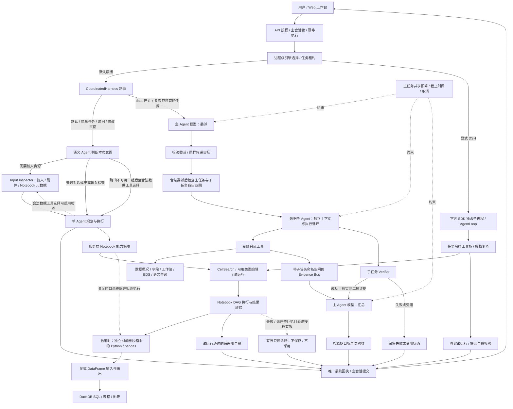
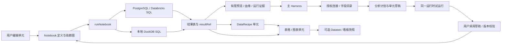

# AgentCanvas Agent 架构

最后更新：2026-09-29。此文档为 Agent 架构的唯一维护入口，随代码变化同步更新。

<!-- agent-architecture-source-sha256: 7cca1c35df9dbfc883e5b4ea1d09e528f3685cc9667a01f47c95614064f02afe -->

## 当前实现与启用状态

发行状态补充（2026-09-28）：当次验收源码已推送独立功能分支，并以 Windows 预览完整包发布到 GitHub；未合并 main、未发布本机稳定站 3000。DSH 0.1.7-rc.2 的官方聊天 / 设置、Notebook Python / SQL / 图表已做隔离便携验证，详见[本次发行记录](../verification/windows-portable-dsh-2026-09-28.md)。下文各历史批次的“仅源码 / 3001”是当时状态，不再表示该便携包尚未分发；同日后续 Notebook 插件抽取不包含在该已发布包内。

| 项目 | 状态 |
| --- | --- |
| 统一可视化 Notebook 桥接（2026-09-29，B2–B5） | B2 / B3 完整计算及分面、B4 官方编辑器和共享作者契约保留。B5 将支持的图改为常驻编辑区，默认复用用户图 3 / 4 的 Data / Style 适配布局，可切换官方原生布局；保存 / 运行不收起左侧。正式与 AI 实时草稿均显示完整编辑外形，草稿仍只读。现有 Cell / ChartConfig 持久化不变；[B5 验收](../verification/notebook-chart-workspace-2026-09-29.md)，未发布 3000 |
| Notebook 实时草稿与执行进度（2026-09-28） | DSH 的编辑、运行事件经现有 SSE 投影到只读草稿；逐单元结果、失败、失效、取消及官方聊天过程定位已接线。结果只在窗口内，正式采用仍走原核验；源码 / 3001，未发布 3000，见[验收报告](../verification/notebook-live-progress-2026-09-28.md) |
| Notebook 能力插件试点（2026-09-28） | `runtime/dsh/notebook-plugin` 为可单独复制的 DSH 工具适配插件，当前网站已改为通过它注册既有能力；不包含业务执行器、UI 或凭据。源码变更尚未发布稳定站或新 Release，离线验证结果见下方专节 |
| DSH 网站执行约束清理（2026-09-28） | 默认移除 24 次工具 / 180 秒整轮 / 35 秒通用工具预算，浏览器支持无任务截止时间；最终回答不再按 1000 / 1600 / 2000 字符裁切。保留取消、授权、实际证据及工具自身保护；源码 / 3001 验收与限制见[本批报告](../verification/dsh-execution-cleanup-2026-09-28.md)，未发布 3000 |
| 官方 DSH 设置组件复用（2026-09-27） | 设置外壳、导航、插件搜索 / 卡片 / 详情直接加载固定版本官方 Web 模块；删除自绘设置及目录 UI。网站仍拥有 Skill 配置与授权，目录明确是安装 / 配置快照而非 Host 实例。仅源码 / 3001，验证与限制见[本批报告](../verification/dsh-native-settings-2026-09-27.md) |
| Notebook 默认文档布局（2026-09-27，体验修正） | 默认直接显示 SQL / Python，数据源摘要与图表 / 数据切换减少重复内容；固定标题 / 运行栏、独立大纲与 Radix 单元菜单已实现。等待整次响应的单元显示“等待结果”，不声称逐单元实时调度。源码 / 3001 验收见[本批报告](../verification/notebook-document-2026-09-27.md)，未发布 3000 |
| Notebook 成熟组件与图表编辑（2026-09-27） | CodeMirror 6、TanStack Table 8、Radix/cmdk 字段选择已接入现有 Notebook；图表配置提供基于新鲜上游预览的即时绘制。正式定义、执行回执、Agent 整稿确认与项目保存仍走原链路。marimo 0.25.0 仅独立合成样板，未成为网站运行时。源码 / 3001 验收见[本批报告](../verification/notebook-workbench-2026-09-27.md)，未发布 3000 |
| 单 Agent Harness | 旧内核与API / 评测兼容实现保留；不再是主工作台聊天入口，旧接口的进程选择默认未变 |
| DSH 官方组件完整安装目录（2026-09-27） | 受管安装元数据只读 API 保留；初批自绘搜索 / 分类 / 分页已由上方原版官方列表替代。未知接入状态仅确认安装，不把包计作 Host 实例或可用工具。初批范围见[历史报告](../verification/dsh-plugin-inventory-2026-09-27.md)，当前以上方官方组件复用为准 |
| DSH 插件设置与官方 Skill（2026-09-27） | 已实现独立插件配置 API / 持久化、搜索分组 / 预设及官方 Skill 工具加载，默认关闭且需显式保存；11 项为网站接入目录，不是全部官方包。配置变化使后续模型会话重新组装，网页历史保留。源码 / 3001 验收与真实离线 SDK 检查见[本批报告](../verification/dsh-plugin-settings-2026-09-27.md)，未发布 3000 |
| 设置与闲置原型收敛（2026-09-27 第二批） | 当批移除旧切换分支与旧引擎前端 PATCH；后端选择 / 旧 Harness 不变。后续独立插件配置以上一行为准。删除未接线 BI 同步原型和闲置评测聚合导出，数据 `bi` 来源兼容及评测主体保留。验证见[第二批记录](../research/cleanup-audit-2026-09-27.md#第二批实施--2026-09-27)，未发布 3000 |
| DSH 展示层收敛（2026-09-27） | 工作台移除旧聊天分支 / 展示开关、手写消息渲染和旧输入框；父组件只组装官方 Frame 与业务反馈。删除闲置旧规划客户端 / 限流器和无消费者导出，旧规划 API、原 Harness 及共享工具保留。验收记录见[轻量化第一批](../verification/cleanup-first-batch-2026-09-27.md)，未发布 3000 |
| 官方 DSH Web 默认工作台 | `/`、`/dsh`、`/dsh/web`统一官方聊天与独立DSH执行入口，不重定向或切换存储。移除旧入口切换、底部步骤条 / 常驻提示 / 上下文卡片；数据选择在头部，错误与业务确认保留。仅源码 /3001，当前验证见[默认入口报告](../verification/dsh-default-workspace-2026-09-26.md)，未发布3000 |
| DSH 原生对话 | 沿用独立API、原生 create/resume、新旧聊天隔离与业务确认；原生会话第二批验收见[报告](../verification/dsh-native-conversation-2026-09-26.md)。第三批接入官方UI，第四批成为默认；不把旧classic历史自动导入模型，未发布3000 |
| DSH 独立上下文与分析说明 | 已拆出不调用旧规划选择器的环境投影，保留请求契约内完整近期消息；验证成功草稿后可展示模型分析说明。3406应用 / 26工具、类型 / 构建通过，3001离线浏览器6图已查看；一任务收费模型显示草稿与说明，但完整回执采集失败，不计完整端到端通过。未发布3000 / 便携包 |
| DSH 0.1.7-rc.2 升级 | 官方候选版已固定安装并由 3001 实际加载；Chat Completions 使用官方 pi-ai 适配器，试点共用同一安装，三处旧依赖已删除。3378 应用 / 26 工具、57 Runtime、30 打包、16 裁剪 SDK、类型 / 构建和 3 张实际截图通过；3 项既有真实 EDS 检查跳过。自动重启原因、恢复用户 DSH 选择及临时副本保留见[升级记录](../verification/dsh-upgrade-2026-09-26.md)。源码默认不变，未发布 3000 / 便携 Release |
| AI Notebook 自动预览运行 | 本窗口默认开启：本次成功新草稿自动打开 Notebook 并运行隔离预览，确认才保存正式定义；撤销保留原结果，看板不变。无历史/失败/只读回答自动执行；当前批次验证见[交付记录](../verification/ai-notebook-auto-run-2026-09-24.md)，未发布 3000 或更新便携 Release |
| 共享 Notebook 能力端口 | DSH / 旧 Harness 直接使用领域能力契约；实际 runner 只收到任务所需的隔离数据，不接收完整工具上下文。499 项专项、两支离线 SDK 与两轮真实模型分析 / 恢复续聊通过；当时的表单类型检查阻碍已于 27 日后续复核解除，原浏览器脚本误报及补充状态见[本批报告](../verification/dsh-notebook-ports-2026-09-27.md)。仅源码 /3001 |
| DSH 参数定义问答 | 有限整句识别、目标定位和完整源码证据已落地；3001两轮真实模型4模型/2工具读到East→手工改值/重开→South，无运行/编辑/提交。78项执行链与155项纯规则通过，完整检查见[本批报告](../verification/dsh-parameter-inspection-2026-09-22.md)，未发布3000 |
| DSH 参数单元 | 网站profile接入原文本/数字/日期/单选参数，以单行value表输入本地SQL/Python；原CSV、来源权限、草稿采用不变。参数输出不单独算业务结果证据。3001两轮真实模型9模型/8工具完成参数变更、采用150/重开/只读结论，全量3074应用/26工具通过，旧EDS3项跳过；见[本批记录](../verification/dsh-parameters-2026-09-22.md)，未发布3000 |
| DSH 说明单元 | 网站profile接入已有text及受控单行引用，原CSV试点不扩；复用模板/执行/回执与用户采用。3001两轮真实模型完成引用230、采用重开及只读追问；全量3039应用/26工具通过，原EDS3项跳过，见[本批记录](../verification/dsh-text-cells-2026-09-22.md)，未发布3000 |
| 可切换 DSH 执行器 | 多来源 / 本次 Excel 原件 / Python / 授权只读数据库 Notebook 已接线。第五批真实模型 + AdventureWorks只读实库已提交38月表图；3001真实模型CSV任务已生成、采用、运行及确认看板并修改保存，最终重开与回归证据见[交付报告](../verification/dsh-delivery-2026-09-22.md)。该批 24工具 / 180秒保护已于 28 日解除默认启用，当前以上方执行约束清理为准。网站原生SDK加载已修复；第三批的旧安装保留记录为历史状态，当前版本以上方升级记录为准；源码默认原版、未发布3000 |
| 官方 DSH 离线内核试点 | 上一步历史实验及四工具桥仍保留；其自身不接公开 API。固定模型 / 真实工具验收结果见[试点记录](../verification/dsh-runtime-pilot-2026-09-22.md)，本次网站 SDK 接入另见上一行 |
| DSH 已选单表语义查询 | 网站profile已接线：只消费本次选定模型，复用semanticQuery及原数据授权/草稿机制。3001两次真实收费任务10模型/9工具通过生成、试跑、显式采用230与重开同会话只读结论，原150/80保持；无模型预检拒绝另验。不创建模型、不扩跨表或其他Cell，实际检查与截图见[接入记录](../verification/dsh-semantic-query-2026-09-22.md)，未发布3000 |
| DSH 已有 Transform 与分析回答 | 第七批已补齐原配方单元、有限初始化诊断和普通分析的真实结果回答分支；修改任务仍需草稿确认。3001合成CSV真实模型第二轮completed，3模型/2工具、输出150/80，首轮失败保留；2912应用/26工具通过，详见[本批报告](../verification/dsh-transform-preflight-2026-09-22.md)。用户原文件未付费分析，3000未发布 |
| M1 工具契约与 Notebook 执行保护 | 输入 Schema / 安全纠错、分工具预算、可选 Python 分段回执已落地；专项与最终全量 1,178 项测试通过；未发布稳定站，不代表完整 M1 已完成 |
| M1 失败诊断可见化 | 第二批新增最终任务只读失败草稿与分段耗时展示；仅当前窗口，不持久化、不采用失败草稿；本批验证记录见[第二批报告](../verification/hex-notebook-diagnostics-2026-09-16.md)，未发布稳定站 |
| M1 数据统计口径 | 第三批当前 Dataset 纯统计、原件范围说明及工具 / 详情共用规则已通过；全量 1,243 项应用 + 14 项 Node、6 组浏览器 / 9 图通过，见[第三批报告](../verification/hex-dataset-quality-2026-09-16.md)；未发布稳定站，不保证任意模型生成代码的统计正确性 |
| M2 Cell 模块边界切片 | 第四批闭合九类目录、浏览器展示 / 默认创建与表图投影已通过源码和 3001 验收；1,313 项应用回归、8 组 / 11 张截图，详见[第四批报告](../verification/hex-cell-modules-2026-09-16.md)；不代表动态插件、完整执行注册或整个 M2 完成，未发布稳定站 |
| M2 数据契约与仓库端口 | 第五批公共表形状 / SQL 预检、连接自有配额、Dataset 仓库端口与错误类型已通过；1,397 项应用测试、实库 8 项、浏览器 8 组 / 11 张新图，详见[第五批报告](../verification/hex-data-boundaries-2026-09-16.md)；不增加结果仓库 / 分页或新 Cell，未发布稳定站 |
| M3 显式依赖调度切片 | 第六批将页面顺序与执行顺序分离，输入候选排除自身 / 下游，搜索和 AI 回执按稳定单元 ID 对应；1,444 项应用测试、实库兼容 8 项、浏览器 8 组 / 9 图通过，见[第六批报告](../verification/hex-dependency-scheduling-2026-09-16.md)，未发布稳定站；不含自动重算或结果仓库 |
| M3 完整结果保存切片 | 第七批分离请求内完整表交付与有限预览；保存接口不再将完整结果的展示截断误当执行截断。验证状态见[第七批报告](../verification/hex-result-access-2026-09-16.md)；不是跨请求仓库或分页服务，未发布稳定站 |
| M4 试运行验收共用切片 | 第八批整稿、增量运行 / 提交、失败诊断共用纯回执一致性模块；运行前固定版本 / 拓扑预期，保护原草稿不被适配器改写。状态见[第八批报告](../verification/hex-trial-verification-2026-09-16.md)；不等于结果真实性 / 权限校验或完整 M4，未发布稳定站 |
| M5 结果展示切片 | 第九批拆分 Notebook 图表适配与表格交互，新增当前预览内三态排序；不修改执行 / 下游 / 持久化，验收状态见[第九批报告](../verification/hex-result-presentation-2026-09-16.md)，未发布稳定站 |
| M5 本地参数单元 | 第十批新增文本 / 数字 / 日期 / 单选，以结构化 `value` 表进入本地 SQL / Python；1729应用 /14 Node、实库8项、3001浏览器5组 /15图通过，见[第十批报告](../verification/hex-parameters-2026-09-17.md)，未发布稳定站 |
| M5 输出变量改名检查 | 第十一批共用纯影响分析，人工保存前确认、AI 编辑回执和草稿审阅；结构化 ID 引用保留，自由代码须检查 / 试运行。验收状态见[第十一批报告](../verification/hex-output-renames-2026-09-17.md)，未发布稳定站 |
| M5 当前预览 CSV 导出 | 第十二批仅导出已返回的预览行，复用当前排序、纯序列化和浏览器下载效果；不重新查询或冒充完整结果。源码 / 3001 的真实下载与截图已验收，见[第十二批报告](../verification/hex-preview-export-2026-09-17.md)，未发布稳定站 |
| M5 收尾 1/3：受控文本引用 | 第十三批稳定 Cell ID / 字段绑定、完整单行结果纯文本插值，人工与 Agent 共用执行及试运行验收；1996 应用 / 14 Node、实库 9 项、7 组 / 13 图已通过，见[本批记录](../verification/hex-text-references-2026-09-17.md)，未发布稳定站；后续收尾进展见下两行 |
| M5 收尾 2/3：参数自动重算 | 第十四批增加显式本窗口开关、保存值变动合并调度、闭包运行及共享输入见证；源码与验收状态见[本批记录](../verification/hex-auto-recompute-2026-09-17.md)，不发布稳定站 |
| M5 收尾 3/3：统一上下文选择 | 第十五批当前参数 / Cell 稳定引用、窗口选择状态、泛指只读工具路径和请求接线；实施与本次验收状态见[专项记录](../verification/hex-unified-context-2026-09-17.md)，不发布稳定站 |
| M6 Python 能力关闭 / 恢复 | 源码与分层验收已完成：部署级能力契约统一创建入口、Agent 工具目录、草稿变更与服务端执行；旧 Python 定义只读保留，恢复后无需迁移。3001 的启用 / 恢复为真实执行，关闭态界面为明确 GET fixture，服务端关闭由模块 / API / 组合测试覆盖；未重启受管 3001、未发布 3000，不等于物理卸载 Runtime。见[专项报告](../verification/hex-python-capabilities-2026-09-21.md) |
| M6 保存失败恢复 | 第二包显式重试、固定项目读写端口、丢失回执核对与冲突保护已实现；2,222 项应用 + 14 项 Node、类型、构建及 3001 的 4 组 / 11 图通过。两次 503 为明确注入，409 来自真实独立 API 写入；重开为新标签页而非服务重启。见[专项报告](../verification/hex-project-save-recovery-2026-09-21.md)，完整 M6 未完成，3000 未发布 |
| M6 文件诊断与安全恢复 | 第三包按需读取 / 恢复时定位缺失或损坏文件；数据表先校验字节、摘要与格式，再移出回收站。2,252 项应用 + 14 项 Node、类型 / 构建及 3001 的 4 组 / 7 图通过，见[专项报告](../verification/hex-project-file-diagnostics-2026-09-21.md)；不是目录自动扫描或文件自动修复，3000 未发布 |
| M6 语义模型删除保护 | 第四包共用全部 Notebook 显式模型引用分析、管理界面提示、删除及项目保存复查、旧草稿采用前存在检查；2,285 应用 + 14 Node、类型 / 构建与 3001 主流程 4 组 / 7 图通过。旧草稿分支仅自动化验证，无单独截图；[专项报告](../verification/hex-semantic-model-deletion-2026-09-21.md)。不自动级联删除或迁移旧孤儿引用，3000 未发布 |
| 模型本地额度 | 正常网站分析不设单次 / 累计输入字符、Prompt Token、模型调用 / 循环次数或输出 Token 配额；保留服务商限制和执行保护，未发布稳定站 |
| M6 单元删除影响审阅 | 第六包显式下游清单、完整文档基线、过期 / 编辑 / 运行拒绝确认与焦点退路；2,334 项应用 + 14 Node、类型 / 构建及 3001 的 6 组 / 9 图通过。确认只删步骤、不连带删除数据或已保存看板；见[专项报告](../verification/hex-cell-deletion-impact-2026-09-21.md)，3000 未发布 |
| M6 看板快照闭环 | 第七包来源审阅、完整基线确认、取消保存与宽表无损保护；2,389 项应用 + 14 Node、类型 / 构建及 3001 的 9 组 / 16 图通过。取消 / 撤销保留数据和原编辑稿，重开不自动运行；既有 Puck 布局告警及未验证项见[专项报告](../verification/hex-dashboard-snapshot-2026-09-21.md)，3000 未发布 |
| M6 项目兼容性诊断 | 第八包有界类型 / 版本诊断、统一读取 / 编辑拒写与恢复提示；2,429 项应用 + 14 Node、类型 / 构建及 3001 的 7 组 / 7 图通过。不兼容项目仍拒绝打开，不是未知 Cell 只读占位；见[专项报告](../verification/hex-project-compatibility-2026-09-21.md)，3000 未发布 |
| M6 可选 Python 资源 | 第九包明确省略资源的构建与统一缺件能力组装；2,447 应用 + 26 Node、类型 / 默认构建及无资源隔离构建 / SQL 通过，3001 分层验收 6 组 / 8 图实际查看。缺件 UI 为状态替身，SQL / 恢复 Python 真实运行；未移除当前站资源或全部适配代码，见[报告](../verification/hex-python-optional-runtime-2026-09-21.md)，3000 未发布 |
| M6 独立只读项目检查 | 第十包隔离显示 DTO 与可执行 / 可保存项目，未知 Cell 只读占位并保留原文件；2,495 应用 + 26 Node、类型 / 构建通过，3001 截图与边界见[报告](../verification/hex-project-inspection-2026-09-21.md)。不是未知项目可编辑打开，3000 未发布 |
| M7 本地分析集成验收 | 第一包聚焦手工 CSV 闭环与离线 Agent 两轮真实工具，两类证据分别记录于[报告](../verification/hex-local-analysis-flow-2026-09-21.md)；不是完整浏览器 Agent 连续链或真实模型质量评测，不新增生产接口，3000 未发布 |
| M7 浏览器 Agent 连续分析 | 第二包初验配方请求超限后已修复，CSV首稿采用/重开追问/暂不采用的离线真实工具闭环已续验。第三包合成Excel真实DSH两轮2任务/11模型/11工具通过：新表图草稿采用后300/160，重开同会话原句结论直接回答。语义手工链与只读实库分开复验，最终检查/失败边界见[交付报告](../verification/hex-m7-local-delivery-2026-09-22.md)；不新增生产契约，3000未发布 |
| M6 原件删除影响审阅 | 第五包全部当前 Notebook 显式 Python 文件名引用 / 下游计数、两处风险确认；2,306 应用 + 14 Node、类型 / 构建与 3001 真实归档 / 缺件 / 独立表执行 / 恢复重跑 5 组 / 9 图通过。可恢复归档接口、输入解析和持久化不变；见[专项报告](../verification/hex-file-deletion-impact-2026-09-21.md)，3000 未发布 |
| Input Inspector | 已改为 Agent 判断后按需检查：对话跳过，数据 / Notebook 任务才进入；复用既有语义路由或合法工具 / 委派决策，不增加模型调用；未发布稳定站 |
| 可视化隔离评测 | 2026-09-27 移除 `/visualization-lab` 页面与菜单，开发站旧地址返回 404；保留 `core/visualization-lab` 与专用 SSE API 的固定合成数据评测及测试，旧 Harness 不变；未发布稳定站 |
| 主 Agent + 数据子 Agent | 源码新增串行最小闭环；通过服务端开关选择 |
| 分析 / 可视化子 Agent | 规划中，尚未实现独立角色 |
| 可视化委派链条专项设计 | [设计 v1](./visualization-agent-design.md) 已完成；首阶段为一个可视化角色 + 折线图专项 Skill，热力图与动态能力分阶段扩展；尚未实现 |
| Hex 可视化技术路线研究 | [研究与接入建议](./hex-visualization-research.md) 已完成；优先验证 Vega-Lite，比较直接编译与 Flint；VegaFusion 后续评估，候选尚未接入 |
| 语义层模块化设计 | [设计 v0.1](./semantic-layer-design.md) 已形成；领域定义、应用端口与适配器分离，先兼容单表，再扩展修订、SQL 和有限关系；本轮仅文档，尚未实现新路径 |
| 并发、子任务依赖图、递归委派 | 尚未实现；第一版每个主任务最多委派一次 |
| 稳定站部署 | 本次变更尚未发布到 3000；源码变更不代表稳定站已启用 |
| 本地项目 + Data Browser | 源码已实现，3001 本地浏览器验收通过；项目数据与定义持久化，临时模式保留；未发布稳定站 |
| SQL 连接 + Notebook DataRecipe + Agent 对接 | 独立 AdventureWorks PostgreSQL 到 Notebook / 表图 / Dataset / 看板确认 / 重开实库验收通过，3001 只读连接可用；Harness 固定模型替身 + 真实工具通过；真实模型 / Databricks 未验证，稳定站未发布 |
| CellSearch 结构检索 | TypeScript 单元 / 变量索引、上下游遍历、按需源码 / 有效输出和只读回答已实现；自动测试通过，未做真实模型验收或发布稳定站 |
| Notebook Python Runtime | Pyodide / CPython、pandas / NumPy / openpyxl、Python → SQL / 图表和两个 Agent 工具已实现；真实执行与开发站合成数据验收通过，未发布稳定站 |
| 数据目录与 Dataset 来源闭环 | 版本化目录、检索 / 同步、查询与 Dataset 来源已实现；2026-09-16 真实本机 PostgreSQL 10 表 / 107 字段、结果保存与来源下载 / 重开通过；未发布稳定站 |

第一版验证角色隔离、真实工具执行、证据验收、共享预算、取消和统一交付。尚未通过真实模型的成本 / 时延对比评测，不能宣称多 Agent 比单 Agent 更快或更准确。

## AI 分析后自动运行 Notebook 草稿预览（2026-09-24）

按用户视频的“图表已可见，仍可 Undo / Confirm”交互，新完成的有效 Notebook 草稿默认打开 Notebook 并实际运行，**不直接采用正式定义**。`StudioWorkspace` 拥有仅窗口内的开启状态与一次性 `AiNotebookRunRequest`；开关位于 Notebook 标题区，不写入项目、会话、浏览器存储或服务端。关闭后保留原手动采用 / 运行；重新开启不执行旧草稿，刷新也不会恢复待执行事件。

`workspace/assistant.ts` 的 `onNotebookDraftReady(task, baseline)` 仅对本次请求完成后、有文档基线的编辑者任务调用：允许 `awaitingConfirmation` / `completed` 且包含 NotebookArtifact、没有 ChangeSet；失败、取消、只读回答、viewer 不发事件。基线在请求前独立克隆，事件在保存任务与释放请求锁后发出；本地回调异常不把成功模型任务改成失败。Harness / DSH、SSE、工具参数、服务端权限及持久化格式不变。

`notebook/ai-run-scheduler.ts` 只消费该一次性事件，先 `handled` 清除上层事件，再 `prepare` 创建预览，下一次文档全文匹配预览后才 `run`。任务 ID 去重，比较完整原文档、项目/界面/会话、来源策略、模型和文件身份；编辑、忙碌、失权、隐藏、外部任务或上下文变化保守阻断，不重试。能力 / 语义 / revision 校验继续复用原 `adoptNotebookDraft` 等纯检查，但准备阶段不调用正式 `onChange`。

`NotebookPanel` 临时拥有预览定义、原结果缓存和预览成功状态；运行仍走 `/api/notebook/run` 与原结果一致性校验、40 秒客户端取消保护，使用独立 `draft` lease，不受参数自动重算开关误取消。预览不能编辑/删除单元、保存 Dataset 或生成看板快照；运行失败/停止不能确认。确认更改再次校验当前基线和能力，才采用草稿并保留本次匹配结果，不重复计算；撤销或离开预览恢复正式定义和原缓存，迟到回执不能覆盖。预览过程中沿用 Notebook 交互锁，需确认/撤销后再发下一轮 AI。

这不是流式逐个插入 Cell、服务端结果仓库或自动改看板。AI 工具内试运行与完成后的可视预览运行是不同执行；后者可能重新读取数据，但不会额外调用模型。实际验证、截图与限制统一见[本批记录](../verification/ai-notebook-auto-run-2026-09-24.md)。源码改动不更新已发布的 Windows ZIP，也不发布稳定站。

## Windows 完整便携部署（2026-09-24）

2026-09-28 更新：当前 Release 为 `v0.1.0-windows-preview.20260928`，构建源码 `39acdc9566caff937f5841c5fac125f3a582ea24`，携带 Node 24.19.0、DSH 0.1.7-rc.2、官方 Web 聊天与设置载体。32 项便携测试通过；Windows/.NET 实际解压的 28,910 个文件与发行目录全树摘要一致。一次真实 DSH 任务（6 次模型请求 / 5 次工具调用）生成有效草稿，断点后未重复调用模型，原草稿确认、5 单元真实运行和保存重开通过。网站运行依赖仅排除安装器生成的 `.bin` 启动脚本，修正本机路径泄漏；ZIP 改用 Node zlib 压缩，保留 fflate 目录 / CRC、普通 ZIP 与有限流式内存。精确四包省略 profile 不变，不增加开放插件、权限或模型能力。详细验证、脚本误判及未验证项见[本次发行记录](../verification/windows-portable-dsh-2026-09-28.md)，下段 2026-09-24 数据保留作历史。

`scripts/build-portable-windows.mjs` 的完整发行目标是 Windows x64 / Node 24：网站独立构建、固定 DSH SDK 安装树及生产载体、Notebook 的 Pyodide / DuckDB 资源和固定 Playwright Headless Shell 一起分发；构建不复制本机整个 `.runtime`、用户项目、会话、凭据或历史安装。完整包以 GitHub Release 附件分发，仓库自动生成的源码 ZIP 仍不是运行包。

`runtime/dsh/installation.mjs` 新增严格的 `{kind:"bundled",id}` 选择，仅解析固定 `.runtime/dsh-bundled` 短目录。保留原 manifest / lock 身份与 override 声明，校验 SDK 版本、根 ZIP 依赖及受管路径；无任意路径或缺件 fallback。`bundle-profile.json` 必须严格匹配 `controlled-notebook-v1` 与四个精确省略包：`@deepseek-ai/libreoffice-kit`、`@deepseek-ai/libreoffice-kit-win32-x64`、`sharp`、`@img/sharp-win32-x64`，且这些目录必须不存在。实际受控 SDK 加载图不使用这些 Office 转换 / 原生附件图像能力，网站也未开放；因对应源码分发未落实而不随包提供，不表示任意插件可用。slot / legacy 的原 Office ZIP 补丁验证和安装树完全保留。这里验证的是安装契约与关键依赖，并不是逐文件签名或操作系统隔离。

`portable/windows/launcher-config.mjs` 在启动前检查平台、必需资源与 DSH 可加载性，并将包内浏览器绝对路径传给 `NOTEBOOK_PYTHON_BROWSER`。网站和 SDK 子进程使用包内 Node，数据写入包内 `data/state`，网站只监听回环地址 3210–3229；不操作受管 3000 / 3001。仅便携启动器设置 `AGENTCANVAS_DEFAULT_ENGINE=dsh`；普通源码部署未配置仍为 harness。`server/selection.ts` 只在进程首次初始化读取这个服务端默认值，设置切换仍为进程内存，HMR 不重置选择与在途租约。默认 DSH 不表示自动调用模型，用户仍需配置自己的密钥；缺能力仍受阻而非静默回退。

既有受控工具、Notebook 能力、授权、取消和人工采用机制不变；不开放 DSH shell 或任意插件。最终受控 ZIP 已在隔离 PATH 和新中文/空格目录实际解压验收：真实 Python / SQL / 图表及一任务收费 DSH（7模型 / 8工具）通过草稿、人工采用、保存重开，6图已查看；不是另一台电脑、Windows 10或具体360验证。已上传 GitHub 预览 Release `v0.1.0-windows-preview.20260924`，远端附件摘要匹配且匿名下载可达。构建、发布状态与限制统一记录在 [完整包交付记录](../verification/windows-portable-dsh-2026-09-24.md)，不以源码支持或 ready 状态代替验收，未发布 3000。

## Notebook 实时草稿与执行进度（2026-09-28）

按 [Hex 录屏差距建议](../research/hex-video-gap-2026-09-27.md) 第一批范围实施，不更换 Agent、Notebook 引擎、数据库或图表组件。DSH 插件与旧 Harness 的现有工具名、参数及正式交付协议保留。

- **计算层**：`core/notebook/live-progress.ts` 定义无 UI 依赖的 `NotebookProgressObserver`、执行 / 草稿事件与结果投影；`server/execution.ts` 在真实拓扑运行的开始、单元开始与实际结果产生后通知。观察者错误不改变计算结果，已取消运行不发送后续结果。`NotebookRunInput` 与 `NotebookDraftExecutionContext` 增加可选 `onProgress`，API 组装入口转发；普通非流式 Notebook API 返回结构不变。
- **业务适配**：`core/harness/server/notebook-tool-bridge.ts` 的可选 `onProgress` 受任务授权和关闭状态约束，校验基线 revision、editVersion、运行 ID、拓扑单元集合及 AI-mode resultRef。单次 runner 返回后关闭回调；无实时回调的兼容 runner 只能在真实最终回执后补发完成结果，不能伪造运行过程。工具仍通过原 `parseNotebookRunReceipt` 校验整个试运行，并只在成功提交后提供 `getVerifiedDraft()`。展示进度不是采用凭证。
- **传输与历史**：`dsh-engine.ts` 把观察值映射为现有 `status_update` 的可选 `notebookProgress`，外层仍携带 taskId / sequence；另有小型 cellId / editVersion / runId / status 索引。每表最多 50 行且行 JSON 最多 16,000 字节、文本最多 2,000 字，去掉 stdout / stderr，保留真实结果引用和截断信息。不把全量计算结果、SDK 内部状态送入事件流。最终任务 trace、客户端任务历史及幂等重放缓存均移除大载荷，仅活跃订阅收到；取消 / 授权失效后不发新的结果。
- **状态所有权**：`core/notebook/live-state.ts` 为纯展示 reducer，拒绝旧序号、旧编辑版本、不符身份的结果及终态后的回执；新编辑清空预览，旧结果标为失效。`StudioWorkspace` 保存窗口内 live state，以项目 / 页面 / 会话 / 数据与正式基线范围隔离，`workspace/assistant.ts` 分发通知而不把它写进 DataProduct。刷新不恢复实时结果，不自动重放历史任务。
- **界面**：`NotebookLivePreview` 复用 CodeMirror、TanStack 表格、Recharts 与既有大纲，只读显示草稿 / 状态 / 错误；可切回正式文档，不新增保存、编辑或执行入口。原 `NotebookPanel` 在最终草稿完成后继续依据当前权限和数据执行隔离预览，再整稿确认 / 撤销。生成阶段结果不能作为正式缓存复用，重跑阶段明确提示原因。`core/dsh-web/progress.ts` 仅映射真实 trace，官方 DSH `conversation.input.dock` 插槽显示最多 80 条过程和工具详情；定位通过受 origin / iframe / nonce / 当前任务限制的 `locate-cell` 命令，不新增执行权限。
- **启用与范围**：当前 DSH 对话默认有这些观察事件，无新增模型预算或运行开关；“AI 分析后自动运行 Notebook”开启时首个编辑草稿自动打开 Notebook，关闭时不强制切页。旧 Harness 保留；普通 Notebook 全量 HTTP 运行仍等待整次回执。未实现结果跨运行缓存、逐单元采用或增量调度，未更换运行时。本批验证与截图以[专项报告](../verification/notebook-live-progress-2026-09-28.md)为准，浏览器使用显式 SSE 夹具加真实 XLSX / SQL / 图表，不冒称真实模型端到端。

## Notebook 能力插件试点（2026-09-28）

`runtime/dsh/notebook-plugin/` 是独立 ESM 包 `@agentcanvas/dsh-notebook-tools`，通过官方 `name / inject / apply` 和 `ctx.plugin()` 注册工具。`index.mjs` 只依赖标准语言能力，`index.d.mts` 明确公开 `NotebookToolDescriptor / NotebookToolCall / NotebookPluginConfig`；`package.json` 保持 private，不安装或发布新依赖。[接入说明](../../runtime/dsh/notebook-plugin/README.md)提供另一宿主的组装示例与实际边界。

公开接口只有本次目录 `catalog` 和可信宿主执行端口 `execute({name,args,callId,signal})`。支持原四个 Notebook 工具及四个可选来源工具，仅注册所给子集；固定目录快照、拒绝未知/重复/已有同名工具，使用官方 tools 服务的执行/输出管线与插件生命周期。参数 Schema 用于工具描述，严格业务输入验证仍须由宿主执行，不能假定工具服务会替宿主完成全部校验。错误不伪装为成功，调用 ID 与取消信号保持，取消后不交付迟到成功结果。插件不读取环境变量、网络、项目路径、数据库凭据、模型配置或 UI 状态，也不接管其他插件的工具白名单。

`controlled-plugin.mjs` 仍拥有网站模型适配、Wire Fetch、任务 profile、认证和安全错误转换，通过 `ctx.plugin(notebookPlugin, ...)` 注入现有 broker；`policy.mjs` 从插件公开常量取得名称，继续拥有网站允许的工具组合。broker / Notebook 业务桥仍负责逐次授权、严格业务 Schema、数据隔离、并发/调用账本、试运行、验证草稿与正式采用。没有复制 SQL/Python/数据集执行器，没有迁走旧 Harness 的全部公共契约；本批是**可移植接入层**，不是完整独立分析引擎。将来移植仍须在目标宿主实现授权与业务执行端口。

运行开关、Skill 配置、工具名称/参数/结果、权限与保存确认保持原状；不新增 UI、插件安装开关、终端/文件能力或预算。便携白名单和架构指纹包含独立包，后续构建不会漏装；本批没有重新制作/上传运行 ZIP。目标版本仍为 DSH 0.1.7-rc.2、Cordis 4.0.4、Node 24，不保证其他版本或任意官方 Host 直接安装可用。

本批验证：6 项新增插件测试通过（包含仅复制四文件后在真实 DSH 工具服务加载/调用/卸载）；21 项 SDK 驱动原回归通过。全部 Runtime + 打包 + 架构守卫的 120 项检查中 119 通过，原 Web 资源符号链接测试因 Windows 创建 symlink 返回 EPERM 受阻，单独复测相同，未跳过或修改该保护。`npm test -- --exclude '**/.runtime/**' --maxWorkers=2` 为 3,616 应用 / 26 Node 通过，3 项既有实物工作簿检查因未提供样本跳过；typecheck、定向 ESLint、build、250 文件架构指纹通过，构建保留大 chunk / 插件耗时提示。`node scripts/verify-dsh-embedding.mjs` 经真实 SDK + 原业务桥 + 本地 SQL 得到 East 150 / South 80，草稿、内存采用和取消回收通过，不持久化。没有真实收费模型、实库、外部产品或新界面验收，不以旧截图代替本批证据；3000 / 3001 / 截图服务均保持原进程和健康状态。

## 官方 DeepSeek Harness 网站嵌入（2026-09-22）

2026-09-26 本批优化：`core/agent-engines/server/dsh-context.ts` 单独组装 DSH 的已授权 Dataset 字段目录、Notebook 元数据、选中单元、连接、附件名、语义定义与会话；不再调用 `buildHarnessContextSelection`，不运行旧 Harness 的意图 / 计划选择或合成其 workingMemory。目录按 Notebook sourceIds 投影，未选 / 待授权来源、未允许连接、完整源码、原始行和凭据不进入初始上下文；实际数据和源码仍按需读工具。已解析的最近最多10轮消息保留1000/2000字符契约内完整内容，不再额外截成400/600；历史、摘要和旧工作状态仍标记为非本轮证据，不扩大来源授权、不复用DSH持久会话。不是新增长期记忆或取消服务端存储上限。

`dsh-delivery.ts` 只在成功草稿私有回执核验后整理模型最终分析说明，首先展示服务端确定的“待确认、正式文档未改”状态；模型自然语言不是保存回执，也不表示每句结论已机器核实。缺少说明或明确声称已经保存 / 绕过确认时保留权威状态而不展示冲突说明；该文本保护不是完整语义判定。2026-09-28 起，草稿、对话和只读答案均使用 `redactHarnessSecrets` 完整脱敏，不再截取 1000 / 1600 字符或拒绝超过 1800 字符的答案；`HarnessTaskSummary.resultMessage`、可见会话 `response` 与官方 Web 投影取消 2000 字符上限。确认 / 拒绝追加权威状态但不裁掉分析正文。失败、取消、撤权、未提交不展示成功分析说明，正式看板仍单独确认。

完整回答与模型上下文摘要是不同职责：工作台保留完整可见 / 持久化回复，下一轮请求按原 2000 字符摘要契约投影，避免长答案造成请求校验失败；服务端旧会话摘要仍有界，原生 DSH 会话沿用 SDK 接受点，不重复注入网页历史。没有恢复历史已截掉的文字，也没有解除 HTTP/SSE 字节、项目快照与原生会话存储容量边界；超大内容仍可能明确拒绝。诊断事件继续用有界 `sanitizeHarnessText`，不把日志无限增长当成完整答复。

本批保留原只读识别 / 工具裁剪、业务工具桥、执行预算、thinking disabled 和SDK配置；仅减薄上下文规划耦合与成功回答展示，不宣称完整原生插件能力或推理质量已提升。服务端会话存储仍可先截取为1000字符；此处移除的是上下文投影额外400/600截断，不恢复已丢失内容。聊天仍保留生成时的原答复，确认后的当前状态以Notebook状态条与任务回执为准，不改写聊天历史。实际实现、已查看截图和收费验收的采集限制见[专项记录](../verification/dsh-autonomy-2026-09-26.md)。

网站的 `/api/ai/harness` 与 `/api/ai/harness/stream` 继续承担服务端身份、数据授权、会话锁与幂等；执行时从 `core/agent-engines/server/selection.ts` 获取不可变任务租约，`executor.ts` 在完整 `CoordinatedHarness` 与 `runDshEngine` 中二选一，不将新循环塞入旧 `HarnessModel.next`。选择只保存在本机进程，默认为 `harness`；既有评测与可视化实验仍固定原执行器。重复幂等请求跨引擎切换仍返回原回执，不重新执行。

2026-09-26 组装边界收窄：`handler.ts` 从已授权的项目状态创建一次 `AuthorizedAgentDataPorts`（数据运行时、Notebook runner、可用能力、原件元数据和连接检查），`executor.ts` 分别接收旧 `CoordinatedHarnessOptions` 与 DSH 专属 `DshAgentExecutionOptions`。只有旧 Harness 分支调用 `configureDeepSeekHarness`、读取旧模型配置并组装旧预算；DSH 分支使用服务端授权复查、独立执行策略和相同业务端口，不再借旧 Harness 选项承载自身内核。公共 HTTP 身份、会话、幂等、SSE、取消和工具桥未复制，也未改路由或数据授权。`AuthorizedAgentDataPorts` 的类型仍复用既有业务工具契约，属于保留的兼容耦合；这不是把全部公共能力迁出 Harness 目录。

`GET/PATCH /api/settings/agent-engine` 仅同源本机访问；PATCH 校验 revision 并拒绝活动任务期间切换，保留旧API兼容。2026-09-26第四批起，工作区“DSH 执行与插件”传`conversationOnly`，只GET真实DSH readiness / 已接插件，不显示或提交旧Harness选择；工作台独立路由强制DSH，不依赖这里的全局选择。未修改全局选择或HMR生命周期。模型选择与密钥仍沿用既有 AI 接口配置；不支持的能力明确拒绝，无静默fallback或任意插件安装。

开发热更新会刷新进程选择对象的实现原型，但不替换对象、engine、revision 或 activeTasks；旧租约的 release 仍作用于同一对象，避免目录停留旧版本或任务丢锁。本批验收发现用户已选择 DSH，截图结束恢复该初始选择，不将源码默认误写为当前已启用状态。

`core/agent-engines/server/dsh-driver.ts` 为可替换驱动端口组装官方 SDK；`runtime/dsh/driver.mjs` 以独占 SDK 子进程执行任务，结束 / 取消关闭该进程。固定官方候选版 `0.1.7-rc.2` 安装在独立 `.runtime` 依赖目录，Cordis 4.0.4、Schemastery 3.18.4、pi-ai 0.85.1 也固定版本。源码部署需显式运行 `node scripts/setup-dsh-runtime.mjs`，主依赖不变。当前支持本地 Node 24+；2026-09-28 Windows 便携整包已单独验收并分发，云部署 / 本机稳定站新版发布未验证。不可用时设置说明原因，不回退执行旧引擎。

第三批增加 `runtime/dsh/installation.mjs`：安装身份由独立 manifest / lock 摘要确定，活动指针只允许受管版本槽位或旧安装，不接受任意路径。每个任务在启动前固定依赖树，SDK 导入与子插件解析使用同一 manifest；切换指针不重定向在途任务。升级允许解析旧版本指针用于迁移，但执行和回退仍严格要求当前版本。当前载体修订 `?carrier=10` 经 `native-loader.cjs` 原生动态导入，修订传入 policy / installation 依赖，避免热更新混用旧常量；不替换进程选择 / 租约。安装修补与回退均是显式操作，不在用户请求中安装依赖。清除旧树后 previous 置空，不保留失效回退入口；历史安装验收见[真实链报告](../verification/dsh-live-2026-09-22.md)，本次迁移与清理以[升级记录](../verification/dsh-upgrade-2026-09-26.md)为准。

### DSH 独立对话入口（2026-09-26 第一批，入口现状以后续默认工作台节为准）

`app/dsh/page.tsx` 复用网站工作台，显式选择 `dsh-conversation` 体验；此节记录第一批入口，当前 `/` 也已使用 DSH，旧 Harness 保留兼容 API 与执行器。DSH 入口跳过前端问候 / 能力问答的本地固定回复，通过 `/api/ai/dsh/conversation` 与 `/stream` 强制租用 DSH，不改全局选择、不在不可用时回退。`handler.ts` 仅接受路由组装选项，公开请求不能自报该权限模式；同源、本地身份、数据授权、连接目录、幂等、SSE、取消和终检沿用原链，服务端上下文另加 `:dsh-conversation-v1` 命名空间。`/clear` 仅清该命名空间。

`executor.ts` 的可选 `mode` 参数选择 DSH 对话模式与原生会话绑定；`dsh-engine.ts` 按本轮实际工具账本决定交付，不使用旧只读关键词分类来要求草稿。零工具普通回复 / 澄清可以结束，明确尚未读取或计算数据，不合成业务验证通过。只读解释核验实际工具结果；新模式可直接运行当前Notebook或运行后检索，以原revision、未编辑账本和真实运行 / 输出引用核验，不要求先 `cellSearch`，经典只读规则不变。尝试编辑 / 提交后必须有桥内有效成功草稿，仍 `awaitingConfirmation`，模型文字不能宣称正式保存。取消、撤权、执行保护和未恢复工具失败不能被最后一句回复洗成成功。

DSH driver / broker / controlled plugin 传递服务器受控 profile。仅 `conversation` profile 可有空工具目录，已知 Notebook 能力缺失可投影为有限不可用说明；未知初始化错误、来源越界和授权错误仍拒绝。旧 Notebook profile 仍要求原受控目录，未开放shell、终端、任意文件、任意插件或全量Skill。有效桥仍复用现有Notebook、CSV、SQL、Python、原件及语义查询端口；没有复制业务执行器。

浏览器仍只持有一份项目 `assistantSessions.items`，新会话使用集中定义的 `dshconversation_` ID 前缀，旧 ID 均属 classic；筛选、切页、清除和恢复按入口区分，不改变项目 schema 或丢弃旧记录。`activeByPage` 仍是共享页面提示；另一个入口的提示被忽略，选本入口最近更新会话。第一批服务端仅有网站有界历史；第二批已接下述原生会话日志，网站历史继续用于展示与旧入口，每任务SDK仍新建并关闭临时环境。

刷新恢复不再把DSH普通回复套用旧“含数据关键词但零工具即失败”的启发式。项目仓库提供已有DSH会话的任务ID集合；新请求通过 `assistant-request-identity.ts` 生成显式入口标识，超出可见20轮的已保存回执仍可识别。标识仅用于客户端恢复展示，不选择服务端模式或增加权限；旧经典任务恢复规则和在途任务刷新取消均保留。入口切换需无在途任务 / 待确认编辑，先保存与flush再同标签导航；满容量恢复保持持久化关闭并显示错误，不以空会话覆盖原项目。

保守边界：选中来源过期 / 未授权仍可能在模型调用前被HTTP层拒绝，纯聊天不绕过该检查。图片与其他未接能力不静默降级。官方Web安装产物需要独立客户端依赖图，不能直接当作网站React组件导入。第一批没有原生会话，第二批状态以下节为准；前两批未移植官方UI，第三批采用官方公开逻辑RPC扩展点，避免引入完整Host。第一批3001实际测试 / 截图见[第一批验收](../verification/dsh-conversation-2026-09-26.md)。

### 官方 DSH Web 嵌入（2026-09-26 第三批，入口现状以后续默认工作台节为准）

`/dsh/web` 为可选接入预览，从 `/dsh` 顶部按钮进入，仍使用同一 DSH 网站会话；经典 `/` 会话不合并。`StudioWorkspace` 复用现有 `handleGenerateAiPlan`、取消、项目保存 / 会话切换锁；`AiBuilderAssistant` 将文字输入和历史列表替换为 `DshWebFrame`，上下文选择、实际 Harness Trace、Notebook 草稿 / 看板确认继续由父工作台展示和处理。没有第二个分析执行器或自动采用入口；默认页面不切换。

`runtime/dsh/web-assets.mjs` 从服务器固定受管安装提供原版 `dsh-web-frontend` 静态产物与22个官方客户端模块，使用公开 `bootInjections/orderByModuleGraph` 和受审桥模块构建依赖图。只允许确定的公开资源 / 精确摘要URL，拒绝映射、服务端包、任意路径、链接 / 硬链接及超量文件，保留 MIT 声明；不启动 Host、监听端口或安装插件。`core/dsh-web/server/assets.ts` 为固定 GET 文档 / 资源入口，拒绝跨站访问，私有配置和SDK日志没有HTTP路径。公共资源快照缓存只随服务器载体及安装选择变化失效，不缓存用户会话。

`runtime/dsh/web-client.mjs` 实现公开 `ClientTransportHooks.rpc` 逻辑通信适配。读取接口仅投影网站当前可见20轮、标题和运行状态；`session/follow/control` 的序列是显示用临时序列，不是SDK原始日志、工具事件或模型内部思维。`session/prompt` 仅普通文字，经父 `send` 命令接回独立DSH HTTP/SSE入口；`session/cancel` 只取消当前任务。其他RPC失败关闭，图片 / 文件摄入明确不支持，本地文件仍从父工作台导入。官方 `conversation.content` 使用原聊天 / 输入组件；不注册官方完整窗口、文件浏览器、模型设置或终端工具。无逐Token流时不伪造token、用量或工具运行。

`core/dsh-web/protocol.ts` 是严格显示DTO / 命令的唯一父窗口契约；不传AppSpec、完整任务、项目句柄、原件、配置或SDK路径。父窗口校验来源窗口、同源和每frame随机nonce，限制重复命令、忙碌 / 编辑状态，`result.ok`仅表示网站接收，不表示分析完成。`ready`是通道握手，真实官方输入框挂载后的`mounted`才解除加载提示；超时提供重载 / 原入口退路，不自动重发。父窗口拥有会话 / 草稿 / 任务权威状态；官方UI自身可能缓存草稿与视图偏好，但每frame / 历史替换使用独立显示ID，不将这些缓存恢复成网站会话或模型记忆。

输入同步只保留最多32项未确认本地草稿作为短期回声保护，避免迟到的父状态覆盖后续按键；最新回声确认、任务接纳进入busy、换会话或清除显示代后恢复父状态权威，不增加持久化副本。实际先红后绿回归覆盖交错回声、80次快速输入、busy及换会话 / 清除。

安全边界：这是固定可信SDK的**同源嵌入**，`allow-scripts allow-same-origin`不是不可信插件安全沙箱。该文档 `connect-src none` 阻止直接API / 模型网络，摄像头等能力禁用；官方Cordis启动依赖 `new Function`，仅嵌入文档允许 `unsafe-eval`，不能宣称严格无eval CSP。脚本nonce和资源白名单保留；服务端授权、逐工具检查和确认机制仍是业务边界。未来开放第三方插件需另行审计，不能复用此信任假设。

官方 `turn-process` 和 `composer.dock/stats` 公开插槽以空组件覆盖：显示投影没有真实执行耗时 / 步数，不让官方默认最小一秒误报计时。消息 / 输入框 / 失败与取消尾部保持官方实现。当前公开 content 插槽不暴露内部输入框placeholder或加号开关，不改上游源码 / 私有组件，顶部明确 `/`、`@`、`+` 尚未接入；导入 / 选择使用父“添加上下文”，未知RPC与文件摄入仍拒绝。

本批不新增模型、工具或存储格式。载体打包清单与架构指纹包含Web适配文件；未制作 / 上传新版便携包。只验证源码 / 3001，实际命令、收费轮次、截图、未验证项统一见[第三批验收](../verification/dsh-official-web-2026-09-26.md)。

### 官方 DSH 设置 Web 适配（2026-09-27）

`runtime/dsh/web-assets.mjs` 的聊天图仍为 22 个官方模块 + 聊天桥；`?surface=settings` 独立设置图增加 `dsh-client-ui-settings-general`、`dsh-client-ui-settings-plugins`、`dsh-client-ui-settings-plugin-inventory`，使用设置桥替换聊天桥，共 26 项。原包 JS / CSS 字节不改；仅在组装图中去掉 inventory 对 `ui-agent-preset` 的依赖边（仅用于内置名称翻译，非其运行服务），避免带入未接通的完整 Host 预设编辑器。网站的两个能力组合继续用官方 SegmentedControl 呈现。受管安装必须含这些固定模块，缺失明确报资源不可用；聊天执行配置不变。

官方 SettingsPanel / settings 插槽管理弹窗、导航、搜索、分组和卡片，官方 primitives 管理 Button / Switch / SegmentedControl / Modal。`web-settings.mjs` 只实现网站业务表单和公开插槽适配，通过只读 `settings/describe`（网站固定 locale）、`pluginInventory/list` 和空 session 展示投影满足组件契约；未知 RPC、配置文件打开、Host 配置任意写入和模型操作均拒绝。官方通用页的客户端偏好不等于网站功能接线，并在页内提示；没有启动完整 Host。隐藏空 AppFrame 根节点、保留官方 portal，不复制其弹窗 CSS。

`settings-projection.ts` 严格校验命令及来源 / 同源 / 随机 nonce，投影公开包说明、版本、依赖和网站接入标注。用官方 locale 扩展标明“已安装组件”“网站已配置”“尚未核实”，所有 fiber 状态为未知，不能把布尔配置解释为运行中。`OfficialSettingsFrame` 懒读目录、限制重复 / 并发请求、关闭取消、拒绝过期配置快照；30 秒未挂载提供重载 / 关闭。原父配置控制器保留冲突后的刷新、草稿保留、重复提交保护、任务锁和放弃确认；Skill PATCH 与模型配置仍走原网站入口，没有复制状态真相或泄漏私密设置。

文档 / 资源 GET 沿用同源、nonce 和 CSP `connect-src 'none'`；iframe 是固定可信 SDK 的同源组件，不是任意插件沙箱。删除旧 `PluginSettingsContent`、`OfficialPluginInventory`、仅针对其 DOM 的测试及 CSS，核心生命周期迁到父桥测试，搜索 / 分组 / 失败 / 退出转由实际官方浏览器验收。原两条截图脚本入口转到统一官方设置验收，历史截图 / 报告保留。未升级依赖、改变授权、启用终端 / 任意文件、调用模型或发布 3000。实际验证见[本批报告](../verification/dsh-native-settings-2026-09-27.md)。

### DSH 插件配置与官方 Skill（2026-09-27）

初批自绘设置已由下节的原版官方 Web 组件替代；`AgentEngineSettings` 仅管理网站配置生命周期，`dsh-settings/OfficialSettingsFrame` 提供嵌入与有限命令桥。仍非完整官方 Host，原 `GET/PATCH /api/settings/agent-engine` 保留兼容，页面仅 GET 引擎状态，不恢复旧执行器切换。

新增 `GET/PATCH /api/settings/dsh-plugins`：本机同源、有限 JSON、严格 Schema，只允许 revision 和 Skill 布尔配置；检查任务活动数与乐观版本，复用 `JsonFileSnapshotAdapter` 的原子写、锁和冲突检测，保存在私有 `STUDIO_LOCAL_STATE_DIR/dsh-plugin-settings.json`。默认关闭 Skill 保持原行为；缺持久化不能保存，损坏配置明确失败不重置。保存成功下一轮生效，不调用模型；失败保留草稿，刷新确认后才可再保存，不自动重试未知写结果。

`server/plugin-catalog.ts` 维护本网站接入清单，由载体 `inspectDshPluginPackages()` 只读核对固定安装包的版本，区分已配置、按任务提供、未启用、未接入与组件缺失。它不是完整 DSH 包清单，也不把已配置等同于运行中。官方基础循环 / 工具服务、受控会话持久化、网站 Notebook / 来源能力继续保留；压缩、结构化提问、文件 Skill 扫描尚未接入，终端与任意文件工具不开放。

`officialDshDriver` 每轮读已保存设置，`runtime/dsh/driver.mjs`（Skill 接入时载体 revision 9，当前为 10）只接受 `{ skills: boolean }`；开启时 patch 挂载固定版本 `dsh-skill` / `dsh-tool-skill` 和 `builtin-skills.mjs` 的两份有界说明（data-inspection、notebook-analysis），不加载 filesystem provider、脚本或用户目录。`controlled-plugin.mjs` 仅将官方 `skill` 加入本轮原业务工具白名单并核对实际注册集合；Skill 在官方工具层执行，不冒充 Notebook 数据证据，不绕过数据授权或草稿采用。普通文字可以要求加载 Skill，不宣称官方斜杠菜单已接入。插件配置 revision 非零时纳入原生会话 scope 指纹，组合变更重建模型连续性，网页聊天记录保留；revision 0 不改变旧 scope。任务期间 API 拒绝修改配置。

本批更新便携载体文件列表与架构指纹，未升级 SDK、发布 3000 或分发新版运行包。固定范围、实际测试及 3001 截图以[插件设置验收报告](../verification/dsh-plugin-settings-2026-09-27.md)为准。下方先前的只读目录说明是上一批历史；本批新增的是插件配置，不是引擎切换。

### DSH 官方组件安装目录（2026-09-27）

初批的自绘分类 / 分页 UI 已退役，当前为官方插件列表的分组、搜索和卡片详情，网站能力另设配置页。首次读取 `/api/settings/dsh-plugins/inventory` 仍只接受本机同源、无查询参数 GET，失败和部分读取明确提示；未知安装状态不冒充已启用。计数来自实际元数据，不复制截图中的 29 / 185；列表是设置打开期间的读取快照，配置保存后重开设置刷新，不宣称实时 Host 状态。

`runtime/dsh/package-inventory.mjs` 只读已选受管安装的 `node_modules/@deepseek-ai/dsh*` 顶层包元数据；不递归扫描项目或整个依赖树，不 import 包代码 / 启动 SDK。通过现有受管路径校验拒绝目录链接，并检查文件类型、硬链接与大小；最多 1000 个候选、单文件 64 KiB，说明与依赖有界，只返回明确公共字段。单项异常仅返回受限 ID / 固定失败码，不暴露路径或异常内容；安装解析失败返回 503，不伪造空清单。

`core/agent-engines/plugin-inventory.ts` 是浏览器 / API 共用严格 DTO；`OfficialPluginInventory.tsx` 单独拥有查询、筛选与分页状态，旧设置草稿仍由原组件持有。已标注组件可关联网站配置快照；未知条目仅显示“仅确认安装”，不推断启停；版本不一致或设置待确认时不宣称已配置。这里不是官方 Host `pluginInventory.list()` 的运行实例投影，包分类不等于执行作用域，也不代表目录外的 Cordis / Office 等非 `dsh*` 包清单。

载体当前 revision 10 提供独立元数据读取入口，实际执行循环、工具白名单和模型会话规则未变；便携载体清单含新模块，但未分发新包。没有新的能力开关，不开放终端、任意文件、上下文压缩或完整 Host。本批实际读取 274 个包（该快照不是固定总数），全量 3609 项应用测试、26 项工具测试、60 项载体 / 打包测试、类型 / 定向 lint / 构建通过；3001 的 12 张新截图逐张查看。EDS 实物 3 项仍因未提供工作簿路径跳过，不含真实模型测试。实际验证、截图与剩余边界见[本批报告](../verification/dsh-plugin-inventory-2026-09-27.md)。

### DSH 默认工作台与旧界面退出（2026-09-26 第四批）

2026-09-27 第二批轻量化：`AgentEngineSettings` 不再支持 `conversationOnly` 模式选择，所有挂载都只读取 `GET /api/settings/agent-engine`。删除前端引擎单选、应用操作、PATCH 和相关状态 / 样式；保留严格 DTO 校验、错误 / 失效状态、重复刷新保护、关闭时取消 GET、重开重新读取及焦点约束。`StudioWorkspace` 的调用不再传模式标记。后端 PATCH、进程选择默认值、版本冲突及活动任务保护均未修改；旧 Harness / API / 评测仍可独立使用，不自动回退 DSH。`core/bi/` 未接线原型和 `core/evaluation/index.ts` 闲置再导出已退役，现有 Dataset 的 `bi` 来源类型、存储兼容和评测具体入口不变；无依赖升级、数据迁移或新开关。原 `verify-dsh-settings-browser.mjs` 迁为只读验收，移除真实引擎切换副作用；本次范围与实际验证维护于[第二批记录](../research/cleanup-audit-2026-09-27.md#第二批实施--2026-09-27)。

2026-09-27 第一批轻量化：`AiBuilderAssistant` 不再提供 `dshConversation` / `officialDshWeb` 切换；所有布局直接使用 `DshWebFrame`，父窗口仍拥有草稿、会话和任务权威状态。移除旧 textarea / 图片选择器、消息列表、`AssistantAnswer` / 自写文本解析、`HarnessTrace` / 旧诊断展示和 `AgentWorkspaceWelcome`；`WorkspaceModeBar`、`StudioArtwork`、数据菜单、Notebook 上下文芯片、导出、条件错误与显式 ChangeSet 确认保留。旧任务诊断数据、事件契约和执行保护未删除。`onSubmitInstruction` 为必需组装回调，普通输入、换行、取消仍交给官方组件与原桥，旧图片草稿继续阻止发送并提供移除。无新开关、请求 / 数据格式不变；下文第四批保留旧分支的说明为当时状态。

同时删除仅测试使用的旧 `core/ai/client.ts`、`server/rate-limit.ts` 及其专属测试、无人消费的 `core/ai/index.ts`、`components/studio/index.ts`、`core/harness/mcp/index.ts`；不影响仍被执行器使用的模型凭据、契约、组装与工具。旧规划 HTTP API、可视化实验 API、BI 原型及外部集成不在本批范围。删除文件可从 Git 或本批修改前备份恢复。业务状态 / 输入委派测试迁移到 DSH 路径，原 Harness API、工具、诊断与评测测试继续保留；验证与边界见[本批记录](../verification/cleanup-first-batch-2026-09-27.md)。

三个主要页面`app/page.tsx`、`app/dsh/page.tsx`、`app/dsh/web/page.tsx`都复用无外部体验切换参数的`StudioWorkspace`，入口固定`dsh-conversation + officialDshWeb`。不重定向、不更换浏览器持久化key / 项目schema / 命名空间。所有普通聊天继续走`/api/ai/dsh/conversation/stream`并强制DSH；不会因旧全局设置仍为Harness而改用旧循环。移除过渡banner / 返回旧入口 / 试用DSH按钮及菜单中的旧可视化实验链接。实验路由 / API / 评测及旧渲染分支仍保留兼容测试，不声称全仓旧内核已删除。

官方分支不再渲染父`HarnessTrace`、安全说明脚注、空白助手标记及`agent-context-bar`卡片。数据和上下文选择通过聊天头部“数据”调用既有`ComposerContextMenu`，显式向下定位；原输入区菜单默认向上不变。不新增授权或扩大sourceIds；数据浏览器 / 文件导入 / Notebook / 语义模型管理保持。业务草稿、真实导出、条件错误、验证拒绝、重试和ChangeSet预览 / 人工确认保留；去除文字提示不等于取消确认机制。未形成turn的前置错误仍由条件alert展示，已入turn的错误由官方消息显示，避免双份正文。三个页面共享的DSH样式统一在根layout加载，避免路由共享CSS遗漏导致首页嵌入框退回浏览器默认尺寸。

`runtime/dsh/web-client.mjs`仅在官方`conversation.input.dock`公开插槽展示真实父`statusText`单行运行状态，busy结束即消失；不合成思维、耗时、工具步骤或完成卡片。停止和最终成功 / 失败 / 取消消息仍由原官方组件渲染。DSH标签说明当前文字 / 扩展限制，官方`/ @ +`尚未接入，不以头部“数据”冒充原生附件功能。加载失败只提供手动重载，不回退旧聊天或自动重发。

嵌入资源的`runtime/dsh/web-assets.mjs`在固定SDK版本的官方iframe中加载作用域样式：空会话缺少消息视图区，输入座位使用自动上边距贴底；有消息时原视图区布局保持。样式仍经原CSP nonce加载，不改变消息、请求、工具或权限协议，且官方类名在当前固定安装包的资源测试中校验。位置修正的实际浏览器证据见[默认工作台报告](../verification/dsh-default-workspace-2026-09-26.md)。

`AiBuilderAssistant`在官方主工作台且无聊天轮次、任务、错误、待发送内容或草稿时，额外显示父站的空会话引导；复用`StudioArtwork`装饰线描与静态文案，通过`app/dsh/dsh.css`限定在输入区上方，指针事件透传给官方iframe。Notebook侧栏和非空会话不显示。它不注入模型上下文、不读数据、不新增快捷问题按钮或第二输入框；官方`conversation.content`仍保持`hero:false`，避免在缺少官方workspace时触发上游工作区选择和禁发状态。当前视觉验收与限制记录在[默认工作台报告](../verification/dsh-default-workspace-2026-09-26.md)。

2026-09-26 界面收简：`AiBuilderAssistant`不再显示整行“上下文：工作界面 · 数据表”灰条，主工作台与Notebook侧栏仍通过头部“数据”菜单选择来源；`workspace/assistant.ts`继续按当前来源、页面、Notebook及语义选择组装请求，隐藏提示不扩大或缩小数据授权。左上角菜单移除仅供本地演示的角色切换，工作台保持原默认`editor`，原ChangeSet / Notebook角色契约与服务端权限校验不变；顶栏仅作说明的“发布”按钮及弹窗退役，网站的独立`site:publish`运维命令不受影响。这些是前端入口和展示层调整，不改变DSH/旧Harness执行、工具、会话、持久化或确认流程。

全部旧classic会话ID、消息、任务及项目字段继续保存，仅默认筛选DSH；不把旧消息重标为DSH或导入原生记忆。DSH清除仅操作本命名空间；恢复容量预检 / 拒写保护保持。旧聊天目前无主界面入口，可随完整项目与备份保留。本次范围与实际检查见[默认工作台报告](../verification/dsh-default-workspace-2026-09-26.md)。未发布3000、升级SDK、删除用户历史或改变模型 / 数据库权限。

### DSH 原生会话恢复（2026-09-26 第二批）

`native-conversation.ts` 仅在独立 DSH 对话路由组装阶段协调会话，`native-session-store.ts` 负责候选日志与原子接受点。启用条件为服务端配置绝对路径 `STUDIO_LOCAL_STATE_DIR`；日志位于其 `dsh-native-sessions` 子目录，未配置时保留第一批网站历史路径，不伪报原生恢复。服务端按身份 / 项目命名空间、conversation_id、pageId哈希隔离；SDK ID / 本机路径不接受浏览器输入、不出现在回执。API新增可选 `task.nativeConversation: new | resumed | reset`，只在正式接受检查点后提供给 Trace。

原生模式不再把 `conversationContext`、recentConversation、continuityMemory重复传给模型；第一轮也不自动导入来源权限无法还原的旧网站聊天。网站项目仍保留可见历史，LLM历史以原生接受点为准。每轮携带当前工具、上下文与数据描述；历史工具结果只能提供对话线索，不作为本轮计算 / 保存证据。所选来源 / 连接、角色、能力、语义模型或附件范围变化时先作废旧接受点，再开新原生会话，即使新轮失败或切回原范围也不复活旧历史。

`runtime/dsh/session-server.mjs` 使用固定SDK公开的 `agents.create/resume`、官方 JSON-RPC peer / 通知和 `sessions.flush`；独占受控prompt入口替代官方仅create的prompt派发，不修改上游包。每轮仍有独立子进程、临时home / cwd、当前模型配置和新broker租约，旧token与旧工具不复用。原生模式只启用官方sessions日志后端；禁用默认SDK prompt服务器、Shell、任意文件工具、终端、MCP、后台任务和未知插件。载体修订升级到 `?carrier=8`，便携复制与源码指纹包含新模块。

模型完成→日志flush→Agent dispose→子进程退出→业务回执核验→重新检查取消 / 访问权→候选rename与head原子切换，才允许后续resume。失败 / 取消 / 撤权 / 无成功草稿不会把候选设为恢复点。同源 `/clear` 先撤销原生head，再清网站上下文；任一失败不报告清除成功。第三批使用 `HarnessConversationStore.clearWith`：先获取现有同线程运行锁，整个异步清除持锁，拒绝中途新任务 / 二次清除；其他线程不受阻。旧 release 幂等，避免迟到释放影响下一租约。两存储不是分布式事务：后者落盘失败可能已经撤销前者，网页旧历史保留并返回失败，重试安全但不保证保留旧原生连续性。清除是逻辑遗忘，不是物理擦除。

持久层拒绝路径链接 / 硬链接、校验日志摘要、跨进程独占租约；不猜测或自动偷取崩溃残留锁。配置凭据与broker令牌不写日志，但用户正文 / 工具结果会持久化，不能承诺任意秘密或PII自动清洗；文件权限遵循本机账户，Windows不是新增ACL安全沙箱。旧代和失败候选留在私有目录且不会自动恢复：单日志16MiB、每代32MiB /128文件、每会话256代、总512MiB为存储保护，不是模型上下文额度；达到上限明确拒绝，不自动删除。当前复制完整接受代，有磁盘增长成本，尚无压缩归档 / 安全清理UI。

本批范围为受控跨轮持久恢复，不等同于无限长期记忆、进程重启恢复在途任务或官方Web已上线。验证、真实收费范围、截图与限制统一见[第二批验收](../verification/dsh-native-conversation-2026-09-26.md)。只针对源码 / 3001，未发布3000或更新GitHub运行包。

第五批发现网站动态导入SDK失败但独立Node验收成功，修为 Node 24 `createRequire(capturedManifest)` 固定加载当前SDK同步ESM依赖图，不提供备用loader或执行器。就绪检测真正解析并加载SDK、检查导出，不创建实例、子进程或模型请求；设置DTO只返回有限 `phase` / `code`，不暴露底层异常、路径或凭据。`ready`仅代表本地导入可用，不代表模型网络、费用或整个任务必定成功。若未来SDK引入顶层await，需重新验证并调整该适配边界，不能无检验升级依赖。具体证据与网站真实闭环见[交付报告](../verification/dsh-delivery-2026-09-22.md)。

0.1.7 的官方 DeepSeek 专用适配器仅支持 Messages；`runtime/dsh/chat-adapter.mjs` 使用官方 `@deepseek-ai/dsh-llm-pi-ai` 和公开的 `openai-completions.lazy` 协议维持网站 Chat Completions 接口。只注册本任务的精确 model / baseURL / API key；不读取环境凭据或文件、不发现其他模型、不开自动重试。超时沿用网站配置；无显式输出上限时 wire policy 继续省略 max_tokens / reasoning_effort 并写入 thinking disabled。必需的目录价格占位不作为计费证据。官方工具错误迁为 `ToolResultMessage.isError`，业务验证仍只相信工具桥私有回执。便携载体清单和架构指纹包含新适配器与原生加载器；当前验证结果及未验证的真实模型 / 新机整包边界见升级记录。

任务级 `tool-broker.ts` 只监听随机 IPv4 回环端口，使用一次性随机 Bearer、精确 Host / 操作白名单、拒 Origin、有界请求 / 回执、调用去重与取消信号；这不是公网 API。受控 Notebook 插件必需挂载 `cellSearch / editNotebookCells / runNotebookCells / submitNotebookDraft`，只读与独立对话profile按上文收窄；按任务实际能力增加 `getKernelPackagesInfo / inspectEdsRawWorkbook / readEdsRawRows / inspectConnectionSchema` 子集。broker 与 SDK 均拒绝未知、重复、缺必需工具及未向当前任务公开的调用，逐次工具及模型前复查数据授权。禁用默认 Shell、子进程工具、文件作业、MCP和未知工具；会话持久化仅允许上文服务器指定的原生候选目录。模型端点固定服务端配置，配置凭据仅进入本任务子进程环境，不写配置文件或事件。这些限制不是操作系统沙箱，可信插件本身仍属于主机代码。

DSH 拥有 Agent 决策 / 执行循环，工具桥与 Notebook 模块仍拥有 Schema、DAG、SQL、真实试运行及草稿校验。第二批网站使用 `createNotebookToolBridge({profile:"notebook"})`，开放已选授权数据源、SQL / Table / Chart、具备部署能力的 Python 和授权连接的 warehouseSql，支持无 Dataset 的本次 Excel 附件或数据库起点；不开放语义模型 / 图片 / 外部工具。既有 Data 的 ID / 来源受保护，不以目录扩展授权。默认 `profile:"csv"` 保留旧离线试点兼容，不是第二份业务实现。正式文档保持不变，交付只能从真实 submit 工具的私有验证草稿取得，停在 `awaitingConfirmation`；SDK 最终文本不是结果证明。

第六批调试新增独立只读完成分支，修正前述草稿要求不适用于解释已有Notebook的问题。`server/readonly-answer.ts`保守识别明确已有单元查询/解释（含“现在是分析了什么东西出来”），正向创建/修改/导出及无法识别的请求仍走原草稿路径，不更换旧Harness路由。只读模式由engine裁剪为`cellSearch`或`cellSearch + runNotebookCells`；明确禁止运行时仅前者。broker和SDK共用`runtime/dsh/policy.mjs`闭合目录校验，半写组合仍拒绝，不借只读回答开放编辑/提交或新增权限。该批曾保留24工具/180秒保护，当前默认预算已由2026-09-28清理替代。

第七批修复已有Transform导致整Notebook零步骤受阻：网站notebook profile增加`transform`单元，复用原DataRecipe Schema、DAG、执行与草稿回执，不另建计算实现；旧csv试点保持四类。`core/harness/server/bridge-preflight.ts`拥有初始化有限错误类型/静态提示，bridge只在确定guard处抛出，DSH只在初始化阶段消费。已知拒绝保持blocked，未知初始化异常明确failed而不猜测缺能力；取消/撤权/超时优先，原始错误及输入不外发。当前不扩展text/parameter/semanticQuery或其他权限。实际定位、检查与3001状态见[本批报告](../verification/dsh-transform-preflight-2026-09-22.md)。

同批真实模型暴露“已有链路已计算、最终回答但未建草稿”的第二个终结问题。`readonly-answer.ts`增加整句普通文件/数据分析识别和完整工具尝试账本校验；这是备选交付方式，不裁剪普通分析的完整工具目录。命名来源须匹配当前选中的名称或本次附件名，未知简写及附加新计算/图表/修改目标保持草稿契约。仅本轮检索、成功运行及规范AI输出可支持无草稿回答；所有编辑/提交/其他工具尝试（即使失败）排除该分支，可恢复检索错误需后续成功恢复。已验证草稿优先待用户采用，终结前后继续检查权限、取消及桥生命周期；不靠空编辑绕过提交，也不代表逐句证明模型结论。明确只读问题的裁剪目录及原Harness不变。

第八批修复“帮我看一下，能不能给我一个分析的结论”误入修改路径：`readonly-answer.ts`按完整子句识别查看前言和给出/总结/概括已有分析结论，而非对“分析”关键词一律认定修改。命名对象复用精确已选来源匹配；额外新计算、图表、导出或未识别子句仍保留原草稿契约。结论默认需要本轮有效运行输出；明确禁止运行仅能解释定义，不能把历史聊天当计算证据。复核发现并修正“总结当前Notebook的结构”等旧定义问题被新规则误挡：整句解析区分definition/result，固定当前对象的结构/字段来源不要求数值输出，混合结论仍须输出；未知来源和额外目标不能借定义措辞通过。没有增加模型分类请求、模糊文件匹配、工具权限或改变旧Harness路由。

通用`notebook-cell-tools.ts`的无编辑成功运行不再提示提交或返回`next:submitNotebookDraft`，改为依据有效结果回答；实际修改成功仍提示提交，失败仍提示编辑重跑。DSH只读适配继续明确`next:answer`。`core/harness/notebook-submission-error.ts`集中四个有限提交原因（版本过期、没有修改、未完成运行、回执不一致），保留原`StudioValidationError`类别及guard顺序；无编辑仍不能提交，禁止制造空修改。`trustedNotebookToolFailure`只识别真实类型与对应工具，经授权/取消复查和严格`{error:{code}}` DTO传给受控SDK；固定纠正提示与UI共用`runtime/dsh/tool-diagnostics.mjs`，不输出原始错误、参数或标识。原`trustedNotebookSearchFailure`仍是窄接口，提交失败绝不会变成可恢复检索证据。实现、真实模型和M7续验状态见[本批报告](../verification/m7-conclusion-continuity-2026-09-22.md)，未发布3000。

Notebook检索的五类已知业务失败使用真实错误子类携带有限code（定位不存在、缺少定位、草稿版本/运行回执过期、预算不足），保留原Error/StudioValidationError及内部消息语义。DSH只接受真实类型并再次检查授权，经broker严格DTO交给插件；模型纠正提示与UI复用`runtime/dsh/tool-diagnostics.mjs`固定映射，不输出错误原文、参数或动态标识。Schema失败继续只公开受控字段路径/code，未知失败仍通用。历史未记录的参数不会被重建或追认为新错误码。

只读任务成功观察保留于本任务私有证据列表，最终答案只在授权仍有效、正式定义未变、真实检索成功、无范围外操作时可交付`completed`；结果问题还须本轮成功run的规范AI结果样本，或同runId/editVersion的AI output页。验证开始及结束后复查授权、取消和桥生命周期，失败不遗留passed状态。历史聊天/SDK文字本身不作为计算证据。最终有限自然语言解释由模型生成并复用脱敏，证据检查不代表逐句语义或数值真伪已机器证明；页面前缀区分定义说明与本轮运行。工具参数失败的安全Schema字段路径/code写入原task事件/SSE message并随项目保存，取消/撤权/未知异常仍通用，不记录原始参数/密钥。原草稿验收与人工采用规则不变，详见[本次调试报告](../verification/dsh-readonly-debug-2026-09-22.md)。

网站提供的连接目录由 handler 回填，不接受浏览器自报；`connectionInspector` 及 Notebook 查询闭包固定当前项目和 `forAi:true`。DSH 未组装连接端口时仅从任务副本移除该目录，授权复查仍使用原范围。已接端口时 warehouseSql 仍须匹配允许的 connectionId，本地 sql 不允许混入 connectionId；查询继续经过原只读事务、超时、限行、截断传播和撤权检查，SDK 不接触数据库客户端 / 凭据。终态须有官方唯一 `turn/end` completed；SDK idle 或提交后模型错误不能交付。取消时业务层立即拒绝晚结果，但 `executor.ts` 等待可信驱动完成子进程回收 / broker 清理后才让 HTTP 释放租约。

Excel 原件仍由 multipart handler 验证并生成权威清单；只透传无 bytes 的 `rawWorkbook` 工具端口。Python 字节保留在 handler 的 Notebook runner 闭包，只装载本请求附件，不自动读取项目文件；运行继续使用现有隔离 Pyodide，不开放 DSH shell。`notebookCapabilities` 与 `pythonRuntimeInfo` 从同一服务端组装点传至引擎 / 桥，能力关闭不得通过 DSH 绕过；缺策略时 DSH 默认不开放 Python。Input Inspector 只整理元数据，准确附件名另作为不可信文件标识提供；初始上下文不含原始行、工作簿 bytes 或凭据，实际内容仅经有限原件工具或沙箱计算。原件访问不是 Dataset 脱敏，沿用已有“本次上传可按需读取原件”的边界。

`dsh-engine.ts` 将实际上下文、工具开始 / 完成 / 失败、验证事件转为原 `HarnessTraceEvent`；唯一 completed 仍由外层 SSE 产生。不伪造计划、不发送内部推理、暂不实现逐 Token answer_delta。网站受控最近历史与摘要进入任务级 DSH 会话，不复用持久化 DSH session。取消 / 撤权 / 失败不交付草稿，不明用量不伪造 Token 数。模型输入 / 调用及输出 Token 不新增本地配额；官方自动 max_tokens 被受控 wire policy 省略，保留既有 thinking disabled 及模型标识。

`server/execution-policy.ts` 当前默认三个预算均为 `null`（未设置），不再施加第五批的 24 工具 / 35 秒通用工具 / 180 秒整轮硬上限。handler 在任务租约内读取一次 `DSH_MAX_TOOL_CALLS` / `DSH_TOOL_CALL_TIMEOUT_MS` / `DSH_TOTAL_EXECUTION_TIMEOUT_MS`：未配置或字符串 `0` 关闭相应预算，正整数显式启用且可超过旧值，非法配置拒绝并释放租约。可信代码注入使用 `null` 或正整数，不接受数值 `0`；计时器仍遵守 JS int32 范围并预留客户端 5 秒余量。网页与模型均不能修改这些配置。旧 Harness 的 6 次 / 90 秒默认与模型网络、SQL / Python 内部保护不变。上下文 / 工具回执用 `null` 表示未设置限制，不传 Infinity 或虚构剩余额度；失败重试仍计入已用次数。

移除固定次数后，DSH 内部维护独立递增 trace 序号，实时 SSE 发送全部事件；任务保存和 HTTP 合成入口仅保留最近 256 条 trace，原 `events` 仍保留最近 80 条，验证摘要引用最近 15 个成功工具 ID。有界历史不再成为任务成功与否的门槛，最终运行 / 提交仍完整校验。它不是无限审计归档；私有工具观察与原生日志仍可能随长任务增长，没有加入无效循环检测或自动预算估算。

`HarnessTraceEvent.clientTimeoutMs` 接受 `null` 以表示无整轮截止时间；可选正整数仅受平台计时器范围约束，不再限制 185 秒。handler 最早 `task_started` 宣告 `null` 或部署时限 +5秒。客户端仅接受匹配任务的一次开始回执，重复事件不能延后、重新启用或关闭已选择的 deadline；显式调用方 timeout 与取消优先。独立 DSH 对话 SSE / JSON 默认均不设置任务总时限；旧 Harness 未声明时仍为 95 秒，其显式超时仍只能收紧。用户停止、请求断连与授权失效的清理路径保留。解除任务预算可能增加耗时和付费调用，用户仍需停止无效循环；不是提供方上下文、账户或资源无限。AI工作台和Notebook视图共用当前文档上下文，看板视图仍显式选择；来源引用不代表授予读取权限。

第五批另解除本地最近项目登记满100的实际验收阻塞：目录上限集中为1000项 / 5MiB，只改登记容量，不删除或迁移已有项目、格式和权限不变。真实验收使用独立公开合成项目。`scripts/verify-dsh-live.mjs --delivery`显式启用26请求 / 总4MB的验收费用保护，smoke8请求默认保持，不影响正常网站模型配额。已通过的真实实库任务使用12工具 / 10模型请求，包含纠错后成功试运行与提交；浏览器验收和最终交付状态见[交付报告](../verification/dsh-delivery-2026-09-22.md)，不能混称两条链同一验证。

第一批验证见[嵌入记录](../verification/dsh-embedding-2026-09-22.md)，第二批见[能力接入记录](../verification/dsh-capabilities-2026-09-22.md)。第三批仅为 LibreOffice 的 fflate 增加 0.8.3 override；当时活动并排安装 audit0，旧树保留 6 项 moderate 关联风险，回退会恢复风险。第三、四批各一次真实收费任务均未完成分析交付，第四批查询已经成功；任何批次都未发布 3000。

第三批独立验收入口为 `scripts/test-database/verify-dsh-adventureworks.mjs` 与 `scripts/verify-dsh-live.mjs`。前者检查已存在测试库归属、进程监听、reader 身份及权限，在隔离项目中复用生产 DSH / 工具 / SQL / Notebook / SSE 适配，与独立只读 SQL 比较；不改网站连接配置。后者须显式付费标记，仅一次任务，SDK 只收到临时回环令牌，真实凭据留在验收父进程。`scripts/dsh-live-model-gateway.mjs` 固定官方端点，约束请求次数 / 字节 / 输出 / 超时并汇总完整响应 usage，不记录 prompt / 原始响应 / 密钥。这是验收成本保护，不是产品配额，也不把终端适配验收等同于浏览器 HTTP / 人工采用 / 持久化全链；实际通过与未验证项以后述报告为准。

这次真实模型的重复 cellSearch 失败未保留参数，因此根因未追认；离线检查发现并修补参数诊断丢失。broker 仅识别当前工具的可信 `HarnessToolArgumentsError`，在重新授权后返回严格 `invalid_tool_arguments` + 最多六项 Schema 字段路径 / code。`runtime/dsh/tool-diagnostics.mjs` 同时用于服务端脱敏及子插件 DTO 验证，动态字典键、输入值和原始错误不外发；未知 / 业务 / 授权异常仍为通用失败，不改变 HTTP 主接口、工具 Schema、工具数量和正式采用规则。子插件仍以失败回报，模型可以依据安全字段纠错；离线模拟纠错通过不等于真实模型修复验证。

第四批恢复定位收窄桥目录说明：`notebook-tool-bridge.ts` 的编辑提示按本桥允许的 Cell 类型生成，不沿用原 Harness 的专用 Python 工具 / text / parameter 说明；Python 启用时明确通过本桥编辑工具提交完整 Python 单元。检索提示明确首次 `{}`、草稿 `editVersion` 与正式文档 revision 不同，可选定位字段应省略。执行仍使用原严格 Schema，原 Harness 公共目录不变。实际 SDK + 官方适配器 + broker / 业务桥的同响应双工具离线检查证实当前默认严格串行，没有改调度。

第四批唯一真实模型任务已通过检索 / 两页 Schema / 编辑 / 试运行 / 再编辑，实际查询日志证明 SQL 返回38行；第七次工具在执行前被原六次保护阻止，未提交草稿。`dsh-engine.ts` 现保留受控的 `toolLimitReached` 原因，仍返回原 `executionFailed`，但结果明确次数保护，不披露 SDK 原始异常、不伪报模型输入额度；取消 / 撤权 / 超时语义不变。固定次数没有提高、没有增加自动重试。

精确重跑已记录 SQL 验证 bigint 返回 string；按需求新构造的数值图会被现有图表规则拒绝，逐值检查安全整数后显式 SQL 转换的表图则成功且符合独立参考。未保存真实任务原图定义，因此不声称恢复其具体失败原因。目录追加图表必须 number、bigint/numeric 可能为 string、显式转换前验证范围与精度的提示，未改数据库映射或图表 Schema。该提示及次数错误文案在付费任务后加入，仅离线 / 浏览器替身验证，未再次付费。证据与边界见[恢复记录](../verification/dsh-recovery-2026-09-22.md)。

### 上一步离线试点边界（历史）

上一步试点完成时，网站的 `core/harness/deepseek-harness.ts` 仍为自研 `HarnessRuntime` 的兼容包装，并非官方 DSH。该兼容包装本次仍保留；当时 `CoordinatedHarness`、API 身份 / 幂等 / 会话、SSE 与正式采用路径未变，也没有浏览器可选引擎。当前新增切换入口以本节上方网站嵌入说明为准。

`core/harness/server/notebook-tool-bridge.ts` 提供任务级 `createNotebookToolBridge`，接受服务端可信 request、数据运行时、Notebook runner、授权复查及取消信号。公开入口为 `catalog / execute / getVerifiedDraft / close`；只暴露 `cellSearch / editNotebookCells / runNotebookCells / submitNotebookDraft`。桥不拥有模型决策或执行循环，复用工具注册和现有 Schema / DAG / 试运行回执；正式文档保持不变。每次调用与取交付物都复查授权，拒绝并发和关闭后的迟到结果，提交草稿仅从真实工具结果保存，模型完成文本不是交付证明。

此处描述的是保留的默认 CSV 试点 profile：一个已授权本地 CSV、唯一 Data 单元及 SQL / Table / Chart，拒绝其他能力。网站第二批 profile 与新增端口以上方当前实现为准，不能将旧试点证据算作扩展能力的验证。

`scripts/dsh-pilot/` 最初固定官方 `0.1.6-alpha.2` 和测试级 Cordis 插件组合；2026-09-26 起改为通过 installation 解析器共用当前 `0.1.7-rc.2` 安装，删除独立旧 manifest / lock，不再从 dsh-pilot-deps 加载。`scripts/dsh-notebook-pilot.mjs` / `dsh-notebook-fixture.ts` 在独立进程内存及 `.runtime` 证据目录运行合成 CSV。DSH AgentLoop 直接调用业务工具桥，不经过 `HarnessModel.next` 或旧 `HarnessRuntime.run`。依赖不进入网站主包和默认构建，不加载默认 Shell / 文件 / 网络模型插件。此 in-process 组合遵循官方测试使用方式，尚非生产启动器或操作系统沙箱；历史试点结果不自动代表新版验证。

官方 SDK 暂无自定义工具回调与每次 prompt 的取消请求，其 session 通知也不等于逐 Token 流。本批不实现 API 引擎切换、SDK 子进程、跨进程工具传输、SSE 映射或长期会话迁移。真实模型质量、复杂错误恢复和浏览器渲染未因离线数值检查而获得证明；启用与验证状态以[试点报告](../verification/dsh-runtime-pilot-2026-09-22.md)为准。

## 系统框图


```mermaid
flowchart TB
  UI[用户 / Web 工作台] --> API[API 授权 / 主会话锁 / 幂等执行]
  API --> Engine[进程级引擎选择 / 任务租约]
  Engine -->|默认原版| Router[CoordinatedHarness 路由]
  Engine -->|显式 DSH| DSH[官方 SDK 独占子进程 / AgentLoop]
  DSH --> Broker[任务令牌工具桥 / 授权复查]
  Broker --> NotebookTools
  Broker --> DshReceipt[真实试运行 / 提交草稿校验]
  DshReceipt --> Receipt
  Router -->|默认 / 简单任务 / 追问 / 修改页面| Intent[语义 Agent 判断本次意图]
  Intent -->|需要输入资源| Inspector[Input Inspector：输入 / 附件 / Notebook 元数据]
  Intent -->|普通对话或无需输入检查| Single[单 Agent 规划与执行]
  Intent -->|路由不可用：延后至合法数据工具选择| Single
  Inspector --> Single
  Single -.合法数据工具选择可启用检查.-> Inspector
  Router -->|data 开关 + 复杂只读首轮任务| Main[主 Agent 模型：委派]
  Main --> Delegate[校验委派 / 原样传递目标]
  Delegate --> ScopedInspector[合法委派后检查主任务与子任务各自范围]
  ScopedInspector --> Worker[数据子 Agent：独立上下文与执行循环]
  Worker --> Tools[受限只读工具]
  Tools --> Data[数据概况 / 字段 / 工作簿 / EDS / 语义查询]
  Tools --> Evidence[带子任务命名空间的 Evidence Bus]
  Worker --> ChildCheck[子任务 Verifier]
  ChildCheck -->|成功且有实际工具证据| Summary[主 Agent 模型：汇总]
  Evidence --> Summary
  Summary --> FinalCheck[按原始目标再次验收]
  FinalCheck --> Receipt[唯一最终回执 / 主会话提交]
  ChildCheck -->|失败或受阻| Failure[保留失败或受阻状态]
  Failure --> Receipt
  Single --> Receipt
  Single --> CapabilityPolicy[服务端 Notebook 能力策略]
  CapabilityPolicy --> NotebookTools[CellSearch / 可用类型编辑 / 试运行]
  NotebookTools --> NotebookRun[Notebook DAG 执行与结果证据]
  CapabilityPolicy -.关闭时目录移除并拒绝执行.-> Python
  NotebookRun --> Python[启用时：独立浏览器沙箱中的 Python / pandas]
  Python --> Frames[显式 DataFrame 输入与输出]
  Frames --> SQL[DuckDB SQL / 表格 / 图表]
  NotebookRun --> Draft[试运行通过的待采用草稿]
  NotebookRun -.失败 / 无完整回执且最终授权有效.-> Diagnostics[有界只读诊断：不保存 / 不采用]
  Diagnostics --> Receipt
  Draft --> Receipt
  Receipt --> UI
  Budget[主任务共享预算 / 截止时间 / 取消] -.约束.-> Main
  Budget -.约束.-> Worker
  Budget -.约束.-> Summary
```

## 模块与代码入口

以下路径相对 `site/`。

| 模块 | 代码 | 职责与边界 |
| --- | --- | --- |
| API | `app/api/ai/harness/handler.ts` | 身份和数据授权、上下文准备；主会话只进入并提交一次；JSON / SSE 复用 |
| 引擎边界 | `core/agent-engines/contracts.ts`、`server/executor.ts`、`server/selection.ts` | 完整内核选择、进程状态和活动任务保护；不拥有项目数据或凭据 |
| 授权能力端口 | `core/agent-engines/server/authorized-ports.ts` | HTTP 从已授权项目组装共享的 Dataset、Notebook、原件和连接能力；DSH / Harness 分别消费，不接受浏览器自行声明能力 |
| Notebook 执行端口 | `core/notebook/execution-contracts.ts`、`core/harness/notebook-runner.ts` | 领域维护 `NotebookDraftRunner` / `NotebookDraftExecutionContext`；工具适配器只投影所需来源、语义定义、版本、任务 ID 和取消信号，不把整个 Harness 请求 / 工具会话传入执行器 |
| DSH 适配 | `core/agent-engines/server/dsh-engine.ts`、`dsh-driver.ts`、`tool-broker.ts` | 受控上下文 / 工具 / 回执映射、官方 SDK 组装和任务级工具能力传输 |
| DSH Runtime | `runtime/dsh/`、`scripts/setup-dsh-runtime.mjs` | 固定 SDK / CLI、受控插件 profile、独立进程及其生命周期；非浏览器依赖 |
| 引擎设置 | `app/api/settings/agent-engine/route.ts`、`components/studio/AgentEngineSettings.tsx` | 前端只读 DSH 状态 / 工具目录；后端仍保留同源版本化切换供兼容链使用，无模型调用、不写入项目 |
| 输入预处理 | `core/harness/input-inspector.ts` | 只处理已解析且经过入口校验的元数据，输出有界入口快照；不读文件正文、不执行代码、不作授权或业务验收 |
| 主 Agent 编排 | `core/harness/agents/coordinator.ts` | 路由、模型委派、独立子任务、验证后汇总、统一事件与结果 |
| 角色注册 | `core/harness/agents/registry.ts` | 数据角色说明、工具白名单、保守路由；当前只有数据子角色 |
| Agent 协议 | `core/harness/agents/contracts.ts` | Agent 身份、父子任务关系、子任务状态和证据引用 |
| 共享预算 | `core/harness/agents/budget.ts`、`model-limits.ts`、`tool-budget.ts` | 主 / 子共享实际用量与工具预算；模型默认无本地配额；Notebook 工具默认 35 秒、普通工具 10 秒，显式更严值与主任务剩余时间继续生效 |
| 任务执行 | `core/harness/runtime.ts` | 供应商无关的 HarnessRuntime；复用原有循环、工具、预算与验证；子任务注入仅含 next 的模型接口 |
| 模型适配与组装 | `core/ai/server/deepseek-harness-model.ts`、`harness-composition.ts` | 服务端 DeepSeek HTTP、响应/用量/动作解析及凭据组装；通过 HarnessModel 接入执行器 |
| Context Runtime 相关能力 | `core/harness/context-selector.ts` | 上下文选择、压缩、工作记忆；角色隔离由 coordinator 组装受限请求 |
| 工具 | `core/harness/tool-registry.ts`（兼容入口）、`tools/`、`tool-schema.ts` | 工具契约、六类业务实现、静态登记、目录 / 参数投影、执行校验与观察压缩分层；同源 Schema、授权能力检查和领域执行保持共用 |
| Dataset 统计 | `core/datasets/quality-profile.ts`、`components/studio/datasets/DatasetQualityProfile.tsx` | 纯函数统计当前传入行集及所有声明字段；详情与 inspectDataset 共用，不读取原件、不导入服务端或 Harness、不改变持久化质量摘要 |
| 公共表格契约 | `core/datasets/table-contracts.ts` | 字段 / 标量 / 表形状及 truncated，不导入 Notebook；Notebook / Connection 分别施加原有行数和字节政策，不表示结果访问仓库 |
| Dataset 仓库端口 | `core/datasets/repository.ts` | 所有权范围内 CRUD、敏感策略与同步撤权复查；同一错误构造器供内存与项目适配器使用，无全局实例初始化 |
| SQL 预检 | `core/sql/read-only-query.ts` | 共享原 SELECT / WITH 提前检查及原错误文案；旧 Notebook 入口重导出，数据库权限和隔离执行仍是实际安全边界 |
| 证据 | `core/harness/evidence-bus.ts` | 增加可选命名空间，合并后可辨认子任务证据 |
| 规划与验证 | `execution-planner.ts`、`task-verifier.ts`、`visual-verifier.ts`（均在 `core/harness/`） | 计划完成度、工具证据、产物、页面保护及视觉验收 |
| 会话 | `core/harness/server/conversation-store.ts` | 身份 / 会话 / 页面隔离；最近 10 轮、滚动摘要、工作记忆与可配置本地持久化 |
| 事件与显示 | `core/harness/stream.ts`、`components/studio/HarnessTrace.tsx` | 保持一条主任务 SSE 流；事件包含 Agent 归属，消息显示角色前缀 |
| 失败草稿诊断 | `core/harness/notebook-diagnostics.ts`、`components/studio/HarnessNotebookDiagnostics.tsx` | 独立任务内收集器与最终只读投影；不进入工具观察、证据、模型记忆或可采用产物 |
| Notebook 耗时显示 | `components/studio/notebook/NotebookRunTiming.tsx` | 只依赖 Notebook 运行契约，供人工执行与 Harness 诊断共用；无回执不虚构耗时 |
| 诊断持久化边界 | `core/repository/studio-repository.ts` | 共用快照解析剔除 `notebookDiagnostics`；项目、本地存储和备份共用，不改快照版本或实时状态 |
| 可视化隔离评测（无页面） | `core/visualization-lab`、`app/api/ai/visualization-lab/stream` | 保留固定合成数据、独立汇总校验及隔离 SSE 评测接口；专属页面、组件、样式和旧页面浏览器脚本已删除，不改变正式看板 |
| 数据与外部能力 | `core/notebook`、`core/semantic`、`core/wecom`、`core/harness/mcp` | 保留原实现；数据子 Agent 不调用 Notebook 执行、导出或外部 MCP |
| Notebook 定义 | `core/notebook/definition.ts`、`contracts.ts` | Notebook 拥有人工编辑与 Agent 草稿共用的单元、草稿和运行结果契约；不依赖 Harness |
| Notebook 静态能力目录 | `core/notebook/cell-catalog.ts`、`core/notebook/capabilities.ts` | 十类 kind、试运行规则与 Python 所需能力映射；关闭不改变持久化 Schema，能力状态不代替权限 |
| Notebook 参数 | `core/notebook/parameter.ts` | 四类严格配置与一行 value 表的纯转换，不导入 UI / 数据库 / Harness；执行器统一负责运行身份、取消和来源 |
| Notebook 表图投影 | `core/notebook/presentation-table.ts` | 纯字段校验 / 表格图表输入投影，保留类型、字段顺序、完整性；执行器仍拥有副作用、取消与回执 |
| Notebook 看板快照 | `core/notebook/dashboard-policy.ts`、`dashboard.ts`、`dashboard-review.ts`、`core/changesets/confirmation.ts` | 快照表示边界、现有 ChangeSet 编译、只读来源审阅、规范化正式基线 / 完整候选确认；执行与存储仍走原 Notebook / Dataset / 项目入口，无动态 App |
| Notebook 展示与创建规则 | `components/studio/notebook/cell-presentation.ts`、`cell-creation.ts` | 浏览器十类展示元数据及默认单元纯构造；参数由专属编辑器处理，React 更新 / UUID / 新鲜度与运行保留于 Panel |
| Notebook 结构检索 | `core/notebook/search.ts`、`core/harness/notebook-cell-search.ts` | 纯 TypeScript 单元 / 输出变量索引及 DAG 遍历；Harness 适配按需视图、分页预算与任务内运行身份 |
| Notebook 执行与组装 | `core/notebook/server/execution.ts`、`runtime.ts`、`capabilities.ts`、`query-log.ts` | 单元执行依赖 query/python/log 端口并在会话创建前检查服务端能力；默认 SQL / Python 和日志由服务端入口组装，连接授权仍由调用方提供 |
| Python 执行环境 | `core/notebook/server/python-runtime.ts`、`python-program.ts`、`python-files.ts` | 本机浏览器沙箱承载固定 Python 包；原件按当前请求 / 项目解析，DataFrame 转换、取消与错误诊断 |
| Python 安装与状态 | `scripts/setup-python-runtime.mjs`、`python-runtime-lock.json`、`copy-notebook-runtime.mjs`、`app/api/notebook/python/route.ts` | 固定版本 / SHA-256 安装、独立产物复制；状态接口先返回部署级 enabled，再在启用时检查资源 available。关闭不会探测或启动 Runtime |
| Notebook 界面组合 | `components/studio/notebook/NotebookPanel.tsx`、`NotebookChrome.tsx`、`NotebookCellEditor.tsx`、`NotebookResult.tsx` | 标题与单元编辑、起步入口、输入字段参考、运行结果与快照；问题草稿由 StudioWorkspace 共享，无第二条模型调用路径 |
| Notebook 代码与草稿审阅 | `components/studio/notebook/NotebookSource.tsx`、`NotebookDraftReview.tsx`、`cell-source.ts` | 带行号的 SQL / 规则编辑、源内容折叠、完整单元定义差异；纯展示和契约校验，不新增执行器或模型通道 |
| 数据目录 | `core/metadata/contracts.ts`、`catalog-service.ts`、`server/catalog-repository.ts`、`core/connections/server/catalog.ts` | 范围授权、版本化目录、同步时效 / 完整性、条件写入；通过连接适配器读取源结构 |
| Dataset 来源 | `core/datasets/provenance.ts`、`core/notebook/provenance.ts`、`components/studio/datasets/DatasetProvenance.tsx` | 成功步骤闭包与精确定义、目录 / 查询 / 结果引用，随 Dataset 保存及查看 / 下载 |
| 本地项目存储 | `core/projects/contracts.ts`、`server/store.ts`、`server/request.ts` | 有界项目清单、不可覆盖的数据快照、项目句柄、同源限制及 DatasetRepository 适配 |
| 本地项目 API | `app/api/projects`、`app/api/datasets`、`app/api/notebook/run` | 创建/打开、原件下载、保存、回收站；已有导入和 Notebook 请求按项目选择仓库 |
| Data Browser | `components/studio/projects`、`core/projects/client.ts` | 资源分类、项目切换、自动保存队列、冲突提示；StudioWorkspace 保持组合和显式确认 |
| 工作台视觉与导航 | `app/studio-theme.css`、`app/studio-layout.css`、`components/studio/StudioHeader.tsx`、`WorkspaceNavigation.tsx`、`WorkspaceSidebarRail.tsx`、`AgentWorkspace.tsx`、`StudioIcon.tsx`、`StudioArtwork.tsx` | 暖白表面、单行导航、功能菜单和窄工具栏；建议仅填写共享草稿，菜单连接现有工作区操作 |
| 原始文件侧栏 | `components/studio/files/FilesPanel.tsx`、`file-list.ts`、`app/files-panel.css` | 左侧文件目录、导入 / 下载 / 归档 / 恢复 / 数据预览与状态；复用本地项目 API，临时原件仅保留浏览器 File 引用，不加入 Agent 上下文或持久化正文 |

上下文选择、工具注册、规划与验证仍包含具体业务判断。新增角色时需逐步整理这些边界；当前实现不等于全部能力已插件化。

### Input Inspector（2026-09-16）

`inspectHarnessInput` 是确定性的 TypeScript 元数据检查层。当前顺序是：API 校验 / 授权和既有附件解析 → Agent 判断当前请求 → 按需进入 Inspector → 规划与执行。`handler.ts` 只发出“正在判断本次请求的处理方式”的早期回执，不再调用 Inspector。可选图片模型仍沿用既有前置图片理解流程，不属于本次 Inspector 检查；请求校验、连接目录服务端回填和权限复查也不依赖此门控。

`HarnessRuntime` 复用已有 `classifyIntent` 模型调用，在其成功返回后用 `shouldInspectHarnessInput` 判断：非 conversation 且需要数据、Notebook、分析计划、Excel 或 MCP 能力时才检查。提示要求依据当前请求及必要的历史指代判断，不能仅因项目有数据源、附件、Notebook 或过去做过分析而进入。语义路由契约与 DeepSeek 路由输入不再携带 inputInspection；没有新增独立模型调用或公开工具。普通对话发出“跳过输入检查”的轨迹；模型判断的准确性仍影响是否进入。

无 `classifyIntent` 或路由暂时失败时，规则兜底不触发 Inspector；保留 context_loaded 事件说明“输入检查尚未启用，等待 Agent 判断”，不报告检查完成。执行 Agent 实际返回允许的数据 / Notebook / 连接 / 导出 / MCP 工具后，先通过工具名称、当前目录和计划校验，再检查并执行。后续合法数据工具选择也可启用检查；直接完成、取消和非法工具不触发。多 Agent 模式由主 Agent 的合法 `delegateDataTask` 决策开启检查，服务端通过 `HarnessRuntimeOptions.inputInspectionApproved` 传递已判定状态；子 Agent 从裁剪后的请求重建元数据。委派前和无效委派时均不检查，不额外调用路由模型。

直接注入 Harness 的测试或服务端调用方仍负责提供已授权请求。浏览器不能提交 inputInspection 或 inputInspectionApproved，公开请求 Schema 严格拒绝；开关仅存在于当前服务端运行选项，不是持久化字段或环境配置。快照不进入工作记忆或 Evidence Bus，不满足工具成功 / Verifier 完成条件。

输出 `HarnessInputInspection` 包括输入字符数、范围内数据源描述数量 / 是否选中来源、允许 AI 的连接数量、是否选择语义模型；实际附带的 XLSX 名称 / SHA-256 / 工作表行列规模；图片数量和 MIME 类型；Notebook revision、单元种类与数量、声明的输出名及缺失来源 / 未附带文件计数。工作表行数是解析出的物理行数（可能含表头），不是逻辑记录数、完整扫描或数据分析结论。工作簿名称仅为标签，不授予路径访问；名称脱敏时明确标记，公开执行轨迹只输出计数，不输出文件名、路径、数据或凭据。

`inspectedModelContext(input, compact, enabled)` 默认关闭；`buildHarnessContextSelection` 也显式接收本轮门控状态，避免组装上下文时绕过 Agent 再次检查。仅开启后且有非空 Notebook、工作簿或图片时注入报告；只有 Dataset / 无附件空白 Notebook 的数据任务复用既有描述，避免重复目录。后续执行轮次和主 Agent 汇总使用紧凑投影，Planner 和首轮执行使用普通投影。每个任务重新判断，不沿用上轮启用状态；子 Agent 不能继承主任务其他数据目录。

普通 / 紧凑投影序列化后分别不超过 2,400 / 1,200 字符；最多展示 3 / 1 个工作表与 3 / 0 个声明输出名，进一步超限时按项省略，保留总数和 omitted 计数，必要时明确省略文件名。不截断 JSON，不将省略当成空文档。结果随原模型输入计入既有预算；只有实际启用后的 context_loaded 事件携带检查完成摘要，保持 SSE 协议、幂等和单个 completed 回执。

边界：名称是不可信数据，不作为指令；声明变量不是已执行的 DataFrame。不读取 Excel / CSV 正文到 LLM，不执行 SQL / Python，不扫描项目文件夹或连接数据库，不自动挂载缺失原件；仍由既有工作簿工具、CellSearch、Notebook 执行器和连接工具按需检查。未检查的项目原件目录、当前选中单元、实时内核 / 跨任务输出仍不是已知环境；第一版没有增加这些 UI 或存储字段。输入检查不替代服务端权限与逐次模型 / 工具授权复查，不改变看板 / Notebook 确认机制。

首次 Inspector 接入验证（门控调整前的历史结果）：新增 12 项测试覆盖元数据 / 隐私 / 缺失引用 / 转义后体积 / 模型调用时序 / 防假完成和依赖边界，扩展公开 JSON / SSE 合成附件及主子范围测试。修改前相关 38 项与类型检查通过；接入初轮发现 4 项普通任务预算回归，首份全量快照又发现 1 项空白 Notebook 预算回归和新测试的 2 项类型声明错误。改为避免重复空上下文并修正测试声明，未提高限额或弱化断言；相关 35 项复测通过。

最终 528 文件独立源码快照：`npm test -- --reporter=dot --maxWorkers=2` 为 1,089 项通过 / 3 项原有跳过，另 14 项 Node 工具测试通过；`npm run typecheck -- --incremental false`、12 个变更代码文件严格 ESLint、`npm run build` 和 `npm run docs:agent:test` 均通过。构建仍有已有客户端 chunk 超过 500 kB 的提示；源码比对无漂移。没有环形依赖或前端引入服务器实现。证据：[最终结果](../../.runtime/input-inspector-2026-09-16/validation-final/report.json)、[测试](../../.runtime/input-inspector-2026-09-16/validation-final/tests.log)、[首次失败与修复前记录](../../.runtime/input-inspector-2026-09-16/validation/report.json)。模型均为明确替身，不代表真实模型质量或用户原件端到端验收；未做网页交互验收。源码接入开发站热更新目录，稳定站 3000 未发布，服务未启停。

本次 Agent 前置判断验证（2026-09-16）：修改前相关 51 项通过；新增时序测试先复现 7 项失败。普通对话带附件 / 历史 / 非空 Notebook、数据读取、Notebook 变量追问、路由失败延后、取消、合法 / 无效委派和公开 JSON / SSE 路径共 62 项相关测试通过。初轮全量发现 next-only 模型路径缺少原有 context_loaded 事件，补回真实的等待判断状态后，25 项 Inspector / Stream 测试及 14 项 Node 工具测试通过；未恢复无条件检查或提高配额。

最终工作区全量离线测试 136 个文件通过 / 1 文件跳过，1,137 项通过 / 3 项原有跳过，另 14 项 Node 工具测试通过；全局类型检查、11 个变更代码 / 测试文件严格 ESLint（最终修改的 2 文件补充复查）、生产构建、架构检查器测试和源码指纹检查通过。构建保留已有部分客户端 chunk 超过 500 kB 的提示。证据：[全量复测](../../.runtime/input-inspector-gate-2026-09-16/tests-final.log)、[类型检查](../../.runtime/input-inspector-gate-2026-09-16/typecheck-final.log)、[构建](../../.runtime/input-inspector-gate-2026-09-16/build.log)。模型均为测试替身，未调用真实付费模型、读取用户原件或执行浏览器业务验收；这证明条件接线及事件 / 权限回归，不代表真实模型判断准确率。源码已更新到开发站工作目录，稳定站 3000 未发布，三个受管服务保持健康且未启停。详见根目录 [任务记录](../../../TASK-LOG.md)。

### Harness 工具模块分层（2026-09-22）

`core/harness/tool-registry.ts` 保留原有全部公开值与类型导出，作为兼容入口；原 2,022 行中的 77 个顶层声明按职责迁移至 `tools/`，没有增加工具或另建执行链。`contracts.ts` 定义工具上下文、类型化定义工厂与目录选项，仅有类型导入；`errors.ts` 拥有同一个 `HarnessToolArgumentsError` 构造器，旧入口继续重导出。Notebook 单元 / 检索模块从契约模块取得上下文类型；DSH broker 与错误投影只依赖窄错误入口，不因检查错误类型加载所有业务工具。

`dataset.ts`、`workbook.ts`、`semantic.ts`、`notebook.ts`、`dashboard.ts`、`external.ts` 分别拥有数据与配方、原件 / EDS、语义、Notebook、看板预览及 MCP 工具。`data-context.ts` 共用来源与配方定位，`dashboard-context.ts` 共用树遍历及 EDS 字段目录。业务实现不反向依赖完整注册表、模型目录或执行协调器；Notebook 执行继续调用原领域 / 会话 / 回执模块，不引入数据库、模型或持久化适配器。

`registry.ts` 按原顺序静态登记 27 个工具；`catalog.ts` 负责本次目录过滤与说明，`parameter-projection.ts` 负责现有输入 Schema 的任务范围投影及紧凑看板参数。投影只依赖 `name/schema` 元数据契约，所需的草稿工具由目录入口显式传入，不导入注册表的值或类型；来源选择直接依赖已有 `source-scope.ts`。`executor.ts` 保留唯一执行入口、原工具分派、角色 / Python 能力 / 已关闭单元保护和错误顺序；`observation.ts` 负责有界输出、统计口径与文本引用元数据保留。目录可见性不替代执行校验，注册新工具仍须符合公开工具名契约与对应权限。

本批是内部结构调整：工具名称、顺序、描述、输入与返回 Schema、预算、统计口径、Notebook 试运行 / 提交、DSH 目录与正式采用规则均沿用原实现。无新运行开关，无依赖或持久化格式变更；源码已拆分，未发布 3000。新增模块加载隔离与兼容对象身份检查，架构检查继续约束运行时无环、客户端隔离和共用回执边界，并增加工具实现不得反向依赖协调层的检查。2026-09-27 在当前工作区补验工具注册、Notebook 单元工具、模块加载隔离与架构边界，4 文件 75 项通过，全量类型检查通过；[本次测试日志](../../.runtime/notebook-components-20260927/decoupling-targeted.log)。本次未重跑全仓测试、构建或真实模型，不将后续其他任务的检查计为本批验收。

### Notebook 工具字段契约修复（2026-09-16）

2026-09-16 M1 扩展后，模型目录通过 `tool-schema.ts` 的 `toolInputSchema` 从现有 Zod **输入**契约生成：保留 `pattern`、数组 / 字符串 / 数值上下限和默认值，带默认值的字段不再被输出视图误列为必填。移除原 `compactNotebookToolSchema` 有损精简；`createNotebookDraft` 的 transform 使用领域原有的严格分支，而不是第二套宽松手写摘要。`editNotebookCells` 仅裁剪单元候选，不再借用草稿创建的数组规则；保持一次编辑 0–10 个新 / 替换单元，允许保留其他合法单元的只删除批次。

组装后，`shareToolSchemaPatterns` 将重复的标量 / 数组 / 分支定义合并为同一工具内部的标准 JSON Schema `$defs/$ref`，仅在实际节省字符时替换；已有引用不重写，`default/enum/const` 等字面值不被当作引用位置。每份目录自包含，不依赖其他工具的定义。`createAnalysisPlan` 继续区分上游 `fields.name` / 已定义输出别名、语义成员 key 和中文 `label/title`；不猜测或宽松接受非法字段。Zod refinement、范围授权、字段存在性与依赖业务规则仍由执行端完整校验；静态 JSON Schema 不等于所有业务约束均已表达。

`HarnessRuntime` 将当前已验证的 `analysisPlanArtifact` 交给工具目录，`createNotebookDraft` 仅呈现该计划使用的单元种类，并要求引用当前计划 ID；重新规划后随新计划更新。无计划时仍提供按当前能力授权裁剪的完整候选；增量编辑与规划工具不继承旧计划的种类限制。该改动是生成目录范围收敛，不更改计划仓库生命周期或旧计划引用的执行端兼容语义。

`summarizeToolArgumentIssues` 沿原 `HarnessToolArgumentsError.issueSummary` / `toolCorrection` 返回字段路径、错误码、Schema 自有的期望类型、大小边界、枚举或正则；列字段继续提示真实字段标识。最多六项、每项 240 字符，不回显被拒绝的参数值或任意 refinement 错误文本。Notebook / 分析计划重试仍只提供任务范围内的字段名称 / 类型，不带行、文件字节或范围外数据；可修复错误的原有重试上限保持不变。

本切片没有新增 API、工具名、请求参数、运行开关、模型调用阶段或权限；不处理模型名称配置不匹配，不改变原件附件策略、聊天布局或确认机制。模型仍可能生成错误参数；一次纠正后再次失败仍保留失败终态，不能保证真实模型每次成功。本轮配套的 Notebook 时间预算及可选运行回执见下方预算、Python 章节。

本轮 M1 契约专项：新增 12 项回归，先复现 6 项失败，再验证数量 / 默认值 / 完整 transform 契约、错误隐私、计划切换、只删除批次与无损共享。6 个相关测试文件共 75 项通过，含真实本地 SQL 和两处原有 10,000 字符显式预算用例；4 个修改文件严格 ESLint 与差异检查通过。完整 Schema 最初使既有预算用例超限，改为按已验证计划裁剪无关候选、无损共享和去除重复说明后通过，没有删除约束、提高额度或弱化断言。模型均为替身；源码已落地，稳定站未发布，本节专项不代表整站验收或真实模型质量验证。

以下为同日首轮字段格式修复的历史验证，不作为本次 M1 整体测试结果：新增 13 项测试覆盖格式引用的无损展开 / 自包含、语义 key 提示、非法参数不回显、重试字段目录、六个非法列纠正后真实本地 SQL / 表格 / 图表产物、原预算与人工确认、不修改正式定义及反复非法仍停止。修改前 28 项通过；新测试先复现三个缺口，首次直接恢复所有内联正则导致既有 Notebook 流程超出 10,000 字符，改为共享引用后通过，没有提高预算或弱化断言。修正新测试的嵌套匹配方式后相关 17 项通过，随后增加语义 key 专项并纳入全量。

最终 534 文件独立源码快照：全量 135 个测试文件通过、1 文件跳过，1,113 项通过 / 3 项原有跳过，另 14 项 Node 测试通过；类型检查、5 个变更源码 / 测试文件严格 ESLint、生产构建及架构检查器测试通过，源码比对无漂移。构建保留已有客户端 chunk 大于 500 kB 警告。证据：[验证报告](../../.runtime/plan-field-contract-2026-09-16/validation/report.json)、[全量测试](../../.runtime/plan-field-contract-2026-09-16/validation/tests.log)。测试模型均为脚本替身，实际 SQL 计算只用合成数据；未调用付费模型、操作用户原件或执行浏览器业务验收。源码已接入开发站 3001 热更新目录，稳定站 3000 未发布，三个受管服务保持健康且未启停。

### 原始工作簿默认访问（2026-09-15）

用户已确认导入后默认可按需读取完整 XLSX。普通 `CsvUploadDialog` 与 `EdsAnalysisDialog` 移除原始数据勾选项及布尔状态；`ImportedWorkbookAttachment` 只保存 File 和工作表名称，EDS 创建回调变为 results / activeResultIndex / source 三参数。`workspace/datasets.ts` 按所选数据源查找会话原件，分析时直接传递；`workspace/assistant.ts` 按原件是否存在与当前 / 追问是否需要原始工作簿决定 multipart 附件，不再检查 aiRawAccess。没有新增环境开关或浏览器授权偏好；会话内旧对象的多余布尔字段也不再限制读取。

`OriginalWorkbookDialog`、原始文件侧栏和助手按原件是否可用显示说明。`context-selector.ts`、`tool-registry.ts` 与 `skills/workbook-analysis` 的运行指令及 SKILL 文档移除重新勾选要求：缺少原件时提示重新导入；有原件时继续 scan → query / 行列读取。默认可读不等于每条聊天都附带原件，也不把整份工作簿直接注入模型：现有服务端文件解析、摘要 / 哈希 / 工作表清单校验、完整扫描、聚合及最多 30 条可溯源查询结果保持原实现。原始文件内容仍是数据，不能作为额外工具指令。

文件引用仍仅在浏览器会话内保存，不进入 localStorage、聊天正文或工作区备份；本地项目原件仍由既有项目文件接口保存到用户选择的目录。刷新或切换项目后未重新挂载原件时，已有数据源可继续查询，完整 XLSX 分析需要重新导入原件。没有新增项目原件自动挂载或访问外部目录能力，也不改变 Dataset 敏感字段策略、数据库 allowAi、工具预算、SSE、看板确认和服务端校验。

验证结果：14 个相关测试文件共 146 项通过，另 14 项 Node 工具测试通过；包含默认附件传递、原件缺失、指定来源、EDS 单 / 多班次与重新选择、原始分页预览、扫描 / 查询和 multipart API。API 用合成 XLSX 与模型替身执行真实完整扫描及行查询。最终类型检查、19 个变更代码 / 测试文件 ESLint、生产构建和架构检查通过；构建保留部分 chunk 超过 500 kB 的提示。开发站隔离 Edge 完成 6 组检查：1440×1000 / 390×844 导入无勾选项，未选中工作表的 45 行可预览，原件 multipart 字节与完整双工作表文件一致，普通请求不附带原件，刷新后不伪造附件，EDS 同步移除开关。4 张截图已人工复核导入桌面 / 手机和 EDS 页面；浏览器异常 0，AI 回复为明确 SSE 替身，没有真实模型或远程数据库请求。

证据：[浏览器报告](../../.runtime/default-workbook-access-2026-09-15/report.json)、[自动测试](../../.runtime/default-workbook-access-2026-09-15/tests.log)、[构建](../../.runtime/default-workbook-access-2026-09-15/build.log)。首轮发现 EDS 重新选择仍调用旧状态 setter，移除后复测通过，并更新过时测试文案 / 参数；浏览器脚本首次标签定位不匹配，修正后通过，保留初轮记录。源码与开发站 3001 已生效并验收，稳定站 3000 未发布；未新增持久原件自动挂载，本轮未跑全量业务测试或真实模型质量评估。

### 模型与执行的依赖边界（2026-09-14）

`HarnessRuntime` 和 `CoordinatedHarness` 依赖 `HarnessModel`，接收 `modelClient` 或惰性的 `createModelClient`；不创建 DeepSeek 客户端，也不接收供应商请求字段或凭据配置。`handler.ts` 仅在旧 Harness 分支用 `configureDeepSeekHarness` 组装现有服务配置，模型客户端仍在原执行边界创建；DSH 分支走独立选项、SDK 驱动和执行策略，不经过该配置器。主子任务的身份、预算、授权复查和失败时序保持不变。

`core/ai/server/deepseek-harness-model.ts` 保留三类调用的原始请求、响应错误、模型 ID 一致性、可信 Token 校验及动作正规化。`model-policy.ts` 共享原有路由/规划提示与输入估算依据；`model-errors.ts` 定义供应商无关的致命协议错误和携带用量的格式错误。DeepSeek 的旧错误类仍保留名称并继承通用协议错误，换适配器不需要在执行循环里增加供应商错误判断。

`HarnessModel.next` 必需，`classifyIntent` / `plan` 可选；缺少可选能力时沿用已有明确标记的规则路径。当前文本适配器没有新增原生图片或 Token 流能力：图片依然经独立视觉验证器转换成证据，SSE 依然是结构化执行事件。没有将不同供应商能力假设为完全相同。

`deepseek-harness.ts` 暂保留旧服务端构造入口及原导出，内部只有组装和委托，不维护第二份执行实现；原调用方迁移后才可删除。浏览器继续通过 `client.ts` / `stream.ts` 和纯契约接入，不使用服务端兼容入口。模型实现目录已加入架构源码指纹检查；本轮验证状态及限制见 [重构记录](./refactor-2026-09-14.md)。源码变动不代表稳定站发布。

查询入口 `core/connections/server/query.ts` 现在只组装共享的 `ConnectionQueryService`。`query-service.ts` 通过 `ConnectionQueryDependencies` 读取授权配置、取得 `ConnectionDriver`，负责 SQL 提前校验、并发限制、超时信号、返回前配置复查与错误脱敏；不导入 `pg`、环境读取器或具体连接器。`drivers/postgres.ts` 保留只读事务、原始文本类型读取和逐行字节限制；`drivers/databricks.ts` 保留 Statement API、分页不完整标记及取消行为。Schema SQL 由连接器生成，结果共用 `result-table.ts`；2026-09-16 第五批改为 Dataset 所属的 `DataTable` 公共类型，JSON 与原 `NotebookTable` 一致，不把远端大表全量载入内存。

`configuration.ts` 是连接配置定义，`server/config.ts` 是环境读取与项目授权入口；浏览器只能取得 `contracts.ts` 的公开描述符。查询服务在组装模块中保持单实例，两并发额度不因请求拆分而重置。查询日志仍由既有 Notebook 运行层维护；数据库最小权限、连接方式、默认无连接和 `allowAi=false` 都不变。

本轮依赖检查还将纯 Web 标准的有界 HTTP 读取实现移至 `core/http/bounded-body.ts`，六个浏览器客户端改用该中立入口；原服务端路径保留重导出，错误类身份和请求行为不变。没有将实际服务端私密能力放入浏览器。

### Notebook 定义与执行边界（2026-09-14）

Notebook 单元、草稿与产物定义现在由 `core/notebook/definition.ts` 维护，供人工编辑、图依赖、配方、运行请求和 Agent 共用。2026-09-14 解耦时保持八种单元与原协议；2026-09-16 增加 python 后共九种，草稿试运行证据与版本确认继续复用。`core/harness/notebook-contracts.ts` 只将同一 Schema 和类型重导出为旧名称，既有 Harness 调用方不需要同时迁移；不存在两套定义。Notebook 核心与其编辑器不再导入 Harness 契约。

`execution-contracts.ts` 定义输入、查询、连接查询与同步日志契约。服务端用例 `server/execution.ts` 执行原有依赖顺序、授权数据处理、结果血缘、大小限制、取消及失败传播；只接收显式 query/log 依赖，不加载 DuckDB 进程执行器或日志文件适配器。它仍使用 Node 加密函数生成 ID 与摘要，不是跨平台纯计算内核。

原 `server/runtime.ts` 保留 `runNotebook` 入口、每次调用的 query/log 替换以及 `NotebookSource` 类型导出；默认组装现有 `query-engine.ts` 与独立 `query-log.ts`。查询并发计数仍由唯一 query-engine 模块拥有；日志仍按写入时的私有配置读取 `notebook-query-log.json`，保留 v1 格式、最近 100 条、2 MiB 限制及同步写入失败语义。日志包含 SQL 文本，仍应作为私有资料保管。远端连接与授权继续从请求入口注入，不进入单元或浏览器。

本轮没有调整 Agent 规划、工具参数、预算、SSE、看板确认、存储格式或运行开关；也没有合并人工与 Agent 的不同校验规则。全量离线测试 957 项通过、3 跳过，另 14 项工具测试通过；类型、构建、架构检查及 3001 Notebook 浏览器 6 项验收通过。54 个变更代码文件 lint 有 1 项原有持久化 Effect 错误，在修改前快照复现，未新增；没有为通过检查改变持久化行为。源码变动不代表发布稳定站。详见 [Notebook 解耦记录](./notebook-refactor-2026-09-14.md)。

### Python 原始文件表单草稿（2026-09-23）

`NotebookCellEditor` 将 Python 原始文件文本留在局部 `fileNamesSource` 中，键入时不拆分 / 过滤，避免首个文件名后的 Enter 被受控输入立即吞掉。只有提交才沿用 `split(/\r?\n/u).filter(Boolean)` 转成 `fileNames`，再交唯一 `notebookCellSchema` 校验。名称不 trim，纯空行仍忽略，重复 / 路径 / 非支持后缀以及超过三项仍被原规则拒绝；无效草稿可修正或取消，不进入正式 Notebook、项目保存或 Agent Context。

原件仍由运行端按请求 / 当前项目范围解析；表单声明不构成文件授权。API、Notebook JSON、Python 资源与运行开关、模型 / Harness 工具、执行限额和确认行为均未改动，无新依赖 / 适配层。源码与 3001 实际验收见[本批记录](../verification/python-files-editor-2026-09-23.md)，不代表稳定站发布或模型 / 实库重新验收，不新增里程碑。

### 配方表单数字草稿与保存保护（2026-09-23）

`components/studio/notebook/RecipeNumberInput.tsx` 只维护表单中数字的原始字符串，完整十进制 / 指数且有限、满足控件范围后才向 `RecipeStepsEditor` 返回数值。数字筛选、左右计算常量和行数共用；空或未完成输入不再变为 0，也不将 NaN / Infinity 放入配方。行数仍为 1–10,000 整数，其他配方常量沿用有限浮点，不增加参数单元的安全整数上限。文本 / 布尔筛选与字段操作数不套用数字必填要求。

未完成数字只留在编辑器组件内，父草稿暂时保留最后合法值，因此 `NotebookCellEditor` 在保存与表单转规则代码两处检查实际无效数字控件并拒绝提交，不能借用旧值静默保存。原生必填 / 范围校验与内联说明辅助展示，直接 submit 仍有入口检查；这属于 UI 数据完整性保护，不替代领域 Schema 或服务端授权。取消编辑、显式改步骤 / 值类型、移除步骤和重排沿用原行为；仅完成保存后的定义进入 Notebook / 持久化和 Agent Context，不上传键入草稿，不增加真相来源。

不改变 DataRecipe Schema、执行器、Agent 工具 / 确认 / 预算、API、存储格式或运行开关；只是现有编辑器修复。真实 3001 合成 CSV / 本地执行及修前、修后截图和各层验证见[本批记录](../verification/recipe-numeric-input-2026-09-23.md)，不代表收费模型或外部数据库重验，未发布 3000，不规划新里程碑。

### Cell 静态目录、默认创建与表图计算边界（2026-09-16，M2 第四批）

`definition.ts` 仍是严格九类 Zod 定义的唯一来源，JSON / 持久化格式不变。`cell-catalog.ts` 通过映射类型逐 kind 校验闭合目录，保留既有 CellSearch 类型顺序；`NOTEBOOK_CELL_KINDS` 供检索参数枚举复用，`requiresSuccessfulNotebookTrial` 供 Harness 整稿生成与客户端采用复用原 sql / python / warehouseSql / transform 四类要求。目录不导入 React、服务器或模型，不重新分配授权；其余类型不要求该条证据是原规则，不意味着可以绕过各自执行 / 工具 / 数据权限校验。

浏览器自己的 `cell-presentation.ts` 集中标签、工具栏与源码说明，原顺序、SVG 和表单差异保留。`cell-creation.ts` 从显式数据 / 模型 / 连接 / 当前字段信息构造默认单元，不请求网络、不读缓存、不操作 React。随机 ID、文档更新、选择编辑对象、运行结果新鲜度判断仍归 `NotebookPanel`。新增单元先插入后编辑，因此取消编辑只关闭草稿表单、不会撤回已新增的默认单元；本轮刻画并保留此行为，不将重构变成新撤销机制。

`projectPresentationTable(cell, upstream)` 只处理 table / chart 的字段存在性、数值类型和饼 / 环形负数校验及投影。字段元信息仍按源顺序、行属性按请求顺序；不转换高精度字符串、不截断完整行集，原 truncated 标记沿用。执行循环仅调用此函数，继续统一拥有来源匿名化、依赖阻断、Python 会话 / 分段耗时、总取消、日志失败、回执及血缘。text 显式无计算输出，尾分支用 never 作编译期穷尽保护；未知输入仍先被原 Schema 拒绝，不能落成虚假成功。

没有添加开关或动态加载器。新增 kind 仍需要维护 Schema / 核心目录、对应浏览器元数据与创建 / 编辑、执行分支和真实业务校验；不能仅登记一个名字就自动开放模型 / 数据库权限。执行注册 / 任意测试扩展处理器、结果仓库与参数单元不在本批范围；整套 M2 仍待后续分批验证。实际测试、截图和启用边界见[第四批实施报告](../verification/hex-cell-modules-2026-09-16.md)。

第四批实际验证：1,313 项应用测试和 14 项 Node 测试通过、3 项原有跳过；类型、20 文件严格 ESLint、构建及架构边界通过。3001 合成项目 8 组 / 11 张截图通过并实际查看，覆盖真实本地 SQL / Python / 语义查询、错误阻断及九类增改删 / 取消 / 保存重开；数据库 SQL 只用明确目录替身，未调用真实模型或远端库。稳定站未发布，服务进程和重启数未变化。

### 输出变量改名影响边界（2026-09-17，M5 第十一批）

`core/notebook/output-renames.ts` 的 `analyzeNotebookOutputRenames(previousCells, nextCells)` 按稳定 Cell ID 对比输出名；只读返回旧 / 新名称、仍保留的直接声明引用、直接 SQL / Python 输入检查、Python 自身输出赋值检查，以及最终图中的受影响 ID。新建 / 删除不伪装成改名，同批名称交换按最终文档统一校验。检查不解释代码，不重写 SQL / Python，不保证动态变量或计算语义正确；同批已修改源码仍保守列为待核对。

人工编辑先用原 `updateNotebook` 校验候选文档。UI 的保存审阅持有仅内存的候选与当前文档基线，返回编辑不写正式文档 / 不丢表单值，确认再次核对基线避免覆盖后来修改。既有输入绑定不需要按名字重写；确认保存不自动执行，原祖先指纹负责使受影响结果失效，独立链保留。AI 整稿审阅使用同源说明，仍整份采用且执行原修订 / 成功回执门槛。

`editNotebookCells` 在整图验证之后、任务内提交前计算同源影响；仅发生改名时追加 `outputRenames` 与 `renameNotice` 回执，`createPythonCell` 复用此路径。现有 Context 普通 / 压缩选择保留该结构，不含额外数据行或源码。工具目录要求先检查再试运行；不新增工具或参数、不放宽版本 / 权限 / 取消，不将分析结果作为成功运行证据。改名照常清除任务旧回执，SQL 失败阻断下游和提交，修复后成功仍需用户采用。

没有新运行开关或持久字段，没有跨会话状态副本、自动重算或通用代码重构器。数据库驱动、模型服务、SSE、Dataset 与看板确认路径不变。基线、实际运行 / 截图和未验证项统一记在[本批报告](../verification/hex-output-renames-2026-09-17.md)，源码完成不代表稳定站已发布。

本批实际验证：新增 46 项，最终 1,775 项应用与 14 项 Node 测试通过、3 原有跳过；类型、12 文件严格代码检查、构建、架构边界与文档指纹检查通过。只读 AdventureWorks 8 项兼容通过；3001 合成项目 7 组 / 15 图 / 11 次真实 HTTP，通过并逐图查看。AI UI 使用固定模型选择驱动真实工具 / SQL / Python后的明确 SSE 回放，未调用真实模型；稳定站未发布，服务身份和重启数前后不变。

### Notebook 内嵌 Graphic Walker（2026-09-29）

入口补充：正式 Notebook 的图表单元常驻「编辑图表」按钮，权限 / 忙碌禁用仍由原 Panel 判断。旧单指标柱 / 线 / 面积图在用户打开编辑时进入 GW，取消不改变原定义；不自动迁移历史图表，也不将普通明细表替换为图表。本次只调整入口文案与可见性，没有增加执行接口或数据读取；394 项定向测试、类型检查与 3001 旧图打开 / 取消 / 保存重开验证见同报告第四批，仅开发站生效。

在原 chart 单元上增加可选 `graphicWalker` 配置，由 `core/chart-editor/config.ts` 的严格 Schema 校验；与单元 ID / 上游、标题、图表类型和 X / Y 字段一致性在 `definition.ts` 中统一校验。无配置的旧 Notebook 保持原格式、原执行与 Recharts 显示。`core/notebook/graphic-walker.ts` 仅适配当前上游表及字段引用，不加载浏览器渲染器、不请求数据、不包含数据库凭据；共享图表契约已加入架构源码指纹。

`NotebookChartEditor` 对单数值柱 / 线 / 面积图嵌入共用 Graphic Walker 编辑器，Data / Style、分组、筛选、分面、撤销、图片导出均复用既有组件；旧多指标和饼 / 环形图保留 `LegacyNotebookChartEditor`，不静默删减序列。编辑器增加可选 owner 接口，由 Notebook 提供初始配置和保存回调：此路径不读写独立图表 localStorage，保存经过原 `saveCell` / revision / 项目自动保存链路。源数据缺失或失效时只显示定义与等待信息，不拿旧数据预览；配置修改即刻重绘但不写执行回执。取消带确认，切换上游前需保存或恢复本地配置。

执行时 `projectPresentationTable` 校验并保留 X / Y、颜色、分面、Tooltip 和筛选所需输入列，原始标量、行数和截断标记不变；Graphic Walker 仍在浏览器对当前返回的行进行计算。因此服务端 chart 回执、输入数据表和“保存输入为 Dataset”不是浏览器聚合结果或成功绘图证明。画布单独展示聚合结果；非全量输入明确提示先在 SQL 聚合。不自动再请求全量数据，不改变现有执行权限、结果新鲜度、预算与草稿采用。

新配置随 Notebook / 本地项目持久化与同一 Schema 序列化，纯显示恢复仍需运行得到当前数据。此版本的新配置不能承诺更早版本客户端可读。旧看板不能表示分组、筛选与样式，因此 UI 不提供新版图表的看板快照入口，服务端 `notebookDashboardSnapshotIssue` 同步拒绝，避免生成不同含义的旧图。散点图当前留在独立编辑器，Notebook 仍保留既有 chartType 契约。本批不新增 AI 工具或高级图表生成工作流，不作收费模型端到端声明。

全量回归发现新可选配置增加了旧 Harness 普通任务的输入体积。`tools/parameter-projection.ts` 现在只在已有 Notebook 使用 Graphic Walker，或请求明确提到 Graphic Walker 时向模型提供该配置 Schema；普通 SQL / 旧图任务不携带无关的编辑器参数。无请求的通用 Schema 保持完整；实际工具验证和项目读写始终使用完整严格契约，没有提高输入额度或放宽验证。已有新版图的完整替换仍可保留并校验配置；同 ID 全量替换语义不变。

真实 SQL 验收发现原查询 worker 将 DATE 统一标记为 string，导致日期钻取不可选。`scripts/notebook-query-worker.cjs` 现在只为 DuckDB DESCRIBE 确认的 DATE 标记 `date`，仍 CAST VARCHAR 返回原日历日期字符串与 NULL；时间戳 / 高精度数字的无损 string 策略不变，不根据文本内容猜类型。该 worker 纳入架构指纹；原 SQL 执行隔离、只读和超时不变。图表日期字段通过 GW 公开 metadata.offset=0 配合 timezoneDisplayOffset=0，避免纯日期被本机时区偏移到前一季度；验收核对 2024 Q1 至 2025 Q4，未宣称所有混合时区场景通过。

状态：源码 / 3001 已验收，未发布 3000。真实隔离 CSV → SQL → 单元编辑 / 保存 / 重开 / 重跑通过；本批 22 张网页截图和 1 张导出 PNG 已查看。最终全量 3663 项应用与 26 项 Node 工具测试通过、3 项既有跳过；类型、定向代码检查、构建和 259 文件指纹检查通过。联合 Tooltip、旧客户端读取新图配置、窄屏体验及跨浏览器边界见[Graphic Walker 报告第三批](../verification/graphic-walker-editor-2026-09-29.md#第三批notebook-内嵌编辑与显示)。

### 成熟编辑组件与图表配置预览（2026-09-27）

2026-09-28 基础控件迁移：`components/ui/studio-theme.tsx` 接入固定版本 Radix Themes 3.3.0，按钮、文本 / 多行输入、选择、复选、Tabs、菜单及共用弹窗采用成品组件。`fields.tsx` 的 Select 使用显式 `onValueChange(string)`，对选项字符串统一编码，保持空值与任意字段名可选；复选使用 `onCheckedChange(boolean)`，不伪造原生事件。旧布局 CSS 进入 `studio-legacy` 层，Themes 控件样式与少量布局 / 动效适配独立维护。控件的草稿值、校验、禁用、执行、确认、撤销、项目保存与 Agent 工具权限仍由原业务模块拥有，未新增运行开关、数据副本或接口。

本批在 3001 的隔离项目验证十单元真实 SQL、编辑 / 图表字段、搜索和列设置、草稿确认 / 撤销、语义模型成功 / 失败 / 取消及保存重开。弹层统一由 Themes 管理 Portal 与焦点；共用 Dialog 在子元素原生 autofocus 之前记录返回目标，避免取消后焦点落到已移除输入。按钮保留调用者的 aria-busy，加载状态提供 Spinner 和可访问名称，短过渡与弹层动画服从减少动态效果设置。具体运行结果、截图及未覆盖范围维护于[Radix Themes 验收报告](../verification/radix-themes-2026-09-28.md)。源码 / 3001 生效，稳定站 3000 未发布；DSH 官方 iframe、CodeMirror、TanStack Table、Recharts 与 Puck 继续使用各自组件，Themes 不接管其执行或内部界面。

2026-09-27 默认布局补充：`NotebookPanel` 的分析视图默认展示 SQL / Python / 仓库 SQL 源码，其他配置仍可展开；数据源表格默认折叠，字段数与当前返回预览行数作为摘要。`NotebookOutline.tsx` 只导航并聚焦已存在的单元，`NotebookCellMenu.tsx` 复用 Radix Popover 放置上移 / 下移 / 删除，业务回调仍回到 Panel 的原移动与删除审阅检查；取消删除将焦点返回菜单触发器。标题 / 运行按钮保持在 Notebook 滚动容器顶部，运行设置集中到原生 disclosure，Escape 可收起并返回焦点。大纲、小部件展开、图表 / 数据视图均为窗口展示状态，不进入 Notebook 定义或结果指纹。

`NotebookResult` 为图表提供本地“图表 / 数据”切换，图表视图保持结果完整性与预览范围可见；隐藏数据表不会重新查询，表格内部搜索与列状态保留。普通 SQL / 表格结果仍直接展示。耗时与来源收入“运行详情”，CSV 的当前返回范围仍直接显示，排序与详细导出说明移入可展开说明。正式运行、失败、取消、过期、保存 Dataset 和 Agent 草稿确认接口不变。当前 `/api/notebook/run` 一次返回整次结果，`runningCellIds` 表示本次请求包含的单元，因此各单元显示“等待结果”；没有新增 SSE 进度、执行队列或并行调度，也没有伪造哪个单元正在计算。当前布局和实际验收以[默认文档布局报告](../verification/notebook-document-2026-09-27.md)为准。

`components/ui/code-editor.tsx` 封装 CodeMirror 6 的 SQL / Python / JSON 语言、行号、搜索 / 替换、补全和本地撤销；`NotebookSource.tsx` 通过原 `NotebookCodeEditor` 入口使用该组件。源码字符串仍由单元编辑草稿拥有，外部值更新和只读配置通过编辑器事务 / Compartment 同步；长度过滤沿用现有 10,000 / 20,000 / 60,000 字符限制，正式保存仍由唯一领域 Schema 校验。SQL 补全仅包含已经勾选的输入表及当前可用字段，不读取数据库 Schema、不推导或更改执行依赖；编辑与确认改名期间的禁用状态显式传给内容编辑器。

`NotebookResultTable.tsx` 使用 TanStack Table 8 处理预览搜索、分页、列显隐和列宽。字段使用内部稳定前缀 ID，访问单元格继续通过自有属性读取，避免用户字段中的 `constructor` / `__proto__` 等名称碰撞。原 `notebookOrderedPreview` 保持数值 / 精确文本与双向 NULL 最后的排序规则；组件自身禁用 React Compiler 自动记忆，不把可变表格句柄传入被记忆的子组件。所有操作只影响当前返回的预览；CSV 明示导出已返回预览全部行及全部列，不随搜索 / 显隐裁剪，不重新请求完整数据，也不影响图表、执行或保存的 Dataset。

`NotebookChartEditor.tsx` 从 `NotebookPanel` 接收仅当前可用的输入字段和新鲜运行表，复用 Radix Popover / cmdk 的可搜索选择与 Recharts 绘图。单元局部草稿选择类型、分类及最多四个数值字段，使用原 `projectPresentationTable` 校验；没有运行数据时明确提示并保留手动字段兼容入口。预览最多显示当前上游前 100 行，始终标明未保存；没有调用 runner、生成执行成功回执、写入结果缓存或自动保存。取消丢弃局部配置，保存再经过原文档 / 能力 / revision 校验，正式结果需要运行产生。不可用或过期上游不提供旧 rows 冒充新预览。

运行设置收入折叠区，原 AI 自动预览和参数自动重算的默认值、窗口状态与执行语义不变。Agent 工具、SSE、接口、数据格式、执行器、整体确认 / 撤销和 Dataset / 看板交付边界均不变；没有新增运行开关。marimo 样板位于 `scripts/fixtures/marimo-notebook-pilot.py`，固定独立 Python 依赖，合成数据脚本计算及临时编辑器打开已验证；不是接入现有项目保存、Agent 或数据库连接的替代运行时，不进入网站生产依赖。

本批验证、实际查看截图、独立 marimo 试跑、失败修正和未覆盖项统一记录在[交付报告](../verification/notebook-workbench-2026-09-27.md)。源码已实现、3001 热更新可用；未发布 3000 或更新便携发行包。以下 9 月 17 日章节描述原分层与规则，本段补充当前界面组件的实现变化。

### 结果展示边界与预览排序（2026-09-17，M5 第九批）

`components/studio/notebook/NotebookResult.tsx` 只组合可用性、`NotebookChart` 和 `NotebookResultTable`。Recharts 仅在图表适配组件中导入，保持五种图、前100行原序、原配色 / NULL / 负数规则；表格操作不修改图表数组或图表显示顺序。不是整个 Dashboard 渲染实现已解耦，其他数据组件维持原状。

`core/notebook/table-preview.ts` 为纯预览计算：仅处理已经返回的行，先排序完整的可见预览再按20行分页；不查询 / 读取隐藏完整结果、不改输入表。数值 / 布尔按类型，字符串（含大整数 / 小数精确文本）和日期按原始文本排序，不转换精度 / 时区。混合类型时同类型数值或布尔先成组，其他值按文本；降序反转非空组，NULL / 缺失值始终末尾，相等值保留输入序。缺失字段的显示统一为 NULL，不再渲染 undefined。

2026-09-23 缺值修正：`notebookPreviewValue(row, fieldName)` 只读取行的自有属性，排序和表格文本 / title 共用。合法字段 `toString` / `constructor` / `__proto__` / `hasOwnProperty` 缺失时不再误读继承函数或对象；显式自有字段保留，空文本 / 0 / false 不当作 NULL。既有 CSV 已按自有属性读取，本次不修改序列化 / 公式保护、Schema、返回结构、结果新鲜度、查询 / 模型、权限或运行开关，也不借此改变 Schema 对特殊键的克隆行为。修前 / 修后测试与 3001 明确合成回执截图见[本批记录](../verification/notebook-preview-own-values-2026-09-23.md)，不是 SQL / Python 实算验收，未发布 3000。

`NotebookResultTable` 拥有仅内存的排序 / 页码，列头原始→升序→降序→原始；切列与排序回第一页，明确标注仅当前预览，`aria-sort` / 按钮 / 焦点及状态文字可用于键盘和辅助技术。原完整 / 不完整 / 未知范围与保存 / 快照权限保留；`NotebookPanel` 用实际 runId + cellId 作为结果视图身份，新运行不沿用旧排序。表格状态不进入 Notebook、任务 / 模型 Context、项目存储或 Dataset；没有增加 Agent 工具 / 权限 / SSE / 运行开关。源码和验证记录见[专项报告](../verification/hex-result-presentation-2026-09-16.md)，不代表参数单元、服务端排序 / 分页或完整 M5 已完成。

本批于09-16启动、09-17完成：新增46项，全量1623应用 /14 Node、类型 /10文件严格检查 /构建通过，142文件指纹一致。原实库链8项兼容；3001真实HTTP浏览器7组 /10张新图 /9次运行通过并实际查看，覆盖键盘、预览范围、独立图表、失败阻断 / 修复、取消编辑及重开。无真实模型调用，3000未发布；详细证据与脚本早期错误如实记录在专项报告。

### 预览 CSV 序列化与下载边界（2026-09-17，M5 第十二批）

`core/exports/table-csv.ts` 的 `createTableCsv(DataTable)` 只序列化调用方提供的表形状，返回 CSV 文本、行 / 列数、字节数和公式风险保护数量；不接触 Notebook 策略、数据库、模型、React 或文件系统。字段顺序、精确数值文本和日期字符串保持；NULL / 缺失与空文本都成为空字段，CSV 不保留类型，不声称是无损项目备份。危险文本和列名加单引号，不修改原数据但改变导出文本；不保证任意表格软件另存再开仍安全。UTF-8 含 BOM、引用转义和输出字节保护见[本批报告](../verification/hex-preview-export-2026-09-17.md)。

`notebookOrderedPreview` 与 `notebookTablePreview` 共用纯排序，前者返回全部已返回预览、后者再取 20 行分页；不读取隐藏完整结果。`NotebookResultTable` 仍拥有仅本地排序 / 页码，导出按当前排序覆盖全部预览而非一页。范围元数据不一致时禁用，成功空表允许导出字段头，未知 / 截断结果明确仅预览。不会自动调用运行 API、保存 Dataset / 看板或为 Agent 注册导出工具；旧结果依然通过原 Panel 指纹 / 成功状态控制显示，未保存编辑期间属于已保存步骤的结果。

`core/exports/browser-download.ts` 从 `ExcelDownloadButton` 原样提取 `triggerBrowserDownload(blob, fileName)`：显式用户操作才创建 Blob URL / 锚点，点击后移除节点并延迟回收 URL；失败抛给调用方显示。旧组件的同名重导出保留函数身份，待旧消费者迁移后才可清理；不是两套实现。UI 只说明已发起下载，不能证明用户已经选择位置并写入磁盘。

本批没有新开关、API / SSE / 工具协议 / 权限变化或持久数据。`resultRef` 仍不是可跨请求下载的完整结果句柄；本批 CSV 的 1000 行预览不能冒充 1324 行全量查询。数据库实现、Agent 策略、模型适配和完整数据保存端口维持原状，实际验证和未验证项见专项报告。

本批新增 86 项测试，全量 1861 应用 / 14 Node 通过、原有 3 项跳过；最终类型、12 文件严格检查、生产构建和 144 文件指纹通过。原 AdventureWorks 链 8 项兼容；3001 的 8 组验收 / 11 张新截图 / 9 个真实 CSV 下载全部通过并实际查看，含导出失败注入与重试、完整 / 预览边界、图表独立、失效 / 失败阻断及重开。浏览器连接目录为空替身，真实模型调用 0；未运行表格软件或发布 3000。新增测试夹具和 BigInt 写法的首轮失败已修正并如实记录。

### 统一 Notebook 上下文选择（2026-09-17，M5 收尾 3/3）

`core/notebook/context-selection.ts` 维护最多十个 ID 的 Schema、UI 归一化与定义元数据投影。`normalizeNotebookContextSelection` 仅用于界面过滤已删除 / 重复项，不能用于放宽请求校验。Harness `notebookContext.selectedCellIds` 为可选字段，沿用 Cell ID 规则并拒绝重复、超限及不属于本次提交 document 的 ID。`notebookContextSelectionMetadata` 输出 `status=declared` 与 ID / kind / title / outputName，不复制参数值、SQL / Python 源码、表 rows、text 结果或运行回执；不是与服务器持久版本对账，也不是数据授权。

`components/studio/workspace/notebook-context-selection.ts` 维护纯状态转换，`useNotebookContextSelection.ts` 仅适配 React。选择属于当前窗口的项目 / 页面 / 会话 contextId，模式切换保留，切项目 / 页面 / 会话或清上下文后清空；删除同步清理，改名和重排按稳定 ID 重新显示标签。刷新不保存或恢复该焦点，不修改项目 / 会话持久格式。原始文件、Notebook 编辑、运行缓存及已保存结果仍由原模块拥有。

`NotebookContextSelection.tsx` 提供参数 / 其他单元菜单选项与可移除标签；原 `ComposerContextMenu` / `AiBuilderAssistant` 组合展示与键盘操作。`StudioWorkspace` 在 Notebook 模式或确有显式选择时组装现有 Notebook Context，所以 AI 工作台和侧栏实际提交一致；无选择、非 Notebook 模式仍不附带环境。选择不会填改用户指令、自动发请求 / 运行 / 采用草稿；Viewer 仅可选择元数据，不获得编辑能力；忙碌 / 编辑 / 恢复期间不可变更选择。

Harness 通过原 `usesNotebookCellTools`、上下文选择和语义路由传递焦点。有焦点的“解释这些 / 帮我看看”等只读指代使用 CellSearch 按需核实，避免仅因存在 Notebook 而进入整稿生成；明确修改仍走原编辑 / 试运行 / 提交待采用。正常模型上下文给声明元数据，紧凑投影保留 ID 并标记元数据省略；Input Inspector 只增加选中数量，沿用 Agent 按需门控。普通问候不因选择启用分析，没有新增模型调用或工具名称。名称均为不可信标签，声明不代表已运行；只读回答需真实工具证据，浏览器旧结果不进入任务。

选择不是访问白名单或权限凭证；原 Dataset 策略、服务器回填的连接目录和逐次授权检查不变，CellSearch 仍在原 Notebook 范围内按需查看必要依赖。服务端 `conversation.selectedContext` 保持原当前 page / Dataset / model / recipe 目录，本批选择不写入历史快照、不从旧工作记忆恢复。源码、实际检查和截图见[本批报告](../verification/hex-unified-context-2026-09-17.md)；不新增完整数据仓库 / 连接管理，不提前宣称 M6 / M7 完成。

本批新增 98 项回归，最终 2179 应用 / 14 Node、类型、25 文件严格检查与构建通过，原三项跳过不变。新选择 6 组 / 11 图，连同本次新隔离参数 SQL / Python / 图表、自动重算 / 文本及预览导出共 28 组 / 54 图 / 32 次真实 Notebook HTTP 全部验收；包含预期 SQL 失败与迟到拒用，不把所有回执当作 UI 成功。两次 SSE 回放来自固定模型和四次真实 CellSearch，没有真实模型调用。原 AdventureWorks 实库链 10 项重新通过，与浏览器合成链分开记录。M5 三个冻结收尾包完成，3000 未发布；没有新增环境开关或持久化格式。

### 参数自动重算（2026-09-17，M5 收尾 2/3）

`core/notebook/parameter-recompute.ts` 的 `parameterValueChanges(previous, next)` 只认可人工保存事件中的既有参数纯值变动；标题、输出名、类型、选项、结构、增删 / 重排、Notebook 名称与采用来源变更均不推导执行授权。`selectParameterRecompute` 先验证完整定义，再选受影响后代与必要祖先的并集；裁剪文档保持 revision / Cell ID，复用原 `/api/notebook/run` 的 `action=run`。不读取旧预览作为输入，不新增服务端缓存 / API / 工具字段；必要数据库 SQL / Python 可重新运行，权限、只读连接与执行限额仍由原入口控制。

`core/notebook/result-cache.ts` 维护纯缓存创建、显式失效和新鲜度规则。`cacheNotebookRun` 经原回执校验固定文档 / 拓扑 / 版本 / user 身份，记录当前结果及同次运行直接输入的 ID、完整表签名与完整性；不保存历史 rows 或任意长 resultId 列表。`isNotebookCachedResultFresh` 继续检查定义 / 来源 / 文件指纹、过期和递归上游状态；跨 runId 仅完整且相同的服务端 SHA-256 内容签名可等价替换。共享祖先内容不变时独立分支保留原结果，实际内容变化时旧分支保守失效，不偷跑另一条链，也不承诺多次查询处于同一数据库事务快照。手动运行保留原有全后代显式失效规则。

`components/studio/notebook/auto-run-scheduler.ts` 为无 React / 网络的队列，`useNotebookAutoRun.ts` 将已批准保存与父组件实际接收的定义关联；600 ms 合并多参数，编辑时暂停。默认手动，开关只在当前页面实例生效；开启本身不执行，关闭 / 隐藏 / 切项目或页面 / 失去编辑权限清队列并取消自动任务，外部 AI 忙时不启动自动工作。独立 `contextKey` 绑定页面、项目、来源、模型与文件元数据；这些输入变化清队列但不关闭开关，不把正常参数候选提交误判为外部输入变化。环境更新在 layout effect 中完成，避免定时器读取旧环境。失败和取消不循环重试；首次新建保存、草稿采用、初始化 / 恢复不会触发。没有自动 Dataset 保存、看板快照或 ChangeSet 应用，运行中继续使用原编辑锁。

`run-control.ts` 拥有同步单飞租约和 AbortController；取消立即撤销提交资格，但请求 settle 前不释放在途锁。Panel 成功 / catch 检查租约、当前项目 / 输入版本和挂载状态；finally 只释放自己仍持有的租约，在已挂载实例清理忙碌状态。旧响应不能覆盖新文档、释放新任务或创建旧快照；原 40 秒客户端超时保留。运行中只标记实际执行单元，不给未执行的独立分支画假进度。自动运行传输失败 / 取消只清受影响链，不误删未执行分支依赖的旧共享输入。当前缓存仍仅窗口内一份真相，不进入项目持久化 / Agent Context；手工与 Agent 共用的服务端执行器、试运行和确认机制不变。

本批最终 2081 应用 / 14 Node、类型、14 文件严格 ESLint、构建与架构检查通过；实库 10 项、3001 合成浏览器 9 组 / 17 图通过且实际查看。新增 85 项回归，初轮新测试类型问题已修并加强断言；证据与限制见[专项报告](../verification/hex-auto-recompute-2026-09-17.md)。没有新增模型服务、SQL 方言、持久化字段或付费调用；源码 / 开发站已验收，3000 未发布。统一参数 / Cell 上下文选择仍属于最后一个 M5 收尾包。

### 受控文本引用（2026-09-17，M5 收尾 1/3）

`core/notebook/text-references.ts` 维护引用 Schema、模板验证和 `renderNotebookText`。text 保留旧 markdown，新增可选 `references: [{key, cellId, field}]`（最多十项、唯一 ASCII key、实际字段名）。只有非空 references 才识别精确 `{{key}}`；无引用旧静态大括号文字不解析。有引用时未声明 / 未使用、表达式、嵌套或未闭合标记拒绝。每个输入必须是本次成功、完整且恰好一行的表；只读取声明字段的自有标量，NULL 显示 NULL，精确数字 / 日期字符串不转型。值替换一次不递归，8000 字符上限超限拒绝；不执行 HTML、Markdown、SQL、Python 或 JavaScript。

`definition.ts` 与计划的引用配置共用该 Schema；`graph.ts` 从引用提取去重 Cell ID，沿用拓扑、权限入口、缺失 / 自身 / 环和有效输出检查，搜索、改名影响与祖先指纹自动包含这类依赖。`server/execution.ts` 从本次 outputs 读取完整表，只有成功且有引用的 text 才返回可选 `NotebookCellRun.text`；不造 table / resultRef，不把文本结果写入定义或持久仓库。上游失败阻断、取消和响应字节限制维持原规则。

Harness 整稿编译记录真实文本依赖与已知字段；Analysis Plan 文本步骤可选相同 references，dependsOn 必须与引用 ID 一致，草稿不能更改计划引用。计划匹配复用 `cellDependencies`，不再维护第二份不认识文本的依赖函数。有引用 text 需要成功试运行；`run-receipt.ts` 在运行前固定额外的 textCellIds，成功缺文本、失败却有文本、错误类型附文本或混入表格回执均拒绝。旧静态回执和其余可选旧结果引用保持兼容；此处仍不是数学正确性或恶意内部适配器的真实性证明。

`notebook-text-results.ts` 只将已验收运行转换成最多三个 / 每项 800 字符的 Agent 文本预览，附完整字符数 / 截断和省略数量；整稿与增量工具共用。通用工具结果压缩后重新核对文本项：截短须标记、保留原字符数，丢失的项计入省略数，不恢复已删正文；预算不够时只给明确省略信息。普通 / 压缩上下文保留这些明确标记，不把预览当全文。CellSearch output 本批仍是原表格输出视图，不新增文本分页或永久查询句柄。已有模型调用、SSE 事件类型、确认 / 采用、角色权限和预算不变；编辑 / 运行工具契约通过同源 Notebook Schema 获得可选 references。

显式输入预算兼容：仅已有 compacted + Notebook 单元工具上下文将模型可见的重复语义路由摘要缩为 mode / source，并缩短已由工具说明覆盖的操作提示；正常上下文、只读检索规则及实际选择器 / Planner 输入不变。工具集合和完整 Schema、权限摘要、工作记忆与执行证据不压缩掉，原 10000 字符的四工具搜索 / 编辑 / 真实运行 / 提交流程仍须通过。没有提高默认或显式预算。

独立 `NotebookTextEditor` 负责模板 / 引用草稿、稳定单元选择、插入和移除占位符；保存只更新定义。`NotebookTextResult` 只显示当前匹配单元的 fresh / success 服务端 text，未运行 / 失效 / 失败 / 取消中不借用旧值。2026-09-29 阅读升级：无引用静态正文用 `NotebookRichText`；服务端通过 `renderNotebookTextParts` 保留模板 markdown 与 literal 数据边界，同时生成原来的纯文本 text。回执新增可选 `textParts`，仅允许 success / text、不得有 table / resultRef、拼接必须等于 text，片段总长仍不超过 8000。旧回执无片段时继续纯文本，不反向猜测数据与模板边界。

`NotebookRichText` 复用固定版本 `react-markdown@10.1.0` / `remark-gfm@4.0.1`，支持有限标题、列表、代码与表格。解析模板后才将 literal 值替换为文本节点；数据值不能生成 Markdown、HTML、图片、URL 或属性。仅静态模板中的 http(s) / mailto 链接可点击（noopener / noreferrer / no-referrer），无图片、HTML 执行或自动外部内容读取。实时进度在 text 超过既有 2000 字符前缀时移除 textParts 并退回纯文本，保留过程预览不是正式证据的边界。定义、DAG、权限与整稿核验不变，不新增模板执行器或 Agent 工具；无新运行开关，源码 / 3001 生效、未发布 3000。浏览器成功 / 失败 / 取消 / 重开与回归见[统一可视化 A 批验收](../verification/visualization-unification-a-2026-09-29.md)。旧文件可读，未承诺旧版本认识新增回执字段。

本批最终新增 135 项，全量 1996 应用 / 14 Node 通过，保留原 3 项跳过；类型、28 文件严格 ESLint、生产构建与 146 源码指纹通过。新单行 PostgreSQL 汇总 → 文本及原链共 9 项，3001 合成参数 / SQL → 文本 7 组 / 13 图 / 11 次真实 HTTP 通过并逐图查看。原显式预算回归与压缩后错误完整标记均修复 / 补测，无真实模型调用、3000 发布或服务重启；详细边界与日志见[第十三批记录](../verification/hex-text-references-2026-09-17.md)。

### 本地参数单元（2026-09-17，M5 第十批）

`definition.ts` 组合 `parameter.ts` 的内层四类配置，顶层只新增一个 `kind=parameter`。`notebookParameterTable` 输出固定 `value` 列及一行，既有执行器为它生成运行回执与来源；SQL / Python 通过 inputCellIds 引用其 outputName 表，绝不对参数值作 SQL 模板替换。依赖图、指纹、搜索继续以同一文档定义为真相，编辑只使下游失效，仍手动运行。

Harness 计划使用同源参数 Schema、无上游依赖和固定 value 字段；编译不得更换计划的类型、值或选项。整稿和增量工具复用现有真实试运行与版本确认；参数-only 任务可无 Dataset，但不授予数据源 / 连接访问权。目录按请求中的参数意图、现有参数或已校验计划提供该配置，保留执行端跨字段校验；非法值错误不回显原输入。`DatasetLineage` 增加 parameter 类型，定义随原有来源快照保存，没有另建来源仓库。

文本原样保留（2000 字符内）；数字是有限浮点且在安全整数范围内，不承诺精确十进制；日期校验真实 YYYY-MM-DD，本地 SQL 仍收到字符串并需显式 CAST，Python 沿用 pandas 日期转换；单选 1–50 个唯一非空选项且值属于选项。参数是普通定义，可能进入项目、AI 上下文和来源导出，不是秘密字段；编辑器必须提醒不要填写密码 / API Key。

旧九类项目仍可读，新增类型不保证由旧版本打开；不改 API、工具名、SSE、开关、预算或确认机制。无自动重算、远端 warehouseSql 参数绑定、文本模板或动态发布 App 输入。实际验收记录见[专项报告](../verification/hex-parameters-2026-09-17.md)：新增106项，1729应用 /14 Node全量通过，原实库8项兼容，3001四类型到SQL / Python / 图表 / Dataset / 重开5组 /15图 /12次真实HTTP通过且逐图查看；模型为离线替身，不表示真实生成质量、稳定站启用或完整 M5 完成。

## 数据目录与 Dataset 来源（2026-09-14）

### 公共表形状与 Dataset 仓库边界（2026-09-16，第五批）

`core/datasets/table-contracts.ts` 从原 Notebook 契约提取 `dataFieldSchema`、`dataValueSchema`、`dataTableSchema` / `DataTable`：四类字段、原字段 / label / 标量长度和有限数检查、1–100 列、rows 与 truncated。公共表形状本身不承诺数据完整可访问或定义消费者行数额度，也不加载 / 转换数据；Notebook 的同名兼容导出保持字段 Schema 身份，结果 Schema 继续最多 1,000 行，SQL 输入继续最多 50,000 行。CSV 导入格式和类型化算法不改，没有强制将原件或远端结果全部加载进 rows。

连接 query / driver / result-table 不再导入 Notebook 契约和政策；`CONNECTION_QUERY_LIMITS` 自有原值：1,000 行、2 MiB、12 秒、两个并发。结果转换继续保留 BIGINT / DECIMAL 字符串、日期字符串、布尔值、null、截断与错误语义；数值显式转换仍可能损失源精度，不声称公共类型修复已损失的数据。`normalizeReadOnlySql` 只是将既有词法提前检查移到 SQL 所属模块；保留 10,000 字符、原错误文字、注释 / 引号 / 单语句及关键词规则，不扩大 SQL 方言支持。`core/notebook/sql.ts` 是同一函数的旧名重导出，在原消费者迁移后才可移除，无第二套算法；SQL 模块加入架构源码指纹。

`core/datasets/repository.ts` 拥有 `StoredDataset`、`DatasetRepository` 与原两个错误类型；接口包含业务实际调用的同步 `assertAiAccessPolicies`，不延后查询 / 模型前的撤权检查。Memory 与 LocalProjectStore 实现同一端口，`requestDatasetRepository` 显式返回端口。项目仓库只引用公共错误类，不因加载它们而初始化临时仓库；原内存类、快照校验、全局实例 key、TTL、容量、健康和文件写入 / 失败原子性仍留在原 server 实现中。原 server 路径保留类型 / 错误重导出，确保 instanceof 身份兼容；默认实例的组装消费者仍明确导入该实现，不把副作用藏在公共 index 中。

开发站实测发现跨热更新特例：既有全局仓库实例的方法仍可能引用迁移前的错误构造器，策略实际已被拒绝，但 consent API 原 instanceof 将冲突误报为 500。API catch 增加窄兼容：必须为真实 Error、name 与 constructor.name 都等于原冲突类且消息精确匹配原三句业务文本，才按原 409 返回；未知 / 伪造对象或任意文本仍为脱敏 500，新类仍沿原 instanceof 分支。此适配只分类已经拒绝的操作，不作授权、不更改策略、不替换实例或清空数据。所有运行进程不再可能持有迁移前实例后可移除此临时兼容分支；冷加载的同名重导出继续保留到旧 import 消费者迁移完毕。

本批不改变 API、持久化版本、数据库权限、敏感字段策略或确认 / 撤销；没有运行开关、缓存、分页句柄、新仓库实现或页面布局。验证结果、替身 / 实库范围和截图见[第五批记录](../verification/hex-data-boundaries-2026-09-16.md)。

第五批最终实测：新增 84 项回归，全量 1,397 项应用与 14 项 Node 通过、3 项原有跳过；官方类型检查、28 文件严格 ESLint、构建与架构检查通过。保留现有服务 / 内存实例的 HTTP 热更新冲突复测通过；只读 AdventureWorks 的八项 PostgreSQL → Notebook → Dataset / 看板链路重跑通过，Harness 用明确模型替身执行四个真实工具。3001 新合成项目八组 / 十一张截图通过并实际查看；未调用真实模型、连接生产或发布稳定站。

### 现有目录与来源实现

本轮实现连接 → 目录 → 查询 → 可追溯 Dataset 的首个切片。`core/metadata/contracts.ts` 拥有目录快照、字段 / 表 ID、结构指纹和同步版本；`catalog-service.ts` 通过授权、结构读取、仓库、摘要和时钟端口工作，不依赖连接器、Notebook、React 或文件系统。`server/catalog-repository.ts` 实现同步读取 / 条件写入，`core/connections/server/catalog.ts` 适配现有连接配置和查询服务。模块采用逻辑分层，未新建 PostgreSQL 应用库或独立数据库服务。

目录仍最多 500 列，截断时 `complete=false`，不推断未加载表的完整性、主外键或 Join 安全。每次成功同步产生新 revision；结构指纹只根据规范化目录内容和完整性计算，同结构重复同步不改变该指纹。表 / 字段 ID 在同一访问范围与连接身份下按完整名称生成；重命名或更换来源 / 凭据会产生新身份，不声称跟踪物理对象跨重命名的连续性。目录同步时间不代表业务数据更新时间。

`STUDIO_LOCAL_STATE_DIR` 已配置时，目录存于私有运行目录的 `connection-catalog.json`，复用原子 JSON 快照适配器；未配置时显式返回 memory 模式。最多保留 60 个当前目录快照、8 MiB，总数量满时淘汰最久同步项，不保存目录历史全集。读取与同步按项目、user / ai 模式、连接身份、凭据摘要隔离；配置撤权时不能读取旧目录，执行中配置变化 / 取消拒绝保存。并发同步使用预期 revision，迟到写入不覆盖较新版本；同步失败保留原快照。发现缓存以 15 分钟为新鲜期，不能感知数据库内权限或结构的即时变化，必要时需手动同步；真实 SQL 仍按当次数据库身份执行。不会保存凭据、主机或业务行到目录。

原 `POST /api/connections` 的 schema action 增加可选 `refresh`，响应兼容原 columns / truncated，并附 catalog 摘要及表 / 字段 ID。界面支持搜索和手动同步，失败保留上次目录并明确提示；临时请求随组件卸载取消，项目切换重新加载连接。Agent `inspectConnectionSchema` 增加可选 search，按筛选后结果分页，每次最多 15 列，并回传目录版本 / 完整性；上下文中不注入整库。工具权限、子 Agent 白名单、调用预算与 allowAi 默认值保持原约束。

连接查询在执行前记录已有目录引用，不自动额外扫描目录；允许没有目录记录的直接 SQL。Notebook 执行端口接收可选 catalogRef，结果引用及私有查询日志保存它，同时记录实际 runId、文档 revision、上游结果引用与声明的 Dataset 依赖闭包。目录引用是发现上下文，不是 SQL 物理表 / 列血缘证明；没有增加 SQL 解析器、业务数据版本或查询结果缓存。

`core/datasets/provenance.ts` 拥有可选来源回执协议；`core/notebook/provenance.ts` 只将目标结果的成功依赖步骤、精确单元 JSON 定义（含 SQL / 配方）、查询 ID、目录版本、结果摘要、完整性和执行身份转换到该协议。Dataset 模块不导入 Notebook 运行时。保存回执上限 160 KB，与原 Dataset 原子保存；没有另建双写的 Query 数据库。历史 Dataset 缺少详细步骤时仍可读，不补造历史。语义步骤保存模型 ID / 版本，未保存旧模型完整修订，因此本轮不提供自动重放或保证历史可复现。

Notebook 保存成功后及 Data Browser 的已保存结果中可查看 / 下载来源记录。来源含原查询文本，属于项目私有资料，不自动作为 Agent 输入。Notebook 按项目句柄和页面共同挂载，切换项目清除运行结果与最近保存回执。原 AI 敏感字段授权、结果截断限制、完整 Dataset 保存与看板确认继续生效。

本轮验证：14 项新增测试覆盖时效 / 结构指纹 / 对象身份、隔离与撤权、并发同步 / 取消 / 失败保留、真实文件仓库重建与损坏、来源闭包 / 版本 / 截断和 Agent 搜索分页；全量 991 项通过、3 项跳过，另 14 项工具测试通过。类型检查、涉及源码的 ESLint、架构检查器测试和生产构建通过。开发站隔离 Edge 的 6 组检查通过：目录 HTTP 替身验证搜索 / 同步 / 失败及手机生成 SQL；实际 CSV 导入和 DuckDB 得到 East=150、South=80，Dataset 来源随项目写入磁盘、刷新恢复、下载 JSON 一致。浏览器异常 0、AI 请求 0。初轮脚本选择器歧义和手机截图被原有侧栏遮挡已修正后复核；不把替身目录或历史测试当作真实数据库验收。证据见 `site/.runtime/data-foundation-2026-09-14/` 和根任务日志；未连接真实 PostgreSQL / Databricks，未发布稳定站。

### 当前 Dataset 与原件统计口径（2026-09-16）

`profileDatasetRows(source, rows)` 由 Dataset 模块拥有，返回 `DatasetQualityProfile` v1。只统计调用方已取得的当前行集：空值为 null / 缺失，分母为当前行数 × 声明字段；全空行是全部声明字段均为空，重复按所有声明字段、值类型及字段顺序比较，只计第一次之后的记录。非 null 的空字符串 / 纯空白单独计数，不偷偷归为空值；数值 0、false、文字 NULL 均不是 null。拒绝非有限数值，避免 JSON 键将其与 null 混同；无行或无字段时比率为 0，无字段时不定义重复 / 全空行。返回实际行数、来源声明行数及是否一致，不把预览或不完整行集冒充全量，也不回传原始值。

CSV 导入既有的空白归 null、数值 / 日期转换和质量评分算法不变；本统计针对转换后的 Dataset，不代表原 Excel 的物理行。详情页保留历史质量分数 / 摘要，另列“当前数据统计”；字段分析继续沿用 null / 缺失计数及非空唯一值。工具 `inspectDataset` 增加 `qualityProfile`，`inspectFields` 增加当前行数、总字段数、规则并保留 `nullRatio`，不重复执行整表去重。输入参数、工具名称、权限和样本脱敏保持不变。

工具结果压缩将统计规则和其数字作为不可拆散的证据：优先裁字段 / 样本；字段统计按完整记录裁剪，预算不足时只返回明确截断摘要，不提高预算。相关分析的普通 / 压缩上下文保留统计范围和分母；当 inspectDataset 不再是最新观察时，在既有有界 keyStatistics 中保留带规则的空值 / 全空 / 重复事实及声明行数一致性，不因下一步 inspectFields 而丢失，也不重复最新观察内已有详情。工作记忆的 Dataset 行数与原件数据行摘要标明范围，省略统计不冒充零值。仅后续纯页面工具不再需要的详细统计可按已有相关性选择省略，不改变原始工具观察或工作记忆格式。

原件 `scanEdsRawWorkbook` / `queryEdsRawWorkbook` 新增 `rules`：解析行包含自动检测表头及前置行，数据记录是表头后排除标准化全空白的行；原有 NFKC / trim / 类型化去重规则保持。此处没有测量原文件全部空白行或重复行，不能用数据行数倒推；不更改索引、表头检测、过滤或任何已有数值。

无需新增开关，随源码在开发站使用。固定样例从 CSV → Dataset → 实际 SQL / Python / 输出表分别核对；测试与截图、失败 / 取消范围和未验证项统一见[第三批验收记录](../verification/hex-dataset-quality-2026-09-16.md)。这是明确证据口径，不是对任意 LLM 生成统计代码的自动正确性证明；通用语义验收与原文件级完整质量检查仍未实施。

## 语义层分层设计（规划，2026-09-14）

专项方案见 [语义层设计 v0.1](./semantic-layer-design.md)。当前仍使用 `core/semantic/contracts.ts` 的单 Dataset 模型、`model.ts` 的管理 / DataRecipe 编译、`bindings.ts` 的 AppSpec 绑定检查和 `privacy.ts` 的 AI 输出处理；`querySemanticModel` 与 Notebook 的 `semanticQuery` 接口没有改动。模型现行版本与页面选择内嵌于 DataProduct，尚无独立模型历史仓库或参数化语义 SQL。

目标采用模块化单体：纯领域定义和逻辑计划不依赖 UI、DataProduct、Notebook、Harness 或查询驱动；应用用例通过窄接口读取固定模型修订、授权元数据和数据策略，并调用执行适配器。现有 DataRecipe、工作区选择、Harness 证据及 Notebook 表格式分别在适配边界转换；服务器组装复用现有连接实例和预算，浏览器不导入服务器实现。规划路径为 `core/semantic/domain`、`application`、`adapters` 与 `server/composition.ts`，尚未创建这些代码模块。

目标接口包含 `validateModel`、`planSemanticQuery`、`querySemantic`，以及模型读写、元数据、权限与执行端口。新查询按模型 ID / 固定修订和成员 ID 表达，结果带来源字段、结构指纹、访问模式及完整性；v1 `measures` 经兼容适配映射到目标指标定义。首切片只拆分当前能力，保留旧函数签名、存储格式、严格空值规则及两条现行敏感数据处理路径：Harness 语义工具聚合后处理输出，Notebook AI 路径先处理输入，不在重构中改变两者的计算顺序。

后续依次实现修订 / 元数据 / 迁移、同连接单表或视图 SQL、有限 many-to-one 关系及派生指标。SQL 参数契约、关系唯一性与防重复计数、时间 / 精度、结构漂移和完整结果验证都是相应能力的启用前提；当前 500 列目录及连接器不能证明这些能力已具备。页面选择不成为业务定义，图表不能对已聚合指标错误地再次求和。现有用户 / AI 数据授权、项目范围、执行中撤权和原始结果保护继续生效，不增加 Agent 角色或权限。

运行和验证状态：本轮没有新增环境开关、工具、API、依赖或存储版本，没有迁移数据、修改网站界面或运行服务。仅核对源码、补充设计和维护文档，执行架构指纹同步 / 检查、文档链接 / 编码与日志历史完整性检查；未运行应用测试、构建、浏览器、真实模型或数据库。设计未在 3001 / 3000 启用，后续验收清单不代表实现通过。

## 工作台视觉与交互（2026-09-14）

2026-09-16 桌面布局收敛：按用户要求取消手机支持，工作台与可视化测试页以 1024 px 为最小桌面宽度。`StudioWorkspace` 删除 compactViewport 订阅、compactPanel 抽屉状态、遮罩和手机关闭按钮；页面结构 / 原始文件 / 助手统一使用桌面收放状态，`assistant-panel-layout` 按最小桌面宽度限制拖动范围。`DataProductCanvas` 移除未使用的手机 device 参数，`ComposerContextMenu` 始终使用并排子菜单并保留边缘定位及键盘返回，`VisualizationLab` 移除窄屏预览选项。应用及弹窗 CSS 删除手机宽度媒体规则，Notebook 容器查询继续适应电脑上侧栏展开后的编辑区。没有改变项目会话、草稿、导入 / 删除、数据授权、Notebook 执行、模型调用或保存格式，无新增开关。源码与开发站 3001 已验收，3000 未发布；无新增运行开关。

本轮验证：7 个相关测试文件 / 41 项及 14 项 Node 工具测试通过，7 个变更 TS / TSX 文件严格 ESLint、生产构建、CSS 语法与残留断点审计通过。初轮全局类型检查发现本轮未修改的 `app/api/ai/harness/route.test.ts:111` 存在 `body` 为 unknown 的错误；收尾时并行任务已修复该测试，本轮重新运行全局类型检查通过，结果见 `desktop-layout-2026-09-16/typecheck-closeout.log`。隔离 Edge 完成 20 组检查、28 张截图，覆盖 1024 / 1280 / 1440 / 1680 px 桌面、三种模式、并排文件 / Notebook / 助手、收放与焦点 / 调宽、站内删除弹窗、上下文子菜单、项目会话隔离 / 草稿恢复，以及真实合成 CSV / SQL 150 与 80、图表和说明保存。已有内容看板使用隔离浏览器的合成 PageHeader 快照，确认桌面画布宽度和内部滚动保持；测试页仅检查桌面外框与移除窄屏入口，不调用模型生成。浏览器异常与真实模型请求均为 0，最终截图已人工复核。没有手机验收、全量业务测试、真实模型 / 外部数据库或稳定站发布。构建仍有已有 chunk 超过 500 kB 提示。证据：[桌面交互](../../.runtime/desktop-layout-2026-09-16/browser-1789538978767/report.json)、[Notebook](../../.runtime/notebook-layout-2026-09-15/2026-09-16T06-01-11-135Z/report.json)、[项目会话](../../.runtime/project-conversations-2026-09-16/browser-1789538525592/report.json)、[检查日志](../../.runtime/desktop-layout-2026-09-16/)。


2026-09-16 文件删除确认界面：新增 `components/studio/files/FileDeleteDialog.tsx`，由文件侧栏和 Data Browser 原件分类共用，替换两处文件删除的 `window.confirm`。组件接收文件名、可恢复说明、禁用状态、备用焦点引用与异步确认 / 关闭回调；使用原生 HTML dialog 的 showModal 顶层模态能力，样式位于 `app/files-panel.css`，沿用暖白灰色板。默认焦点在取消，复用 containDialogFocus，阻止 Esc 继续关闭外层侧栏 / 数据浏览器；取消时返回原按钮，删除成功后返回备用面板焦点。请求期间禁止取消 / 重复提交，错误保留弹窗并提供重试；外层删除函数继续等待项目保存并调用原归档接口，失败由弹窗展示。没有修改原件保留、数据 / Notebook 定义、项目 API、存储、Agent 工具或运行开关；现有文件恢复入口保持可用。开发站 3001 已通过合成数据交互检查，稳定站 3000 未发布。

本次弹窗验证：既有文件列表 / 项目客户端 2 个测试文件共 14 项通过，另 14 项 Node 工具测试通过；3 个变更 TSX 的严格 ESLint、生产构建及 diff 检查通过。隔离 Edge 完成 5 组检查、8 张截图，覆盖取消默认焦点、Tab 循环、Esc / 遮罩取消、父面板保留、临时原件移除、长文件名与 820 / 390 / 360 px、项目归档等待中禁止重复提交 / 取消、Data Browser 错误内联与重试、刷新恢复和下载字节一致。HTTP 409 与请求延迟为明确测试替身，其余归档 / 恢复为真实本机接口；浏览器原生确认框、页面异常及模型请求均为 0。仅操作独立合成项目和本轮 Dataset ID，人工复核桌面 / 手机截图。最初类型检查通过；最终全局检查因共享工作区后续增加 Python 单元契约，在本轮未修改的 `NotebookChrome.tsx` 与 `NotebookPanel.tsx` 出现 2 项类型错误，不能记录为最终类型通过；本轮没有修改或验收该 Python 实现。未运行全量业务测试或真实模型 / 远程数据库。证据：[浏览器报告](../../.runtime/file-delete-dialog-2026-09-16/browser-1789524682917/report.json)、[最终类型结果](../../.runtime/file-delete-dialog-2026-09-16/typecheck-final.log)、[检查日志](../../.runtime/file-delete-dialog-2026-09-16/)。

2026-09-15 原始文件删除入口：`FilesPanel` 的下载旁新增常显垃圾桶按钮，确认后调用 `setProjectFileArchived(handle, fileId, true)`；Data Browser 原件分类复用同一接口，两处操作前均等待项目保存队列完成，文件栏底部可直达回收站。`POST /api/projects` 新增 `archiveFile` / `restoreFile` 两个严格 UUID 参数动作，沿用本机同源与指定项目句柄限制。`ProjectFile.deletedAt` 为可选字段，旧清单无需迁移；`LocalProjectStore` 使用原子清单写入做归档 / 恢复，不移动或永久删除文件、不改 stateRevision、数据表、Notebook、配方或看板定义。原件归档后不能下载，恢复前校验文件和哈希；重新导入相同原件会恢复同一文件 ID 并合并关联工作表。回收站同时展示文件与数据表，分别恢复；已无可用表的原件同样可以归档。

临时会话只移除内存 File / 工作簿引用，已导入 Dataset 保留；`removedOriginalDatasetIds` 防止同一会话内立刻生成替代文件行，不写入存储。项目归档成功也会释放当前窗口关联原件引用，停止将其用于后续完整工作簿请求；失败保留列表与引用，列表请求版本防止旧响应重新显示已归档文件。刷新后会话原件本就不可用，已有数据仍可显示为数据记录。恢复项目文件后可以下载，但尚不自动重建浏览器 File。查看者及已有 AI / Notebook / 导入忙状态禁用文件删除；没有新增 Agent 工具、模型权限、环境开关或后台服务。归档可恢复、不释放磁盘空间，仍计入原有容量上限。源码和开发站 3001 已验收，3000 未发布。

本轮验证：新增 10 项文件归档 / 恢复 / 范围 / 回执 / 列表测试，相关 6 个文件 65 项通过，另 14 项 Node 工具测试通过；类型检查、13 个变更代码 / 测试文件 ESLint、生产构建及架构指纹检查通过。构建保留部分客户端 chunk 超过 500 kB 提示。隔离 Edge 的 8 组验收覆盖真实 CSV / XLSX、取消、归档失败重试、刷新恢复、相同字节下载、孤立原件、查看者与编辑忙禁用、旧列表响应、保存失败阻止归档，以及 1440 / 820 / 390 / 360 px 布局。原件移除后真实 Notebook Data / SQL 仍可执行；页面异常 0、模型调用 0。HTTP 409 与延迟响应是明确测试替身，其余文件归档、恢复和查询使用本机真实接口。初轮脚本过早比较未保存定义、手机误用已隐藏的桌面工具栏，修正等待及菜单入口后通过；没有将首轮失败当作验收通过。使用独立合成项目，未删除用户文件；未运行全量业务测试、真实模型或外部数据库。证据见 [浏览器报告](../../.runtime/file-delete-2026-09-15/browser-1789485990501/report.json) 与 [检查日志](../../.runtime/file-delete-2026-09-15/)。

2026-09-15 看板清空默认展示：`DataProductCanvas` 以页面根节点是否有子组件判断空白状态，不再因选中了数据源而渲染空的 dashboard 外框或附加原始 / 配方表格。空页面显示纯暖白画布，移除默认欢迎标题、说明、插画与导入卡片；编辑器及已存在 / 待确认的 AppSpec 组件仍使用原渲染链路。导入数据、Notebook、文件与历史不被修改。`StudioWorkspace.spreadsheetResultPageId` 默认 null，只有从助手的处理结果菜单选择已有 tableArtifact 时才为当前页面打开 SpreadsheetWorkspace，模式切换后关闭，其他页面不继承这次展示；原聚焦修订继续支持重复选择结果。语义查询与表格处理工具说明、处理完成摘要同步指向该现有菜单，不再声称自动放到看板下方。没有新增工具、API、保存格式或模型通道；源码与开发站 3001 已验收，3000 未发布。

本轮验证：既有工具注册测试 18 项与 Node 工具测试 14 项通过，类型检查、3 个变更代码文件 ESLint、生产构建、架构指纹和 diff 检查通过；构建保留部分客户端 chunk 超过 500 kB 的提示。隔离 Edge 完成 5 组检查、4 张截图，涵盖新建 / 导入后空白、原始数据预览、Notebook / 模式切换、刷新后定义一致、1440×1000 / 820×900 / 390×844 无溢出，以及 AI 结果默认隐藏、显式查看与重复选择、返回后重新留白。AI 使用明确 SSE 替身，真实模型请求 0、页面异常 0。原 Notebook 浏览器执行 / 快照 / 草稿流程回归通过；没有把空白展示当作清空用户数据，也未运行全量业务测试或真实模型 / 外部数据库联调。[空白看板报告](../../.runtime/blank-dashboard-2026-09-15/report.json)、[Notebook 回归](../../evidence/notebook-2026-09-15T14-35-37-106Z/report.json)、[检查日志](../../.runtime/blank-dashboard-2026-09-15/)。首轮浏览器脚本误用不存在的 Notebook 单元 CSS 类，改为检查实际面板与已导入数据后通过，保留初轮报告；已人工复核桌面和手机截图。

2026-09-15 原始文件侧栏：`WorkspaceNavigation` 的 files 动作和 `WorkspaceSidebarRail` 的文件图标统一切换 `FilesPanel`，由 `StudioWorkspace.filesPanelOpen` 管理；桌面为 52 px 工具栏 + 286 px 文件面板，Notebook / 看板与右侧助手仍同时显示。与页面结构面板互斥；2026-09-16 起统一使用桌面展开 / 收起和关闭后焦点恢复，已移除移动端抽屉。打开 / 收起不重建 Notebook 或改变未保存编辑；上传与数据预览遵守原 Notebook / AI 运行及导入锁，查看者不能从面板导入。

文件模块接收当前来源、当前工作簿、会话 File 引用和项目会话；`file-list` 仅将当前工作界面已关联的临时文件组成目录，同一 File 对象多次引用合并，同名独立文件保留。项目模式读取既有 manifest.files，隐藏已归档的数据表入口但保留原件下载；导入对话框关闭或用户点击刷新后重新加载，失败显示原因并保留上次列表。`CsvUploadDialog.onUploaded` 的可选第四参数 originalFile 供文件栏保留原件；当前原始工作簿默认访问规则见上方同名章节。`StudioWorkspace` 在会话内保存其 File / Dataset 引用，恢复备份或删除关联数据时释放引用，项目切换重建工作区。File 不进入 localStorage、项目定义或聊天正文；需要原始工作簿分析时通过 multipart 发送到服务端工具。临时刷新后仅显示已有数据记录，不提供不存在的原件下载；项目原件仍经已有 `/api/projects/files` 下载。

侧栏支持点击 / 拖放进入原导入对话框、名称 / 时间排序、搜索、逐文件关联表展开、原始工作簿和数据预览；数据库入口继续打开原连接目录，项目管理仍使用 Data Browser。没有新增永久文件删除、外部连接器、后台服务、存储格式或 Agent 工具。本轮 4 个测试文件共 18 项通过（含 7 项新文件目录测试），另 14 项 Node 工具测试通过；最终类型、修改文件 lint、构建与 115 文件架构检查通过。隔离 Edge 完成文件面板 8 组 / 14 张截图、导航 5 组 / 23 张截图、原 Notebook 流程 10 项回归；验证真实 CSV / XLSX 导入与原件字节、数据预览、项目刷新 / 下载、失败保留列表、未保存编辑保留，以及 SQL 150 / 80 与文件栏并排。页面异常与真实模型调用为 0。仅使用合成数据，项目目录保留在本轮证据内，未操作用户项目。源码与开发站 3001 已验收，稳定站 3000 未发布；证据见 [视觉规范](../visual-design.md) 的本轮条目。

2026-09-15 代码单元模式：`NotebookPanel` 新增“步骤 / 代码”显示切换，初始为步骤，偏好以 `datacanvas-ai:notebook-view:v1` 保存在当前浏览器；存储不可用时仍可切换。步骤视图保留字段 / 配置 / 结果编辑区，代码视图改为纵向代码单元，代码默认展开，结果在下方；单个源内容可独立折叠。显示切换不修改 Notebook 定义、revision、结果新鲜度或执行状态，不自动调用模型和查询。`NotebookCellEditor.codeMode` 指定初始处理规则编辑方式；SQL 使用带行号的原生 textarea，DataRecipe 的 JSON / 表单通过 `cell-source.applyRecipeSource` 与既有严格 Schema 双向校验，非法规则留在编辑器，保存失败不修改文档。

`NotebookDraftReview` 接收现有 document / draft / disabled / onAdopt / onDismiss；`cellReviewSource` 展示完整单元定义，包括输入、连接和输出绑定，SQL 另保留原查询文本。线性差异对照保留公共首尾，中间区域按移除 / 新增展示，不执行审阅文本；React 转义代码内容。组件使用原 `adoptNotebookDraft` 做预检查，版本过期、无有效试运行或依赖不成立时禁用采用，点击后仍由原入口再次校验并整份采用。暂不采用不修改文档；看板需要另行确认；草稿试运行不直接替代本地实时结果。此展示改动在 2026-09-15 仅覆盖八类既有单元，未新增执行能力；2026-09-16 加入的 Python 单元复用该代码视图与审阅机制，具体运行边界见 Python 章节。新增展示样式位于 `app/notebook-cells.css`，在主题 / 布局样式后载入。

本轮代码模式验证：新增 18 项来源 / 差异 / 规则校验 / 转义 / 过期草稿审阅测试，连同既有 Notebook 测试共 51 项通过，另 14 项 Node 工具测试通过；类型、变更文件 lint、最终构建与 114 文件架构检查通过。`scripts/verify-notebook-code-cells.mjs` 完成 9 组检查、13 张截图，涵盖显示偏好刷新恢复、代码折叠、JSON / 表单双向编辑与非法输入、真实 SQL / DataRecipe 聚合 150 / 80、行号滚动、取消编辑、AI 差异 / 放弃 / 版本过期 / 整份采用及采用后真实重跑。既有 Notebook 完整流程 10 项、DataRecipe 6 项和布局 7 组通过；布局覆盖六种屏幕尺寸。浏览器异常为 0；AI 草稿使用明确 SSE 替身，没有真实模型或远程数据库调用。首次浏览器回归并发超过既有本地 SQL 两查询上限，受影响流程单独重跑通过，没有提高运行限额。源码和开发站 3001 已验收，稳定站 3000 未发布；[代码模式报告](../../.runtime/notebook-code-cells-2026-09-15/2026-09-15T07-04-32-421Z/report.json)、其余证据见 [视觉规范](../visual-design.md) 和根任务日志。

2026-09-15 Notebook 布局调整：`NotebookPanel` 通过 `NotebookChrome.tsx` 组合可重命名标题、起步页、数据快捷入口、字段参考和单元工具栏（2026-09-16 增加 Python 后共九类）。标题复用 `updateNotebook` 与原保存协议；“添加分析说明”创建既有 text 单元，不扩展文档 Schema。空白页的 `instruction/onInstructionChange` 与右侧 AI 输入共用 `StudioWorkspace` 的草稿，保持 1000 字限制；`onAskAi` 只展开并聚焦助手，保留非空草稿，仍由用户在助手发送。`onBrowseData` 进入现有数据浏览器，连接入口展开原目录，数据快捷项显式选择源 ID。编辑状态在宽屏并列字段、配置与已保存步骤的结果；长配置在自身区域滚动，窄屏堆叠，结果仍受原新鲜度检查约束。保存说明默认折叠，Dataset 来源、草稿采用与看板预览确认保留。Notebook 默认预览图表改用暖灰序列，不改变用户看板中显式指定的图表颜色。2026-09-15 该布局调整没有新增执行器或 Agent 工具；后续 Python 扩展见专项章节，Pivot 仍未实现。

本次 Notebook 验证：4 个既有测试文件共 38 项通过；类型、修改源码 lint、最终生产构建及 114 文件架构维护检查通过。新增浏览器脚本 `scripts/verify-notebook-layout.mjs` 在隔离 Edge 完成 7 组交互、13 张截图，覆盖六种屏幕尺寸、标题 / 说明保存、桌面和手机共享问题与焦点、实际 CSV 导入及 SQL 150 / 80、字段搜索和图表 / 表格并排。已有 Notebook 完整流程 10 项、DataRecipe 6 项通过，包含模拟 SSE 草稿采用、结果失效、Dataset 和看板预览。没有真实模型或远程数据库调用；首轮类型不匹配及过早检查异步焦点的脚本断言均已修正并复测。最终证据见 [视觉规范](../visual-design.md) 与根任务日志。源码和 3001 已生效，3000 未发布。

2026-09-15 展示调整：`AiBuilderAssistant` 移除聊天区的上下文标题、轮数和清除按钮。既有清除行为改由 `WorkspaceNavigation` 的 `clearConversation` 动作调用原 `handleClearAssistantConversation`，通过 `canClearConversation` 保留无对话/运行中禁用条件；入口收在“设置与备份”，支持菜单搜索。会话保存、服务端记忆清除和新会话 ID 规则未变，无新增运行开关。12 项既有组件测试、类型与修改文件 lint 通过；隔离浏览器验证六个桌面/手机/侧栏状态不渲染工具栏，并通过模拟 SSE 验证续聊、菜单清除和会话 ID 轮换。未调用真实模型、清除用户会话、运行全量业务测试或生产构建；本次仅为 UI 入口调整。源码在 3001 生效，未发布 3000；证据见视觉规范与任务记录。

源码采用统一浅色视觉层，覆盖 AI 工作台、Notebook、看板外框、Data Browser 与常用菜单。`StudioHeader` 将模式导航合并进单行 56 px 顶栏，`WorkspaceNavigation` 从左上角展开搜索、工具、最近界面、新建/导入、设置与备份，替代原顶部“更多”和“备份”入口。`AiBuilderAssistant` 在主工作台与右侧栏复用同一聊天、草稿和附件状态；无对话且无任务/错误/预览时显示简洁欢迎区。`DataProductCanvas` 只对空白看板添加自适应布局，已有图表的显式样式仍按原定义渲染。灰度 SVG 是装饰，不代表运行结果或证据。

二轮复核修正了首轮仅用空白页面验收造成的覆盖不足。`globals.css`、`semantic-models.css`、`notebook.css`、`data-browser.css`、聊天 / 上下文 / 执行轨迹及企业微信样式改用统一 `--studio-*` 色板，包含有数据的表格、语义编辑与预览、Notebook 编辑与执行结果、EDS、原始工作簿及历史记录。`studio-theme.css` 对接 Puck 的 root 主题变量，覆盖编辑器、浮层和同步样式的预览 iframe；预览定位说明改成“边框标记区域”。成功、错误和授权提示保留状态含义，图表数据系列的显式颜色独立于界面主题。没有新增运行开关或改变数据、Agent 和确认接口。

布局与接口：`WorkspaceNavigation.onAction` 分发到现有数据、原始文件、语义模型、数据库连接、历史、AI 设置、企业微信、导入、备份、恢复和撤销操作；不提供尚未实现的定时运行或变量管理。Notebook/看板有窄工具栏，连接入口切到 Notebook 并展开既有连接面板。“原始文件”现在统一展开上文的 FilesPanel；Data Browser 自身仍保留原件分类。设置组件支持可选受控 `open/onOpenChange/hideTrigger`，主站由菜单打开，独立测试页仍使用自身触发器；API 配置改为原生模态框，Tab、Escape 与关闭后的焦点返回经过检查，关闭时清除未提交的密钥输入。

运行条件：无新增服务端配置开关；首访默认 AI 工作台，已有 `datacanvas-ai:workspace-mode:v1` 的 agent/notebook/canvas 三种偏好均恢复。侧栏收放是当前窗口的桌面展示状态，助手收起时不可聚焦；不再订阅手机宽度媒体查询。`onSuggestion` 仍只更新共享指令输入框。角色、委派、模型调用、工具、预算、数据授权、Notebook 运行和数据持久化接口未调整。主题默认随当前源码载入，不把选中态当作权限、发布或任务成功的证明。

2026-09-22 展示层优化（历史，旧欢迎组件于 2026-09-27 退役，现用 DSH 空态）：`AgentWorkspaceWelcome` 复用 `StudioIcon` 为现有三个建议显示图标与说明，原 instruction 与 `onSuggestion` 接口保持；`app/studio-layout.css` 仅调整空白 AI 工作台的集中排版、导航 / 输入框层次、Notebook 标题 / 数据入口 / 工具排列，并在主 AI 工作台隐藏无用途的调宽标记。空白态仍由原 `AiBuilderAssistant` 条件决定，聊天、草稿、上下文、执行事件、Notebook Schema / 执行器与保存格式没有变化，也没有新增开关。源码和 3001 完成 6 组 / 12 张实际截图验收，全部图已查看；合成 CSV / SQL 两成功一预期失败、取消编辑及保存刷新通过，0 模型调用。29 项相关组件和 26 项工具检查、类型、严格 ESLint、构建通过；稳定 3000 未发布。详见[当前视觉规范](../visual-design.md)及[逐图验收](../../.runtime/ui-refinement-2026-09-22/browser-1790086787584/visual-review.md)。

2026-09-14 验证：17 个组件/工作区测试文件、85 项通过；导航 23 个截图状态与六种尺寸、带数据页面 30 个状态、本地项目 10 项、原始文件新入口 3 项、模拟 SSE 11 项通过，浏览器异常 0。类型检查、构建和架构指纹检查通过。严格 lint 保留修改前已存在的持久化 Effect 同步 setState 错误，无新增诊断；构建后生成路由类型不匹配通过官方 typecheck 的类型生成步骤恢复。细节、首次失败和最终证据见视觉规范。

启用状态：开发站 3001 已载入，稳定站 3000 和便携包未发布。历史桌面与移动端验收见下方记录，当前仅维护桌面；未调用真实模型或远程数据库，仅使用本地合成数据和模拟事件。稳定、开发、截图服务均保持健康且未重启。视觉规范见 [网站视觉设计规范](../visual-design.md)，每次实际修改见根目录 `TASK-LOG.md`。

2026-09-22 界面选择侧栏：`PageStructurePanel` 仅接收 `appSpec.navigation`、`activePageId` 与 `onPageChange`，显示非旧演示界面的名称和当前选中状态；不再注入数据浏览器、语义模型、数据卡片、原始工作簿或新建 / 重命名 / 删除操作。`StudioWorkspace` 沿用原切换回调及收放焦点规则，原始文件弹窗的后备焦点改为独立文件入口。菜单和窄栏统一标为“工作界面”；数据、文件、模型与导入仍使用已有独立入口，新建保留在工作区菜单。此为前端职责收窄，不改变 Agent、数据、Notebook 执行或持久格式，无新增开关；本轮验收结果见视觉规范与任务记录，3000 不发布。

2026-09-23 成功回答展示边界（历史，旧解析 / 展示组件于 2026-09-27 退役，现用 DSH Web）：`AiBuilderAssistant` 仅在 `turn.state === "success"` 使用 `AssistantAnswer({ text })`；AI 工作台与 Notebook 侧栏共用入口。`assistant-answer-format.ts` 是无 React / 服务端依赖的有限文本解析，组件只输出固定 React 文本标签；不使用 HTML 注入、网络、链接 / 图片元素或代码执行。支持段落、粗体、行内代码、局部标题、连续平铺列表和完整三反引号代码块；粗体中的代码标记保持原文，未知 / 未闭合围栏从该处起保守降级，超长遗留回答完整按文字显示。该模块不是完整 Markdown 服务，不负责模型输出、状态判定或证据验证。

原 response / 会话保存字符串、失败 / 受阻 / 取消消息、用户输入、后备消息、执行过程与 Notebook 文本结果均未改写。没有新开关，不影响 Agent / Harness 调度、工具 / 模型协议、预算、权限、草稿确认或数据库能力。源码与 3001 展示验收的实际结果见[本批报告](../verification/assistant-answer-format-2026-09-23.md)；浏览器为明确合成 SSE 回放，不冒充真实模型端到端验收，3000 未发布。

## 路由与权限

服务端配置 `HARNESS_MULTI_AGENT_MODE=single|data`，默认 `single`，只有 `data` 尝试委派。

条件：现有规则判为多步骤；所需工具全部属于数据角色；不包含写操作、页面 / 视觉检查、配方执行、导出、Notebook、分析计划或外部调用；没有待承接的历史消息 / 工作记忆。显式设置的有限模型调用上限小于 4 时沿用单 Agent；无本地配额不阻止委派。Live 评测保持单 Agent 路径。

首轮示例：`检查零售数据，进行字段分析并核对空值，给出具体结论。`

白名单：`inspectDataset`、`inspectFields`、`querySemanticModel`、`analyzeEdsReports`、`scanEdsRawWorkbook`、`queryEdsRawWorkbook`、`inspectEdsRawWorkbook`、`readEdsRawRows`。

工具目录与执行入口都检查角色范围。子请求固定为 viewer，按本轮相关数据源缩小元数据、配方和运行数据，保留已授权的原始工作簿。没有外部运行时或页面变更工具。语义查询的只读表格产物允许保留。

委派仅接受 `delegateDataTask` 和空参数对象；目标来自原始请求。模型不能通过参数改写目标、提高权限或替换数据范围。

## 上下文、身份和证据

- 主 Agent 获得原始目标、范围内的数据源描述及精简回执，不获得整份原始数据。
- 子任务使用独立任务标识和工作记忆，清除 conversation_id / conversationContext，不进入主会话存储。
- 每次模型请求均重新执行原有数据授权检查，保留授权撤回机制。
- 主 / 子可共用模型适配器，但输入各自组装；子 Agent 不继承主 Agent 执行对话。
- 子工具调用和证据 ID 带子任务命名空间；上报精简工具观察、工作记忆和来源引用。
- 子任务 completed 必须同时有 Verifier passed 和实际工具观察，才能进入主 Agent 汇总。
- 汇总再次通过原始目标的任务级校验。现有 Verifier 主要检查完成条件、工具覆盖、模型版本与页面保护，尚不能完备证明所有自然语言数值或因果声明。

## 预算、终态与事件

正常网站分析的模型本地额度已取消（2026-09-16）。`model-limits.ts` 以 `null` 明确表示没有应用层配额；`context-selector.ts` 和 `runtime.ts` 不再默认限制单次 / 累计输入字符、累计 Prompt Token、模型调用次数或执行循环次数，也不根据简单 / 多步分类重新收紧模型次数。上下文仍按任务选择最小元数据和工具摘要，不自动发送全部原始数据。工具调用次数、工具输出体积、上传 / HTTP 响应体大小、输入结构与授权、有限错误修复及取消 / 超时保护保持原有规则。

DeepSeek 适配器的语义路由、规划、执行和失败解释默认不发送 `max_tokens`，不再以原先的 600 / 1,000 / 2,000 输出 Token 或 12,000 输入 Token 拒绝响应。Harness 的可选图片分析、页面感知和视觉验收同步移除 2,400 / 6,000 输出 Token 配额，保留原证据解析、图片与响应体保护。提供方自身的上下文、默认输出、限流和账户额度仍有效；这不是无限模型容量。文本响应仍必须提供结构正确、总数相符的可信 Token 用量和匹配的模型身份；视觉用量沿原逻辑可选回传。独立的旧 `/api/ai/plan` 不是 Harness 链路，本轮不改它的配额。

主 / 子通过同一 `AgentBudget` 统计模型与工具次数、输入字符和实际用量，不另设隐藏模型配额。仅专用 Live 付费评测或显式服务端注入有限额度时才预留并执行模型预算；没有把有限的评测预算取消，也不允许浏览器请求指定额度。普通 API 不再读取 `HARNESS_MAX_MODEL_CALLS`、`HARNESS_MAX_TOTAL_INPUT_CHARS`、`HARNESS_MAX_TOTAL_PROMPT_TOKENS`，无需修改私有环境文件。未知用量保留输入预估；未设输出额度时不虚构未知输出的 Token 数。

任务 `contextUsage.limits` 的三个模型输入限制兼容旧的正整数，并允许 `null`；用量记录与工作记忆轮次不再有八轮模型配额。原任务和备份保持可读，不改写历史失败。任务历史对 `null` 显示“不设本地限额”及实际消耗，不计算虚假的预算进度条；旧任务继续显示原预算。该变更未新增运行开关或第二条模型链路。

本轮新增 10 项测试，扩展原配额测试以同时覆盖无额度与显式有限额度：超过 10,000 字符的非空 Notebook 完成字段纠错、真实本地 SQL / 图表试运行并等待确认；9 次模型循环和完整任务往返；64,000 Prompt Token 的文本适配与 JSON / SSE API；主子共享累计 150,000 Prompt Token、账本多调用、可信用量、历史显示与保留的有限预算。视觉适配三类请求均检查未发送 max_tokens。修改前 146 项通过；首轮 10 项旧默认配额断言按新要求调整，第二轮发现工作记忆仍截为 8，已修正。首份全量快照又发现既有 Notebook 用例对默认 10,000 字符的断言及新增 API 测试的 unknown 类型错误；保留旧断言为显式额度分支、增加默认无额度分支并用响应 Schema 解析后，相关 44 项通过。

最终 536 文件独立源码快照：`npm test -- --reporter=dot --maxWorkers=2` 为 135 文件 / 1,123 项通过，1 文件 / 3 项原有跳过，另 14 项 Node 测试通过；`npm run typecheck -- --incremental false`、21 个相关代码文件严格 ESLint、生产构建及架构检查器测试通过。构建保留已有大于 500 kB 的客户端 chunk 提示。本轮代码与快照无漂移；构建期间其他任务修改 `app/globals.css`、`app/studio-theme.css`，不归为本次变更或验收。证据：[最终验证](../../.runtime/harness-model-quotas-2026-09-16/validation-final/report.json)、[首轮检查](../../.runtime/harness-model-quotas-2026-09-16/validation/report.json)。

开发站隔离 Edge 用两份合成 SSE 回执完成四组显示 / 旧额度兼容 / 保存刷新检查，页面异常和真实模型请求均为 0；桌面截图已复核。390px 的历史面板仍受原 310px 双栏布局挤压，新旧记录详情宽均为 54px，因此手机视觉不记为通过，本轮没有修改响应式 CSS。证据：[浏览器报告](../../.runtime/harness-model-quotas-2026-09-16/browser-final/report.json)。没有操作用户原件、调用付费模型或远端数据库；真实模型质量与服务商默认输出能力未验收。源码接入 3001，3000 未发布；三个受管服务健康、进程及启动时间未改变。

主任务有统一截止时间，同时保留单次请求和工具超时。取消传播到子任务，即使模型忽略信号，也通过有界等待结束主任务；迟到结果不能生成事件或修改最终状态。

2026-09-16 M1 分工具预算：`tool-budget.ts` 的 `harnessToolTimeoutMs` 仅为 `runNotebookCells` 和 `createNotebookDraft` 默认提供 35 秒（Notebook 30 秒运行期限 + 5 秒外围校验 / 回执转换 / 环境关闭余量）；其他工具默认仍为 10 秒。服务端显式传入的 `bounds.toolCallTimeoutMs` 与该默认值取较小值，不能提高默认保护；既有 `phaseBudget` 继续按主任务剩余时间收紧。API 只有在 `HARNESS_TOOL_CALL_TIMEOUT_MS` 为有效正整数时才传入显式值，不再用缺省 10 秒覆盖 Notebook 默认值。事件计时记录本次实际选择的工具预算；这不是取消执行限时或无限计算。Python 单元执行端仍保留 10 秒计算限时，Notebook 总期限仍为 30 秒，没有新增环境变量。

对外保留原有 `HarnessTaskSummary` 与终态；新增可选 `delegation` 表达父子关系和验收状态，Trace 新增可选 `agent`。SSE 的 taskId 始终是主任务 ID，sequence 连续，只有一个含最终任务的 completed 事件；子任务终态不提前结束用户会话。

## 本地项目、数据范围与持久化

### 项目兼容性诊断与拒写保护（2026-09-21，M6 第八包）

`core/projects/compatibility.ts` 提供纯 `detectProjectCompatibility`、有界 `projectCompatibilitySchema` 和错误投影，复用 Notebook 静态 kind 目录；支持的项目 / 工作台版本由调用方注入，不导入存储实现。它只识别同产品的不支持格式、较新工作台版本和当前正式 Notebook 层的陌生字符串 kind；不解析或执行未知 payload，不替代原严格 Schema。位置采用 Notebook / 单元的 1 起始序号，最多列五项并给出总数 / 省略数；规范 ASCII kind 可展示，标题、ID、路径、源码和未知字段不进入诊断。遍历限于既有 30 个 Notebook / 各 30 个单元；结构超限、已知类型非法、坏 JSON 等仍沿原失败路径。

`LocalProjectStore.loadManifest` 在原有文件身份、容量和有界 JSON 读取后做预检；每次调用的独立闭包只恢复该次亲自捕获的 `ProjectCompatibilityError`，不从通用错误文本猜测，也不改通用快照适配器。读取与全部编辑共用此入口，继续用同一 adapter 做原子保存 / 比较后替换。API 的同源 / 句柄检查仍在前，仅真实兼容性错误返回 409 与可选 `error.compatibility`；其他错误不披露这些元数据，不允许不兼容项目注册成功或被旧窗口覆盖。

客户端只接收符合 Schema 的 409 元数据；`ProjectStateRepository` 从端口错误取诊断而不依赖 HTTP 错误类，暂停后的继续编辑 / 显式重试保留该状态。`ProjectCompatibilityNotice` 是元数据展示组件，Data Browser 打开 / 保存失败与 Provider 启动恢复共用；恢复失败仍明确进入临时工作区，不安装不兼容项目句柄。正常打开 / 保存成功后清除诊断，没有自动修改、版本迁移、模型调用或新运行开关。

这是一批保守诊断与拒写保护，不是未知 Cell 只读占位或部分项目可编辑。未知定义仍导致整个项目拒绝打开，文件原样保留；历史 Agent 草稿 / 任意未来额外字段并未做宽松兼容。源码与本批验证已完成：2,429 项应用 + 14 Node、类型 / 构建、30 项架构边界及 161 文件指纹通过；最后短标签接线另有 4 文件 / 47 项复验。3001 合成故障 7 组 / 7 图全部通过且实际查看，未知 / 较新版本拒绝、取消、恢复打开、保存拒绝、重试与恢复后保存均真实；修复两处长错误状态的布局挤压，原清单字节和全部数据文件已恢复核对。未单独截图 Provider 启动恢复等分支，完整证据和前轮失败见[第八包报告](../verification/hex-project-compatibility-2026-09-21.md)；3000 未发布。

### 独立只读项目检查（2026-09-21，M6 第十包）

`core/projects/inspection.ts` 维护独立 `ProjectInspection` DTO 与严格 Schema；它不是 `ProjectSession`、`NotebookDocument` 或可保存状态。`core/projects/server/inspection.ts` 的 `inspectProjectManifest` 只校验并投影当前项目格式：已知 Cell 原样严格验证，未知字符串 kind 的公共 ID / 标题需合法；只在内部校验副本用最小文本哨兵替换未知单元，随后运行完整项目 Schema。替换前检查原始 Notebook 数量、单元数量和 80 KB 大小，副本绝不返回或安装到 Studio；外围、已知单元、历史 Artifact、较新版本与坏 JSON 仍拒绝。

`LocalProjectStore.inspect()` 复用既有路径、文件身份与 8 MiB 快照读取边界，只调用 load。新增同源 `POST /api/projects/inspect {path}` 不经过项目登记、句柄安装或保存队列，不提供写入 / 执行能力。返回项目名称、更新时间、修订和 Notebook / Cell 目录；只有已知 SQL / Python / 文本能返回单项 2,000 字符、总量 20,000 字符的源码片段，并明确截断 / 省略，总 DTO 不超过 512 KiB。未知 payload、数据行、聊天、历史运行结果、文件路径与句柄不进入响应。读 manifest 仍需解析原 JSON；“只读”不意味着不读取磁盘或不解析未知字段的 JSON。

`inspection-client.ts` 只调用独立 API，验证响应并限制体积 / 30 秒期限。Data Browser 的“只读查看步骤”挂载 `ProjectInspectionPanel`，使用只读 DTO 纯文本展示；不调用 flush / select，不改当前项目，返回 / 关闭中止请求且忽略晚到结果，重新读取时保留键盘焦点。已知源码默认折叠，长源码局部滚动，不含运行 / 保存 / AI 上下文按钮。该入口没有新开关，不影响原 open / save 的 409 保护，也不实现未知单元的可编辑打开、插件加载或部分执行。2,495 项应用 + 26 Node、类型 / 构建及 32 项架构边界通过；3001 实际截图、原文件 / 登记保护和未验证分支见[第十包报告](../verification/hex-project-inspection-2026-09-21.md)，尚未发布 3000。检查只验证项目定义，不代表实际数据文件完整、DAG 可运行或计算结果正确。

### Notebook 看板快照闭环（2026-09-21，M6 第七包）

`core/notebook/dashboard-review.ts` 从已保存 Dataset 描述符提取当前窗口审阅信息：来源单元、runId、revision、生成时间、行列数与存储模式；不复制结果 rows，不创建第二份持久来源。步骤定义只用于和当前 Notebook 同源 Schema 规范化比较，不展示 SQL / Python 正文；缺失旧来源显示未知，已修改 / 移除显示历史版本。定义一致不证明源数据未变。独立快照允许在明确提示后确认历史结果，生成最新结果仍需显式重跑。

`NotebookSnapshotReview.tsx` 在原看板预览中显示审阅；`DataProductCanvas` 通过通用详情插槽与按钮文案接入，不依赖 Notebook 执行器。Notebook 预览显示“确认加入看板”，生成前照常真实运行，服务端完整结果捕获、来源、权限与取消保持原协议。快照表在生成预览时已经保存；取消 / 撤销只取消看板变更，不自动删除数据，未确认预览不持久化或自动恢复应用。项目重开仍清空 Notebook 临时运行缓存。

`core/changesets/confirmation.ts` 的 `applyPreviewedChangeSet` 供手工 / Puck 确认入口使用：`previewChangeSet` 在仅内存的 `confirmation` 中捕获经 Schema 规范化的正式 AppSpec 和完整 ChangeSet；确认核对当前预览 ID / 操作列表、正式基线与全部候选内容，再复用原权限和执行校验，最终候选必须与已预览 AppSpec 一致。这样也能拒绝旧变更覆盖后来修改的同一属性，不依赖最终结果相等来推断基线没变。没有确认基线的旧内存预览要求重新生成；这不是持久化迁移或新的 API 字段。工作台继续拥有正式状态与审计，确认后同步最新引用；取消显式保存审计和正式状态，不等待其他自动保存动作。没有新的权限层或通用自动合并。

`core/notebook/dashboard-policy.ts` 将原快照大小 / 图表校验归为纯共享规则，API 在写入前执行、客户端投影复查。表格超过 30 列明确拒绝，取代原前 30 列静默裁剪；既有 500 行、分类唯一、图表有限数值规则保留。结果可用性只关闭不适合的快照入口，“保存为数据集”仍保留原有完整表能力；没有把看板限制强加给普通运行或 Dataset。

本包无新运行开关、模型调用、API 路径 / 工具 / SSE / 存储变更。最终 2,389 项应用 + 14 项 Node、类型 / 构建、29 项架构边界及 160 文件指纹检查通过；3001 合成项目真实快照生命周期 9 组 / 16 图通过，全部实际查看，覆盖历史版本、取消、确认、重跑、撤销、重开与原编辑稿保留。保留已独立复现的 Puck 布局告警；最终证据与未验证项见[第七包报告](../verification/hex-dashboard-snapshot-2026-09-21.md)。不代表整个 M6 / M7 完成，3000 未发布。

2026-09-21 M6 第五包原件删除影响：`core/notebook/file-references.ts` 的 `notebookFileReferences(notebooks, fileName)` 是纯分析入口，按当前全部 Notebook 的 `python.fileNames` 精确、区分大小写匹配；每个 Python 返回页面 / 步骤身份和 `affectedCells` 的传递下游数量。同一单元重复声明只计一次，多个 Python 的下游计数可能重叠，不扫描自由代码、Agent 草稿或原始数据。`StudioWorkspace` 把当前 `dataProduct.notebooks` 交给 `FilesPanel` 和 `DataBrowser`，不以某一页或旧磁盘清单代替当前定义。

两入口共用 `FileDeleteDialog`，最多显示十条位置但确认覆盖完整列表；有引用时勾选了解重跑影响才开放删除，文件名 / 引用明细改变使旧确认失效，更换文件 ID 重建弹窗；确认回调再次检查可用性，并保留取消、忙碌 / 查看者限制和失败重试。此处是 UI 影响审阅，不是新的服务器权限边界或跨窗口实时引用锁。既有项目归档仅标记原件，保留字节、表和 Notebook 定义；临时模式移除会话 File 引用，不承诺回收站恢复。已有页面结果不会因归档自动重新计算，恢复后需手动重跑。

实际输入仍由 `server/python-files.ts` 按执行闭包解析：本次 multipart 同名文件优先；否则仅在当前项目的未归档原件中按精确文件名查找，多份同名拒绝。引用不是文件 ID 绑定；归档可能令已有另一个同名文件成为唯一候选。本包不修改上述解析、API、Schema、Harness 工具、预算、授权或缓存指纹，不自动重绑 / 迁移旧定义。新增 21 项测试；全量 2,306 项应用 + 14 项 Node、类型 / 构建及 3001 的 5 组 / 9 图通过：真实 JSON 项目原件运行、双入口取消 / 勾选、归档后 Python 缺件与下游阻断、独立表 SQL 成功、同 ID 原字节恢复及显式重跑。跨页 / 同名 / multipart 分支仅自动化验证，不冒称已截图；详见[第五包报告](../verification/hex-file-deletion-impact-2026-09-21.md)，3000 未发布。

2026-09-16 项目会话切换：`core/harness/assistant-sessions.ts` 定义项目内会话列表、当前选择、独立上下文 ID、标题、文字草稿、页面范围及最近 20 轮消息；最多 50 条会话，不自动淘汰其他会话。`StudioPersistedState` 升为 v6，v5 及旧版迁移时保留原聊天；客户端首次恢复为一条会话，之后随当前项目清单或临时工作区快照保存，备份包含所有会话与选择。旧 `assistantConversation` 仅为当前会话兼容投影，恢复优先读取会话列表。列表不查询其他项目，项目切换继续经保存队列 flush 并重建工作台实例。

`workspace/assistant.ts` 从当前会话派生消息和输入稿，切换时恢复该会话最近任务 / 待预览变更，图片仅按会话保留在当前内存，不写项目。请求的 conversation_id 使用当前 contextId，服务端仍按身份 + 项目句柄 + 会话 ID + pageId 隔离；追问只携带选中会话当前页面的历史 / 工作记忆。清除上下文只清除当前会话涉及页面并轮换 contextId，不清空其他会话或任务审计。会话保存 pendingTaskId，刷新时将既有任务恢复器的取消回执放回原会话，不自动重跑；恢复备份为所有会话轮换 contextId，避免服务端较新记忆覆盖较旧备份。AI 在途、变更预览、Notebook 编辑 / 导入及恢复期间禁用切换。`ConversationSwitcher.tsx` 在 AI 工作台与侧栏共用标题下拉和新建按钮，支持当前项标记、键盘与窄屏；`app/conversations.css` 负责浅色样式。临时自动保存增加会话变化触发，仍由原可取消调度器处理；项目状态写入与冲突保护不变。未增加 API、模型调用或授权；源码及 3001 已验收，3000 未发布。

本次会话验证：新增 11 项测试，覆盖旧版迁移、会话状态 / 备份往返、非法选择与 ID 重复、刷新中断归属、备份上下文轮换、客户端清除范围、服务端项目 / 会话隔离、切换时任务 / 草稿恢复、在途 / 预览锁及临时草稿保存。全量 134 文件 / 1,103 项通过，1 文件 / 3 项跳过，另 14 项 Node 工具测试通过；类型、15 个变更 TS 文件 ESLint、构建与指纹检查通过。隔离 Edge 6 组 / 7 张截图通过，使用两个真实本地合成项目验证保存、切换与刷新；SSE / 清除为明确替身，服务端隔离由实际 Store 单测覆盖，无模型请求与页面异常。首轮快照比较暴露相同消息重新序列化不应改变更新时间，已修正；测试夹具的过短 idempotencyKey 和浏览器等待恢复 / 已打开保存状态的断言已修正后复测通过。未执行真实模型、用户业务文件或外部数据库验收；没有实现会话重命名 / 删除或跨项目切换。证据见 [浏览器报告](../../.runtime/project-conversations-2026-09-16/browser-1789536057811/report.json)、[全量测试](../../.runtime/project-conversations-2026-09-16/full-tests.log)、[类型与构建等日志](../../.runtime/project-conversations-2026-09-16/)。

本地模式以用户选择的专用空文件夹为项目库；详细用法和容量边界见 [本地项目与 Data Browser](../local-projects.md)。`agentcanvas.project.json` 保存元数据、AppSpec、DataRecipe、语义模型及工作界面选择、Notebook DAG、ChangeSet 和最近聊天/任务状态；`files/` 保存原件，`tables/` 保存有类型数据与结果快照。仅使用稳定 ID 和相对文件名，不将模型密钥及服务端运行配置写入项目。

客户端按标签页维护当前项目，在数据、Notebook、Harness JSON/SSE 和清除会话请求中传递 `x-agentcanvas-project`。服务端用私有运行目录登记的随机句柄解析项目，不允许模型参数指定任意文件系统路径。Harness 上下文和执行时授权检查均使用本次项目的 DatasetRepository；会话存储与幂等命名空间追加项目句柄，防止同页面/会话 ID 跨项目串用。已有多 Agent 调度、预算、证据和确认机制不变。

项目数据表标记 `storageMode=project`、`ephemeral=false`，不设置临时 TTL；在项目内各工作界面共享。同名表可以有不同 ID，重命名不改变引用；重新载入描述符不会重置用户保存的 DataRecipe。无项目句柄时保留原临时导入/过期路径。敏感字段仍要求用户选择 AI 访问策略，持久化不表示自动授权。Notebook 显式生成看板预览时将结果表存入项目；AppSpec 仍需确认，运行缓存并不全量持久化。

原子清单写入和 `stateRevision` 检查保护保存冲突，发生错误暂停自动保存并保留浏览器中的未保存定义。数据表删除是可恢复归档，服务器复查正式看板、撤销历史、Notebook、语义模型和处理配方引用。路径拒绝符号链接/目录联接与网络目录，文件有容量和摘要校验；项目 API 限制本机回环及同源请求。这不是多用户授权或加密存储，项目中的数据和聊天仍需按私有资料保管。

删除链路修正（2026-09-15）：全局项目缓存跨开发热更新保留句柄，但 `projectByHandle` 遇到旧类实例时重建当前实现，沿用原目录 dev / ino 身份，不将被替换目录重新视为可信；避免陈旧方法、Schema 与错误类导致可处理错误退化为 500。数据源详情与 Data Browser 一样先等待项目保存，再请求归档；前端补充 Notebook 和待确认预览引用检查，服务端保留最终引用保护。删除接口的空 404 仍表示数据已不存在；带错误正文的项目 404 必须显示失败，不能移除本地数据引用。没有永久删除、强制解除引用、新 API、存储格式、Agent 权限或运行开关变化。源码验证与启用状态见本次任务记录，未发布稳定站。

本次新增 13 项删除链路回归，修复前先复现热更新后引用冲突错误返回 500 而非 409。独立源码快照全量 1,041 项通过、3 项跳过，另 14 项 Node 工具测试通过；类型、7 个相关源码 / 测试文件 ESLint 与构建通过。3001 隔离浏览器用合成 CSV 验证归档、保存状态与原件保留、刷新恢复、明确 409 替身提示和真实重试归档；错误展示使用替身，服务端真实引用保护由 API 测试验证。没有试删用户原表，不能将合成验收视为其历史 500 的唯一原因已证实。检查日志与浏览器报告见 `site/.runtime/dataset-delete-2026-09-15/`；未调用真实模型、连接外部数据库或发布稳定站。

保存职责（2026-09-14）：`StudioWorkspace` 持有文档与恢复入口；`workspace/persistence.ts` 绑定 React 生命周期，`persistence-controller.ts` 仅持有可取消的待保存标记及临时查询记录标记。恢复完成后自动保存经微任务执行，取消旧任务可防止覆盖更新的显式保存或备份恢复；验证失败显示警告，不产生未捕获的异步异常。临时工作区仍按查询记录变化自动保存，项目工作区按文档变化保存；显式操作保持原同步 `StudioSaveResult` 和 v5 快照格式。

2026-09-26 恢复投影：`components/studio/workspace/restore-projection.ts` 从安全加载结果纯计算文档 / 执行状态、活动页面和会话、任务确认、选中来源及待补载 CSV ID；启动恢复和备份恢复共用投影，但各自保留原 UI 清理和提示语义。`StudioWorkspace` 仍唯一持有 React 状态与 Repository，每次应用恢复推进代次；异步 CSV 回执及其状态更新必须匹配发起代次，后续备份覆盖后不能把旧来源、行或错误提示带回。未更改快照 / 备份 Schema、来源授权、模型上下文或自动执行行为；恢复流程仍由工作台协调，不新增第二份真相来源。

`core/projects/state-repository.ts` 的 `ProjectStateRepository` 通过 `ProjectStateWriter` 注入实际写入；队列拥有 400 ms 合并、串行 `stateRevision`、dirty/冲突冻结状态，不引用 React、HTTP 或当前项目全局变量。`core/projects/client.ts` 保留原 `ProjectStudioRepository(session, report)` 构造入口并组装 HTTP writer；写入始终携带所属会话句柄。`LocalProjectsProvider` 继续拥有当前会话、异步保存状态、切换前 `flush` 和明确放弃操作。`save()` 接受本地快照不表示已完成磁盘写入，没有新增第二份文档真相或隐藏冲突。具体范围和本轮验证见 [持久化解耦记录](persistence-refactor-2026-09-14.md)。

2026-09-21 M6 第二包保存失败恢复：队列新增可选 `ProjectStateReader(handle)` 与显式 `retry()`；客户端将现有 `loadProject` 接到固定会话句柄。失败时保存上次提交的快照与版本，并继续保留后续本地编辑；点击 Data Browser 的“重试保存”后，单飞读取并校验同一项目身份。磁盘版本未变才重新提交最新待保存定义；恰好增加一次且磁盘定义等于失败请求经过服务端规范化的结果，则确认上次已落盘，不重复提交该版本，有后续编辑时再串行保存。其他修订变化或身份变化拒绝覆盖，读取 / 重试失败继续保持 dirty 和暂停状态。恢复检查期间新编辑仍合并进队列，自动写入保持暂停；服务器原有原子写入和版本比较继续处理检查后发生的竞争。

`core/projects/state-normalization.ts` 只拥有项目目录到工作台快照的纯规范化，保持现有数据源名称、策略与持久化标记规则，由 `LocalProjectStore.saveState` 和丢失回执核对共用；不访问文件系统、React 或网络，不迁移项目格式。Provider / Data Browser 仅委托和呈现恢复状态；“放弃未保存修改并重新打开”继续要求显式确认，正常项目切换仍先 flush。没有增加后台自动重试、冲突合并或强制覆盖。源码、2,222 项应用与 14 项 Node 回归、类型 / 构建及 3001 的 4 组 / 11 图已通过，详见[保存恢复报告](../verification/hex-project-save-recovery-2026-09-21.md)。报告区分注入 503 与真实版本冲突，未测试进程崩溃 / 真实断网；目录元数据在丢失回执后又变更时可能保守拒绝恢复，保留本地编辑而不猜测合并。3000 未发布。

2026-09-21 M6 第三包文件诊断：`LocalProjectStore.readBytes` 沿用路径 / 目录身份、普通文件、大小、打开前后文件身份和有界读取检查，将资源缺失映射为带项目内相对位置的 409，将其他系统读取错误脱敏；数据目录不可用也显示 `tables/` 或 `files/`，不返回本机绝对路径或文件内容。`readTableEntry` 共用摘要与 Schema 校验，`restoreTable` 在原 `edit` 回调中先完整读取验证，再清除 `deletedAt` 并原子保存；失败不改清单、保存版本或引用，修复“失败已出回收站”的旧行为。原件读取、恢复及相同文件重导入共用 `readOriginalBytes`，保留原件先校验后恢复的规则。

客户端 `downloadProjectFile` 仅在失败时有界读取 16 KiB / 30 秒错误正文，非空字符串 `error.message` 可转达，无效响应回退通用提示；失败不创建下载。Data Browser 用原错误区呈现定位，持久数据说明改为“读取时校验文件”，不冒称目录元数据证明文件完好。现有 Dataset / 项目原件 / 恢复 API 接口不变；文件缺失是项目资源冲突，不当作 Dataset 过期 404。没有自动重新导入、修复文件、改引用、全目录扫描或新增 Agent 权限；模型若调用原数据工具仍受原读取与授权边界约束。源码、2,252 项应用 + 14 项 Node、类型 / 构建与 3001 的 4 组 / 7 图通过，见[第三包报告](../verification/hex-project-file-diagnostics-2026-09-21.md)。浏览器真实文件故障产生 4 个 409，所有故障文件已恢复、旧资源不变；未做跨进程文件事务或自动修复，整个 files/ 目录缺失仍受共享目录检查阻断，3000 未发布。

运行条件：现有 `STUDIO_LOCAL_STATE_DIR` 已配置即可启用本地项目登记；不新增默认开启的模型调用、数据库连接或外部 MCP。源码接入不代表 3000 或便携包已更新。本版未实现原件自动重建浏览器 File、任意目录自动扫描、完整服务端长期会话迁移、多人协作或永久清空回收站。

2026-09-21 M6 第四包语义模型删除保护：`core/semantic/model-references.ts` 的 `semanticModelReferences(Pick<DataProduct, "notebooks">, modelId)` 返回完整结构化引用列表，只检查所有 Notebook 中 `semanticQuery.modelId` 的精确引用；同名、旧模型版本和不同页面以稳定 ID 区分。不读取原始数据、扫描代码文本或将模型选择 / 历史 Agent 产物视作活引用。`deleteSemanticModel` 在角色与模型存在校验后复查引用，错误展示前三处及剩余数；无引用时仅删除模型与选择状态，原 Dataset / Notebook / 看板保持。工作台删除控制器在确认前和确认后读取最新产品并复查，避免提交过时候选。

`SemanticModelManager` 接收当前 Notebook 层，在现有弹窗中由 `SemanticModelDeletionImpact` 展示名称和页面 / 单元 ID，最多展开十行但保护全量引用；有引用时禁用删除并关联说明。`LocalProjectStore.saveState` 在保存版本校验后比较原模型与候选模型 ID，只拒绝“本次移除模型且候选 Notebook 仍引用它”的保存，返回 409 且清单不写；明确同时移除引用单元和模型允许，旧项目已有的孤儿引用不会因无关保存被迁移或清除。没有新增 API、持久化字段或权限。

历史 / 待采用 Notebook 草稿不永久锁住模型。`core/notebook/client-state.ts` 的 `notebookSemanticModelIssue(cells, models)` 供 `NotebookPanel` 展示采用阻断原因并在采用回调再次检查：旧成功试运行回执不代表模型现在仍存在。缺失模型时拒绝采用，原 Notebook 不动；模型版本、字段、来源与授权继续由原执行链验证，本包不宣称任意旧草稿可直接重新运行。没有新增 Harness 工具或真实模型调用。2,285 项应用 + 14 项 Node、类型 / 构建与 3001 主流程 4 组 / 7 图通过：真实语义查询、引用阻断、独立 API 409 清单不变、取消 / 删除及标签页重开后原表看板保留；旧草稿分支只有纯函数 / SSR 测试，没有单独浏览器截图。未来新采用入口须显式调用前置检查；服务端删除差量守卫不充当全局孤儿引用校验。详见[第四包报告](../verification/hex-semantic-model-deletion-2026-09-21.md)，3000 未发布。

### 按工作界面隔离会话（2026-09-23）

`assistant-sessions.ts` 为会话增加稳定 `pageId` 归属及 `activeByPage` 选择映射，按 ID 而非界面标题隔离。`StudioPersistedState` 升为 v7，v6 继续迁移；旧消息先恢复中断任务，再按 turn.pageId / task.pageId 拆分，旧草稿与无归属消息只放到最后已知界面，无线索时归初始空白界面。保留旧线程主 ID，拆分分支生成独立 ID / contextId，保留全部消息；已删除界面的历史仍随备份保存，不显示到其他界面。每界面新建上限 50；项目有界上限 1050 可容纳旧 50 会话各 20 轮加待返回页面的最坏拆分，不静默淘汰历史。备份维持 5 MiB 限额，旧版不能读取 v7，未发布 3000。

`useStudioAssistantState` 随页面身份在子组件渲染前切换到本页最近选中会话，同步恢复回复、错误 / 重试和待确认状态；图片改为按 session ID 派生的窗口内状态，仍不持久化 File。`StudioWorkspace` 恢复匹配的当前页面 / 会话，并使侧栏、顶栏、菜单与上下文界面切换共用在途任务 / 预览 / 编辑 / 导入 / 恢复保护；任务完成或取消后才可切换，防止完成回调写入另一页。`ConversationSwitcher` 只列当前界面的线程，显示“仅当前界面”。切换不发起模型请求、自动重试或采用草稿；数据集 / Notebook / 看板仍走原模块。服务端仍按原身份 + 项目句柄 + contextId + pageId 隔离，无新 API、工具、权限或运行开关。

实际验证：全量 3304 项应用 / 26 项 Node 通过、3 项既有跳过，类型、严格 ESLint 和生产构建通过，保留既有大分块提示。3001 自有合成项目真实创建 / 保存 / 读取，4 组浏览器检查及 9 张逐张查看的截图覆盖成功、失败、取消、刷新、跨模式、重试 / 清除隔离和 v6 混合记录迁移；5 次合成 SSE 请求、1 次合成清除，无真实模型 / Notebook 执行。图片窗口内恢复由真实 hook 重渲染单测验证，未补图片浏览器截图。详见[本批验收](../verification/interface-conversations-2026-09-23.md)。仅源码 / 开发站 3001 生效，3000 未发布。

### 对话终态恢复（2026-09-23）

`components/studio/workspace/assistant-turn-state.ts` 的 `assistantTurnState(turn)` 从当前会话最后一轮派生瞬时 `requestStatus / requestError`：failed 映射 error，blocked / cancelled 保持对应状态并复用原回复；success / 空会话清空错误。`workspace/assistant.ts` 会话切换与 `StudioWorkspace` 首次加载、备份恢复共用投影，修复先前只恢复终态却遗漏错误而导致重试按钮消失的问题。既有待确认 ChangeSet 仍优先为 success / 无错误，不被转换成失败重试。

聊天是恢复状态的依据，任务历史仅提供可选详情；任务摘要淘汰后保留聊天中的 taskId，不把它当成本地回答或伪造详情。`AiBuilderAssistant` 在无详情时对当前最后一轮的同文错误去重；有其他当前任务时仍需 taskId 匹配，新的不同错误继续单独展示。没有新增持久字段、请求协议、角色、工具或开关；不自动请求、运行、恢复附件或采用草稿。点击重试仍由原入口生成新幂等键并执行当前上下文 / 授权检查；图片仅当前窗口内会话 map 可恢复，刷新和备份不恢复 File，未改变原附件与页面范围策略。

仅现有功能维护，不定义 M8 或后续阶段。源码 / 3001 的实际测试与截图见[重试恢复报告](../verification/assistant-retry-restore-2026-09-23.md)，浏览器使用明确合成 SSE，不代表模型 / 实库重新验收；3000 未发布。

## Notebook 单元工具第一批（2026-09-15）

### 运行回执一致性共同边界（2026-09-16，第八批）

`core/notebook/run-receipt.ts` 是不依赖 Harness、React 或服务端实现的纯业务模块。`captureNotebookRunExpectation(document, accessMode, targetCellId?)` 在调用内部 runner 前校验定义并从稳定拓扑图取得独立、冻结的 revision / cellIds / accessMode；不读取可变的 artifact.executionOrder。`parseNotebookRunReceipt(raw, expected)` 返回按现有 Schema 校验并复制的 NotebookRun：版本、精确单元数量 / 顺序、顶层状态与逐单元状态的双向一致性必须匹配。已有 resultRef 必须匹配 runId / cellId / revision / accessMode；同时有 table 时核对已知行数和展示截断标记，兼容完整 1,324 / 预览 1,000 和真正 SQL 截断成功回执。

`createNotebookDraft` 与 `runNotebookCells` 都在 await 前捕获预期，将 `structuredClone(artifact)` 交给 runner，返回后先保留原取消 / 编辑版本检查，再验回执，最后才写执行证据或任务内缓存。整稿已安装 runner 返回 undefined 也拒绝；真正未配置 runner 的原声明式简单草稿仍允许只通过结构校验，不附运行证据。`submitNotebookDraft` 除原 editVersion / runVersion / success 门槛外，在提交前按当前草稿再核对缓存回执。各 Tool 保留 StudioValidationError 分类和真实执行失败原语义；不一致统一脱敏报错，不回显错误回执的 notice / 行数据。

`NotebookDiagnosticSession.begin` 从其独立定义快照保存同一预期，`recordRun` 复用同一解析器；无效回执继续静默拒绝，最终只读投影显示 unavailable / unknown，无伪造 runId 或耗时。代次、20,000 字符、失败优先与最终授权复验保持，不增加持久化、模型上下文或新 SSE 类型。单元工具、普通 Notebook API 和执行器端口没有换协议；本批 API 验证走已有 Harness JSON / SSE 路由，无产品调试入口。

边界：这是内部适配器返回的一致性验收，不是认证、授权或数学正确性证明。按旧协议继续允许缺少 table / resultRef 的回执、未强制非空 runId；不验证内容哈希、inputResultIds 或来源声明的真实性，也不能抵御一个能伪造所有一致字段的恶意内部执行器。声明式无运行草稿、真正截断但执行成功和失败诊断都保留原用途，保存完整结果仍有第七批独立限制。未新增自动重算、长期缓存、参数或模型服务；没有新运行开关，尚未发布 3000。实际验证和新截图见[第八批记录](../verification/hex-trial-verification-2026-09-16.md)。

本批新增69项，全量1577应用与14 Node通过，3项既有跳过；类型、11文件严格ESLint、构建、141文件架构指纹通过。实际JSON/SSE路由用固定模型和真实DuckDB验证合法待确认及错回执拒绝，均保留唯一最终事件。原AdventureWorks链8项通过；3001合成项目5组/8张新图通过并查看，手工真实Python/SQL和三份真实离线Harness任务的明确SSE回放分开记录，没有真实模型调用。暂不采用刷新后仍可恢复合法待采用草稿为原行为，正式文档不自动修改。

### 原有单元工具与诊断能力

源码新增 `core/harness/notebook-cell-tools.ts`。已有 Notebook 上下文且任务涉及单元、CellSearch、变量、血缘、上下游或 Python / pandas / NumPy 时，明确编辑任务使用 `cellSearch → editNotebookCells / createPythonCell → runNotebookCells → submitNotebookDraft`；只读查找走下节的独立检索流程，语义路由判为闲聊时不进入任务链。其他 Notebook 请求保留 Analysis Planner / 整稿生成路径。2026-09-16 增加的 Python 执行与安装边界见专项章节；没有新增后台作业或外部连接权限。

- `cellSearch` 返回匹配单元、相邻索引和分页定义、`editVersion`，并已扩展变量锚点、DAG 遍历、声明血缘与有效输出视图，见下节接口。保留原 `query/cellId/offset/sourceOffset` 调用和默认 source 视图；没有浏览器选中区域的自动定位。未匹配不等于整个文档为空；定义不作为计算结果证据。
- `editNotebookCells({editVersion, cells, removeCellIds?, afterCellId?})` 在任务内副本中新增 / 完整替换单元，保留未涉及单元。最多同批 10 个单元；新增位置可指定锚点，替换保持位置，移除需显式列出。整批通过九类单元 Schema、源授权、SQL 和依赖校验才更新副本；编辑后清除旧运行证据。SQL 与图表可同批创建；Python 在模型目录使用单独的 `createPythonCell` 紧凑参数，底层仍复用同一编辑校验。
- `runNotebookCells({editVersion})` 使用 API 注入的同一 `notebookRunner` 完整试运行当前草稿；返回每个失败 / 阻断单元、有限结果、来源和完整性，Python 回执可附下节定义的分段计时。失败可在预算内编辑再跑。它等待本次执行返回，不是 `WaitForCell` 后台轮询接口；默认 35 秒外层工具预算、Notebook 30 秒总期限、主任务截止时间及 6 次工具预算共同生效，不能保证任意长修复循环完成。
- `submitNotebookDraft({editVersion})` 仅接受当前版本完整运行成功的回执，返回原 NotebookArtifact（baseRevision、executionEvidence）；Verifier 接受该提交工具的证据，任务停在 awaitingConfirmation。复用已有完整修改对照与采用时 revision 检查；2026-09-24 起新任务默认自动运行隔离预览，确认时保留结果，关闭开关后的手动采用仍需人工运行，看板另行确认。

`HarnessRuntime` 为每个任务创建独立 `NotebookCellSession`，不跨任务 / 项目持久化；取消或草稿版本变化后的迟到运行回执不能入库。工具目录 / 执行路由、计划、工作记忆与 Verifier 同步登记单元工具（原四个，Python 扩展新增两个），数据子 Agent 白名单保持原范围。模型上下文按需搜索当前单元定义，避免反复携带整份文档；CellSearch 按实际工具预算调整分页并返回真实后续偏移。编辑工具复用按连接 / 语义模型裁剪的参数目录，DataRecipe 完整参数仅在已有 transform 单元或明确配方 / 处理规则 / 清洗 / 派生 / 转换目标时携带。运行回执压缩时仅保留首项结果的 3 行并注明省略数量；完整任务 Evidence Bus 仍保留。工具观察仍按原预算截断，不将截断预览当完整数据。SQL 数据来源、敏感字段策略及模型调用授权沿用当前执行边界。

失败诊断边界（2026-09-16 M1 第二批）：`NotebookDiagnosticSession` 在增量编辑 / 运行及整稿 `createNotebookDraft` 两条路径中，收集最后一版通过原有完整 DAG / 源授权校验的草稿。每次编辑 / 运行更换代次，拒绝迟到或身份不匹配的运行回执。供模型修复的原 `state.run` 和工具观察仍按原规则管理；新的 `task.notebookDiagnostics` 是另一个有界、只读的**最终响应投影**，不是 `notebookArtifact`、Evidence 或模型上下文，不新增增量 SSE 事件。

仅最终 `failed` / `blocked` 且最终授权复验通过的任务可附诊断；取消、源消失、任何一次模型调用授权被拒绝均不回传诊断代码。字段包含版本、基准修订、可选编辑版本 / runId、各单元状态、已验证定义的 JSON 文本、可选真实计时及省略数量；最多 30 个单元、总源码最多 20,000 字符，优先失败 / 阻断单元并标记截断。执行器未返回有效完整回执时标为 `unavailable` / `unknown`，没有 runId / 耗时，不能把外层超时伪造成一次完整单元失败。

API 在 JSON / SSE 共用的最终 `execute` 出口复用现有 Dataset / 连接授权检查，覆盖不会重新进入 Runtime 的幂等缓存和共享在途任务；取消或无法确认当前授权时，仅从本次响应副本删除诊断，不修改共享缓存、原任务状态或其他既有结果。此处不新增权限系统，也不改变原幂等业务语义。

第二批验证：新增 35 项回归，最终全量 141 文件 / 1,213 项通过、3 项原有跳过，另 14 项 Node 测试通过；全局类型、21 文件严格 ESLint、生产构建、131 文件架构指纹与检查器通过。开发站隔离合成项目 7 组 / 10 图通过并逐张复核，覆盖人工真实 Python 成功 / 失败 / 取消，以及脚本模型驱动真实 Harness / Python 后的明确 SSE 回放、只读与截断、刷新不恢复诊断。JSON / SSE 缓存与共享在途授权复验由 API 集成测试验证。源码与 3001 已验证，3000 未发布；无真实模型调用，完整证据与边界见[第二批报告](../verification/hex-notebook-diagnostics-2026-09-16.md)。

`HarnessTrace` 在终态失败面板内提供默认折叠的“查看失败草稿（只读）”，源码按 React 文本转义，无采用、运行或保存按钮。定义可能含业务字面量，不能宣称无敏感内容；不主动附加原始数据行、stdout / stderr 或原始异常。诊断只保留当前窗口实时任务，刷新后不可从项目恢复：共用 `parseStudioPersistedState` 在 localStorage、项目保存 / 重开、备份导入 / 导出时剔除该字段；聊天请求和服务端会话存储不携带它。既有任务内存及短期幂等缓存仍可能持有最终响应，不等于服务器完全不存于内存。`submitNotebookDraft` 仍只允许当前编辑版本全部单元实际成功的运行证据，本批不新增失败草稿持久化或跨任务恢复。

本次验证：新增 10 项测试通过，包括真实 DuckDB SQL → 图表（合成数据华东 150、华南 80）、失败修复 / 证据失效、整批回滚、源范围 / 依赖校验、任务隔离、取消后迟到回执、源定义预算分页，以及公开 SSE API 注入真实 Notebook 执行器后提交草稿。脚本路由 / 计划 / 四次工具的主链共 6 次模型调用；另一个脚本模型在 6 次工具内修复 SQL 后提交。模型为测试替身，不代表真实模型准确率或所有修复都能在预算内完成。

全量 1,019 项应用测试通过、3 跳过，另 14 项 Node 工具测试通过；最终使用 `--maxWorkers=2`，首轮默认并发时一个既有 EDS 工作簿保护测试超时，单独及最终全量复测通过，没有提高超时限额。类型检查、变更文件 ESLint、构建、115 文件架构检查和 diff 格式检查通过；构建仍提示部分 chunk 超过 500 kB。[自动检查日志](../../.runtime/notebook-cell-tools-2026-09-15/) 与 [浏览器报告](../../evidence/notebook-2026-09-15T08-04-40-750Z/report.json) 保存本次证据。浏览器 10 组既有流程回归通过，真实双表 SQL 得到 East=300、South=240；草稿交互使用明确 SSE 替身，人工检查图表与修改对照截图。新工具的 API 验证由上述路由集成测试执行，未把浏览器替身当作真实模型验收。

源码和开发站 3001 已更新，稳定站 3000 未发布。第一批覆盖既有数据 → SQL / 处理规则 → 图表的单元编辑和执行；2026-09-16 补充 Python Excel 读取、固定环境信息和 DataFrame 与 SQL 衔接。任意包安装、持久后台任务及横向堆叠 / 分色图表规格仍未实现；用户示例中的 4,651 行或工站排名不是本项目已核实结果。真实模型和远端数据库联调留待相应任务。

## Python Runtime 与 Python 单元（2026-09-16）

当前实现使用本机独立 Chromium / Edge 沙箱进程中的 Pyodide 314.0.7 / CPython 3.14.2。不是主机原生 Python 子进程，也不调用模型完成计算。固定 pandas 3.0.2、NumPy 2.4.6 和 openpyxl 3.1.5 及依赖由 `npm run python:setup` 按 SHA-256 安装到 `vendor/python`，代码执行阶段禁用网络 / WebSocket，不挂载主机目录或传入 API 密钥；不开放 pip / uv 安装。构建 / 发布通过 `copy-notebook-runtime.mjs` 将资源复制到独立产物，缺失资源明确报错。Pyodide / 包加载机制参考 [官方文档](https://pyodide.org/en/stable/usage/loading-packages.html)，浏览器隔离接口参考 [Playwright 文档](https://playwright.dev/docs/api/class-browsercontext)。

接口与数据流：

- `pythonCellSchema` 包含 `id/kind/title/code/outputName/inputCellIds/fileNames`；最多 10 个输入表和 3 个原件，代码最多 20,000 字。依赖图、审阅、保存、CellSearch 与来源协议识别 python，旧文档仍兼容。`createAnalysisPlan` 可包含 Python transformation 步骤；编译后的 Python / SQL 草稿必须实际运行。
- `NotebookExecutionDependencies.python(signal)` 返回 `execute({code,outputName,tables,files},signal)` / `close()` 会话端口；Notebook 执行器按需创建，在 finally 释放。每次运行新建 Python 环境，每个单元在独立局部命名空间中执行，跨单元以声明的 DataFrame 表为接口；模块和虚拟文件可在同一次运行内存在，不提供长期内核状态或缓存复用。
- 2026-09-16 M1 增加可选 `NotebookCellRun.timing`，旧回执无此字段仍可读。`preparationMs` 记录首次 Python 会话工厂调用耗时，`executionMs` 记录本次 `python.execute` 调用耗时（包括该端口内的数据传入 / 结果处理，不冒充纯 Python 指令耗时）；同一次 Notebook 运行复用会话的后续单元准备耗时为 0。失败可附 `failurePhase=preparation|execution` 与 `termination=error|cancelled|timeout`，数值为非负整数毫秒，不含代码、原始行或凭据。
- 运行器区分主动取消与 `TimeoutError`；取消引起的浏览器关闭不再被当成独立根因。`runNotebookCells` 仅在有计时时增加 `data.timings[{cellId,...timing}]`，失败项另含 `errors[].timing`；`context-selector.ts` 保留这些计时供模型解释。首批这些字段实际存在于工具内部观察和人工 Notebook API，并非通用公开 Trace 事件；第二批通过最终失败任务的可选 `notebookDiagnostics` 向浏览器传递有效失败运行计时。没有新增事件种类，也不保证每次外层强制终止都取得完整内层计时；人工成功 / 失败运行和失败草稿共用阶段展示，不将缺失计时显示为 0。
- `pd` / `np` 为预置库，`files[文件名]` 为显式原件路径。输出必须是 1–30 列、最多 50,000 行 / 16 MiB 的 DataFrame；仅标量列，超大整数转文本、日期转 ISO、非有限值转空值。展示最多 1,000 行，运行内下游 SQL / Python 使用完整输出；被上游引擎实际截断的结果仍拒绝继续计算。stdout / stderr 各 2,000 字，失败保留诊断，后续依赖阻断。
- `/api/notebook/run` 兼容原 JSON，也接受 multipart 的 `payload` 和最多 3 个 `file`。文件按当前请求优先、当前项目未归档原件后备解析，同名歧义拒绝；单文件 10 MiB，请求和编码后的执行输入各限 16 MiB。路径穿越与重复文件名拒绝。界面传递当前内存 Excel 原件；项目 CSV / XLSX 可从当前项目解析，临时 CSV 可经 Data 单元作为输入。
- Agent 仅获得当前 Harness 请求附带的工作簿字节；字节只进入 Python 执行端口，不进入原工作簿工具对象或模型上下文。原件内容不自动脱敏，导入 Dataset 仍先执行现有 AI 敏感字段策略。人工原件分析保存的新 Dataset 重新要求 AI 使用确认。`resultRef.sourceFiles` 及 Dataset lineage 保留名称 / SHA-256、Python 源码、运行身份和上游依赖；没有将原始文件写入回执。
- 能力启用时，`createPythonCell({editVersion,cell,afterCellId?})` 复用批量编辑校验并使旧结果失效，`getKernelPackagesInfo({})` 返回固定版本、资源校验、浏览器可用性与限额；前者在计划 / Verifier 中按编辑步骤验收，事件仍记录实际工具名。两者仅在 Notebook 工具范围提供，Python 意图按需加入模型目录；不扩大数据子 Agent 白名单。仍需 `runNotebookCells` 成功后 `submitNotebookDraft` 待人工采用。能力关闭时两者从工具目录移除，直接伪造调用同样拒绝。
- `GET /api/notebook/python` 是同源本机状态接口。部署策略启用时才校验每个资源文件的大小和摘要及浏览器路径；策略关闭时直接返回 `enabled=false/available=false/reason`，不探测 Runtime。默认寻找 Edge / Chrome / Chromium，`NOTEBOOK_PYTHON_BROWSER` 可指定路径，兼容既有 `PLAYWRIGHT_CHROMIUM_EXECUTABLE_PATH`。没有新增启停网站服务的操作；运行器只管理自己创建的浏览器进程。

边界：最多两个 Python 会话并发，单元计算限 10 秒，Notebook 总期限仍为 30 秒。预览 / 保存 Dataset / 看板继续使用原行数、体积与确认限制；不提供 Jupyter 持久内核、任意原生包、后台任务、Python 图片输出或多租户服务。网页 Python 计算无需 AI Key，Agent 自动编写仍需模型；完整用法和迁移条件见 [Python Runtime 使用说明](../python-runtime.md)。

本轮 M1 预算 / 诊断专项：新增 17 项测试；最后一组 7 个文件 158 项通过（包括 API、模块边界与完整 DeepSeek Harness 回归）；真实本机 Pyodide 6 项通过，随后强化 `TimeoutError` 断言的单项复测通过。13 个相关代码文件严格 ESLint 与差异检查通过。分组验证有重叠，不与前文契约专项数量相加；未调用真实模型、读取用户原件、操作服务或发布稳定站。整体类型 / 构建 / 全量回归与数据库联调由本轮收尾单独记录，不能由这些专项结果代替。

本轮验证：新增 12 项应用测试，全量 132 个测试文件通过、1 文件跳过，1,077 项通过 / 3 跳过，另 14 项 Node 工具测试通过；生产构建将 Playwright 改为按需加载后，相关 5 文件 27 项及 14 项 Node 工具复测通过。类型检查、相关严格 ESLint、架构检查器测试、生产构建与 diff 检查通过；独立产物 13 项 Python 资源摘要 / 大小核对一致，Playwright 在产物内解析。构建保留大于 500 kB 的客户端 chunk 提示。真实执行覆盖 pandas / openpyxl、双表 Excel 合并、完整 DataFrame → SQL / 图表、类型与大整数、诊断 / 下游阻断、网络与主机不可访问、超时取消、敏感字段、原件来源及 Dataset 再授权。脚本模型经公开 SSE 完成环境查询、Python 创建 / 执行 / 提交和附件读取；没有真实模型质量验收。开发站隔离浏览器最终 5 组通过，覆盖人工编辑 / stdout、SQL / 图表、失败修复、刷新保存及 1440 / 390 px，截图已查看，页面异常和模型调用均为 0。第二次浏览器复测期间共享源码热更新，等待请求超时；保留失败日志，重开隔离会话后全部通过。证据：[全量测试](../../.runtime/python-runtime-2026-09-16/full-tests-initial.log)、[最终专项测试](../../.runtime/python-runtime-2026-09-16/targeted-final.log)、[构建](../../.runtime/python-runtime-2026-09-16/build-final.log)、[最终浏览器报告](../../.runtime/python-runtime-2026-09-16/browser-1789527246929/report.json)、[独立产物资源](../../.runtime/python-runtime-2026-09-16/standalone-assets.json)。源码与 3001 已启用；3000 未发布，未操作用户业务文件或真实 Input 分析。交付期间其他会话继续修改 Harness 入口，以上全量结果对应本轮执行时源码，不替代并行功能验收。

## Python 能力关闭与恢复（2026-09-20，M6 第一包）

`core/notebook/capabilities.ts` 是浏览器、Harness 与执行器共用的纯能力契约；`cell-catalog.ts` 只把 Python kind 映射到 `python` 能力，严格 Cell Schema 仍接受并保存 Python 定义。服务端 `core/notebook/server/capabilities.ts` 从 `NOTEBOOK_PYTHON_ENABLED` 读取部署策略：未设置或 `true/1/on` 启用，`false/0/off` 关闭，其他值明确报配置错误。客户端读取 `/api/notebook/python` 的 `enabled/available/reason` 仅用于呈现，不能扩大服务端能力。

关闭时有三层一致边界：Notebook 在同源状态接口返回前先保持 Python 控件关闭，创建入口不提供 Python；旧 Python 单元显示定义、源码和依赖但禁止编辑 / 单独运行，并说明定义已保留；已经打开的编辑器再次保存、关闭前生成的待采用草稿，以及 Agent 整稿 / 增量工具，都必须原样保留禁用单元的 ID、配置和依赖，不能借能力切换静默修改或移除。这里的“只读保留”约束内容编辑、执行和自动 / Agent 草稿；用户明确删除整个单元仍沿用原依赖影响确认。Harness 工具目录移除 `createPythonCell` 与 `getKernelPackagesInfo`，上下文选择不再宣传或要求不存在的工具；含旧 Python 的混合文档只允许 Agent 只读检索，整稿修改明确阻断，`runNotebookCells` / `submitNotebookDraft` 也检查任务内 Session，不能依赖自定义 runner 绕过。Notebook 执行器在创建 Python session 之前再次检查服务器策略。运行含旧 Python 的文档时，该单元明确失败、下游阻断，不读取旧结果；独立 SQL / 表格 / 图表分支仍可由界面单独运行。恢复开关后使用同一份项目定义，无需迁移或重写代码。

本包只实现逻辑关闭 / 恢复，不是物理卸载。`vendor/python`、构建复制脚本和 Runtime 适配器仍存在；真正卸载需要后续解除静态产物复制并验证无资源构建和旧项目只读打开。能力开关也不替代 Dataset、连接或角色权限。源码与聚焦 / 全量回归、类型、构建和 3001 分层截图已完成，详见[专项报告](../verification/hex-python-capabilities-2026-09-21.md)：真实默认 3001 验证启用与恢复执行；关闭态浏览器只替换 `GET /api/notebook/python`，真实服务端关闭由进程内模块、API 与运行时组合测试验证，没有重启受管 3001。本段记录 M6 第一包；第二包保存恢复见“本地项目与持久化”相关正文，完整 M6 与稳定站仍未完成。

### 可选 Python 资源产物（2026-09-21，M6 第九包）

本包限定范围已实现并验证，接续第一包的逻辑关闭：构建复制入口 `copyNotebookRuntime(source, destination, { pythonEnabled })` 默认保持完整 Python 资源，显式关闭时不要求或复制 `vendor/python`；如目标已有该目录、文件或链接则在写入前拒绝，不删除或声称已经省略。CLI 严格解析本进程 `NOTEBOOK_PYTHON_ENABLED`，发布组装按稳定服务相同的环境优先级（进程环境再叠加私有运行配置）取值，仅传布尔能力，不复制凭据。DuckDB 与共用 Playwright 仍保留；不是移除 Python 类型 / 适配代码 / 所有依赖。

运行侧保持纯环境解析，新增 `core/notebook/server/available-capabilities.ts` 的 `getNotebookCapabilities`，状态 API、Harness 入口和执行组装共用。配置关闭优先且不探测资源；缺少资源清单则关闭 Python 能力，旧定义继续按原能力政策只读保留、下游阻断、独立非 Python 分支仍可运行。只检查普通可读标记及打开前后身份，不读内容；该轻量检查不代表所有资源摘要、浏览器和 SDK 可用，完整检查仍归 RuntimeInfo / 会话准备。资源恢复后重新获取状态即可重新检查，不缓存永久缺件结论；显式 false 仍须恢复配置。

2,447 项应用 + 26 Node、类型 / 默认构建、31 项架构边界、163 文件指纹和检查器通过；无 Python 源资源的隔离完整构建与产物 SQL 150 / 80 / 230 通过。3001 分层 6 组 / 8 图实际查看：缺件 GET 为明确替身，独立表图与恢复 Python 为三次真实运行。当前实际 Python 资源保持，不改受管配置、启停或发布；受管发布、无资源独立服务器 HTTP、新电脑 / 系统重启没有验收。完整记录及三轮脚本失败见[第九包报告](../verification/hex-python-optional-runtime-2026-09-21.md)，不把资源可选等同代码卸载或完整 M6。

## CellSearch 结构检索（2026-09-15，2026-09-16 补充 Python）

源码以现有 TypeScript / Node.js 实现，不依赖 Python 服务。`core/notebook/search.ts` 的 `buildNotebookSearchIndex(document)` 校验原单元定义与 DAG，建立单元 ID、输出名、声明输入、直接上下游、源 Dataset / 连接 / Python 原件依赖闭包及源码索引；不导入 Harness 或服务器实现。`searchNotebookIndex(index, query)` 支持元数据 / 源码关键词、输出变量定位、单元类型筛选和有界 BFS，按文档顺序返回方向与最短距离，菱形依赖去重。每次读取基于任务当前草稿重建，文档上限仍为 30 个单元，没有另设持久索引或数据库。

`core/harness/notebook-cell-search.ts` 拥有严格工具 Schema 和结果适配。定位参数 `cellId` / `variable` 二选一；`query` 与 `kind` 进一步过滤命中。`direction=self|upstream|downstream|both`、`depth=1..30` 控制锚点范围；非 self 遍历必须提供锚点。`searchIn=metadata|source` 默认为元数据。过滤不改变锚点：cells 是过滤后的命中，source / lineage / output 仍读取指定锚点；无锚点则读取当前页首项。

- `view=summary` 只读命中摘要；`view=source` 读取精确单元 JSON，保留相邻单元信息，默认单页 2,000 字符。
- `view=lineage` 返回 `basis=declaredNotebookBindings`、本单元定义的输出变量、直接输入 / 消费者以及传递来源。它表达 Notebook 明确绑定，不解析 SQL 物理表 / 列或 Python 变量，也不将源码里出现的名字当成变量定义。
- `view=output` 只读取同一 Harness 任务中 `runNotebookCells` 返回的当前版本回执。文档 revision、editVersion、runId、cellId 和 `accessMode=ai` 必须匹配；未运行、过期、失败、阻断、无表格和真实空表分别表达。未自动读入浏览器旧回执或跨任务结果缓存，单独检索任务可能返回 notRun，需要明确执行任务才能取得新的计算结果。
- `offset/sourceOffset/linkOffset/rowOffset/fieldOffset` 提供单元、源码、依赖、行与字段分页；续读可携带返回的 `editVersion` / `runId`，变化即拒绝旧页。命中、链接、行、列默认各最多 5 项，长值截断有计数和长度上限；结果同时标注总行数、可读预览行数、完整性和下一页游标，预览结束不等于完整结果。按既有工具字符预算进一步缩页，不能装入时明确报错。

只读流程由 `isNotebookInspection` 识别明确查找 / 解释目标并排除编辑、执行动作；工具目录只开放 `cellSearch`，允许多次按需读取。主循环、上下文提示及输入预算估计共用 `notebookSearchContinuation`，至少取得一次真实工具观察后才能 complete，Verifier 检查工具覆盖。搜索依赖图表单元不触发视觉检查；明确渲染 / 布局检查仍按原规则处理。纯文字 / 空 Notebook 无数据源亦可查找。路由是有界文字规则并沿用语义路由的闲聊判断，不保证识别任意自然语言表述；编辑流程、采用确认、模型和工具预算、数据子 Agent 权限均保留。

本轮新增 14 项测试：纯索引 / 菱形 DAG / 深度与类型筛选 / 换源 / 非法依赖、工具读取 / 真实 SQL 回执 / 编辑及重跑失效 / 访问模式错配 / 空表与失败 / 分页预算，以及纯检索完成 / 提前完成拒绝 / 公开 SSE 接口。相关 4 文件 24 项通过；同时回归原有单元编辑、修复和提交流程。真实 DuckDB 使用合成数据，读取华东 150、华南 80；模型为明确脚本替身。首轮源码分页回归发现 Schema trim 改变末尾换行，改为保留原始单元 JSON，并按序列化后的实际预算寻找可容纳的最长源码页，复测通过；新增测试的类型引用错误已修正。

全量离线测试 1,065 项通过、3 跳过（`--maxWorkers=2`），另 14 项 Node 工具测试通过；类型检查、11 个变更代码 / 测试文件 ESLint、生产构建和 117 文件架构指纹检查通过。构建保留部分 chunk 超过 500 kB 的提示。[本轮自动验证日志](../../.runtime/cell-search-2026-09-15/) 保留初轮失败与最终结果。没有执行浏览器交互、真实模型或远端数据库联调；本轮只调整检索后端与 Harness 路由，以真实执行器和公开 API 集成测试验收，不操作用户正在手动验收的业务任务。

启用状态：工具已接入当前源码与开发站 3001。结构检索自身仍为 TypeScript 实现；2026-09-16 能识别 Python 单元和传递的原件名称，按需读取 Python 日志并标记预算截断，不解析任意 Python 变量或列级血缘。Python 执行见上节；稳定站 3000 未发布。

## Hex 风格 Notebook 与 Agent 共用执行链路（2026-09-13）

本节是当前唯一维护入口中的新增实现说明。源码已实现，尚未发布到 3000；连接器的协议测试不能代替真实数据库联调。

### 显示顺序与依赖调度（2026-09-16，第六批）

2026-09-21 M6 第六包单元删除审阅：`core/notebook/cell-deletion.ts` 的 `prepareNotebookCellDeletion` 捕获完整文档基线、目标 ID，以及按显示序排列的目标 / 直接下游 / 间接下游清单，复用 `affectedCells` 与 `cellDependencies`，不解析自由代码。`isNotebookCellDeletionStale` 比较完整定义，覆盖同 revision 替换、改名与重排；`confirmNotebookCellDeletion` 拒绝过期基线，根据当前文档重新计算闭包而不信任展示条目，通过 `updateNotebook` 校验剩余文档并仅增加一次 revision。仍允许显式移除使无效草稿恢复合法，不提前要求原整稿已有效。

`NotebookPanel` 拥有仅本窗口的待删除审阅，`NotebookCellDeletionReview` 只呈现清单 / 身份 / 输出变量 / 数量与确认按钮。确认时复查运行、角色、外部任务、编辑与过期状态；审阅期间暂停参数自动重算并占用原交互锁，目标消失时仍可关闭过期审阅。关闭后焦点优先返回可用删除按钮，无可用按钮时落到文档容器。删除后只清理被删单元的本窗口运行缓存，取消待自动运行，不执行模型 / SQL / Python；保留上游与独立步骤、原 Dataset / 原件 / 语义模型、已保存看板与结果快照。已关闭 Python 的人工显式删除保持允许，不套用 Agent 草稿能力限制。未增加回收站、自动撤销、API、Schema、工具或服务器删除权限。新增 28 项测试；2,334 项应用 + 14 项 Node、类型 / 构建与 3001 的 6 组 / 9 图通过：具体四步清单、保留、编辑导致旧确认失效、重审确认、独立 SQL、标签页重开看板 230 及编辑期间关闭的真实焦点回退。看板为直绑原表 fixture，不代表完整结果快照闭环；见[第六包报告](../verification/hex-cell-deletion-impact-2026-09-21.md)，3000 未发布。

`core/notebook/graph.ts` 是依赖校验、调度和输入候选的共同入口。`validateNotebook` 校验完整文档但返回显示顺序；缺失依赖、非表输出、自引用、重复 ID / 输出和循环均拒绝。`cellsToRun` 以稳定拓扑序返回全部单元或目标的祖先闭包：每次执行当前可运行且页面位置最靠前的单元，原本按依赖排列的合法文档保持原运行顺序。仍只读取显式绑定，不解析 SQL / Python 中隐藏依赖；顺序重排不提供持久 Python 状态承诺。

`notebookDependencyCandidates` 返回原显示顺序中有输出的非自身、非下游单元；Panel 不再把输入候选截成前方单元，Editor 说明实际执行依据。移动仍只变更文档顺序和 revision，使用原保存、采用、失效与取消流程；不自动重跑，不更改预算 / 权限。`search.ts` 按拓扑累积来源、按显示顺序返回检索项，以 ID 对应原始未修剪源码；Notebook 运行、结果来源和日志使用同一调度结果。

Harness 的 `notebook.ts` 在拓扑序校验原来源授权、字段 / 模型版本；产物 `cells` 和 `lineage` 保留显示序、`executionOrder` 为实际拓扑序。已有 Analysis Plan 的显式步骤顺序协议继续保留，不在本批改写计划编译规则；无计划的增量编辑可使用前向展示绑定。`notebook-cell-tools.ts` 运行前从文档计算预期 ID 序列，不信任可被运行器改写的产物数组；仍需成功试运行和用户采用。失败诊断按共享调度校验完整回执、按 cellId 关联状态 / 耗时 / 源码，保留失败优先、同级显示序、20,000 字符及最终授权复查。

没有新运行开关或存储格式，稳定站尚未启用。M2 的动态处理器 / 编辑注册仍保留未完成边界：已有九类端口足以支撑本批调度切片，不以提前推进独立 M3 切片宣称完整 M2 完成。实际修改、回归、失败与截图统一见[第六批记录](../verification/hex-dependency-scheduling-2026-09-16.md)。

本批最终验证：新增 47 项回归，全量 1,444 项应用与 14 项 Node 通过、3 项原有跳过；类型、19 文件严格 ESLint、构建和 137 文件架构检查通过。真实本地乱序链、取消 / 失败与恶意回执拒绝通过；八项原顺序 AdventureWorks 链兼容回归与八组 3001 浏览器检查通过，九张新截图已实际查看。浏览器使用合成 CSV / 本地 SQL，实库脚本无 HTTP；没有真实模型 / Databricks 或乱序真实 Python 内核验收。


```mermaid
flowchart LR
  User[用户编辑单元] --> Doc[Notebook 定义与依赖图]
  Agent[主 Harness] --> Catalog[授权连接 / 字段目录]
  Catalog --> Draft[分析计划与单元草稿]
  Draft --> Trial[同一运行时试运行]
  Trial --> Review[用户采用草稿 / 版本校验]
  Review --> Doc
  Doc --> Runtime[runNotebook]
  Runtime --> Remote[PostgreSQL / Databricks SQL]
  Runtime --> Local[本地 DuckDB SQL]
  Remote --> Result[结果表与 resultRef]
  Local --> Result
  Result --> Transform[DataRecipe 单元]
  Transform --> Chart[表格 / 图表单元]
  Result --> Chart
  Chart --> Snapshot[可选 Dataset / 看板快照]
  Result --> Evidence[有限预览 / 血缘 / 运行证据]
  Evidence --> Agent
```

### 本地 CSV 两轮工具集成边界（2026-09-21，M7 第一包）

`core/harness/server/notebook-continuity.integration.test.ts` 将已有 CSV 解析、`MemoryDatasetRepository` 授权、`HarnessConversationStore.begin / commit / release`、固定 `HarnessModel` 与 `HarnessRuntime` 接到真实 `runNotebook`。模型只是确定性动作替身；实际调用 `cellSearch → editNotebookCells → runNotebookCells → submitNotebookDraft`，不得用伪造成功回执代替 SQL / 表 / 图计算。合成敏感字段先拒绝 pending，再通过既有 masked 策略授权；模型上下文与回执均检查不泄露原值，测试不允许网络或收费模型请求。

首轮正式定义仍不改变；测试显式调用 `adoptNotebookDraft` 后才将新定义传入第二轮。相同 `conversation_id` 的聊天连续信息来自服务端会话仓库，新会话不继承；历史上下文不是执行证据，每轮必须重新运行并获得独立 `runId`，过期 revision 仍拒绝采用。这里只证明核心接口协作，采用调用不是浏览器点击，内存会话也不是进程重启后的长期记忆。

`scripts/verify-local-analysis-flow.mjs` 另外验证 3001 手工 CSV / 参数 / SQL / 表图与看板快照、保存重开；不回放 Agent SSE，不用这份截图冒充 Agent 浏览器全链。没有新业务模块、开关、API、工具名、存储格式或权限变化。实际验证、截图、失败与后续范围以[本包记录](../verification/hex-local-analysis-flow-2026-09-21.md)为准。

### 浏览器请求与离线 Agent 接线（2026-09-21，M7 第二包）

`scripts/fixtures/agent-continuity.mjs` 是验收专用入口，不是生产 Provider 或第二套业务实现。`createAgentContinuityRunner({ directory, scope, loadSyntheticDataset })` 解析浏览器真实 `harnessPublicRequestSchema`，固定项目 / 页面 / 数据源后，通过可信回调读取指定合成 CSV。公开请求没有 `role`；测试内部固定 editor，仅代表离线信任接线，不能替代公开 handler 的身份和授权验证。

替身只给出模型动作；`HarnessRuntime` 的实际 search / edit / run / submit 工具和 `runNotebook` 负责计算与验证。`createHarnessStreamResponse` 生成正式事件，`readHarnessStream` 复核回执，再以缓冲 SSE 返回浏览器。请求 ID、会话 ID、指令与 Notebook 均不伪造；不据此宣称真实模型质量、实时网络分片或在途取消已验证。单进程内存 `HarnessConversationStore` 支持本轮追问，历史只作连续对话信息，每轮运行必须产生新的 runId / resultRef；新标签页重开不等于进程重启后的长期记忆。

工厂状态 / Vite 缓存放在独立证据目录，不启动监听服务、不读取环境文件；禁止真实 fetch，结束后恢复环境。相同请求幂等复用回执、不同请求拒绝并发、错范围 / 旧修订 / 未采用追问拒绝。`core/harness/server/agent-continuity-fixture.test.ts` 验证这些边界；浏览器脚本包含正式采用、保存 / 重开和暂不采用后定义核对步骤，本次尚未运行到这些步骤。暂不采用仅是当前窗口隐藏草稿，不是永久删除或持久拒绝。最终检查与截图以[本包记录](../verification/hex-agent-analysis-flow-2026-09-21.md)为准；未改变现有模型、工具、持久化和权限契约。

本轮浏览器实际停在第一个请求：项目有 40 个配方，原前端全量发送违反公开请求的 20 项上限。已保存的失败任务 / 消息保留；未通过修改 fixture Schema、剪裁拦截 payload 或伪造成功来绕过。浏览器首稿采用 / 追问 / 取消未验证，不能用工厂测试替代。

上述为第二包首次验收的历史状态。2026-09-22续验复用同一工厂，新增`scripts/verify-agent-continuity-browser.mjs`拥有独立项目与单次两任务预算，避免清除旧失败或改变旧项目；真实UI导入CSV/原件，首稿显式采用、150/80运行、保存重开同会话、追问300/160新runId、第二稿暂不采用均已通过。正式Notebook保持首稿四单元，第二任务仍awaitingConfirmation，隐藏不等于永久拒绝。准备与正式是同一项目的两个浏览器进程，正式阶段包含刷新及新标签页重开；未验证进程重启长期记忆。固定模型/可信合成身份/真实工具/缓冲SSE的分层边界不变，不作为DSH付费两轮或公开handler授权证明；无生产模块、API、权限或持久化变化。九张新截图已查看，旧58资源及失败任务保持；[续验报告](../verification/m7-conclusion-continuity-2026-09-22.md)记录实际检查，M7其余范围未因此完成。

### M7 本地交付与真实模型连续链（2026-09-22）

`scripts/verify-m7-excel-live-browser.mjs`是验收入口，不是生产执行器：准备默认阻止AI，真实UI上传单表XLSX/派生Dataset并保存完整原件；两个显式收费阶段分别使用一次性持久开始标记。公开handler/SSE/SDK模型和Notebook工具均真实运行，不回放固定响应；任务数量与模型调用数分开记，不在缺账时伪造Token/金额。用户已统一授权后续真实收费端到端，离线单测仍保留确定性替身。项目验收须串行，避免其他合成项目的登记更新触发严格保全检查。

首轮通过现有edit/run/submit新增SQL/Table/Chart，正式四单元在采用前不变；用户采用后七单元实际运行原150/80与新300/160，保存重开相同会话不自动运行。第二轮原句结论经过只读目录，重新run并检索本轮输出，直接completed；没有edit/submit/草稿，正式文档不变。两任务共11模型/11工具均成功；不等于跨服务重启长期记忆、任意自然语言数学证明或用户原始敏感文档验收。

`scripts/verify-m7-semantic-browser.mjs`另用全手工UI验证单表语义模型、semanticQuery和表图、保存重开真实150/80；不是DSH语义能力。既有AdventureWorks只读实例10组回归与官方SDK固定模型XLSX/Python/SQL夹具分开执行：前者真实数据库但非浏览器/收费模型，后者真实SDK与计算但DBI/O固定。DSH重开后不会自动附带项目原件，跨重开付费链使用持久Dataset；原始Excel Python能力仍只接受本请求附件。API、权限、Cell白名单、SDK依赖、持久化和运行开关均未改；当前DSH revision7不变，3000未发布。

浏览器准备选择器/并行登记失败保留，逐次实际执行和复用步骤明确区分；截图和最终验证以[收尾记录](../verification/hex-m7-local-delivery-2026-09-22.md)为准。不用后续只读复核追认先前未完成的保全检查，不删除失败证据。

### M7 后续：DSH 消费单一已选语义模型（2026-09-22）

`server/notebook-tool-bridge.ts`的网站notebook profile不再一律拒绝semanticModel；仅当其来源等于当前dataSourceId、在已授权sourceIds中、`validateSemanticModel`通过时，把canonical `semanticQuery`变体加入本次编辑目录。旧csv profile仍不接语义模型，未选模型时不提供该变体；原Python/连接/原件及unsupported上下文限制保持。初始化的现有语义单元使用原`createHarnessNotebookArtifact`做直接Data血缘、模型ID/版本与成员校验，仅投影语义单元及其声明的直接上游，避免其他错误SQL/图表阻止进入编辑修复；正式编辑、运行和提交仍校验整稿。失败映射到静态`semantic_model_unavailable`，不展示输入值/底层异常。不另建语义编译器。

`dsh-engine.ts`把原上下文选择器生成的semanticModel加入受控字段白名单，保留`untrustedBusinessDefinitions`及“说明不是指令/权限”规则。工具说明要求modelId/modelVersion对应模型id/version，维度/指标使用成员key，measures按既定口径，模型不允许由编辑工具修改。`handler.ts`原有来源/字段验证与semanticModels→`runNotebook(forAi:true)`接线不变；实际计算仍由Notebook模块复用`compileSemanticQuery→executeDataRecipe`完成。敏感字段在聚合前处理，与独立旧querySemanticModel工具的聚合后隐藏不是同一统计语义；不为接线统一或悄悄改变该行为。

模型是经服务端校验的本次浏览器业务快照，不宣称已从项目核对权威完整模型或建立跨任务修订锁。已有采用预检仍检查模型存在，改版/字段变化留给运行校验；模型修改后需重新选择或生成，不能将旧回执当新版本结果。没有多模型Notebook接线、跨表Join、参数/文本Cell开放、自动原件重附或新插件；保持原权限、预算、SDK和正式确认。`AgentEngineSettings.tsx`的静态能力段与selection插件目录同步，不再声称所有语义模型均不支持；不改布局和设置行为。范围、实际检查/失败和3001截图见[本批记录](../verification/dsh-semantic-query-2026-09-22.md)，3000未发布。

### DSH 当前参数定义问答（2026-09-22）

`core/agent-engines/server/parameter-inspection.ts` 负责有限的中英文完整问句识别、正式参数目标定位与源码覆盖校验。当前/全部指向所有参数，所选只使用selectedCellIds中的参数；命名只认精确ID、outputName或唯一标题。不存在、重名、未识别附加目标不进入参数例外，回到原路由；不是通用语义分类器或新增授权。`readonly-answer.ts` 对匹配问句返回 `allowRun:false / requireOutput:false / parameterInspection.cellIds`；工具目录只保留cellSearch，参数输入不再因“多少/value”而被误要求业务运行。计算结果与编辑任务保留原证据/草稿机制，参数-only结果仍不能证明业务数值。

`dsh-engine.ts` 在原预检通过后私有固定正式revision和既有Notebook搜索索引源码，成功检索后从实际validated arguments记sourceOffset；这些源码不进入初始模型context/公开事件或持久化。新增参数问答元数据只含目标IDs和检索规则，原Notebook摘要/选择/会话上下文保留；须读取每个目标同版本完整source，按nextSourceOffset续页。校验对每页1..2000字符精确比对原源、editVersion=0/baseRevision/游标，兼容工具预算缩页；最终要求每个目标无缺口全覆盖。摘要、其他单元、历史output、只读头页/尾页、重复头页均不能替代。重复合法页或乱序完整页可以验证；重复toolCallId仍拒绝。

回答标明参数是当前分析输入、不是业务计算；不承诺逐句事实正确。当批不改HTTP/SSE、工具名称/Schema、Notebook运行、持久格式、权限/取消或SDK。原整Notebook preflight仍生效，无数据来源、关闭Python、缺模型等不会被参数问答绕过。当批保留的24工具/180秒默认保护已于2026-09-28清理，但分页、提供方容量和实际资源边界仍存在。参数不是保密输入，禁止存放凭据。验证与截图见[本批报告](../verification/dsh-parameter-inspection-2026-09-22.md)；3001源码热更新不等于已发布3000。

### DSH 接入现有参数单元（2026-09-22）

网站 `server/notebook-tool-bridge.ts` 的 notebook profile 开放 canonical parameter，Schema/图/执行/回执仍归原 Notebook 模块，无第二套参数业务。四种字面值经 `notebookParameterTable` 变成完整单行 `value` 表，本地 SQL/Python 只通过声明输入读取，不拼接 SQL 或代码；warehouseSql 不提供该绑定，semanticQuery 仍直接依赖模型 Data。旧CSV、missing_data_context、Data来源保护、授权/取消/提交确认均保持。参数不是秘密输入，不走Dataset字段脱敏，不得写密码或API Key；安全数值与日期边界沿原Schema，不宣称精确小数或隐式时区转换。

`dsh-engine.ts` 在开始时从正式定义固定 parameterCellIds，交给 `readonly-answer.ts` 排除参数-only run/output作为业务数值证明。所有样本仍须同版本/同运行结构与引用校验；混合样本至少一个非参数结果，定义类只读可解释当前输入。不是逐句事实验证，也不阻止任意SQL常量伪装；用户修改要求仍先草稿真实试跑/采用。设置正文与插件卡同步四参数范围，不改已有手工自动重算。测试与新截图见[本批记录](../verification/dsh-parameters-2026-09-22.md)，未发布3000。

### DSH 接入现有说明单元（2026-09-22）

`server/notebook-tool-bridge.ts`仅为网站notebook profile开放canonical text；目录说明提供markdown及references的精确`{{key}}`、稳定Cell ID/字段、完整单行结果要求，并强调无引用旧静态文本不求值、文本本身不是指令/权限或计算证明。未新增工具、端口、来源权限或参数Cell；已有文本不再触发不支持单元预检，无来源任务仍拒绝。编辑、执行、提交仍走原整稿Schema/DAG和验证，复用`renderNotebookText`与文本回执，不复制业务逻辑。

`dsh-engine.ts`两种executionPolicy均标明读取的定义/说明/数据属于内容，静态说明不能当本次结果证据；工具目录与授权仍是实际执行边界。文本引用来自forAi处理后的当前表，但用户自由说明文字不自动Dataset脱敏。`runNotebookCells`现有textResults最多3项/各800字预览及截断元数据不变；`cellSearch output`仍无文本分页，readonly verifier仍要求上游表证据。试运行只保证引用/执行，不证明自由结论正确。设置静态段与插件卡同步支持说明、仍拒参数等；持久化/取消/确认/SDK/预算保持，具体测试和3001截图见[本批记录](../verification/dsh-text-cells-2026-09-22.md)。

### 请求配方与来源共用选择（2026-09-22）

`core/harness/source-scope.ts` 提取原 `context-selector.ts` 中的纯 `resolveHarnessPageDataSourceIds` 与绑定来源读取，只有类型依赖，不触达模型 / 数据库 / 执行器。Notebook 请求按其显式 `sourceIds`；普通请求按当前来源、指令点名来源和当前页绑定来源，过滤不在 AppSpec 目录的 ID。原 `context-selector.ts` 导出保留给既有消费者，不保留第二套选择规则；新浏览器消费者直接使用纯入口。旧导出待现有引用统一迁移后方可清理，不为本批搬动无关调用者。

`components/studio/workspace/assistant.ts` 在发起请求前仅选取上述来源对应配方。原公开 / 内部请求上限提为共享 `MAX_HARNESS_REQUEST_RECIPES = 20`，Schema 和 API 格式不变；不删除或改写项目配方，也不截取前 20 项。相关范围本身超过上限时明确提示、保留输入，在创建任务、取消预览和持久化之前返回。七项回归覆盖 39 个无关配方 + 1 个当前配方、Notebook 多源、页面 / 点名来源、空范围，以及 20 / 21 边界。选择只是请求元数据范围，不是授权；原逐次权限、数据掩码、执行和确认机制仍由原模块负责。

### 完整结果与有限预览（2026-09-16，第七批）

`core/notebook/result-access.ts` 定义纯 `NotebookResultPublication / NotebookResultPublisher` 端口，`NotebookExecutionDependencies.publishResult` 可选注入，`server/runtime.ts` 只负责接线。执行器继续在请求内 `outputs` 保存完整表，下游仍读取该表；原 Data 100 行、其他表 1,000 行的 wire 预览和 `resultRef` JSON 保持。只有显式目标、整条目标祖先运行成功、回执 Schema 校验通过、Python 会话正常关闭且取消复查通过后，才同步发布一次目标完整表；失败 / 阻断 / 真正截断不发布。普通 run 与 Harness 默认不注入，不新增捕获限制或持久状态。

`server/result-capture.ts` 的 `createNotebookResultCapture` 是 API 单次已授权请求拥有的保存缓冲，不是全局缓存。绑定 target cell、revision、人工 / AI accessMode，并以规范化后完整引用字段匹配本次 run；只允许一次匹配发布，校验完整性、表结构、50,000 行及 UTF-8 4 MiB 上限，写入隔离、读取复制，取消 / dispose 后拒绝访问。身份权限仍由原 API / 执行器负责，`resultId` 不是访问令牌；不新设下载 URL、后台回收器或磁盘临时结果仓库。

`/api/notebook/run` 仅 `dataset / snapshot` action 建立 capture，运行后由 `capture.read(result.resultRef)` 取完整目标表，在 `finally` 释放；保持原来源授权、同源检查、敏感字段继承、CSV 描述建立与类型恢复、4 MiB 总响应、看板 500 行和 ChangeSet 确认。保存仍重新执行，不复用先前页面结果；显式保存响应仍含原有完整有界 `snapshot.rows`，普通运行不会因此传全表。SQL 真正超过查询上限的结果仍不能保存。

浏览器 `result-availability.ts` 统一评估可见行数、已知完整行数和按钮条件；Panel 将结果与本次运行身份元数据共同保存在当前窗口，NotebookResult 说明完整结果 / 当前预览，不把本地预览分页宣称远端完整分页。Data 保留不可直接保存按钮、空结果不可保存、看板以完整行数检查 500；缺少引用时保守兼容旧非截断结果，有矛盾引用不回退。编辑失效、取消、既有采用和持久化规则不变。

没有新开关；开发源码与稳定发布分开记录。跨会话结果句柄、全量远程分页、增量/自动重算、任意大表及完整 Agent 回执信任加固不在本批。实际检查与截图见[第七批记录](../verification/hex-result-access-2026-09-16.md)。

本批最终验证：新增 64 项，全量 1,508 项应用与 14 项 Node 通过，3 项既有跳过；官方类型、17 文件严格 ESLint、构建及 140 文件架构指纹通过。真实 Python 1,324 行保存保持末行 / 字符串 / NULL，真实 DuckDB 截断拒绝；原 AdventureWorks 链 8 项兼容通过。3001 合成项目 9 组 / 11 张新截图通过并实际查看，保存与刷新后独立 SQL 计数均 1,324；浏览器没有真实模型 / 数据库调用，实库无 HTTP。未发布 3000。

### 当前实现

- 手动编辑与 Agent `createNotebookDraft` 使用同一个单元契约和 `runNotebook`。新增 `warehouseSql`（connectionId、sql、outputName）与 `transform`（inputCellId、outputName、DataRecipe steps）。DataRecipe 处理上游完整结果，输出可继续进入本地 SQL、表格或图表，不要求先保存 Dataset。
- `core/connections/contracts.ts` 定义公开连接目录；`server/config.ts` 合并服务端 `STUDIO_SQL_CONNECTIONS` 与 `server/local-config.ts` 的私有文件配置，并继续校验项目范围；`server/query.ts` 组装既有查询服务与 PostgreSQL / Databricks 驱动。`GET /api/connections` 列出项目连接，`POST` 提供连接测试 / 字段目录；手动查询从 `/api/notebook/run` 进入同一运行时。
- `inspectConnectionSchema` 是主 Harness 的只读工具，读取已经授权给 Agent 的表 / 列目录；`createAnalysisPlan` 支持 warehouseSql / transform，Notebook 编译校验不允许更换计划连接。API 丢弃客户端声明的连接权限，重新注入服务端目录；工具执行与模型调用前检查授权。数据子 Agent 白名单未扩大，Notebook / 数据库流程仍由主 Harness 完成。
- 连接目录读取在计划 / 草稿期间可继续分页或查询其他已授权连接，仍占用原任务调用与时间预算。模型侧 Notebook / Plan 参数目录保留输入的静态约束、默认值和分支，采用无损重复定义共享，并按已验证计划裁剪草稿候选；执行入口继续使用完整 Zod Schema，未放宽运行校验。动态授权和依赖规则仍由服务端核对。
- `NotebookCellRun.resultRef` 包含 resultId、runId、cellId、revision、inputResultIds、rowCount、complete、dataSignature、accessMode。Agent 有限结果预览和用户界面共用此契约；AI 授权试运行与人工运行分别标记，不声称两次运行具有相同身份或敏感字段处理结果。该引用目前是运行证据，不是可跨会话下载数据的地址。
- SQL / DataRecipe / warehouseSql 草稿必须实际试运行；采用草稿仍检查 revision，人工采用后重新运行。API 运行与 Agent 运行共用执行器。结果存在页面内存；上游编辑或重跑使受影响结果失效，取消后的迟到结果不生成成功输出。
- `/api/notebook/run` 的 `dataset` action 可选保存完整结果，复用项目数据集存储并记录 Notebook 运行来源。`snapshot` action 保留原看板 ChangeSet 预览流程；外部 SQL 的人工保存结果重新要求 AI 数据授权，避免列别名掩盖敏感来源。
- 输出端的 `components/data-components/BarChart.tsx` 沿用现有 Recharts 渲染与数据 binding；本轮最小修复让分类标签跟随实际 SVG 绘图区和内边距均分，竖排字形在槽内居中，避免少量分类与密集长标签错位。未替换渲染器、改变聚合或自动确认看板；实际截图与几何复核见本轮验收记录。

### 开关、权限与能力边界

- 未配置时没有外部连接。`STUDIO_SQL_CONNECTIONS` 是服务端 JSON 配置，凭据引用独立环境变量；可选私有文件位于 `STUDIO_LOCAL_STATE_DIR/sql-connections.private.json`，缺失时兼容原行为，损坏 / 超限 / 重复 ID 则拒绝读取。projects 明确列出 `local` 或本机项目 handle，allowAi 默认 false。凭据、主机与配置路径不进入 Agent 上下文、浏览器连接目录或结果引用。当前连接管理是服务端配置加界面浏览 / 测试，没有图形化凭据编辑。
- `resolveConnectionCredential` 是两个驱动与字段目录身份的共同服务端解析入口；环境变量优先（显式空值不回退），文件凭据只绑定完整匹配的注册配置。`ConnectionQueryDependencies.credentialIdentity` 向查询用例提供不透明身份，由组装层选择 SHA-256；返回前复核配置与凭据变化，拒绝已撤销 / 轮换的旧结果。文件可按请求热读，沿用既有快照的大小 / 链接 / 并发防护，不增加凭据编辑 API 或认证系统。
- AdventureWorks 测试库采用独立 PostgreSQL 16 实例、只读 reader 和 10 张销售 / 产品表授权；`scripts/test-database/` 只管理自身新建的实例，校验归属后才能启停，不影响已有网站 / 数据库。开发站测试连接仍 `allowAi=false`，离线脚本的授权测试与真实模型授权分开；没有云数据库或真实模型联调授权扩展。
- PostgreSQL 使用独立连接和 `BEGIN READ ONLY`，远端账户还必须按最小权限配置；SQL 关键词检查只是提前报错，不是权限边界。Databricks 使用只读授权的 Warehouse 身份和 Statement Execution API。后端限制两个并发查询、单次 12 秒、1000 行 / 2 MiB，具体配置见 `docs/sql-connections.md`。
- 2026-09-16 真实联调修复 PostgreSQL 流式 Query 回调：启用 `query_timeout` 的 pg Client 会包装 `Query.callback`，原事件式实现未提供该回调，成功返回也可能抛未捕获异常。现在显式接收回调错误，并保留逐行字节限制、`end` 结果与超时 / 取消；模拟回归先复现后通过，随后真实库查询 / Notebook / Dataset 复测通过。未升级驱动或取消安全期限。
- 第一阶段只支持受限表结果模式。远端大表先执行 SQL 筛选 / 聚合；截断 / 多块未取全的结果不能进入 DataRecipe 或下游 SQL / Python。已加入上述每次运行独立的 Python Runtime；尚未实现远程 Query 引用、SQL 下推编译、远端 Chained SQL、持久 Python 内核、缓存复用、后台自动重算、参数单元或 App 版本发布。不能将当前快照看板描述为 Hex 的响应式已发布 App。
- 当前系统仍是本机单用户身份；连接 API 要求本机同源访问。项目范围是本机项目隔离配置，不是多人 RBAC。数据库查询预算是确定性并发 / 时间 / 行数限制，尚无数仓费用估算与账单预算。Databricks 在拿到 statement ID 后取消，提交响应丢失时不能保证远端查询已终止，需结合数仓超时管理。

### 验证状态

2026-09-13 阶段：本地真实 SQL / DataRecipe 与连接器协议测试通过；脚本模型通过连接目录 → 计划 → Notebook 配方 / 图表草稿的完整 Harness 流程。浏览器验证通过手动配方编辑、直接绘图、重跑失效、可选 Dataset 保存及当时的移动端控件不重叠；当时没有真实 PostgreSQL / Databricks 联调。2026-09-16 已恢复独立 PostgreSQL 样本并配置只读开发站连接；本批实际结果见[首批实施记录](../verification/hex-foundation-2026-09-16.md)，不以数据库启动代替整条输出链路通过。

2026-09-13 后续使用已有数据进行真实模型验收：48 行零售示例的手动 SQL → DataRecipe → 图表 → Dataset → 看板预览与确认操作通过，独立核对总收入为 3,248,000；21 行已有导入表的行数与各列空值统计通过。快照看板的柱形与分类标签错位，视觉验收未通过。真实 `deepseek-flash` 的 Notebook 生成在首次业务工具调用前触发 10,000 字符上下文限制，未生成草稿；导入表质量检查在两个读取工具成功后误入数据处理工具并以 `protocolViolation` 结束。因此真实 Agent 端到端验收未通过，不能以此前脚本模型或手动结果替代。详见 [已有数据验收报告](../verification/notebook-existing-data-2026-09-13.md)；本次只增加验收脚本和记录，未修改运行路径、预算或授权。

## 持续维护与检查（命令）

根目录 `AGENTS.md` 要求每次 Agent 变化同步更新本文件：实现状态、受影响模块、接口、边界、验证结果和下方变更记录。正文审核后执行：

```text
npm run docs:agent:sync
npm run docs:agent:check
npm test
npm run typecheck
npm run build
```

测试与构建前自动检查源码指纹。覆盖 `core/harness`、`app/api/ai/harness`、`core/notebook`、`core/semantic`、`core/wecom`、`core/projects`、`app/api/projects`、`core/connections`、`app/api/connections`、`app/api/notebook` 的实现和 Skill 文档，排除测试 / 夹具。源码变更而指纹未更新时检查失败。

指纹只能检测维护状态是否过期，不能证明正文准确。禁止只刷新指纹而不审核正文。范围外的模型、权限、UI、数据层变化若影响 Agent 架构，同样必须人工更新。

本机运行与发布遵守 [STABLE-RUNTIME.md](../../STABLE-RUNTIME.md)。

## 验证记录

- 2026-09-22 DSH 第五批交付：251测试文件 / 2,731应用 + 26Node、77独立检查、类型、29文件严格lint、构建和188文件指纹通过，原3项跳过。按用户付费授权，真实模型+AdventureWorks只读实库12工具/10模型请求提交38月/31,465订单正确表图；3001真实CSV任务6模型/5工具生成草稿、人工采用、运行150/80、快照取消/确认、可视化标题修改及保存重开通过。网站首次SDK动态导入失败已用固定native require修复；最终重开脚本曾因窄屏隐藏状态超时，仅修验收观察后无收费恢复，原false报告保留。截图已查看，费用不完整/验证层次/能力边界见[交付报告](../verification/dsh-delivery-2026-09-22.md)。保留DSH revision7，未发布3000、未启停三服务或升级依赖。
- 2026-09-22 DSH 第四批：248文件 / 2,680应用 + 26Node、68独立检查、类型、10文件严格lint、构建与187文件指纹通过。实际SDK双工具默认串行；一次真实模型检索与38行SQL成功，但六工具后再次运行被阻止，无已提交草稿。独立只读复现证明该SQL的bigint字符串不能直接绘图，安全范围核对后显式转换的表图成功；不能反推未保存的历史图定义。3001四张新图已查看，明确真实引擎 / 工具与模拟driver / SSE回放边界，无公开handler或付费截图；详见[恢复报告](../verification/dsh-recovery-2026-09-22.md)。没有再次付费、增加次数或发布 / 启停服务。
- 2026-09-22 DSH 第三批：248 文件 / 2,676 应用 + 26 Node、64 项独立 SDK / 安装 / 网关 / 诊断验收、类型、22 文件严格 lint、构建与187文件指纹通过。真实 AdventureWorks 固定动作链核对38月 / 31,465订单及取消 / 越权拒绝成功；一次真实模型4次HTTP200，但2次Schema成功后4次cellSearch失败，无草稿。随后只修补已确认的参数诊断丢失，未再次付费，未知根因未冒充解决。活动 SDK ZIP 补丁audit0、旧树风险保留；3001只读设置2张新图均实际查看、DSH/revision7不变。详见[第三批报告](../verification/dsh-live-2026-09-22.md)，未发布 / 启停三服务。

- 2026-09-22 DSH 能力第二批：248 文件 / 2,671 应用 + 26 Node 通过，原 3 项跳过；官方 SDK 10 项、真实 XLSX→Python→DuckDB→表图及数据库替身组合、原 CSV / 取消回归通过。类型、20 文件严格 lint、构建、184 文件指纹 / 检查器通过。3001 三能力卡、实际切换 / 取消 / 明确注入失败 / 恢复共 7 组 / 10 张最终新图全部查看，保留用户 DSH 选择（revision7、活动任务0）。真实付费模型、AdventureWorks 实库和浏览器分析采用全链未验证；[能力报告](../verification/dsh-capabilities-2026-09-22.md)区分底座、替身与 SDK 组合证据，未操作三服务或发布。

- 2026-09-22 DSH 网站嵌入：最终 246 文件 / 2,623 应用 + 26 Node 通过，原 3 项跳过；官方 SDK 子进程 8 项、真实业务 / SSE 组合成功及取消、类型、相关严格 lint、构建、184 文件指纹 / 检查器通过。3001 设置实际切换 / 取消 / 明确注入失败 / 刷新与恢复原版共 6 组 / 8 图全部查看。实际模型 / 浏览器分析全链 / 云或稳定站发布未验证；分层证据和依赖风险见[本批报告](../verification/dsh-embedding-2026-09-22.md)。没有操作三服务或用户项目。

- 2026-09-22 官方 DSH 离线试点：新增工具桥 21 项通过，全量 238 文件 / 2,527 应用 + 26 Node 通过，原 3 项跳过；独立官方内核 7 项通过。真实合成 CSV → 4 工具 → SQL 150/80 → 待采用草稿，以及独立 DSH 取消 → Notebook 信号 → 拒交付两场景通过。类型、6 文件严格 lint、构建、169 文件指纹和检查器通过；详细证据见[试点报告](../verification/dsh-runtime-pilot-2026-09-22.md)。未运行真实模型 / 生产 SDK，未更改 UI 或生成截图，未接网站默认路径、未发布或操作三服务。

- 2026-09-16 Hex 首批实施：最终全量 138 文件 / 1,178 项通过，1 文件 / 3 项原有跳过及 14 项 Node 工具测试通过；数据库生命周期 / 安全绑定另 11 项 Node 测试通过。类型、36 个变更代码 / 测试 / 脚本严格 lint、130 文件架构维护与构建通过；构建保留原有大 chunk 提示。真实 PostgreSQL 服务端 8 项与开发站浏览器 10 项通过，9 张截图保留且已复核；Harness 使用明确模型替身执行 4 个真实工具，不代表真实模型质量验收。修复实库发现的 pg Query callback 崩溃、看板柱形标签错位；保留初轮失败证据。开发站因驱动故障自动恢复 2 次，修复后健康且不再增长；稳定站 / 截图服务未受影响，未手动启停或发布。范围、证据、后续里程碑与替换位置见[首批报告](../verification/hex-foundation-2026-09-16.md)。

- 2026-09-14 Notebook 解耦：新增 24 项契约 / 端口 / 日志 / 含类型依赖边界测试；全量 957 项通过、3 跳过及 14 项 Node 工具测试通过。类型、生产构建、100 文件架构维护检查及开发站浏览器 6 项通过，3 张截图已查看。当前 lint 保留 `StudioWorkspace.tsx:541` 的 1 项已有错误，修改前快照同位置复现；详细证据见 [本轮记录](./notebook-refactor-2026-09-14.md)，不宣称 lint 全绿。未调用真实模型 / 数据库、未发布或启停服务。

- 2026-09-14 模块化重构：最终独立源码快照的类型检查、36 个变更代码文件的严格 ESLint、架构指纹/检查器及生产构建通过；离线测试 933 项通过、3 项跳过，另 14 项 Node 工具测试通过。新增 23 项覆盖模型替换、严格失败解释策略、数据库端口/并发/撤权/取消、结果精度与 HTTP 兼容身份及源码依赖边界。运行时值导入图未发现循环，客户端无法达服务端实现。
- 同轮开发站浏览器 SSE 回放 11 项、真实本地 SQL/配方/图表/Dataset 烟测 6 项通过，页面异常为 0，桌面/小屏截图已查看。首次并行全量检查的原有大型 Excel 用例发生 5 秒超时，单独 24 项及错开类型编译后的全量复测通过，未改超时或断言；详细过程和限制见 [重构报告](./refactor-2026-09-14.md)。没有调用付费模型、连接远端数据库、改动确认或持久化格式，也没有发布/重启稳定站。

- 2026-09-13 已有数据专项：手动浏览器 8 项操作检查通过，页面异常 0；已有项目全行数及逐列空值独立核对通过，只读复核前后数据、项目清单与 AI 策略不变。两个真实 Agent 用例均未通过：Notebook 为 `contextBudgetExceeded`，字段检查后为 `protocolViolation`。最终浏览器结果 `.runtime/notebook-existing-2026-09-13T14-53-27-850Z/report.json` 明确 `manualPassed=true`、`dashboardVisual.passed=false`、`passed=false`：快照看板四根柱形与标签中心偏差约 25–159 像素。导入表报告 `.runtime/existing-project-check-2026-09-13T14-49-46-793Z/report.json` 明确 `localPassed=true`、`passed=false`。详细范围、原始失败回执与复测方法见专项报告。未发布稳定站，未执行真实数据库联调或全量应用回归。

- 2026-09-13 视觉遗漏复核：隔离 Edge 完成 30 个桌面 / 手机页面状态，真实导入合成 CSV、语义求和预览、Notebook 本机 SQL 得到 150 / 80、图表渲染、看板预览 / 确认 / 编辑选中态、历史和发布准备弹窗；浏览器异常 0，模型调用 0，创建的临时 Dataset 已按 ID 删除。本地项目既有浏览器脚本 10 项检查、可视化测试页的合成 SSE 回放 8 项检查通过；另验证聊天流的成功 / 失败 / 取消，以及企业微信的模拟授权状态。界面配色检查保留明确状态色，预览边框的最后一处紫色已修正。证据在 `.runtime/visual-audit-2026-09-13/`，详见视觉规范；不代表真实模型、企业账号或外部数据库验收，未发布稳定站。
- 同轮交付检查：11 个现有组件测试文件、50 项测试通过；类型检查、`DataProductCanvas.tsx` ESLint、架构同步 / 检查及生产构建通过。另重新通过六种尺寸的导航、共享草稿 / 附件、上下文与侧栏浏览器检查。Data Browser 主按钮悬停对比度约 12.08:1；构建保留大 chunk 提示，三个受管服务健康且未启停。

- 2026-09-13 黑白灰视觉优化：6 个现有组件测试文件、18 项测试通过；类型检查、修改 TSX 文件的 ESLint、架构维护检查和包含主题的生产构建通过。隔离 Edge 在六种屏幕尺寸下检查共享草稿与附件、三种模式、键盘切换、菜单、手机侧栏、刷新及布局；浏览器异常 0、模型请求 0，未执行真实数据写入。已人工复核截图。验收证据在 `.runtime/visual-refresh/`，详见视觉规范。稳定站未发布，构建仍有客户端大 chunk 提示；这轮验证不能替代 Notebook 执行或真实模型质量验收。

- 2026-09-13 SQL / Notebook 第一阶段最终验证：当前工作区全量离线测试 888 通过、3 跳过，另有 14 项 Node 工具测试通过；类型检查、相关 ESLint、生产构建与架构检查器测试通过。构建仅保留客户端 chunk 超过 500 kB 提示。此前连接测试缺少 NODE_ENV 的类型问题已修正。日志为 `evidence/sql-notebook-offline-tests.log`、`evidence/sql-notebook-build.log`。
- 浏览器：`scripts/notebook-browser-acceptance.mjs` 既有完整流程通过；`scripts/notebook-transform-browser-acceptance.mjs` 新增配方编辑 → 图表 → Dataset / 失效 / 窄屏验证通过。证据位于 `evidence/notebook-2026-09-13T13-07-01-159Z` 与 `evidence/notebook-transform-2026-09-13T13-16-41-778Z`。已人工检查截图并修复窄屏控件重叠，增加控件不重叠检测。测试使用隔离浏览器与合成数据，已清理自身上传 ID。并发全量测试期间曾触发本地 SQL 的 8 秒保护超时，串行浏览器复测通过，未提高生产超时。
- 服务：为加载新的数据集校验契约，通过受管命令重启开发站一次；稳定站未发布、未重启。真实外部数据库与真实模型尚未联调。

- 2026-09-13 本地项目与 Data Browser：新增 27 项测试覆盖独立目录创建、重新打开及复制、内容校验、并发版本、原件关联、共享资源、配方保留、引用/回收站保护、请求大小/取消、同源与项目会话隔离。全量 `npm test` 888 项通过、3 项跳过，另有 14 项 Node 工具测试通过；报告为 `.runtime/local-project-vitest.json`。
- 本地项目浏览器验收：`node scripts/local-project-browser-acceptance.mjs` 的 10 项检查通过。真实导入合成 CSV / XLSX、重命名/归档/恢复、语义模型创建与刷新、真实本地 SQL 聚合得到 15 / 20、图表渲染、结果快照、Notebook 刷新与退出项目保留临时定义；没有调用付费模型或真实数据库。浏览器异常和控制台 error 均为 0，桌面、窄屏、语义计算及 Notebook 图表截图已人工检查。证据：`.runtime/local-project-browser-2026-09-13T13-23-42-437Z/`。合成项目与截图保留用于复核，不包含用户原始文件。
- 本地项目阶段：全量类型检查、相关 ESLint、生产构建、架构指纹及检查器测试通过；构建仍有大于 500 kB 的客户端 chunk 提醒。本阶段补齐连接器测试环境的 `NODE_ENV` 和工具目录新增项的预期，没有修改连接逻辑；下方旧阶段的两项类型错误已在此次全量检查中消除。未发布 3000、未重新打包便携版；最终三个服务健康，稳定站 PID 与版本未改变。

> 此前补充委派策略时，Notebook 等模块的后续修改曾导致源码指纹检查未通过。本次可视化链条设计交付时，维护检查已通过（71 个文件）；这只证明指纹一致，不替代对后续代码修改的运行验证，下方旧测试结果仍属于当时的实现基线。

- 2026-09-13：新增 14 项离线测试通过，覆盖串行闭环、真实数据工具、API、主会话单次提交、非法委派、越权、假完成、范围隔离、授权撤回、共享预算、取消、迟到结果与 SSE 顺序。
- 全量 `npm test`：838 项通过、3 项跳过，另有 14 项 Node 工具测试通过。最后的取消信号调整后，相关 23 项测试再次通过。
- `npm run typecheck`、新增模块的 ESLint 检查、`npm run build` 均通过。构建仅提示部分客户端 chunk 大于 500 kB。
- `npm run docs:agent:test` 通过：隔离临时目录验证源码变化会使检查失败、测试文件和 CRLF 变化不会误报、缺少指纹时拒绝同步。
- `npm run site:status`：稳定站、开发站和截图服务均为 ok；本轮未重启或停止服务。
- 真实模型协作质量、成本与时延：尚未评测。
- 稳定站发布：尚未执行。

### 统一可视化 V2 计算核心（2026-09-29，B1 初始实现）

`core/visualization/definition.ts` 定义版本 2 的计算 / 编码 / 显示三部分；第一批只接受柱 / 线 / 面积、一个数值指标、X 与可选颜色两个维度。严格验证输出别名与通道引用，不接受原始 SQL；宿主 Cell ID 不进入图表定义。`plan.ts` 在完整 typed DataTable 上检查字段和值，编译白名单 SELECT、聚合前枚举 / 数值范围筛选、纯 DATE 粒度、稳定排序及显式 Top N。原始行模式不聚合 / 不堆叠，用内部 ordinal 保持输入序；Tooltip 不增加分组。旧 `ChartConfig` / Notebook chart Schema 不变。

`server/execute.ts` 接收宿主已经授权的完整表、来源引用、捕获的 runId / revision / accessMode / inputCellId 和查询函数。检查行数、完整性、内容 SHA-256 及本次运行身份后，只调用一次注入查询端口；结构兼容现有 `executeNotebookSql`，不反向依赖 Notebook。没有自己实现聚合、连接凭据、结果仓库、模型调用或 HTTP 路由。宿主接线和当前结果解析仍待下一批；源引用 / SHA-256 是一致性检查，不是授权令牌或防伪签名。

`result.ts` 返回完整图表表格与 `visualResult`（定义 / 表格 hash、输入结果 ID、运行版本、权限模式、输入 / 输出行数、数值模式、显式 limit），恢复时核对外部捕获身份。取消前后检查，截断、类型错配或精度超限不产生成功结果。50,000 输入行 / 16 MiB 和 1,000 输出行 / 2 MiB 是本地有界计算能力范围，不提高既有查询保护；不能把预览切片改标记后作为完整输入。没有新增全局缓存或落盘。

数值边界：安全整数 SUM 在 DuckDB 内转 BIGINT 后求和，最终超出 JS 安全范围拒绝；浮点结果明确 `float64`，不承诺 0.1 + 0.2 的精确十进制语义。decimal / bigint 文本不能作为数值指标自动转换。COUNT(*) 包含 NULL 行，COUNT(field) / distinctCount 排除 NULL。日期仅 YYYY-MM-DD + UTC 的 year / quarter / month / day，不支持 timestamp / DST 分桶。

`adapters/graphic-walker.ts` 使用 0.5.2 公共 normalize、canonical 编码、scales 和主题；`materialized-workflow.ts` 仅允许 raw 投影，拒绝聚合、筛选、变换、排序与再次切片。首批 X 轴只接受非空文本 / 纯日期、离散坐标；空值或数字分类可计算但绘制明确拒绝，不字符串合并 NULL。季度暂显示桶起始日期；不宣称连续时间轴 / 联合 Tooltip / 分面已完成。原始重复分类保持行和值，柱可能重叠，尚非最终产品交互。

上述为 B1 当批范围，实际隔离验证见[专项报告](../verification/visualization-unification-b1-2026-09-29.md)。后续产品桥接、日期兼容和季度标签以下方 B2 为准；V2 首次落盘前仍必须验证格式版本与旧客户端拒写，不能只升级 Schema。

### 正式 Notebook 计算 / 展示桥接（2026-09-29，B2）

`core/notebook/visualization.ts` 是宿主转换边界，将现有单指标柱 / 线 / 面积 Cell 或其 `graphicWalker` 配置转为请求内 V2。旧图用 rows 保留输入顺序与重复行，GW 图用 aggregate；取消 / 查看不会迁移配置，持久化 Schema 与 storageVersion 7 不变。编辑器仍保存 ChartConfig V1，保存后需明确运行。`productEnabled: true` / `productScope` 是源码范围说明，不是运行开关；默认 `server/runtime.ts` 将 `visualize` 端口接到既有 DuckDB，替代宿主须自行注入该可选端口。

`server/execution.ts` 从当前请求的完整 outputs 与同轮上游引用取数，在授权 / 脱敏之后调用独立计算核心；不从浏览器 100 / 1000 行预览取数、不新增结果仓库。单元回执新增可选 `visualization`，原 `table` / resultRef / Dataset 保存仍表示输入投影；chart 本就无 outputName，不能作为其他计算单元的表格输入，本批不改变这一点。旧回执无新字段仍接受。同步回执校验捕获定义的 canonical key、运行身份、上游完整引用和行数；前端正式绘图前再校验定义与结果 hash。校验不是身份授权 / 防伪签名。新数据结果与本轮一起受原缓存失效、取消和输出预算保护；SSE 预览去掉完整 visualization，不冒充正式结果。

`NotebookMaterializedChart` 提供“图表 / 图表数据 / 输入数据”；`MaterializedChartCanvas` 经现有浏览器 lazy 边界加载，复用 GW PureRenderer、主题与图片导出。computation 只允许 raw 投影，不在浏览器再次业务聚合。季度轴显示 YYYY Qn，数据表 / 单系列 Tooltip 保留真实 ISO 日期。编辑区继续用已返回输入快速预览，明确标注不是完整正式计算；切换 Data / Style、保存 / 恢复沿用原路径。

兼容边界：分面、周粒度、百分比堆叠、额外 Tooltip 分组、复杂筛选、多指标、饼 / 环图、数字 / 空 X、超过 1000 行或存在重复分类的原始旧图保留原路径并显示原因；不让新离散轴把旧图独立柱 / 点叠在一起。GW 0.5.2 的 count 映射 COUNT(*) 保持含 NULL 行口径；其他指标有 NULL 时保留 GW 原口径，避免 SQL 改变旧图数值。日期增加导入器标准 `YYYY-MM-DDT00:00:00.000Z` 兼容，哈希仍核对原始表；非午夜时间戳与 DST 不开放。V2 能力和限额未扩展为任意图形 / 任意大小。AI 试运行经过同一执行入口，但本批不更改模型工具 Schema、提示词或宣称已完成真实模型端到端。专项验证状态见 [B2 报告](../verification/visualization-unification-b2-2026-09-29.md)。

### 分面完整计算（2026-09-29，B3）

在 B2 运行时桥接上增加可选 `encoding.facetX / facetY`，维度最多四个（X、颜色、水平 / 垂直分面），结果字段最多五个。严格要求可见维度一一引用，不增加隐藏分组；宿主同时把分面加入分组、稳定排序、Tooltip 与数据定义 key。复用原 DuckDB 编译循环、完整上游引用、权限、取消与回执校验，不新增 API 或查询引擎。持久化仍为 ChartConfig V1 / storageVersion 7，旧无分面定义与计算 key 不变；重复通道字段、NULL / 非文本非纯日期分面、周等不兼容组合保留原路径。

`adapters/graphic-walker.ts` 通过公共 normalize 将分面加到 columns / rows，保持 aggregate:false 与 raw-only workflow 校验。独立 `adapters/facet-layout.ts` 仅计算网格尺寸，不筛行 / 聚合；正式画布复用公共 auto size / Vega view 尺寸，至少 260 × 200 像素单图，在图形区内部滚动。为避免笛卡尔网格撑爆渲染，超过 36 个网格位置时明确停止绘图、禁用导出，完整计算表仍可查看；不偷偷取前 36 组、不回退不完整计算。输入 / 输出行与字节预算不变。空结果不做零除，仍显示空状态。

画布计算就绪使用数据身份，渲染 key 另包含样式与尺寸；晚到的旧数据回调不能覆盖新数据状态，布局重挂载也不把已计算结果永久变回加载。生命周期定向测试与实际刷新 / 窄屏验证见专项。

源码 / 3001 接线，验证见 [B3 分面验收](../verification/visualization-unification-b3-2026-09-29.md)，未发布 3000。本批不新增 AI 图表专用协议、多指标、看板或 V2 落盘。上方 B2 的“分面保留原路径”为该批历史状态，独立受支持分面现按此节执行。

### 图表默认常驻编辑区（2026-09-29，B5）

`NotebookChartWorkspace` 为 Notebook 图表单元的常驻宿主。`NotebookPanel` 不再用 `activeEditing` 在只读图和编辑器间二选一；支持的图在无运行结果、已有结果、保存、运行、重开后都保留字段库和配置。默认复用此前独立 `/charts` 的 `ChartEditor`（用户提供图 3 / 4 的 Data / Style 适配面板，内部使用 GW 计算和绘图），保留切换到 B4 官方 `GraphicWalker` 原生布局的入口，不将前者伪称官方原生 UI。没有新增字段编辑实现；`NotebookChartEditor` 通过 layout / persistent 参数复用两套已有组件，均走同一 ChartConfig / authorNotebookChart 保存契约。

只有未保存修改才占用 Notebook 编辑锁，不是打开常驻面板即阻塞全部运行或 AI。其他单元编辑 / 运行 / 采用仍遵守原锁；dirty 时禁用布局与上游切换，取消确认后重建已保存基线但不移除编辑区。保存、AI 替换定义以单元定义 key 重建，未修改的其他图保持实例；聚焦第二张图不跳回第一张的搜索框。只读权限 / 执行中使用 disabled + inert。无有效上游时提示等待，不取旧结果，运行后载入本轮数据；等待态与筛选空结果分开，失败提示绑定数据快照，避免新上游到达后仍残留旧错误或重置未保存配置。`NotebookLivePreview` 也复用同一外形，但读取当前成功上游投影、禁用修改，不新增保存或执行接口。

编辑画布仍是有限返回数据预览，不能冒充完整计算；原校验后的正式 `NotebookResult` 保留在“已保存配置的完整运行结果”折叠区，明确不含未保存修改。保存与参数 / AI 调度规则不变，没有自动触发额外模型或数据库调用。新 CSS 使用独立 `notebook-inline-chart-workspace` 命名避开旧两栏工作台规则，窄屏内部横向滚动而不是自动隐藏字段库；只有用户点击收起才折叠。旧多指标 / 饼环继续兼容，不改变持久化版本。本批源码 / 3001，具体测试、截图及未覆盖项见 [B5 验收](../verification/notebook-chart-workspace-2026-09-29.md)；B4 官方 Tooltip 补丁仍未获准通过重启开发站补验。

### 官方编辑器 / AI 图表作者入口（2026-09-29，B4）

`NativeChartEditor` 在支持的 Notebook 图表单元内直接挂载 @kanaries/graphic-walker 0.5.2 的 `GraphicWalker`，而不是仿写字段配置 UI；通过公开 `chart` / `storeRef` / `exportCode` 回存配置。`native-adapter.ts` 隔离固定版本源码实际发出的 `edit-graphic-walker` 事件，以 instanceID 隔离实例并在卸载时解除监听，随后从 store 导出而非信任事件载荷；不轮询或读 DOM 保存。这是版本耦合接缝，升级必须跑真实 store 事件 / 撤销回归，不能声称稳定的 onChange prop。外部 MobX reaction 在本包无法观察内置 store，试验后已撤回直接依赖，不修改官方源码。storeRef 接入要等待 ShadowDom 异步挂载，不能只读一次父组件 effect。关闭多图导航、数据导入导航及本批不能持久化的工具栏项，无外部 AI endpoint；默认收起 Auto Viz 留出画布。不能无损回存的操作明确拒绝保存且保留原定义。适配器集中 IChart / ChartConfig 转换；动态浏览器边界避免 SSR 执行。正式完整计算仍复用 B2 / B3 PureRenderer，不重新聚合。

`core/notebook/chart-authoring.ts` 为 AI 与手动编辑共用的作者输入 / 构建模块。`editNotebookCells` 增加可选 `charts` 数组（cells 可省略），包含 id / inputCellId / title / mark / channels / 可选 filters、style；宿主派生版本、datasetId 及旧字段镜像，模型不再猜两套字段的一致性。相同来源修改保留省略的样式与筛选，channels 整体替换；切换来源不继承旧筛选。不能替换非 chart 单元，cells + charts 总量仍最多 10，重复 ID / 删除冲突 / DAG / 授权 / editVersion / 试运行 / 提交继续由原边界校验。桥接将 charts 的变更 ID 发到既有草稿事件流。DSH 目录固定提供此作者入口和说明；旧 Harness 保留紧凑按需投影，普通任务不增加整套配置负担，服务端仍接受 canonical 校验。

没有修改 Notebook storageVersion 7 或直接持久化第三方 IChart；新增和编辑后保存仍为已支持的 Cell / ChartConfig V1。支持单指标柱 / 线 / 面积；其他图保留旧兼容入口，未静默迁移或删掉旧能力。本批为 C 的现有契约桥接，不宣称 V2 原生落盘 / 全部官方配置 / 全部 AI 工作流统一完成。额外 Tooltip 指标或不同聚合仍走已明确标识的兼容预览。

浏览器发现固定版本官方 `multiEncodeEditor` 把后续 Tooltip 的删除 / 聚合索引写死为 0。通过 `patches/@kanaries__graphic-walker@0.5.2.patch` 修正 TS 源码和网站实际消费的 ESM 两个回调索引，pnpm workspace / lock 注册补丁并纳入架构指纹；不直接修改 node_modules、不另造编辑器。未使用的 UMD 分发未修改，不声称补丁覆盖所有第三方使用方式。依赖缓存须按受管规则更新；具体启用状态和实际验收见 [B4 报告](../verification/native-notebook-chart-2026-09-29.md)，未发布 3000。

B4 最终全量回归 303 文件 / 3,795 项及 26 项 Node 工具测试通过，定向 127 项、类型 / 构建 / 架构检查通过。3001 隔离项目验证官方编辑、取消保护、保存重开和 48 行完整均值计算；一次真实模型交付了可采用的图表草稿，但该付费流程末尾保存断言竞态和后续 Tooltip 缺陷没有记为全流程通过。已安装的 Tooltip 补丁仍待用户批准重启开发站后补验；动态宿主样式仅保证保存后正式图生效，官方编辑预览可能保留初始主题。

## 变更记录

### 2026-09-29 · 图表字段与配置常驻（B5）

按用户再次说明纠正 B4“默认只看图、点编辑才显示配置”的交互：Notebook 与 AI 只读实时草稿均使用常驻图表宿主；默认复用既有 Data / Style 适配布局，保留官方原生布局切换；保存 / 放弃 / 运行 / 重开保留面板。隔离旧 CSS、保留完整结果证据与编辑锁，无持久化 / 模型 / 执行接口变动，未发布 3000。实际验收见 B5 专项报告。

### 2026-09-29 · 官方图表编辑器与 DSH 共用配置（B4）

Notebook 支持的图改用官方 GraphicWalker 编辑组件；增加 charts 作者入口与共享配置构建，保存仍是 ChartConfig V1。补齐异步 store 挂载、真实编辑事件、取消保护和不支持操作拒存；详细模块、校验与实际验收见上方 B4 说明和专项报告；未发布 3000。

### 2026-09-29 · 统一可视化 B3：完整上游分面

扩展运行中维度 / 编码 / 回执字段范围，宿主增加分面分组与只绘图适配；保留持久化格式和原不兼容读路。新增可读分面尺寸、内部滚动与过大网格明确提示，完整表不裁切。当前验收和剩余边界见 B3 专项报告；未发布 3000。

### 2026-09-29 · 统一可视化 B2：Notebook 正式接线

新增纯宿主适配、可选 visualize 端口、同轮完整计算回执与正式只绘图组件。旧定义保存格式不变，旧图不自动聚合；分面和 NULL 等明确兼容，完整数据不进入有限 SSE 预览。同步验证范围及实际截图见 B2 专项报告；仅源码 / 3001，未发布 3000。

### 2026-09-29 · 统一可视化 B1：独立计算与结果核验

新增 `core/visualization` 定义 / 编译 / 查询端口 / 结果身份 / GW 适配，新增真实 DuckDB、边界及隔离浏览器验证。架构指纹与模块边界测试纳入该目录。产品入口、存储版本、旧图、权限和原 Harness 均不变；不将隔离绘图冒称为 Notebook 已接线。实际检查 / 已知限制见 B1 专项报告。

### 2026-09-29 · 统一可视化 A：安全说明阅读与适配门槛

新增 `NotebookRichText` 成熟 Markdown 阅读组件；`text-references.ts` / `execution.ts` 输出可信模板与纯数据片段，`contracts.ts` 校验一致性，`live-progress.ts` 为被截断的过程文本去掉排版片段，旧回执仍纯文本。静态旧大括号、不完整 / 失败 / 失效上游、权限与整稿证据规则不变。增加单元测试、3001 隔离项目实际截图与 GW 无二次聚合 / 排序试验；依赖、验证数字及已知限制见[专项报告](../verification/visualization-unification-a-2026-09-29.md)。同时补架构目录索引、旧图历史标识及统一方案的精度 / 分批门槛；未实现 V2、看板快照或新的 AI 策略，未发布 3000。

### 2026-09-29 · 图表与分析结果统一架构提案（仅规划）

新增 [专项方案](./visualization-unification-proposal-2026-09-29.md)，按现有执行器、请求内完整结果捕获、DSH 工具桥和 Puck / AppSpec 约束，提出统一图表定义、正式计算结果、共享渲染与固定快照的分批演进。无产品源码、协议或运行开关变更；不表示 V2、服务端图表计算或新版看板节点已实现。补充审查边界：旧 Harness 的 createNotebookDraft 关键词投影不能泛化为当前 DSH 编辑工具不可访问 GW 配置，后者仍从 canonical schema 生成目录。

### 2026-09-29 · 图表编辑入口可见性修正

针对用户在 Notebook 找不到新编辑器，图表编辑按钮改为常驻「编辑图表」，保留原操作锁和旧定义。隔离浏览器核对无悬停 / 焦点 / 选中时入口可见，旧图打开内嵌 GW、取消不修改、保存与重开可恢复；未读取或迁移用户项目，未修改 Agent / 执行层，未发布 3000。验证细节及新截图维护于同一 Graphic Walker 报告第四批。

### 2026-09-29 · Notebook 内嵌 Graphic Walker

chart 单元增加受校验的可选图表配置和浏览器编辑 / 显示适配，沿用 Notebook revision / 项目保存 / 执行；保留旧图，多字段输入投影不冒称服务端聚合，阻止不兼容的旧看板转换。SQL DATE 保留语义与原日期字符串，公开 GW 时区配置消除季度偏移；Harness 按相关性投影高级图表参数，运行时仍用完整 Schema。全量 3663 + 26 项通过、3 既有跳过，类型 / 构建及真实浏览器通过；259 文件指纹同步，详见新增正文及同一报告第三批。无新依赖、无模型调用、未发布稳定站。

### 2026-09-28 · 分析过程与 Notebook 实时衔接

新增可选计算观察契约、受授权的草稿 / 单元进度桥、窗口内版本化展示 reducer 和只读实时草稿；官方 DSH 公共插槽接实际过程并可定位单元。保留工具参数、最终成功回执及人工整稿采用，不把实时行数据存入历史 / 幂等重放。兼容 runner 无进度时仅补发真实完成回执；失败、取消、修复、Top10→Top5、撤销与重开等验证详见[专项报告](../verification/notebook-live-progress-2026-09-28.md)。本批未发布 3000 / 新 Release。

### 2026-09-28 · Notebook 能力的独立 DSH 插件试点

从受控插件分离工具注册与调用适配，新增零网站依赖的 `runtime/dsh/notebook-plugin`、公开契约与移植说明；当前网站直接复用它，原业务桥、模型、权限及人工采用不变。便携复制与架构指纹同步，验证与未完成边界见上方专节。既有架构守卫测试夹具缺少后续设置目录/载体文件，本次同步补齐，不弱化指纹断言；不涉及 UI、稳定站发布或 GitHub 推送。

### 2026-09-28 · 独立分支推送与完整依赖发行

同步当前源码、原版 DSH Web / 插件设置、Notebook 与基础控件到功能分支，不合并 main。完整运行包改进仅涉及分发与验收：排除网站依赖安装器的本机路径脚本，修复 DSH 字体的 DEFLATE 解压兼容，更新 Radix 字段 / 官方聊天 / 插件目录 / 草稿确认的便携验收入口。未修改 Agent 策略、授权或预算默认值，32 项便携测试及一任务真实 DSH 的分段闭环证据见[发行记录](../verification/windows-portable-dsh-2026-09-28.md)；3000 / 3001 / 截图服务未启停或发布。

### 2026-09-28 · 清理 DSH 网站默认预算与回答裁切

解除 24 / 180s / 35s 默认执行预算与回答固定字数限制，贯通可空 deadline、SSE 序号、有界任务 trace、完整回复保存及下一轮摘要。保留原 Harness 执行预算、授权 / 取消 / 私有草稿证据和数据库 / Python / 模型网络保护，不修改 SDK、thinking 策略或主机权限。134 次真实业务工具、长回答 HTTP/SSE 与取消回归、3001 隔离 3306 字回复保存重开等检查见[本批报告](../verification/dsh-execution-cleanup-2026-09-28.md)；未发布稳定站或便携包。本批未定位截图原任务重复调用的具体原因，不以解除额度作为循环问题已解决的证明。

### 2026-09-28 · Radix Themes 基础控件与交互

网站基础控件和常用弹窗迁入统一 Themes，清理自绘控件外观，隔离旧样式；加入短促反馈与减少动态效果适配。Notebook 表单切换为明确的选择 / 勾选回调，保留原保存和运行边界。修正 ghost 按钮点击区域重叠、折叠侧栏占位及 autofocus 弹窗返回焦点；测试适配真实 Portal / checkbox 语义，不再用空 SSR 内容验收弹窗。具体检查和实际截图见上述专项报告；仅源码 / 3001，未发布稳定站。

### 2026-09-27 · Notebook 默认文档布局与等待状态

响应默认界面变化不明显的反馈，将大卡片浏览改为紧凑文档、固定标题与运行栏、独立单元大纲、默认源码和折叠数据源。使用 Radix 菜单承载低频操作，保留删除审阅；图表 / 数据切换与运行详情只管理本地显示。修正批量请求期间所有单元“运行中”的误导表述为“等待结果”，未改执行协议或加入调度进度。隔离十单元真实 SQL、失败 / 取消、浏览布局与原有 Agent 预览回归见[本批报告](../verification/notebook-document-2026-09-27.md)。源码 / 3001 生效，未发布 3000。

### 2026-09-27 · Notebook 成熟组件与图表配置

接入 CodeMirror 6、TanStack Table 8，复用 Radix/cmdk 和 Recharts 完成字段选择 / 配置预览；收起运行设置，代码编辑与输出按单元上下排列。预览状态不进入运行回执或项目定义，保留结果完整性、CSV 范围、自有属性访问、AI 整稿确认和执行 / 持久化接口。独立 marimo 样板尚未接入网站。实际验证与边界见[本批报告](../verification/notebook-workbench-2026-09-27.md)，源码 / 3001，未发布稳定站。

### 2026-09-27 · 官方组件完整安装目录

新增受管 DSH 包的有界只读元数据投影、同源 API 与独立搜索 / 分类 / 分页目录。复用网站接入说明，未知状态不猜测；不改变已保存配置、执行图或数据权限，不照搬上游实例数量。测试、截图及发布范围见[本批报告](../verification/dsh-plugin-inventory-2026-09-27.md)。

### 2026-09-27 · 设置界面直接复用官方 Web

接入原版官方设置外壳和插件目录三个模块，公开插槽衔接网站 Skill 配置，独立设置 / 聊天图和消息契约；退役自绘组件，保留 API、权限、配置生命周期和旧 Harness。安装快照不冒充 Host 实例，不提供未接入能力的虚假开关。源码 / 3001 与实际检查见[本批报告](../verification/dsh-native-settings-2026-09-27.md)，未发布稳定站或便携包。

### 2026-09-27 · DSH 插件配置与官方 Skill 接入

新增插件配置契约 / API / 原子持久化、接入状态目录和设置面板；官方 Skill registry / tool 按开关加载网站内置说明，变化影响后续任务与原生会话 scope，不扩大数据权限。保留旧引擎选择、业务工具、草稿确认和界面历史；不启用完整 Host、终端 / 任意文件或其他未接入插件。实际验证和发布边界见[本批报告](../verification/dsh-plugin-settings-2026-09-27.md)。

### 2026-09-27 · 轻量化第二批：只读设置与闲置原型清理

移除设置前端旧模式、应用 / PATCH 及相关样式；迁移组件和实际浏览器验收到只读接口，后端切换与 Harness 评测保持。删除 BI 同步原型 4 文件和评测 index 1 文件，保留数据兼容与评测主体。没有新执行开关、数据格式或依赖变化；源码 / 3001，未发布 3000。范围、实际验证和截图见[本批记录](../research/cleanup-audit-2026-09-27.md#第二批实施--2026-09-27)。

### 2026-09-27 · 轻量化第一批：闲置模块与旧聊天展示退役

完成 DSH 单一展示路径与七个闲置文件清理，删除旧消息 / 输入 / Trace 专属实现和样式，保留所有执行器、业务确认与数据契约；移除专属旧测试的同时将有效状态 / 输入回归迁至 DSH。没有新增开关、发布或依赖变化。实际验证结果与兼容边界维护于[本批报告](../verification/cleanup-first-batch-2026-09-27.md)，不将移除 UI 误称为移除旧 Harness。

### 2026-09-27 · 工具模块分层补验与 Notebook 组件调研

补齐 22 日工具模块分层的验证状态：当前代码的工具注册、模块加载、Notebook 单元工具和架构边界 75 项定向回归及全量类型检查通过。本次没有继续搬动业务实现；首次 `npm test` 在源码指纹检查阶段停止，定向 Vitest 单独通过，再更新本文并执行指纹同步 / 检查。未重跑全仓测试或构建，未发布 3000。另核对现有 Notebook 界面与成熟编辑 / 表格 / Notebook 方案，[调研记录](../research/notebook-components-comparison-2026-09-27.md)仅为建议；没有引入新组件、文档模型、执行机制或开关。

### 2026-09-27 · 可视化测试页面退役

按用户要求移除工作区菜单入口及搜索特例，删除专属页面、React 组件、CSS 和旧页面浏览器验收脚本；旧 URL 返回 404。新增退役浏览器回归脚本并更新工作台入口断言。只移除界面，不改 Agent 执行、工具、权限、数据格式或旧 Harness；保留 `core/visualization-lab`、专用 SSE API 与隔离测试，不新增开关。相关 3 文件 13 项测试、全量类型检查、目标严格 ESLint、生产构建及架构指纹检查（236 文件）通过；构建保留大 chunk 提示，未跑全仓测试。3001 全新浏览器验证菜单、搜索 / Escape、Notebook / 看板导航和真实 HTTP 404，4 张截图已逐张查看，详见[验收报告](../../.runtime/visualization-lab-removal/browser-1790508684182/report.json)。没有调用模型、实库或写入用户项目，未发布 3000。下方旧页面章节保留为历史说明。

### 2026-09-27 · 类型检查阻碍状态复核

后续前端批次已修正语义表单聚合类型收窄，本轮重新执行全量类型检查通过，并新增 20 项聚合校验回归，5 文件 60 项相关测试通过；全仓测试和构建的进程中途被终止，来源未确认，不计通过。本条仅更新验证状态；下方夜间批次的原失败记录保留，不把后续修复记为当时通过。没有改变 Agent 架构、执行契约、权限、开关或发布状态。

### 2026-09-27 · 共享 Notebook 能力契约与真实 DSH 数据链路复验

`AuthorizedAgentDataPorts` 与 DSH 选项直接依赖 Notebook、Connections、EDS 各自拥有的能力类型，不再通过 `HarnessToolContext` 索引类型。整稿与增量工具共用执行输入投影，深复制本次草稿引用的来源 / 行和语义定义，保留同一 AbortSignal；HTTP 保持原授权来源和任务标识，负责实际运行组装。旧 `HarnessRawWorkbook` 只保留类型别名，旧 Harness / 工具桥、请求和持久化格式不删除或改名。共享 HTTP handler 和工具实现仍在原 Harness 目录，本批不声称完整 Agent 契约迁移。

无新增运行开关，不扩大工具权限；源码 / 3001 生效，未发布 3000。499 项目标回归、两支离线 SDK、严格目标 ESLint、构建与 236 文件指纹检查通过；全量类型检查被并行新增语义表单两处错误阻碍，未覆盖其修改。两轮唯一真实收费任务共 9 模型 / 7 工具，完成新草稿及自动预览、历史恢复采用、刷新后原生 resumed 只读复核 150 / 80 / 230。首轮截图选择器误报与零付费恢复脚本误报均保留，8 图逐张查看；不声称本次同窗口确认连续链全程完成。详见[本批报告](../verification/dsh-notebook-ports-2026-09-27.md)。

### 2026-09-26 · 工作台演示控件与冗余上下文条清理

移除本地演示角色切换、非实际部署的发布说明入口及重复的上下文灰条；保留默认编辑角色、真实数据选择、受控请求上下文、旧Harness兼容、Notebook/看板确认和独立站点发布命令。仅源码及开发站界面调整，验证与截图以本次任务日志为准，未发布3000。

### 2026-09-26 · 官方 DSH 空会话主工作台引导

主工作台空会话增加复用本站线描的纯展示欢迎区，打字或出现实际对话 / 任务后隐藏，清空后恢复；Notebook侧栏不渲染。父站仅覆盖视觉层，DSH iframe继续独占输入与消息，模型、工具、权限、持久化、事件协议和运行开关均未改变。验证与截图见[默认工作台报告](../verification/dsh-default-workspace-2026-09-26.md)，仅源码 /3001。

### 2026-09-26 · DSH 空会话输入区布局修正

针对用户发现的工作台与Notebook侧栏空会话输入框贴顶，给固定官方嵌入界面的输入座位加作用域自动上边距；保留有消息的原布局和所有对话契约。源码、测试及3001实际截图见[默认工作台报告](../verification/dsh-default-workspace-2026-09-26.md)，仅开发站生效。

### 2026-09-26 · DSH 默认工作台第四批

按用户要求主网页统一为官方DSH，退出旧聊天切换与截图中的底部常驻区域。上下文入口收进头部，保留错误 / 取消 / 业务确认；原运行状态经官方公开输入插槽显示，不恢复独立步骤条。设置只读显示DSH，本地classic历史与旧API兼容实现保留，不修改身份、授权、存储格式或原生会话接受点。验证与截图见[本批报告](../verification/dsh-default-workspace-2026-09-26.md)，仅源码 /3001。

### 2026-09-26 · 官方 DSH Web 第三批

可选 `/dsh/web` 接入固定官方Web / 聊天组件、公开逻辑RPC与父窗口显示契约，复用既有DSH执行和业务确认；原入口与默认路径保留。资源白名单、挂载失败提示、会话显示代次 / 当前输入权威明确；没有官方完整Host或任意插件权限。同时将原生 / 网页清除置于现有运行锁内，保留跨存储落盘失败边界。实际测试、截图及限制见[第三批报告](../verification/dsh-official-web-2026-09-26.md)，未发布3000或GitHub。

本批收尾修复快速输入的旧回声覆盖、真实任务接纳及同文重试显示ID，官方显示插槽不推断不存在的耗时。3597项应用 /26项工具与106项载体 / 打包 / 架构检查通过；两次唯一真实收费轮次完成new→resumed并记住合成代号，未执行业务工具 / 数据库。验收脚本首轮Markdown展示比较误报已保留并修正，安全续跑只补第二轮；不把脚本误报计为模型失败或重复收费。

### 2026-09-26 · DSH 原生会话第二批

原生会话日志与网站展示历史分离，官方create/resume、独占轮次工具租约、候选持久化 / 业务接受点与权限范围失效已接线；Trace展示真实new/resumed/reset状态。便携复制清单及指纹加入session-server，无依赖升级。3001两轮真实模型已验证新建及刷新后续聊，旧入口、清除和失败 / 取消显示同步检查；最终测试、截图复核、保留限制见[第二批验收](../verification/dsh-native-conversation-2026-09-26.md)。官方Web仍未迁移，未发布3000或GitHub。

### 2026-09-26 · DSH 独立对话入口第一批

新增受控对话 profile、独立HTTP入口和网站过渡UI，按实际操作区分普通回复 / 工具解释 / 待确认草稿；新旧会话分别筛选与清除，保留原权限和Notebook确认。修复零工具普通对话刷新误判，满容量拒写并保护历史。3471项应用与26项工具、19项Runtime、类型 / 构建通过；3项既有EDS检查跳过，全仓lint仍有原有范围问题，适用源码检查通过。3001两轮真实模型完成身份问答和代号追问，离线 / 真实模型轮共20图实际查看；未重新验证收费业务分析链。原生Web与持久DSH会话尚未实施，详情见[本批记录](../verification/dsh-conversation-2026-09-26.md)，未发布3000或便携包。

### 2026-09-26 · DSH 独立上下文与分析说明

DSH 环境投影与成功草稿说明从执行适配器拆出；不再依赖旧 Harness 规划型上下文选择，保留完整有界对话、按授权元数据投影。模型说明在工具回执核验后展示，正式状态 / 确认 / 取消 / 失败验证不变；共享脱敏与确认消息末尾保护同步调整。当前批次验证见[专项记录](../verification/dsh-autonomy-2026-09-26.md)，未发布稳定站或便携包。

### 2026-09-26 · 官方 DSH 升级至 0.1.7-rc.2

固定新版 SDK / CLI / 内核和官方 pi-ai Chat Completions 适配，迁移工具错误事件；版本化原生载体依赖图避免 3001 热更新沿用旧版本，旧指针可迁移但不得跨版本执行。离线试点共用当前受管安装，移除独立旧锁及三处旧安装；便携清单及源码指纹覆盖新增载体文件。3378 应用 / 26 工具、57 Runtime、30 打包、16 裁剪 SDK、类型 / 构建与 3 张截图通过，旧 EDS 3 项跳过。清理锁曾触发开发站自动重启两次，已修正并恢复用户 DSH 选择，3001 新版 ready；当前边界和临时副本清理拒绝见[升级报告](../verification/dsh-upgrade-2026-09-26.md)。无新增运行开关，未发布 3000 或 GitHub 便携包。

### 2026-09-24 · AI Notebook 完成后自动运行草稿预览

新增本次请求完成回调、一次性预览调度器及本窗口开关；复用原 Notebook 运行 / 结果缓存 / 能力检查，独立 draft lease。成功后先显示真实预览结果，用户确认才保存正式定义；撤销恢复原缓存，不恢复历史事件、不自动重试、不自动操作看板。全量 3378 项应用测试及 26 项 Node 工具测试通过，保留 3 项既有跳过；类型、严格 lint、构建及 3001 的 9 组隔离交互通过，完整视觉轮 13 图已阅。合成 SSE 与真实 Notebook 计算不等于收费模型端到端验收。实际证据和限制见[本批记录](../verification/ai-notebook-auto-run-2026-09-24.md)，3000 与现有 Windows Release 未更新。

### 2026-09-24 · Windows 完整 DSH 便携发行

新增受管短路径 bundled 安装契约、显式部署默认执行器和包内浏览器启动配置，保留原 SDK / 工具 / 授权 / 草稿采用边界。普通源码部署继续默认 Harness，便携启动器显式选择 DSH；进程设置不写入项目或替换在途租约。构建只选取固定运行资源，不复制本机项目、密钥或会话；验证与实际发布状态见[交付记录](../verification/windows-portable-dsh-2026-09-24.md)，3000 不发布。

### 工作界面会话隔离（2026-09-23）

按用户截图要求将会话列表、当前选择、草稿、回复与重试按稳定界面 ID 分开；v7 保留兼容迁移与备份，在途界面切换增加保护。旧项目聊天不清空，未知归属按上述保守规则保留，服务端授权 / 执行不变。全量 3304 应用 / 26 Node、类型、严格 ESLint、构建和 3001 的 4 组 / 9 图验收通过，边界见[专项记录](../verification/interface-conversations-2026-09-23.md)；3000 未发布，无新运行开关。

### Harness 工具模块分层（2026-09-22）

将原工具中心拆为契约、六类业务实现、静态登记、目录 / 参数投影、统一执行和输出压缩，旧入口保持同一对象与类型兼容。Notebook 类型消费者及 DSH 错误消费者改用窄入口，补充模块隔离和反向依赖约束。原工具逻辑、Schema、预算、授权与确认语义保持；源码已实现，验证进行中，稳定站未发布。

### 工作界面选择侧栏精简（2026-09-22）

按用户截图要求将 `PageStructurePanel` 收窄为纯选择器，删除资源与管理操作的组件接线，统一入口文案；原界面切换、其他独立资源入口与存储结构保持。仅当前源码 / 3001 生效，不发布 3000。3001 合成项目 3 组 / 5 张新图全部实际查看，鼠标 / 键盘切换、收起取消与焦点、独立资源入口和数据保持通过；0 AI 请求。11 项组件 / 页面动作和 26 项工具检查、类型、修改源码严格 ESLint 及构建通过；构建保留原大分块提示。证据见[侧栏验收](../../.runtime/interface-selection-2026-09-22/browser-1790088178982/visual-review.md)，没有重验 Agent 运行或全部业务链。

### 首页与桌面工作区展示优化（2026-09-22）

调整建议卡片、空白态输入区、顶栏 / 侧栏和 Notebook 工具布局；复用原共享状态与全部操作接口，不扩展 Agent 能力、权限或执行范围。源码与 3001 已验收，3000 未发布；本轮截图和检查见上方展示层条目与视觉规范。

### DSH 应用交付执行保护与浏览器上下文（2026-09-22）

按用户明确的最终交付与付费授权建立独立24工具 / 180秒DSH策略、服务端有界剩余预算、SSE客户端固定起点deadline、24工具有界验证引用、AI工作台当前Notebook上下文与最近项目容量修复。网站SDK导入改固定Node24原生加载，新增无收费就绪诊断和有限阶段/错误码。原Harness / 数据权限 / 严格提交 / 人工采用不变；没有因验收而改全局Schema限制。真实实库已生成并提交数值一致的表图，真实浏览器完成草稿采用、运行、快照取消/确认、可视化看板修改与保存重开；故障及脚本恢复、费用缺口和启用状态以[交付报告](../verification/dsh-delivery-2026-09-22.md)为准。

### DSH 检索恢复定位与能力提示一致性（2026-09-22）

新增官方 SDK 双工具调度离线验收及检索上下文 / 版本测试；按实际 profile 修补工具说明与可执行类型不一致，保留 Schema、六工具保护、授权及用户采用。本批一次真实任务检索和 SQL 成功，但再次运行触及工具保护；终止说明保留可控的次数原因，追加精度安全的图表类型提示与只读复现。没有据未保存的历史参数 / 图定义猜测根因。真实 / 离线验证和未验证项见[恢复记录](../verification/dsh-recovery-2026-09-22.md)，未发布稳定站。

### DSH 真实模型 / 实库与隔离依赖修补（2026-09-22）

增加每任务固定 SDK 安装选择和受控并排安装入口，保持官方 SDK / 主依赖不升级，旧安装不删除；仅针对已确认 ZIP 依赖修补。新增拥有者验证、只读实库比较与一次真实模型的独立验收脚本，费用保护不进入正常网站执行路径。真实任务失败后最小修补工具参数诊断的跨进程损失，保留授权复查、严格 DTO 脱敏和失败语义；仅离线重验，不追认未知根因。具体安装 / 真实运行 / 检查结果见[第三批报告](../verification/dsh-live-2026-09-22.md)，不代表稳定站发布或所有模型场景通过。

### DSH 受控 Notebook 能力第二批（2026-09-22）

复用现有 Excel 原件、Python 沙箱与只读数据库端口；闭合工具白名单改为四项必需加四项按授权 / 能力开放。网站引擎接收统一能力策略，增加元数据 Input Inspector，设置目录明确“已接线不等于本任务全部启用”。SDK / 主依赖版本不变，原版默认、真实回执、人工采用与取消回收保持；实际验收状态以[本批记录](../verification/dsh-capabilities-2026-09-22.md)为准，未发布稳定站。

### DSH 可切换嵌入第一批（2026-09-22）

在离线试点后新增引擎边界、官方 SDK 受控子进程 / 工具传输、原协议事件和草稿适配，以及网站选择 / 插件目录。默认仍为原版，选择仅影响后续新任务；保留人工采用、权限与原持久化。修复 idle 与成功终态区分、取消回收等待、无关连接目录误阻断；新增边界回归，不开放远端工具。全量 / 类型 / 构建与分层验证已通过，详见[本批记录](../verification/dsh-embedding-2026-09-22.md)，未发布稳定站。

### 官方 DSH 离线内核试点（2026-09-22）

新增受限 Notebook 工具桥及隔离的官方 DSH 固定模型实验，将执行循环替换可行性与业务计算 / 证据责任分别验证。保留网站默认路径、API / 数据格式、人工采用和稳定站；未迁移生产执行器。实际命令、失败及未验证项统一记录在[专项报告](../verification/dsh-runtime-pilot-2026-09-22.md)。

### 失败结果解释（2026-09-13）

Harness 保留失败状态、error 和 terminationCode，聊天正文优先显示 resultMessage。failure-response.ts 使用受控事实解释密钥、网络、权限、字段和预算问题；已完成进度仅来自成功工具事件和固定的工具说明，不发送原始工具错误或数据行。工具失败后的解释可使用一次无工具模型调用，仅在原任务时间、调用次数和上下文预算充足时执行，最多 5 秒，并再次核对数据授权。模型使用独立的失败解释系统提示词，contextUsage.requests 记录 failureExplanation 阶段，计入实际用量；无法取得用量时保留预算估算。接口异常、解释超时、格式错误或明显编造原因时回退本地说明，不重试解释；取消可以中断解释。恢复过程中模型接口失败也直接使用本地说明，不额外调用同一个异常接口。当前自然语言检查仅能拦截明显违规表述，不能作为完整的事实核验。

这轮不改变任务验收标准。审计与可展开的执行详情仍保留技术错误；聊天中的失败说明使用“当前看板没有改动”等用户可理解的措辞。已有 blocked 回复继续沿用原来的缺少条件说明；请求进入 Harness 之前的 HTTP、网络和认证错误由客户端转换为本地解释。相同错误已经出现在当前聊天回复时，不再重复显示红色错误卡，保留重试入口；其他操作的新错误仍单独显示。多 Agent 主任务异常也使用本地解释，子任务解释沿共享预算记账。未发布稳定站。

真实模型专项验收：使用合成数据和受控工具失败，分别验证未取得结果与前序步骤成功两种场景；解释阶段实际调用 deepseek-flash，执行阶段用脚本动作触发失败。最终两种场景的解释均被接受，耗时约 1.1 秒；失败状态和原始 AppSpec 保持不变，能说明已经读取概况但后续尚未完成。记录保存在本机忽略目录 `.runtime/failure-explanation/live-report.json`；这属于小样本质量验证，不代表所有任务和模型均已验证。`scripts/verify-harness-failure-ui.mjs` 在隔离浏览器回放真实回复，经过开发站的实际 SSE 解析与 React 界面，验证聊天只显示一次、详情可展开、重试可再次提交，以及断网和认证错误的本地回退；该浏览器步骤不调用模型。

本轮回归：全量离线测试 900 通过、3 跳过，另有 14 项 Node 工具测试通过；全局类型检查、相关 ESLint、浏览器回放均通过。整站构建在并行开发的 VisualizationLab 页面处中断：第一次缺少组件，组件出现后仍缺少 VisualizationLab.module.css；该未完成页面不属于失败解释改动。构建日志保存在 `.runtime/failure-explanation/build.log`。未发布或重启稳定站。

| 日期 | 变更 | 影响与状态 |
| --- | --- | --- |
| 2026-09-26 | 工作区恢复投影 / 过期 CSV 回填隔离，以及 DSH / Harness 服务端组装选项拆分 | 保留旧 Harness、API、快照、授权和确认；DSH 不再经旧模型配置器。仅源码 / 3001，本次验证与限制见根目录任务日志；未发布 3000 |
| 2026-09-23 | 修复表格预览误读继承属性 | 排序与文本 / title 共用自有字段读取，缺值统一 NULL；保留 CSV、Schema 与执行边界，测试及截图见[记录](../verification/notebook-preview-own-values-2026-09-23.md)，仅源码 / 3001，未发布 3000 |
| 2026-09-23 | 修复 Python 原件输入框吞换行 | 原始字符串草稿提交时才拆分，保留既有文件校验 / 解析 / 授权及保存格式；实际验证见[记录](../verification/python-files-editor-2026-09-23.md)，仅源码 / 3001，未发布 3000 |
| 2026-09-23 | 修复配方数字清空误转 0 | UI 数字草稿与保存 / 规则代码切换双保护，保持原配方契约、执行及确认边界；实际验证与截图见[记录](../verification/recipe-numeric-input-2026-09-23.md)，仅 3001、未发布 3000 |
| 2026-09-23 | 修复会话切换 / 刷新 / 备份恢复后重试入口丢失 | 共用终态UI投影，成功 / 空会话清错，保留原确认和任务关联、缺失摘要去重；实际检查见[报告](../verification/assistant-retry-restore-2026-09-23.md)，无新增阶段，未发布3000 |
| 2026-09-23 | 成功回答展示模块化与有限安全格式化 | 共用纯解析 / React 展示，保留原字符串、错误 / 取消 / trace 和业务契约；实际检查与截图见[本批报告](../verification/assistant-answer-format-2026-09-23.md)。仅源码 / 3001，3000未发布 |
| 2026-09-22 | DSH接入原四类参数与输入证据边界 | 复用参数表/本地SQL和原采用；参数-only run/output不能作为业务数值结果，合法值与能力关闭预检保留。实际验证见[本批记录](../verification/dsh-parameters-2026-09-22.md)，未发布3000 |
| 2026-09-22 | DSH参数定义只读问答 | 精确目标与整句识别，私有源码/版本/真实分页证据；不运行、不修改，保留业务结果保护。实际验收及局限见[本批报告](../verification/dsh-parameter-inspection-2026-09-22.md)，3000未发布 |
| 2026-09-22 | DSH支持原静态说明与受控单行引用 | 仅扩网站text目录、提示与设置文案；沿用原Schema/权限/执行/采用，不升格文字为计算证据。实际验证见[本批记录](../verification/dsh-text-cells-2026-09-22.md)，未发布3000 |
| 2026-09-22 | M7之后接线DSH单一已选语义模型 | 复用模型/血缘/成员校验与forAi语义执行，目录按选择开放，初始化有限诊断；API/权限/确认不变。实际验证见[本批记录](../verification/dsh-semantic-query-2026-09-22.md)，未发布3000 |
| 2026-09-22 | M7本地交付验收：Excel真实两轮DSH、手工语义与只读数据库回归 | 新增两个受限浏览器脚本与使用说明，不改生产接口；真实2任务/11模型/11工具、语义表图重开、实库10组分别通过，失败与最终检查见[收尾报告](../verification/hex-m7-local-delivery-2026-09-22.md)。DSH语义/自动原件重附仍未开放，3000未发布 |
| 2026-09-22 | DSH 结论意图与无编辑提交修复，恢复M7第二包后半验收 | 整句保守识别结论、运行回执分流、四类安全提交诊断，保留原权限/确认/账本；本批实际检查与截图见[报告](../verification/m7-conclusion-continuity-2026-09-22.md)，未发布3000 |
| 2026-09-22 | DSH 第七批：Transform、安全初始化诊断与普通分析双交付 | 复用原计算，完整工具目录下只凭本轮有效结果可回答，所有编辑尝试仍需草稿确认；补终结竞态保护。2912应用/26工具/19专项、类型/构建/13文件lint通过，3001第二次真实任务3模型/2工具完成150/80，首轮失败保留。范围及截图见[报告](../verification/dsh-transform-preflight-2026-09-22.md)，未发布3000 |
| 2026-09-22 | DSH 第六批调试：只读解释独立完成契约、安全工具诊断与终结授权/取消复查 | 检索/运行成功不再强制改动并提交草稿，未知或修改请求仍保持原采用规则；2819应用/26工具/19专项、类型/构建通过，3001真实模型纠正版本错误后完成，首次失败保留。见[调试报告](../verification/dsh-readonly-debug-2026-09-22.md)，未发布3000 |
| 2026-09-22 | M7 浏览器发现配方全量发送超限，提取共用纯来源范围并在客户端请求前筛选 / 明确拒绝相关超限 | 共享原 20 项契约，不删除配方或静默截断；七项请求回归，旧选择器导出兼容。浏览器失败任务保留、采用 / 追问后半未验证，实际检查见[报告](../verification/hex-agent-analysis-flow-2026-09-21.md)，未发布 3000 |
| 2026-09-21 | M7 第二包浏览器实际请求、离线模型与真实工具连续分析接线 | 新增专用工厂和边界测试；正式 SSE 缓冲回放、内存会话与生产身份授权明确区分，实际检查 / 截图见[报告](../verification/hex-agent-analysis-flow-2026-09-21.md)。不改生产契约，未发布 3000 |
| 2026-09-21 | M7 第一包本地 CSV 手工闭环与两轮 Agent 工具集成验收 | 新增离线测试和受限合成项目浏览器脚本，不改生产接口；分别证明手工界面、真实工具计算 / 采用守卫 / 会话连续性，证据和未验证项见[报告](../verification/hex-local-analysis-flow-2026-09-21.md)，未发布 3000 |
| 2026-09-21 | M6 第十包独立只读项目步骤检查 | 独立 DTO / 校验投影 / 安全文件读取 / API / 只读界面，不安装执行项目，open / save 保护不变；验证状态见[报告](../verification/hex-project-inspection-2026-09-21.md)，未发布 3000 |
| 2026-09-21 | M6 第九包可选 Python 资源构建与缺件能力组装 | 2,447 应用 + 26 Node、类型 / 默认和无资源隔离构建、3001 分层 6 组 / 8 图通过；保留定义与共用依赖，不移除当前站资源，见[报告](../verification/hex-python-optional-runtime-2026-09-21.md)，未发布 3000 |
| 2026-09-21 | M6 第八包项目兼容性有界诊断、读取 / 编辑拒写保护及错误状态展示 | 未知 Cell / 较新版本仍拒绝打开，不改执行契约或原文件；2,429 应用 + 14 Node、类型 / 构建及 3001 的 7 组 / 7 图通过，实际截图发现的两处长状态布局问题已修复复验；见[报告](../verification/hex-project-compatibility-2026-09-21.md)，未发布 3000 |
| 2026-09-21 | M6 第七包快照来源审阅、完整预览基线确认、取消保存与表格宽度无损保护 | 保留独立 Dataset / 来源与人工确认；取消 / 撤销不删快照或原编辑稿。2,389 应用 + 14 Node、类型 / 构建及 3001 的 9 组 / 16 图通过；既有布局告警和未验证项见[报告](../verification/hex-dashboard-snapshot-2026-09-21.md)，未发布 3000 |
| 2026-09-21 | M6 第六包单元显式级联删除影响清单、完整基线、过期确认与焦点保护 | 2,334 应用 + 14 Node、类型 / 构建、3001 的 6 组 / 9 图通过；只删除已确认步骤，数据与已保存看板保留。原开发缓存失败和焦点修补后复跑均记录于[报告](../verification/hex-cell-deletion-impact-2026-09-21.md)，未发布 3000 |
| 2026-09-21 | M6 第五包提取显式原件引用分析，两处删除入口共用影响清单和风险确认 | 2,306 应用 + 14 Node、类型 / 构建、3001 真实缺件 / 恢复等 5 组 / 9 图通过；保留可恢复归档、数据表及定义，不把文件名当文件 ID，不自动重算。见[专项报告](../verification/hex-file-deletion-impact-2026-09-21.md)，未发布 3000 |
| 2026-09-21 | M6 第二包增加项目保存显式重试、固定项目读端口和共享落盘规范化 | 同版本重试、丢失回执去重、真实冲突保留编辑；2,222 应用 + 14 Node、类型 / 构建与 3001 的 4 组 / 11 图通过，见[专项报告](../verification/hex-project-save-recovery-2026-09-21.md)；无格式迁移、自动合并或服务启停，未发布 3000 |
| 2026-09-21 | M6 第三包按需文件诊断、表恢复先校验后改目录、原件校验共用及下载错误透传 | 已复现并修复失败恢复提前移出回收站；2,252 应用 + 14 Node、类型 / 构建和 3001 的 4 组 / 7 图通过。不清理目录 / 引用或自动修复文件，未发布 3000 |
| 2026-09-21 | M6 第四包共用语义模型引用分析、删除影响说明、领域 / 保存守卫及旧草稿采用检查 | 已复现并保护直接删除及保存的 Notebook 引用；2,285 应用 + 14 Node、类型 / 构建及 3001 主流程 4 组 / 7 图通过；旧草稿分支无单独浏览器截图。不改格式、自动级联或清理历史，未发布 3000 |
| 2026-09-21 | M6 第一包完成部署级 Python 能力契约与分层验收，统一客户端创建 / 只读占位、Harness 目录 / 草稿 / 直接调用守卫及 Notebook 执行边界 | 默认兼容启用；关闭保留旧定义并阻断 Python 及下游，独立非 Python 链仍可人工运行。真实 3001 验证启用 / 恢复，关闭 UI 用明确 GET fixture，服务端关闭用进程内测试；[专项报告](../verification/hex-python-capabilities-2026-09-21.md)，不等于物理卸载，未发布 3000 |
| 2026-09-17 | M5 收尾 3/3（第十五批）当前参数 / Cell 上下文菜单、独立窗口焦点状态、严格 ID 契约、泛指只读工具路径和模型元数据投影 | 关注项不是权限或旧运行结果，不写长期记忆，不自动计算 / 采用；检查与截图见[本批报告](../verification/hex-unified-context-2026-09-17.md)，未发布 3000 |
| 2026-09-17 | M5 收尾 2/3（第十四批）人工参数值变动的显式自动重算、合并队列、纯闭包选择 / 依赖见证与单飞取消控制 | 默认手动、不持久开关，不自动保存 / 应用；共享祖先内容等价保持独立分支。验证与实际截图见[本批报告](../verification/hex-auto-recompute-2026-09-17.md)，未发布 3000 |
| 2026-09-17 | M5 收尾 1/3（第十三批）文本稳定 ID / 字段引用、独立纯模板规则与编辑 / 结果组件；计划、依赖、真实执行与回执共用验证 | 只读本次完整单行输出，不执行表达式；旧静态兼容、真实试跑及用户采用保留。有界工具文本预览；[第十三批记录](../verification/hex-text-references-2026-09-17.md)，未发布稳定站 |
| 2026-09-17 | M5 第十二批纯 CSV 预览序列化 / 安全文件名、复用预览排序及浏览器下载效果；新增范围说明 / 失败重试 | 只导出当前已返回预览，不重新查询、不改变图表 / 数据 / Agent；[第十二批验证](../verification/hex-preview-export-2026-09-17.md)，未发布稳定站 |
| 2026-09-17 | M5 第十一批输出变量改名共用纯影响分析，人工保存确认 / AI 审阅和两个编辑工具回执同步 | 保留 ID 引用、不自动改写自由代码，沿用失效、试运行和采用保护；[第十一批验证](../verification/hex-output-renames-2026-09-17.md)，未发布稳定站 |
| 2026-09-17 | M5 第十批增加四类本地参数单元、纯表转换和独立编辑器；同源计划 / 工具目录、试运行、Dataset来源同步 | 结构化传值、不拼SQL，保留手动运行与确认、来源 / 重开；按需指导保持原显式模型预算。[第十批验收](../verification/hex-parameters-2026-09-17.md)，未发布稳定站 |
| 2026-09-17 | M5 第九批隔离 Notebook 图表渲染和表格交互，增加纯预览三态排序 / 分页，运行身份重置视图状态 | 排序不改变图表 / 下游 / 保存结果，保持完整性文案、原图表行为及确认机制；[本批验证](../verification/hex-result-presentation-2026-09-16.md)，未发布稳定站 |
| 2026-09-16 | M4 第八批统一整稿、增量运行 / 提交和失败诊断的回执一致性验收；运行前捕获独立预期并隔离 runner 输入变异 | 错配回执不进入执行证据 / 可采用草稿，原取消、失败和可选无运行声明草稿保持；验证见[第八批报告](../verification/hex-trial-verification-2026-09-16.md)，不扩大权限，未发布稳定站 |
| 2026-09-16 | M3 第七批增加执行端完整结果交付端口、请求范围捕获与释放；保存接口和 UI 区分执行完整性及展示预览 | 不改 wire / 存储格式、权限 / 配额、手动重算或确认；SQL 实际截断仍拒绝，完整表保存不再受预览行数误判；验证见[第七批报告](../verification/hex-result-access-2026-09-16.md)，未发布稳定站 |
| 2026-09-16 | M2 第五批隔离公共表契约、连接配额和 SQL 预检；分离 Dataset 仓库端口 / 错误与实现，补同步撤权契约 | 原数据 JSON / 额度 / 错误 / 权限不变，项目存储不再因错误类型加载临时仓库；验收见[第五批报告](../verification/hex-data-boundaries-2026-09-16.md)，未发布稳定站 |
| 2026-09-16 | M3 第六批分离 Notebook 显示序与稳定依赖执行，接入候选、来源检索、草稿和回执 / 诊断 | 保持格式、预算、授权和采用；本批限定范围及实际验收见[第六批报告](../verification/hex-dependency-scheduling-2026-09-16.md)，非自动重算 / 结果仓库，未发布稳定站 |
| 2026-09-16 | M2 第四批收敛 Cell 静态目录和原试运行要求、拆出浏览器展示 / 默认创建及纯表图投影 | 保持九类定义、UI 行为、权限 / 取消 / 回执与存储；本批验收见[第四批报告](../verification/hex-cell-modules-2026-09-16.md)，不是动态插件系统，未发布稳定站 |
| 2026-09-16 | M1 第三批增加 Dataset 纯统计、数据详情卡片与工具 / 原件统计范围；压缩不拆散计数与口径 | 导入算法、质量分数、权限和持久化不变；固定样例及真实 SQL / Python / 界面验收见[第三批报告](../verification/hex-dataset-quality-2026-09-16.md)，未发布稳定站 |
| 2026-09-16 | M1 第二批补齐只读失败草稿与 Python 阶段耗时界面；统一保存投影排除临时诊断 | 两条 Notebook 工具路径共用任务内收集器；取消 / 撤权不回传代码，不新增采用或模型记忆；实际验证、截图及未验证项见[第二批报告](../verification/hex-notebook-diagnostics-2026-09-16.md)，未发布稳定站 |
| 2026-09-16 | 完成 AdventureWorks 数据库到输出端真实联调；修复看板分类网格与竖排字形中心偏移 | 保持数据 binding、预览 / 确认 / 撤销及项目格式；服务端 8 项、浏览器 10 项通过，无真实模型调用，未发布稳定站 |
| 2026-09-16 | 修复真实 PostgreSQL 流式 Query 在启用 query_timeout 时缺少回调、成功也可崩溃的问题 | 保留逐行字节保护和期限；新增回归先失败后通过，真实连接复测通过；联调前两次开发站自动恢复，稳定站未受影响，详见首批实施记录 |
| 2026-09-16 | 增加本地私有连接适配、统一凭据解析及查询后身份复查；恢复独立 AdventureWorks 测试库并接入开发站只读连接 | API / 项目格式兼容；只读权限下推到数据库，默认不授权 AI；连接适配 33 项专项通过，真实链路与整体验收见首批实施记录；未发布稳定站 |
| 2026-09-16 | M1 统一 Notebook 工具输入 Schema，保留边界 / 默认值与严格 transform 分支；无损共享、安全纠错及按已验证计划收敛草稿目录 | 执行端权限 / refinement 不变；新增 12 项契约回归，相关 75 项通过，保留显式预算断言；未发布稳定站 |
| 2026-09-16 | M1 按工具分配有界时间预算；新增可选 Python 准备 / 执行计时与取消 / 超时诊断 | Notebook 工具默认 35 秒、普通工具 10 秒，显式更严值和总期限仍生效；失败代码 / 回执仅任务内，不新增失败草稿持久化或采用权限；专项验证见预算 / Python 章节，未发布稳定站 |
| 2026-09-16 | Input Inspector 改为先由 Agent 判断再按需进入；移除 API、语义路由和主 Agent 委派前的无条件检查 | 对话跳过；路由不可用时延后至合法工具选择，子任务在合法委派后按自身范围检查；不增加模型调用，验证见 Input Inspector 章节，未发布稳定站 |
| 2026-09-16 | 取消手机布局、侧栏抽屉与窄屏预览，统一最小 1024 px 桌面；保留 Notebook 容器内排版 | 只调整前端布局 / 参数与验收范围，无数据或 Agent 运行变更；验证见工作台章节，未发布稳定站 |
| 2026-09-16 | 取消正常分析的 Harness 模型输入 / Token / 调用和循环配额，主子链路与历史展示同步支持无本地限额 | 保留服务商边界、授权、工具与时间保护及显式付费评测预算；验证见预算章节，未发布稳定站 |
| 2026-09-16 | 增加项目内会话切换 / 新建、独立上下文与草稿，快照升级 v6 并兼容旧聊天 | 当前项目清单保存列表，清除只针对当前会话；在途恢复归属、备份上下文轮换；验证见本地项目章节，未发布稳定站 |
| 2026-09-16 | 修复 Notebook 工具目录遗漏字段格式规则，参数纠错返回具体格式并重新提供范围内字段目录 | 保留严格执行校验、原预算 / 重试 / 授权与确认；验证结果见工具字段契约章节，未发布稳定站 |
| 2026-09-16 | 新增 Input Inspector，统一本次附件 / Notebook / 数据范围的有界元数据检查，接入路由、规划、执行及主子任务上下文 | 不新增模型调用、正文读取、授权或持久化；普通任务避免重复上下文，初轮预算回归已修正；验证见专项章节，未发布稳定站 |
| 2026-09-16 | 文件侧栏与 Data Browser 共用居中站内删除确认弹窗，增加焦点管理、提交锁与弹窗内重试 | 仅文件删除确认界面与错误呈现；沿用既有归档 / 会话移除语义及接口，验证见工作台章节，未发布稳定站 |
| 2026-09-16 | 补齐 Python Runtime、Python 单元 / 显式 DataFrame 依赖、Excel 原件输入、Agent 创建 / 环境工具和结果来源 | 固定离线包、浏览器沙箱、超时取消与原权限边界；开发站真实 Python → SQL → 图表和脚本 Harness 验证通过，未发布稳定站；最终检查见 Python 章节 |
| 2026-09-15 | CellSearch 增加结构索引、变量锚点、DAG 检索、声明血缘及按需源码 / 输出读取；纯检索可回答而无需提交草稿 | 沿用 TypeScript / Node.js，任务内有效 AI 回执与版本分页校验；不实现 Python 或 SQL 列级血缘；验证见结构检索章节，未发布稳定站 |
| 2026-09-15 | 文件行增加删除按钮，项目原件支持归档 / 恢复，清理会话原件引用并保留数据分析 | 新增可选 deletedAt 与两个项目动作；复用原子清单和同源项目范围，保存失败阻止归档，旧列表回执不覆盖新状态；验证见工作台章节，未发布稳定站 |
| 2026-09-15 | 看板改为纯空白起步，取消自动附加原始 / 配方表格与欢迎卡片，保留显式查看 AI 结果 | 不修改数据、Notebook 或 AppSpec；结果查看按页面临时开启，后续模式切换关闭，验证见工作台章节，未发布稳定站 |
| 2026-09-15 | 修正项目热更新缓存、详情归档前保存及 Notebook / 预览保护；区分幂等 404 与项目错误 | 保留目录身份与回收站恢复、原件不删除；针对删除链路验证，未发布稳定站 |
| 2026-09-15 | 普通 XLSX 与 EDS 导入默认开放完整工作簿按需读取，移除前端授权开关、布尔门控和过时 Skill 提示 | 原件可用时按需附带，缺少文件提示重新导入；原有扫描 / 查询与服务端校验保持，验证见默认访问章节，未发布稳定站 |
| 2026-09-15 | 原始文件改为 Hex 式左侧文件面板，增加导入 / 下载 / 关联数据与临时原件会话引用 | 复用原文件与 Dataset API，不新增 AI 授权或存储格式；18 项应用测试与开发站浏览器验收通过，未发布稳定站 |
| 2026-09-15 | 新增搜索、批量编辑、试运行和提交 Notebook 单元工具；任务内草稿版本与失败后修复，按需读取定义；同步工具目录、执行计划、上下文及 Verifier | 复用现有执行 / 修改对照 / 人工采用；不新增 Python 或后台作业；验证详见本次单元工具章节，未发布稳定站 |
| 2026-09-15 | 新增 Notebook 步骤 / 代码视图、带行号的 SQL 与规则 JSON 编辑、AI 单元定义差异审阅 | 复用严格契约、执行与整份草稿采用；显示偏好独立保存，不新增 Python 或模型通道；51 项应用测试与开发站浏览器验收通过，未发布稳定站 |
| 2026-09-15 | 参照 Hex 重排 Notebook 标题、空白起步页、数据入口、单元工具栏及字段 / 配置 / 结果工作区 | 复用八类单元及原执行 / 保存 / 确认；问题与 AI 共用草稿，无新增执行能力，未发布稳定站 |
| 2026-09-15 | 移除聊天内容区的上下文标题、轮数和清除工具栏，清除动作移到已有左上角菜单 | 只改 UI 入口与回调归属，保留会话/记忆规则；3001 生效，未发布稳定站 |
| 2026-09-14 | 新增可持久化的目录快照、范围隔离、检索 / 同步及 Dataset 步骤来源；扩展 Notebook 回执和目录工具，新增 metadata / datasets 指纹范围 | 首个数据底座切片；991 项应用测试和开发站本地数据链路通过；真实外部数据库与稳定站发布尚未执行 |
| 2026-09-14 | 工作区保存调度与主组件分离；项目保存队列通过 writer 隔离 HTTP；修复原自动保存 Effect 错误 | 保留快照/API/显式保存及冲突语义；新增取消、备份恢复和队列替身测试；不改布局、不发布稳定站 |
| 2026-09-14 | 借鉴 Hex 布局：单行顶栏、可搜索的左上角功能菜单、窄工具栏、居中 Agent 首页与可收起 AI 侧栏；补齐手机焦点和模式恢复 | 复用现有功能接口；合成数据与模拟 SSE 验证，详见视觉规范；3001 已载入，未发布稳定站 |
| 2026-09-14 | Notebook 自有定义与旧 Harness 别名兼容；执行用例与 SQL / 查询日志依赖分离 | 单元、草稿、保存与确认格式不变；补充契约、端口和含类型导入的依赖边界测试；未发布稳定站 |
| 2026-09-14 | 分离供应商无关 HarnessRuntime、DeepSeek 适配、模型错误契约及服务端组装 | 保留旧服务端入口、预算、确认及 SSE 行为；模型目录纳入维护检查；本轮验证见重构记录，未发布稳定站 |
| 2026-09-14 | 分离 SQL 查询用例/连接器/结果映射，校正共享 HTTP 读取入口，增加注入与依赖边界测试 | 保持连接 API、Notebook 返回、数据权限和确认；未连接真实数据库、未发布稳定站 |
| 2026-09-13 | 新增可视化测试页、固定示例数据的专用 SSE 入口、独立数值校验与人工报告；修正通用图表提示 Schema 强制筛选的问题 | 复用现有主 Agent 和 Recharts；隔离项目/会话/外部 MCP，候选在浏览器检查；10 项新增测试、浏览器回放和单次真实模型生成通过，未发布稳定站 |
| 2026-09-13 | 新增已有数据的 Notebook 浏览器与项目质量验收脚本，记录真实模型及快照图表问题 | 仅验收与文档；手动操作通过，真实 Agent 两个用例与看板标签对齐未通过；待修复上下文、质量检查路由与图表布局，未发布稳定站 |
| 2026-09-13 | 按用户参考图统一黑白灰视觉，更新工作台建议入口、空白看板、模式图标与用户提示 | 纯展示与布局；共享草稿、确认和 Agent 执行契约不变；组件、类型、构建及六种尺寸浏览器验收通过，未发布稳定站 |
| 2026-09-13 | 复核并补齐有数据页面、语义模型、Notebook 编辑与结果、EDS、历史和 Puck 编辑器的统一主题；提高详情文字可读性 | 修正首轮空白页验收覆盖不足；只改展示样式与预览定位文案，合成数据及模拟事件浏览器验收通过，稳定站未发布 |
| 2026-09-13 | PostgreSQL / Databricks 连接适配、项目与 Agent 授权、字段目录工具 | 源码已实现；默认无连接，allowAi 默认 false；协议测试通过，真实数据库未联调 |
| 2026-09-13 | Notebook warehouseSql / DataRecipe 单元、统一结果引用、可选 Dataset 保存、重跑失效 | 手动与 Agent 共用执行器；脚本模型 / 本地 SQL / 浏览器验证通过；未发布稳定站，Query 模式及响应式 App 发布仍为规划 |
| 2026-09-13 | 失败结果解释层与聊天错误展示 | 独立解释提示词、原任务预算、部分进度、本地回退与聊天去重；两类合成失败通过真实模型验收 |
| 2026-09-13 | 建立架构维护入口、AGENTS 同步规则、源码指纹检查 | 测试与构建前校验文档维护状态 |
| 2026-09-13 | 主 Agent → 数据子 Agent → 验证 → 汇总最小闭环 | 新增 data 开关；默认 single；尚未发布 |
| 2026-09-13 | 共享预算、子任务证据命名空间、公开 Agent 身份 | 不扩大权限；保留单会话与唯一最终回执 |
| 2026-09-13 | 完成离线回归、类型检查、构建及文档检查器验证 | 验证通过；真实模型评测与稳定站发布仍待后续执行 |
| 2026-09-13 | 本地项目库、Data Browser、项目范围的上传/Notebook/Harness、保存冲突及回收站 | 新增本机单用户路径；不扩大 AI 授权；单元/浏览器/类型/构建验证通过，未发布稳定站 |
| 2026-09-13 | 明确按专长与上下文开销委派、限长结构化回传及产物引用策略 | 设计补充；动态专家选择、上下文驱动拆分和可视化子角色尚未实现 |
| 2026-09-13 | 完成可视化委派链条专项设计 v1，细化专项 Skill、工具门控、回传协议和预览验收 | 文档设计；优先折线图，热力图 / 动态能力分阶段实现，未改运行代码 |
| 2026-09-13 | 核对 Hex 图表路线，新增 Vega-Lite / VegaFusion / Flint 与专项 Skill 研究、接口建议和验收顺序 | 研究与设计；尚未安装候选依赖或改动执行路径，生产选型待原型验证 |
| 2026-09-14 | 新增语义层 v0.1 设计：领域 / 用例 / 适配器边界、固定修订查询、元数据与权限端口、粒度 / 关联 / 完整性及分阶段迁移 | 仅设计与文档维护；现有单表契约、敏感数据策略和执行路径保持原实现，新功能未启用 / 发布 |

## 按专长与上下文开销委派（下一阶段设计）

以下是目标设计，尚未替代第一版的固定规则、单次数据委派。

委派有两个独立动机：任务需要某个角色的专用工具、Skill 和验收方法；任务包含大量可以独立处理的局部细节，需要隔离这些细节对主会话的占用。主 Agent 应在规划时判断是否委派，不必等待自己执行失败或上下文超限。

| 触发条件 | 目标行为 | 当前差距 |
| --- | --- | --- |
| 可视化、专项分析等任务与某角色能力匹配 | 主 Agent 根据能力注册表选择合适角色，确定输入、目标、权限和完成条件 | 当前只有数据角色，未实现动态专家选择 |
| 预计读取或执行产生大量中间结果 | 将有清晰边界的子目标交给独立上下文执行，回传限长结果与引用 | 已有上下文隔离；尚无基于上下文开销的自动拆分策略 |
| 主 Agent 执行受阻，但已注册角色有对应工具或处理策略 | 根据失败证据重新委派，保留原目标和已完成工作 | 尚无跨角色的能力补足与重新委派 |

角色专长由可用工具、Skill、上下文选择和验收策略体现。角色可使用同一个模型；增加角色名称本身不能保证能力或准确率提升。主 Agent 保留整体目标和最终交付责任，确定性调度器负责验证委派、限制预算、取消及状态流转。

可视化示例（目标流程）：用户要求分析异常并制作看板 → 数据子 Agent 查询和聚合 → 可视化子 Agent 按结果引用生成图表与 ChangeSet 预览 → 统一验证 → 主 Agent 汇总交付。可视化子 Agent 尚未实现，当前可视化任务仍走原有单 Agent 路径。

子任务的目标回传协议应包含：状态、限长结论、关键发现及对应证据引用、结果表 / 图表 / 预览的产物引用、未解决问题和用量。大结果保存在受控数据或产物层，主 Agent 按需读取摘要、分页或聚合，不把子任务的完整对话与中间输出重新灌入主上下文。该通用产物引用读取协议尚未实现；当前数据子任务回传的是精简回复、工作记忆、最近工具观察及证据 ID。

大量原始数据应由查询、聚合等执行工具处理；子 Agent 同样受上下文上限约束。委派降低主上下文负担，但不会无限扩大上下文，也不保证减少总 Token 或总时间。主任务继续统一管理预算，并为验证和最终汇总保留额度。

## 可视化测试页（2026-09-13，历史实现）

当前状态（2026-09-27）：以下描述为旧实现及当时验收记录。页面、菜单、专属组件 / CSS 及 `scripts/visualization-lab-browser-acceptance.mjs` 已删除，开发站旧地址返回 404。仅保留底层固定数据评测与专用 API，正常图表功能和旧 Harness 未删除；本次未发布稳定站。

`/visualization-lab` 提供五种原生图表题、一道自主选图题和自定义指令；工作台左上角功能菜单提供入口，当前仅维护桌面布局。测试页沿用 `--studio-*` 黑白灰色板，图表系列与检查状态保留语义颜色。每轮从含空 `DashboardGrid` 的独立画布开始，使用 `retail_orders` 的 48 行合成数据，不继承项目、Notebook 或历史会话。

客户端复用 Harness SSE 解析器，发送至专用 `POST /api/ai/visualization-lab/stream`。该路由只在服务端选择测试模式，重新构造标准 AppSpec、数据源和空配方，忽略客户端携带的其他上下文，拒绝项目请求头与附件。它复用现有身份、预算、幂等和主 Agent 执行循环，固定单 Agent，隔离幂等命名空间，关闭外部 MCP。测试运行时只提供固定零售数据；没有新增模型或渲染器依赖。通用图表工具的提示 Schema 同步允许 `filters: []`，与执行 Schema 的无筛选语义一致，避免强迫模型添加无关条件。

现有工作台截图服务打开的是独立工作台，不能证明测试候选的视觉质量。专用测试路由因此不注入该截图验证器；浏览器收到 ChangeSet 后，用现有 `previewChangeSet`、`executeChartBinding` 和 Recharts 渲染候选。此选择仅作用于固定合成画布，正式工作台的视觉配置与确认流程仍沿用原实现。测试页没有正式应用按钮。

预置题检查回执、单图结构、图表类型、指标与分组、独立汇总数值、分组覆盖及排序。数值标准从原始行独立汇总，不使用模型返回的配置生成标准答案。DOM 检查仅确认图形元素出现，不评定视觉质量；标题、单位、标签、配色、响应式及自定义需求由人工评价。修改预置提示词后自动转为人工需求核对，不套用原题答案。热力图、动态交互、Vega-Lite 及可视化子 Agent 仍未接入。

每轮使用独立随机幂等键，支持中途取消；当前标签页的 `sessionStorage` 保留最近 8 条记录，单次保存上限 2,000,000 字符。历史包括指令、模型回执、耗时、调用/Token 用量及人工备注，可下载 JSON 报告。报告不写入密钥，不代表正式看板已应用；这属于交互测试入口，不是自动评测所有模型的基准。

浏览器脚本 `scripts/visualization-lab-browser-acceptance.mjs` 默认回放明确标注的 SSE 响应，验证真实组件与交互；只有显式 `--live` 才请求当前配置模型。此模块及专用 API 已纳入架构指纹范围（当前共 80 个源码文件），界面变动仍须同步本文与视觉规范。

验证：新增 10 项测试通过，覆盖隔离请求、正确/错误图表、独立汇总、编辑提示词、真实工具执行、模型可用的容器/无筛选 Schema，以及服务端拒绝项目与上传。全量离线测试 910 通过、3 跳过，另有 14 项 Node 工具测试通过；类型检查、相关 ESLint、生产构建和架构检查器测试通过。浏览器回放的 8 项检查通过，包含渲染、记录刷新、报告、失败/取消和 390px 窄屏；页面异常为 0。证据：`evidence/visualization-lab-2026-09-13T14-59-41-049Z/`、`evidence/visualization-lab-offline-tests.log`、`evidence/visualization-lab-build.log`。

真实模型测试先后发现模型名称不匹配、空白页没有合法绘图容器，以及工作台截图与测试上下文不对应；失败回执保留，未当作成功。通过已有 AI 设置接口刷新模型列表后，开发进程当前模型由环境名称 `deepseek-v4-flash` 切换为提供方返回的 `deepseek-flash`，没有修改密钥或环境文件；此选择只保留在进程内，重启后如仍沿用旧环境名称，需在 API 设置中重新检测可用模型。补齐容器与隔离入口后，一次真实折线图生成返回 `awaitingConfirmation`，7 项规则均通过，12 个月数值和顺序一致；耗时约 7.8 秒，4 次模型调用、2 次工具调用，共 7,741 Token。回执与截图在 `evidence/visualization-lab-live-2026-09-13T14-57-23-774Z/`。这不代表所有题目或视觉质量均已通过真实模型验收；开启数据标签时仍应人工检查边缘裁切及窄屏可读性。

源码与开发站 3001 已可用；稳定站 3000 和便携包未发布。构建保留已有的客户端 chunk 大于 500 kB 提示。

## 可视化委派链条设计（规划）

专项方案见 [可视化子智能体委派链条 v1](./visualization-agent-design.md)。采用主智能体选择任务 → 可视化子智能体独立执行 → 基础 Skill + 图表专项 Skill → 受控工具生成与隔离渲染候选 → 数据 / 结构 / 视觉验证 → 限长结构化回传。

第一阶段以现有单序列折线图能力跑通预览链条；热力图需要新增类型、绑定与组件，动态能力需要分别实现时间播放、筛选联动和实时刷新。当前图表动画关闭，不能把现有图表组件或截图验证当成这些能力已经可用。

数据不足由主智能体安排受控数据准备，子智能体不递归委派。大数据留在执行与产物层，上报摘要、证据和版本化引用。图表变更停在 awaitingConfirmation，候选预览验收与确认后的最终页面验收分别记录。以上属于设计，现有角色、协议、配置和运行路径未改变。

## 后续演进

### Hex 可视化技术路线研究（2026-09-13）

详细来源、能力差距、目标框图与验收方案见 [Hex 可视化路线研究与接入建议](./hex-visualization-research.md)。Hex 公开介绍过内部图表配置编译到 Vega-Lite，以及可视化子智能体创建、检查和迭代图表的流程；没有查到其使用 AntV MCP 的公开证据。[Hex 图表说明](https://hex.tech/blog/making-ai-charts-go-brrrr/)、[子智能体说明](https://hex.tech/blog/cloned-visualization-team/)

建议为新图表能力优先验证 Vega-Lite，比较项目直接编译与 Microsoft Flint Chart 编译两种方式，保留人工与 Agent 共用的精简图表定义。Flint 是独立候选，不能称为 Hex 技术。VegaFusion 后续单独评估，不能将其旧版 DuckDB 接口或浏览器运行方式当成本项目已经实现的服务端数据优化。

当前 Recharts、只读数据子角色、Skill 注册方式和 HARNESS_MULTI_AGENT_MODE 均未改变。后续需补充图表定义与迁移、授权结果引用解析、渲染适配、专项 Skill 和交互验收；当前 Notebook resultRef 仍是运行证据，不是可直接赋给 Vega data.url 的下载地址。研究中的框选、热力图和时间播放不作为已启用能力。

本轮为文档研究，未安装依赖、连接外部 MCP、运行模型或发布。文档维护检查不能代替新渲染器的运行验收。

### 其他演进方向

图表专项的近期修改建议见 [图表与分析结果统一架构修改方案（2026-09-29）](./visualization-unification-proposal-2026-09-29.md)。保留已有 GW 渲染、自定义编辑器、Notebook / DSH 执行与 Puck 布局，在完整上游与现有结果捕获边界内逐步统一 Notebook、AI 和看板。**A 阅读、B1 核心、B2 Notebook 运行桥接、B3 支持范围内的完整分面已实现。V2 落盘 / 旧客户端拒写、新 AI 图表契约、多指标及看板仍待实现，未发布 3000。**

依次考虑分析角色、可视化角色、独立读取任务的有限并发、依赖图、跨角色产物引用和变更冲突检查。先通过同任务单 / 多 Agent 评测，再决定默认范围与预算。

早期方案和图片位于工作区 `artifacts/data-agent-architecture/`，仅作为历史参考。
