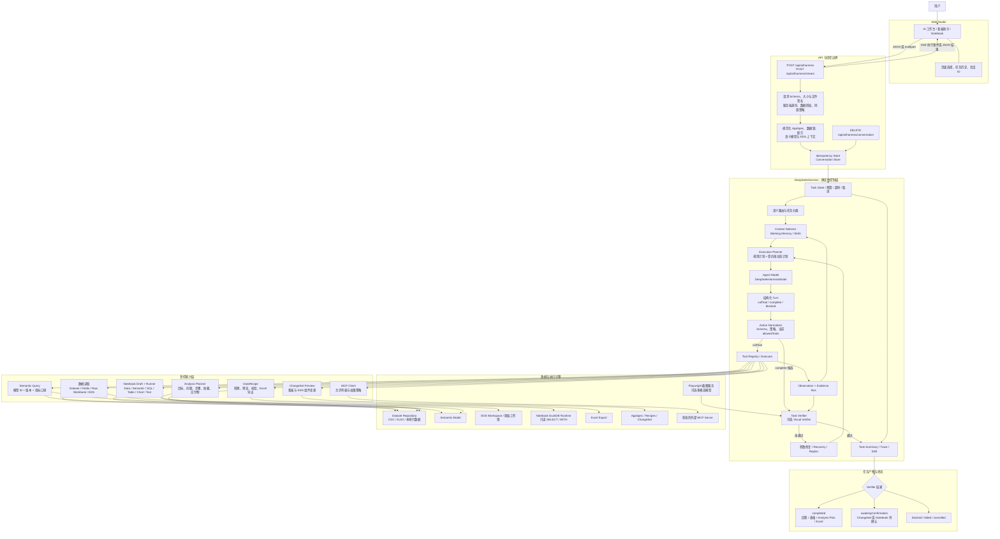
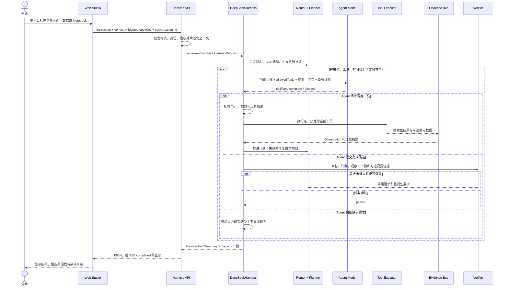
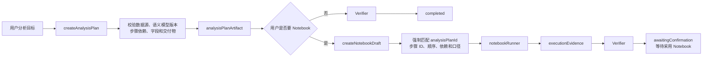
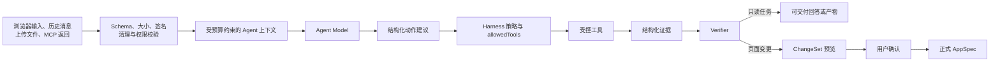

# AgentCanvas Harness 与 Agent 系统框图

> Agent 角色、上下文、预算和验证机制的最新维护入口：[Agent 架构](./agent-architecture.md)。多 Agent 的实现与启用状态以该文档为准。

> 依据 2026-09-11 的当前源码整理。这里的 Agent 指模型决策层，Harness 指掌握执行权、权限、预算、证据和任务状态的确定性运行时。

## 一句话关系

**Agent 负责提出下一步，Harness 负责决定它能看到什么、能调用什么、工具是否真的执行成功，以及最终结果能否交付。**

| 模块 | 主要职责 | 不直接负责 |
| --- | --- | --- |
| Agent / Model | 理解意图、提出分析步骤、选择当前允许的工具、根据观察继续推理、生成候选回答 | 直接读取服务器数据、绕过工具、直接修改正式页面 |
| Harness | 规范化请求、装配上下文、规划和限权、执行工具、记录证据、恢复重试、验收结果、管理任务状态 | 替模型编造业务结论 |
| Tool | 在严格 Schema 和权限范围内完成一次具体操作 | 自主规划后续步骤 |
| Verifier | 根据用户目标、计划、工具观察和视觉证据决定通过、重规划或失败 | 接受只有文字声明而没有证据的“完成” |

## 总体框图

## 一次 Agent 任务的时序

## Analysis Planner 与 Notebook 子链路

Analysis Plan 中的 SQL 步骤保存转换目标，Notebook Cell 才保存实际 SQL。当前 Runner 使用本地 DuckDB 执行依赖已有 Dataframe 的只读 `SELECT` / `WITH`；它不是通用数据库连接器，也不是任意 SQL 或 Python 沙箱。

## 权限和数据流边界

关键约束：

- 浏览器不能提交服务端角色、API Key、MCP 地址或启动命令；身份和运行配置由服务端补齐。
- Planner 每一步只开放当前 `allowedTools`；Agent 不能调用未注册或当前未授权的工具。
- 工具参数、工具结果和最终任务都要通过 Schema；工具失败会进入有限次数的修复或重规划。
- Evidence Bus 保存公开证据清单和安全摘要，不把模型内部推理当作证据。
- 数据或页面任务必须有真实工具观察；只写“已完成”不能通过 Verifier。
- 页面修改只生成 `pendingChangeSet`；用户确认前正式 `AppSpec` 保持不变。
- 图片原件、工作簿字节和完整原始工具结果不会进入 Conversation Store。

## 主要工具分组

| 分组 | 当前工具 |
| --- | --- |
| 数据与语义读取 | `inspectDataset`、`inspectFields`、`querySemanticModel` |
| 原始工作簿与 EDS | `scanEdsRawWorkbook`、`queryEdsRawWorkbook`、`inspectEdsRawWorkbook`、`readEdsRawRows`、`analyzeEdsReports` |
| 分析文档 | `createAnalysisPlan`、`createNotebookDraft` |
| 数据处理与导出 | `transformSpreadsheetData`、`previewDataRecipe`、`validateDataRecipe`、`exportDataRecipeToExcel` |
| 页面检查与变更预览 | `inspectAppSpec`、`createChangeSetPreview`、`createEdsBreakdownChartPreview`、`createEdsLineIssueChartPreview`、`updateEdsTablePreview` |
| 外部能力 | `callMcpTool` |

## 状态与产物

| 终态 | 含义 | 常见产物 |
| --- | --- | --- |
| `completed` | Verifier 已通过，可直接交付 | `resultMessage`、`tableArtifact`、`analysisPlanArtifact`、`exportArtifact` |
| `awaitingConfirmation` | 预览或草稿已通过当前阶段校验，等待用户采用 | `pendingChangeSet`、`notebookArtifact` |
| `blocked` | 缺少明确的数据、字段、权限或能力 | `missingRequirements`、安全说明 |
| `failed` | 协议、工具、预算或最终验收失败 | `error`、`terminationCode`、失败 Trace |
| `cancelled` | 用户取消、连接中止或拒绝待确认结果 | 取消记录，正式页面保持原状态 |

任务回执统一由 `HarnessTaskSummary` 表达，并可包含语义意图、Skills、Working Memory、Execution Plan、Evidence、Verification、计数、耗时和公开 Trace。SSE 的 `completed` 只表示请求结束，界面仍需读取 `task.state` 判断真实终态。

## 当前实现边界

- 主 Harness 支持 JSON 和 SSE；原始工作簿或图片通过受限 multipart 上传。
- 会话按身份命名空间、`conversation_id` 和 `pageId` 隔离，保存精简问答、Working Memory 和最近任务状态。
- 已有四类动态 Skill：数据可视化、EDS 异常分析、看板组件编辑、原始工作簿分析。
- 已支持本地 Notebook SQL 执行，但还没有 MySQL、PostgreSQL、Databricks 等通用数据库连接器。
- 尚无 Python 执行沙箱。
- `/api/ai/plan` 是独立的单次 ChangeSet Planner；新的多步 Agent 主链路使用 `/api/ai/harness`。
