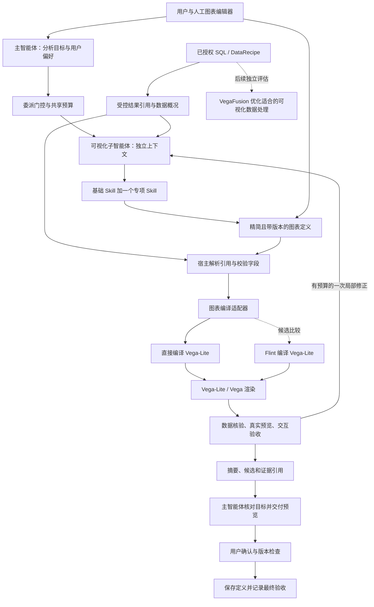

# Hex 可视化路线研究与 AgentCanvas 接入建议

研究日期：2026-09-13。状态：公开资料与本地源码核对完成；本文是选型与接口设计，尚未安装候选依赖、实现专项 Skill、启用可视化子智能体或发布。

维护入口：[Agent 架构](./agent-architecture.md)。委派、预算、权限、候选验收与确认流程继续遵循 [可视化委派链条 v1](./visualization-agent-design.md)。本文补充图表技术路线，不替代当前实现说明。

## 1. 研究结论

建议将 **Vega-Lite 作为新可视化渲染适配器的优先验证对象**，在应用层保留精简、可编辑、带版本的图表定义。图表定义由人工编辑器和 Agent 共用，实际数据由受控结果引用绑定；确定性代码负责编译、渲染与检查。现有 Recharts 图表继续作为已实现能力和对照基线。

精简配置的实现比较两个候选：本项目直接编译到 Vega-Lite；使用 Microsoft Flint Chart 编译到 Vega-Lite。Flint 提供现成 Skill 与 MCP，值得先验证其可复用程度；本轮没有选定生产依赖。VegaFusion 留到大数据优化阶段单独评估，不作为首张图跑通的依赖。

目前没有查到 Hex 使用 AntV MCP 的公开证据，也没有找到其内部可视化子智能体的完整可下载实现。AntV、Flint 是独立候选项目，不能称为 Hex 内部技术。

## 2. Hex 公开方案与可借鉴部分

| 已核实资料 | 公开描述 | 对我们的启发 |
| --- | --- | --- |
| [Hex 图表技术文章，2024-06-20](https://hex.tech/blog/making-ai-charts-go-brrrr/) | 内部图表配置编译到 Vega-Lite；AI 生成原生、可编辑的图表单元；缩减模型需要表达的配置 | 人工与 Agent 共用图表定义；布局默认值交给代码，不要求模型反复输出完整配置 |
| [Hex 可视化子智能体文章，2026-04-30](https://hex.tech/blog/cloned-visualization-team/) | 主智能体委派分析目标、数据来源与用户偏好；专职子智能体建立图表结构、查看效果、迭代样式 | 将专业工具与局部上下文交给子角色；用户指定图表形式时保留其要求 |
| [Hex VegaFusion 介绍，2023-01-24](https://hex.tech/blog/vegafusion/) | 将适合的图表数据处理放到服务端，减少发送给浏览器的数据 | 执行层准备图表所需结果，模型上下文和浏览器都不默认承担整份原始数据 |

这些文章说明各自发表时的方案，不能拼接成 Hex 现网全部内部依赖的证明。文章中的速度与 Token 指标属于 Hex 的实验，不能作为 AgentCanvas 的性能承诺。

## 3. 可复用资源与能力边界

| 资源 | 类型与核实能力 | 接入判断 |
| --- | --- | --- |
| [Vega-Lite](https://vega.github.io/vega-lite/) | 用声明式配置描述图形、字段编码和组合视图 | 适合作为编译目标；它不负责 Agent 调度、项目授权或 Notebook 生命周期 |
| [Vega Embed](https://github.com/vega/vega-embed) | 将 Vega / Vega-Lite 可视化嵌入网页 | 新 React 图表组件可封装此能力；不是安装后自动接管现有图表 |
| [Microsoft Flint Chart](https://github.com/microsoft/flint-chart) | MIT 开源的 JS/TS 精简图表语言，包含多个编译后端和 MCP 服务 | 与本项目语言栈接近；优先比较其库接口，MCP 作为另一接入方式 |
| [Flint Chart Author Skill](https://github.com/microsoft/flint-chart/blob/main/agent-skills/flint-chart-author/SKILL.md) | 指导生成语义与图表配置、先准备数据、按后端编译；提供验证与渲染工具用法 | 可作为专项 Skill 的参考；需适配项目的字段 ID、结果引用、能力门控和指令长度 |
| [Markdown Viewer Vega Skill](https://github.com/markdown-viewer/skills/blob/main/vega/SKILL.md) | 社区的 Vega / Vega-Lite 语法指导与图表示例，面向 Markdown 输出 | 可参考语法与示例；不是 Hex 或 Vega 团队提供的生产子智能体 |
| [VegaFusion](https://github.com/vega/vegafusion) | Rust、Python、JavaScript 可视化分析与规模优化构件 | 后续独立评估运行方式、转换支持和资源成本；不是数据库连接器或现成 Agent |

Flint 的 [Vega-Lite 后端目录](https://github.com/microsoft/flint-chart/blob/main/docs/reference-vegalite.md) 列出具体图表与配置，包含热力图相关能力。应按选定版本读取能力，不将一个后端的支持范围推断到全部后端。Flint 的动态图表编辑控件，也不能直接等同于时间播放或实时数据刷新。

### Vega-Lite 能解决哪些“动态”需求

Vega-Lite 的参数与选择机制可以表达滑块、下拉选择、框选、过滤及关联视图；官方有概览与明细联动示例。[参数文档](https://vega.github.io/vega-lite/docs/parameter.html)、[联动示例](https://vega.github.io/vega-lite/examples/interactive_overview_detail.html)

| 用户需求 | 拟采用方式 | 仍需本项目实现 |
| --- | --- | --- |
| 折线趋势 | 时间字段编码、数值字段、可选分组；先核对排序和粒度 | 数据绑定、缺口策略、多序列与持久化编辑 |
| 矩阵热力图 | 两个维度映射位置、数值映射色阶；参考官方 [Table Heatmap](https://vega.github.io/vega-lite/examples/rect_heatmap.html) | 重复坐标聚合、空格与真实零区分、色阶和大矩阵策略 |
| 框选与筛选联动 | 参数、选择与过滤 | 交互作用域；同一视图组合与多个独立图表之间的联动需分别实现 |
| 固定数据时间播放 | 宿主维护播放状态，更新图表参数或数据 | 播放、暂停、定位、固定色阶、计时器清理、行为验收 |
| 实时更新 | 宿主取得新结果后更新数据 | 授权查询、刷新节奏、版本检查、取消、过期响应和资源预算 |

Vega View API 提供数据、信号、异步渲染、静态导出与销毁接口，可支撑上述宿主适配。它不会自动创建实时数据源或管理查询订阅。[Vega View API](https://vega.github.io/vega/docs/api/view/)

### VegaFusion 的版本与执行位置

不能直接复制早期 Hex / VegaFusion 教程中的运行配置。VegaFusion 2.0 的官方说明包括：转换改为使用 DataFusion DataFrame API；浏览器 WASM 运行方式；移除旧 DuckDB SQL 连接；Python 接口也有迁移。[VegaFusion 2.0 说明](https://vegafusion.io/posts/2024/2024-11-13_Release_2.0.0.html)

因此，本项目已有 DuckDB 并不表示可以直接接入旧版 VegaFusion DuckDB 连接。浏览器执行也不等于服务器聚合：如果数据已全部传到浏览器，不能再宣称实现了“原始数据留在服务端”。后续需要明确执行位置、可支持的转换、回退行为与实际传输量。

## 4. 当前源码与差距

以下是 2026-09-13 的局部源码核对，不替代运行验证；路径相对 `site/`。

| 模块 | 当前实现 | 本路线的新增工作 |
| --- | --- | --- |
| `package.json` | React / TypeScript、Recharts、DuckDB WASM、MCP SDK；没有 Vega、Vega-Lite、Vega Embed、Flint 或 VegaFusion 依赖 | 新依赖先在独立实验中锁定与验证，记录渲染器和编译器版本 |
| `core/models/data-product.ts`、`components/data-components/BarChart.tsx` | bar / line / area / pie / donut；看板图表为单 value 序列，动画关闭 | 新图表模型、绑定和渲染适配；保留旧定义读取 |
| `core/harness/notebook-contracts.ts`、`core/notebook/dashboard.ts` | Notebook 支持多个数值字段；转看板时拆成单独图表保留各序列 | 新图表定义需贯通 Notebook 和看板，不能仅替换前端库就声称实现多系列叠加 |
| `core/notebook/contracts.ts`、`server/runtime.ts` | 有运行结果、完整性、数据签名、访问模式；Notebook 表结果限制 1000 行，阻止对截断上游继续计算 | 授权结果引用解析器、聚合结果描述；大数据不能绕过现有限制后直接灌入新图表 |
| `core/harness/skill-registry.ts` | 显式注册并动态导入本项目 Skill；单包指令有条数和字符限制 | 外部 SKILL.md 需要转换与注册；复制文件不会自动启用 |
| `core/harness/agents/registry.ts`、`coordinator.ts` | 仅数据子角色、保守单次委派 | 可视化角色及门控；之后再支持受控的数据准备依赖 |
| `core/harness/mcp/runtime.ts` | stdio / HTTP 工具调用、结果转换 | 尚未发现 MCP Apps 的 UI 资源宿主实现；工具调用成功不表示可显示交互 App |

当前 `resultRef` 是运行证据，不是可跨会话访问的下载地址。它不能直接填入 Vega 的 `data.url`。需要宿主按身份、项目、访问模式、版本和字段范围解析引用，取得合法结果后再绑定到图表。

## 5. 建议的目标架构

以下为 AgentCanvas 的建议设计，不是 Hex 的内部接口，也不是已实现代码。

### 图表定义与工具接口

建议新增独立 `ChartDefinitionV1`，不要把所有 Vega 属性直接加入现有 `BarChart`。最小字段如下，具体 Schema 留待实现：

| 字段 | 含义 |
| --- | --- |
| `id / version / revision` | 图表身份、定义格式与编辑版本 |
| `dataRef` | 宿主管理的结果引用，不含原始数据、文件路径或数据库凭据 |
| `kind` | line / heatmap 等；必须在已验证能力清单中 |
| `encoding` | x / y / series / color 对应的字段身份与类型 |
| `presentation` | 标题、轴名称、单位、主题与有限的布局选项 |
| `interaction` | 已实现的 hover / brush / playback 等模式及作用域 |
| `provenanceRef` | 已执行的数据处理、时间范围、粒度、缺失值政策和来源版本 |

编译后完整 Vega-Lite 配置和渲染截图作为派生产物保存，主智能体收到引用；人工与 Agent 的后续编辑仍作用于图表定义。配置包含编译器无法无损表示的修改时，应返回明确限制，不能下次编辑时悄悄丢失。

现有 `getVisualizationCapabilities`、`renderVisualizationPreview` 等仍按专项设计推进；拟补充两个工具边界：

- `createChartDraft`：接受受控数据引用、图表类型、字段映射和允许的样式，校验后返回候选引用。
- `updateChartDraft`：只允许更新已声明的结构或样式字段，要求候选 revision，返回新版本与受影响的验证项。

这两个名称是设计占位。它们不提供任意脚本执行，不直接应用正式页面。首次渲染即使用受控加载器；模型不能通过嵌入 URL、表达式或任意补丁绕过数据工具。需要的转换由确定性编译器生成或先交由现有数据执行层完成。

### 模型上下文与数据执行

主智能体委派分析目标、数据范围、验收条件以及用户明确的图表偏好。默认把图表类型判断交给可视化子智能体；用户要求“热力图”时保留这一约束，不能以自动选型覆盖。

子智能体获得字段概况、范围、缺失信息和限量样本，需要精确数值时调用受控查询。全量数据由执行层保管，解析数据引用后直接进入编译 / 渲染器，不让模型手写或转抄数据。数据不足沿用 `needs_data` 流程，不把读取更多数据隐含为加载新 Skill 的权限。

基础包继续使用本项目的数据口径与验收规则；折线、热力图、交互专项包按需加载官方示例与经本地验证的模式。外部 Skill 的来源、上游版本或提交、适配内容与依赖必须记录，不能将社区说明标成 Hex 官方 Skill。

## 6. 验证顺序与选型判据

### 第一轮：Vega-Lite 与 Flint 对比原型

用独立、合成的已聚合数据，对比“直接编译”与“Flint 编译”的三个场景：30 天多系列折线、日期 × 线体热力图、概览框选联动明细。目标是验证库能力与定义兼容，不先接真实模型、项目数据或远程 MCP。

| 检查 | 通过条件 |
| --- | --- |
| 数值与字段 | 图中数值、系列、时间范围与已知数据一致；不重复聚合或转抄变值 |
| 缺失与极值 | 缺失日期、真实零、负数与异常点均按明确规则处理 |
| 编辑与保存 | 人工改标题、轴、系列后保存重载一致；Agent 再改不会丢失人工设置 |
| 热力图 | 重复坐标先聚合；空白与零区分；色阶和单位明确 |
| 可读性 | 桌面 / 窄屏中文长标签不遮挡主要数据；有文本摘要和数据查看入口 |
| 交互 | 框选、清除与重置实际改变正确的视图；不能仅用截图判断通过 |
| 运行生命周期 | 过期结果不覆盖新图；切换页面后清理 View 与订阅；取消后无成功回执 |
| 资源成本 | 记录配置大小、编译与渲染时间、页面增量体积；目前未做性能测量 |

两条路径均使用锁定版本。若 Flint 无法表达首批需求、忽略关键属性或不能保留编辑语义，则优先直接编译；不能仅因现成 Skill / MCP 就选定。若可覆盖且减少维护量，再将它封装为内部编译适配器。Flint MCP 的交互界面需要宿主支持 MCP Apps；库接入可直接使用我们的 React 界面。

### 第二轮：子智能体与原生工作台集成

先完成专项设计 A–C 的一个可视化角色、折线图、候选渲染与验证闭环。原型通过后再将新图表定义加入 Notebook、AppSpec、保存恢复和 ChangeSet。检查来源授权、跨项目隔离、基础版本冲突、共享预算、取消与一次局部修正；用相同任务比较单 / 多 Agent 的正确性、时延和总 Token。

现有 Recharts 首张折线闭环仍可先完成；新增 Vega 适配器与旧图表并存，并通过显式版本迁移采用。旧数据回读验证通过前，不批量替换已有图表定义。

### 第三轮：动态与大数据

时间播放、跨图筛选、实时刷新逐项声明能力并运行行为测试。VegaFusion 另做支持转换、服务器 / 浏览器执行位置、传输量和资源消耗实验。生产数据来自外部 SQL 时先在数据源侧筛选聚合；未取全的结果不能因更换绘图库而变成完整数据。

## 7. 本轮交付与维护

完成公开资料核对、本地实现差距表、目标框图、图表定义建议和分阶段验收方案。没有安装或执行外部 Skill / MCP，没有修改运行代码、依赖、Agent 开关或现有服务。本轮不声称完成真实渲染、性能实验或模型质量评测。

文档验证包括维护入口与相对链接、Markdown 代码围栏、源码指纹同步与检查。旧有离线测试和浏览器结果仍以主架构文档各自记录为准，不能用于证明本方案已实现。

| 日期 | 变更 | 状态 |
| --- | --- | --- |
| 2026-09-13 | 补充 Hex / Vega-Lite / VegaFusion 的公开来源、Flint 与专项 Skill 候选、接入边界和验收顺序 | 研究与设计完成，候选未接入，生产依赖未确定 |
