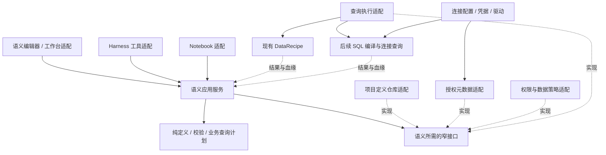

# 语义层设计 v0.1

日期：2026-09-14。状态：设计稿；本轮仅研究 / 文档修改，没有实现新接口、迁移数据或启用新查询路径。当前实现与启用状态以 [Agent 架构维护入口](./agent-architecture.md) 为准，现有功能说明见 [单表语义模型](../semantic-models.md)。

本设计承接 Connection / Metadata / Semantic / Query / Dataset 的逻辑分层。语义层负责定义业务名称、指标口径、数据粒度与允许的组合，并将业务查询转换为可验证的计划。连接管理、数据读取、页面状态和 Agent 调度分别由原所属模块承担。

## 1. 本轮设计决定

1. 采用模块化单体：先在现有 TypeScript 工程内建立依赖边界，共用现有部署和项目存储；不要求新增服务或独立数据库。
2. 语义模型独立于工作界面、Notebook、图表组件和模型供应商。人工与 Agent 使用同一套定义和计划校验；实际可见数据仍由调用身份和数据策略决定。
3. 先拆分现有单表能力，保留 v1 数据与行为；再扩展新模型格式、SQL 编译和关系查询。每阶段有独立验收和回退条件。
4. 查询按模型 ID、固定修订和成员 ID 表达。持久引用不依赖中文名称、页面选择或隐式的“最新版本”。
5. 关联、空值、单位、时间和完整性属于计算契约；无法证明支持的查询返回明确诊断，不自动猜测口径或换执行器。

## 2. 当前基础与真实缺口

以下结论来自本轮只读源码核对；“已有测试覆盖”描述测试文件内容，不表示本轮重新执行了这些测试。

| 范围 | 当前源码 | 对设计的约束 |
| --- | --- | --- |
| 定义 | [contracts.ts](../../core/semantic/contracts.ts) 定义单 Dataset、维度、固定聚合指标、版本与页面选择 | `version` 是模型修订；没有模型格式版本、跨表关系、计算表达式或历史修订仓库 |
| 管理与编译 | [model.ts](../../core/semantic/model.ts) 同时依赖 DataProduct、数据描述、角色和 DataRecipe | 拆分领域校验、工作区操作与执行器编译；旧入口暂作兼容门面 |
| 查询 | v1 仅含 `dimensions / measures / limit`，支持六种聚合；每次最多 5 个维度、20 个指标、100 行 | 筛选、排序、时间粒度、比率与 Join 均需新增契约和验收 |
| 持久化 | `DataProduct.semanticLayer` 内嵌模型及 `selectedByWorkspace`；进入浏览器快照和本地项目清单 | 当前每个 ID 只保存现行版本，旧修订不可凭版本号重新读取；没有独立语义 API |
| Agent | [querySemanticModel](../../core/harness/tool-registry.ts) 编译 DataRecipe，聚合完整输入后限制输出；记录模型 ID / 版本 | 工具产物和 Evidence 属于 Harness；新内核不依赖 Harness 契约 |
| Notebook | [execution.ts](../../core/notebook/server/execution.ts) 的 semanticQuery 必须接匹配的 data 单元与模型版本 | 当前不能直接从 warehouseSql 单元或远端表运行语义查询；需要独立接入阶段 |
| 展示和敏感字段 | [bindings.ts](../../core/semantic/bindings.ts) 检查 AppSpec 绑定；[privacy.ts](../../core/semantic/privacy.ts) 按原字段处理 AI 输出 | UI 绑定规则和结果策略移到边界，保留来源字段血缘 |
| 元数据 | 后续数据底座切片已扩展 [连接目录契约](../../core/connections/contracts.ts) 和 [目录模块](../../core/metadata/contracts.ts)：数据库 / schema / 表 / 列 / 类型、名称派生 ID、同步版本与结构指纹；最多 500 列且可能截断 | 尚无完整大目录分页、主外键、关系基数或即时新鲜度保证；未接入语义 SourceSnapshot 适配，不能自动宣称 Join 安全 |
| 远端执行 | [查询端口](../../core/connections/server/query-contracts.ts) 已支持注入驱动，输入仍是 SQL 字符串 | 参数化语义查询尚无端口；不能把模板字符串拼接当成已具备的参数绑定 |

特别保留两个兼容事实：v1 的空值遵守 DataRecipe 严格校验，包括计数；Harness 语义工具在聚合后遮蔽敏感结果，Notebook 的 AI 路径先处理输入敏感值再计算。因此第一阶段不能把两条路径合并成一种默认数据策略，也不能承诺不同身份下结果相同。

## 3. 领域边界与依赖方向

下图是目标模块调用关系；虚线为注入或结果流，不代表独立服务部署。



| 模块 | 拥有的数据和行为 | 接口边界 |
| --- | --- | --- |
| Connection | 凭据、驱动、项目连接授权、只读身份、取消和并发 | 只给上层公开描述、元数据和受控查询能力 |
| Metadata | 物理对象和列、类型、可见范围、目录完整性、结构版本 | 给语义层 `SourceSnapshot`，不替业务定义决定指标名称与口径 |
| Semantic | 模型、粒度、维度、指标、关系、业务约束和逻辑计划 | 输入元数据快照和业务查询；输出计划、依赖与诊断 |
| Query | 执行器能力、方言编译、参数执行、查询记录 | 处理获准的完整计划；返回结果及执行事实，不自行替换业务定义 |
| Dataset / 结果存储 | 原始导入表、物化结果、完整性与来源 | Dataset 可以是语义输入，也可以是查询输出；不要求每次查询先落库 |
| Notebook / 图表 / Agent | 单元编排、展示绑定、工具事件、上下文预算 | 消费语义服务与结果，不持有第二份口径计算实现 |

代码导入方向固定为“调用方 / 适配器 → 应用接口 → 领域定义”。领域层只使用自身契约、纯工具和既有校验库，不导入 React、Next、Harness、Notebook、DataProduct、DataRecipe、数据库驱动、文件系统、HTTP 或环境读取；类型导入也受此约束。与 Notebook 的表结构转换放在适配器，避免让通用语义执行依赖 Notebook 运行定义。

所有实现通过构造函数或工厂参数注入；不新增全局 service locator。`server/composition.ts` 只在服务器组装依赖，复用当前查询服务实例，保留共享并发与超时预算。浏览器公共出口仅导出安全定义，不重导出服务器组装模块。

## 4. 目标领域模型

下表描述 v2 目标字段；第一阶段不将它们写入当前 v1 Schema。

| 对象 | 最小信息 | 约束 |
| --- | --- | --- |
| ModelRevision | `schemaVersion=2`、`id`、`revision`、名称、说明、来源、成员、关系 | 格式版本与业务修订分开；使用中的修订不可原地覆盖 |
| SourceRef | `dataset`：Dataset ID；`relation`：连接 ID + 元数据对象 ID | 不嵌入原始行、数据库地址、凭据或任意 SQL；结果须物化成完整 Dataset 才作为此阶段的新来源 |
| SourceSnapshot | 稳定来源标识、结构指纹、字段 ID / 类型、完整性、读取时间、能力 | metadata 拥有；服务端解析物理 catalog / schema / table / column，不接收模型自报的授权结论 |
| Grain | 每行代表的实体、来源 ID、键字段及其验证依据 | 迁移模型可标为 `unknown` 并继续单表聚合；Join 不能依赖未知粒度 |
| Dimension | 稳定 ID、名称、别名、来源字段、类型、可用筛选和时间粒度 | 业务别名仅用于发现；同名或别名冲突返回候选，不随机选中 |
| Metric | 稳定 ID、名称、粒度、定义、单位、空值和可加性 | 区分基础聚合与聚合后派生指标；迁移时沿用现有 key |
| Relationship | 明确左右来源 / 键、连接方向、基数、Join 类型、验证依据 | 同连接、单事实模型的 many-to-one / one-to-one 优先；多路径必须明确关系 ID |
| ModelConstraints | 固定业务过滤、时间语义、允许维度、禁止组合 | 用户筛选只能与固定过滤取交集；权限约束来自外部策略，不放在可编辑的业务说明中 |
| DefinitionState | 草稿 / 使用中 / 停用，校验报告及其依赖指纹 | “校验通过”与“业务口径经审核”分开；AI 生成内容先为草稿，不能自报为可信模型 |
| SemanticSelection | 页面 ID → 模型引用 | 由工作台维护；不是模型内容，不触发模型修订递增 |

SourceSnapshot 的完整性必须对应明确的来源范围。全库目录最多返回 500 列时，不能据此声称某张大表的全部字段已加载；执行前需要确认本次所需来源和依赖的覆盖。文件字段暂时没有稳定 ID 时，由适配器保留名称与结构指纹，不能伪造跨重命名不变的身份。

`Metric.definition` 使用受限结构：第一步仍是 `aggregate(field, operation)`；后续增加 `countRows` 与 `ratio(numeratorMetricId, denominatorMetricId)`。行级算术、条件表达式及其他派生算子另按能力扩展，禁止存储任意 JavaScript 或将用户字符串作为 SQL 表达式执行。

比率必须先在相同分组、时间范围和筛选下计算分子分母，再相除。例如客单价为总销售额 / 去重订单数，不能平均各分组的客单价。平均数、去重计数和比率默认不允许再次求和；后续汇总应重新执行原模型，或使用有明确定义的可合并中间状态。

业务指南可引用模型 / 成员，说明“销售额是否含税、什么是有效订单”等约定。首期保存模型与成员说明、别名、固定过滤即可；跨项目指南库、向量检索和自动学习另行设计。自然语言说明只帮助理解，实际计算以结构化定义为准，说明不能调用工具或提升权限。

### 粒度与关联示例

以下是专为设计构造的小数据，不是 AdventureWorks 的实际查询结果：订单 A 的金额为 100，有两条明细 40 / 60；订单 B 的金额为 60，有一条明细 60。

| 请求 | 正确语义 | 预期 |
| --- | --- | --- |
| 订单销售额 | 在订单粒度求和 | 160 |
| 订单数 / 明细行数 | 去重订单数 / 明细记录数 | 2 / 3 |
| 客单价 | 160 / 2 | 80 |
| 订单头 Join 明细后直接 SUM 订单金额 | 订单 A 被重复计算，计划应拒绝 | 错误算法得到 260 |
| 按产品统计销售额 | 使用明细金额，或另定义分摊口径 | 不能把整单金额直接分给每个产品 |

第一轮关系执行只接受从事实到已验证唯一维度的 many-to-one / one-to-one 路径。反向一对多、many-to-many、跨事实汇总和跨连接 Join 返回 `UNSUPPORTED_RELATIONSHIP` / `FANOUT_RISK`。不能用 `SUM(DISTINCT amount)` 修正重复计数，不同订单完全可能金额相同。

声明基数本身不是证明。关系校验要记录字段、来源结构、验证方法和时间；有可信数据库唯一约束才可据此规划。其他情况需要在同一一致性范围内验证唯一性和执行查询；当前执行端口不支持该范围，首期应拒绝，或使用事先核验的不可变完整快照。目录样本、过期检查和字段名称相似均不足以放行。

## 5. 查询协议与执行过程

新协议使用 `metrics`，旧 `measures` 在 v1 适配器映射。以下是目标 v2 请求示例，尚无对应 API；`sales_model` / `area` / `revenue` 来自现有合成夹具，版本也须由真实仓库解析。

```json
{
  "schemaVersion": 2,
  "model": { "id": "sales_model", "revision": 1 },
  "dimensions": ["area"],
  "metrics": ["revenue"],
  "filters": [],
  "orderBy": [{ "memberId": "area", "direction": "asc" }],
  "limit": 100
}
```

不允许调用者另传聚合方式覆盖指标。筛选值是有类型的参数；初版仅开放维度过滤，`eq / in / range / isNull` 按成员类型和后端能力校验，多个筛选取交集。聚合后指标过滤、任意布尔表达式及复杂时间偏移稍后单独扩展。排序成员必须可解析；限行发生在聚合与排序之后，查询解释记录真实输出范围。

目标服务端过程：

1. 请求入口从已建立的身份和项目会话组装执行上下文；工具参数不携带凭据、项目路径或自报权限。先限定可发现的模型和元数据。
2. 仓库按固定 ID / revision 取模型；收集所有指标、过滤、排序、关联键与派生表达式依赖。
3. 读取已授权元数据快照，校验字段、类型、结构变化、粒度与后端能力，生成纯 `SemanticPlan`。编译可以在内存中完成，不读取业务行。
4. 权限适配器检查完整依赖集合；执行器在开始前再次复查。计划不构成持久授权票据。
5. 查询适配器编译为 DataRecipe 或参数化 SQL，执行完整查询后生成有界结果；执行完成、读取缓存和对外返回前都重新核对授权。取消后的结果不得发布。
6. 返回模型修订、结构指纹、实际查询 ID、字段血缘、访问模式、完整性、诊断与结果。Notebook、Harness 和图表分别适配自己的产物格式。

目标接口职责如下，具体参数 Schema 随对应实现阶段提交：

| 接口 | 输入 → 输出 | 所属层 |
| --- | --- | --- |
| `validateModel` | 模型 + SourceSnapshot 集合 → 结构化诊断 | 纯领域函数 |
| `planSemanticQuery` | 固定修订 + 查询 + 元数据 + 能力描述 → SemanticPlan / 诊断 | 纯领域函数 |
| `SemanticModelReader.get` | 受信范围 + ID / revision → 精确修订或不存在 | 应用读端口 |
| `SemanticModelWriter.saveDraft / activate / deprecate` | 受信范围 + 预期修订 + 候选 → 新修订 / 冲突 | 管理端口；与只读查询分离 |
| `SemanticMetadataReader.resolve` | 受信范围 + 来源引用 → 授权元数据快照 | 应用读端口 |
| `SemanticAccessPolicy.check` | 受信上下文 + 操作 + 完整依赖 → 允许 / 拒绝及数据策略 | 权限端口；实现复用现有项目和连接授权 |
| `SemanticQueryExecutor.execute` | 受信上下文 + 计划 + 数据策略 + AbortSignal → 结果与执行事实 | 执行端口；不返回 Harness / Notebook 专属类型 |
| `querySemantic` | 查询 + 受信上下文 + 上述读端口 → SemanticQueryResult | 应用用例；不依赖模型供应商 |

`SemanticPlan` 至少包含模型引用、规范化查询、输入来源 / 列、过滤阶段、聚合定义、关系路径、输出成员及来源、空值 / 时间 / 数值规则、所需后端能力和计划格式版本。它是可检查的数据结构，不携带函数、数据库连接或任意可执行文本。

`SemanticQueryResult` 区分：`inputComplete`（输入是否完整）、`outputComplete`（分组结果是否全部返回）、`previewTruncated`（展示是否缩短）和 `totalGroups`（未知时为 null）。远端可以在全表聚合后只返回前 100 组，此时输入完整、输出不完整；不能根据这 100 组宣称完整排名分布或再求总体指标。现有 `truncated` / `resultRef.complete` 由适配器保守映射，无法证明完整就不作为完整下游输入。

建议的诊断码包括 `UNKNOWN_MEMBER`、`AMBIGUOUS_MEMBER`、`MODEL_REVISION_MISSING`、`SCHEMA_CHANGED`、`METADATA_INCOMPLETE`、`ACCESS_DENIED`、`UNSUPPORTED_CAPABILITY`、`FANOUT_RISK`、`INCOMPLETE_INPUT` 和 `REVISION_CONFLICT`。字段路径、处理建议和可重试性分开存储；用户消息不暴露被拒绝对象的名称或原始数据库错误。

### 后端一致性与 SQL 接入前提

v1 DataRecipe 编译适配器必须继续使用现有六种聚合和严格空值行为。v2 为每个指标显式记录 `nullPolicy`，默认沿用严格模式；未来支持 SQL 的忽略空值语义时，应作为新修订的选择。空集合的 sum / count / average、数值溢出和零分母都需有固定规则与跨执行器样例，不能直接沿用数据库默认值并声称兼容。

远端严格空值校验应在同一次查询中返回检查信息并阻止无效结果，或依赖明确的一致性执行能力；不使用无约束的“先检查，再另查”冒充同一批数据的证明。严格模式未适配前返回能力不支持。v2 SQL 规则拟定为空集合 count 为 0、sum / average / min / max 为 null；比率零分母为 null 并给诊断。v1 空集合继续以当前执行器行为为准，不在拆分时更改。

Metadata 必须保留 decimal / bigint / date / timestamp 等源类型信息。当前远端高精度数字保持字符串，图表要求 number；SQL 适配不能悄悄转为浮点数。金额单位和币种是指标信息，不自动换汇；时间维度区分日期和带时区时间，时区与周起始规则由模型明确指定，不能取浏览器机器设置。

先为 Connection / Query 增加有类型的 `text + parameters` 执行契约，再开放语义筛选。值使用驱动参数绑定；对象和列名只从授权元数据解析并由方言编码。当前 `execute(sql, signal)` 不能直接满足该要求，必须补充连接器测试；不支持参数绑定的后端暂不开放此能力。Notebook 原手写 SQL 接口可以经兼容适配继续使用。

## 6. 权限、上下文与结果血缘

语义层不能增加数据访问权限。Dataset 访问策略、页面 / 项目可见性、连接 `projects` / `allowAi`、数据库账户权限和执行时撤权检查继续生效；字段别名、派生指标、筛选和关联键都须追溯物理依赖。发现接口也过滤未授权模型、字段和样例，不能先把全部目录送给模型再靠工具报错限制。

现有平台是本机单用户模式，UI 中的 editor / viewer 不等同于服务端多人身份。新增语义管理服务需要在服务端核查可信范围与管理动作；客户端提交的模型定义、`active` 状态、校验报告或修订号都不构成服务端认证。临时工作区仍允许经过校验的请求级定义，明确标为临时 / 未审核，不能借用相同 ID 冒充仓库中的已使用修订。

第一阶段将两种现行敏感数据策略分别注入其原调用边界；不移动聚合与遮蔽的先后顺序。后续统一策略前，需单独定义并验收每种聚合是否允许暴露；计数可见不表示已经具备隐私推断防护。结果的授权范围标识、访问模式和处理策略都要进入缓存隔离和证据，人工结果不能自动用于 AI 上下文。

Agent 接入按“检索已授权的相关模型摘要 → 选择精确修订 → 构造查询 → 查看结果和诊断”展开。显式选择模型时跳过检索；首期用名称、说明与别名检索，不引入向量数据库。摘要限制长度，业务说明按不可信内容处理。现有 `querySemanticModel` 名称和 v1 参数暂保留；新协议通过显式适配接入，不能只扩展服务端而忘记模型侧工具 Schema、上下文选择和 Verifier。

可视化消费语义结果时要保留成员 ID、固定修订、单位和分组粒度，避免把平均值、去重计数、比率重新 SUM。现有图表通过原字段 / 聚合生成绑定，并未保存完整语义修订；所以本设计不宣称已有看板可自动跟随语义模型刷新。新实时绑定需要独立契约与验收，当前可先使用明确的查询结果快照。

查询证据记录模型 ID / 修订、计划版本、来源和列血缘、结构指纹、规范化查询摘要、实际执行 ID / 时间、输入版本、完整性和访问模式。`resultRef` 暂作运行证据，不伪装成跨会话可下载地址。保存为 Dataset 时沿用所属存储的来源登记及 AI 授权流程。

## 7. 修订、存储与失效

模型 ID 在所属项目内稳定；有效地址包含项目范围 + ID + revision。业务名称与别名可以修改，引用仍保留 ID；旧 key 已用作成员 ID 时先保留，不自动改成中文字段名。物理字段改名若没有可证明稳定的来源 ID，标记需要重新绑定，不按名称相似度猜测。

v2 编辑保存草稿；激活时完整校验并以 compare-and-swap 原子检查预期修订，分配新修订并保留旧修订。引用固定修订的 Notebook / 查询不随新修订隐式更新；缺少历史版本明确报错。停用阻止新默认选择，历史定义及证据仍可查看；历史重跑始终重新检查来源和权限。被引用的修订归档后保留，永久删除需要独立引用检查。

草稿有自己的并发版本；激活 / 停用是独立的生命周期记录，不改写已固定修订的定义内容。修订集合仍受现有项目清单容量限制，迁移实现需给出修订数量与字节上限；达到上限时拒绝继续写入并提示整理，不能静默裁剪被 Notebook 或历史结果引用的版本。

第一阶段继续使用当前浏览器快照 v5 和 `agentcanvas-local-project-v1`，无自动数据迁移。后续读写 v2 必须一起扩展模型、DataProduct、快照、项目解析器、引用索引、备份 / 恢复和 Notebook 契约；存储版本由该迁移提交统一升级，旧客户端不能将新文件以旧格式覆盖保存。

建议继续由现有项目清单保存一个原子状态，用仓库适配器实现修订集合和索引，复用 `stateRevision` 及保存队列。不要同时双写浏览器、清单和一个新增 semantic.json；临时工作区与文件夹项目各自保有原来的明确存储归属。读端口只取得一版不可变快照；写端口在真实写入完成后才报告成功，不能把当前客户端队列接受快照当成磁盘持久化完成。

v1 迁移只转换现有修订：`version → revision`、`sourceDatasetId → dataset SourceRef`、`measures → aggregate metrics`，保留成员 key、聚合和严格空值规则。`selectedByWorkspace` 仍由工作区维护。旧存储没有历史修订时不能补造；旧 Notebook 缺失版本继续提示重选。没有语义层的旧备份迁移为空，失效来源保留诊断，重复导入不得在同 ID / revision 下覆盖不同内容。

模型指纹只证明定义，结构指纹只证明 schema；两者都不能证明远端数据未变化。首期不新增共享结果缓存。后续缓存键至少包含项目 / 身份范围、访问模式与策略、模型修订、查询参数、编译器版本、结构指纹和数据版本；源没有可靠数据版本时关闭自动复用，或单独启用明确时限与时间标记的缓存策略。撤权和过期检查仍在缓存读取时执行。

## 8. 建议目录与实现切片

以下是规划路径，尚未新建代码目录。按能力逐步产生文件，避免为未来假设预先建立大量空模块。

```text
core/semantic/
  domain/
    model.ts              模型与成员定义
    query.ts              业务查询、逻辑计划、结果与诊断契约
    validate.ts           字段、粒度、依赖与能力校验
    planner.ts            纯逻辑计划；不生成数据库请求
  application/
    ports.ts              读取、管理、元数据、权限、执行接口
    query-service.ts      只读用例与执行前后复查
    model-service.ts      后续修订管理用例
  adapters/
    legacy.ts             v1 契约映射
    data-recipe.ts        计划到现有 DataRecipe
    workspace.ts          原 DataProduct 管理与选择适配
    postgres.ts           后续计划到参数化 PostgreSQL 查询
  server/
    composition.ts        仓库、元数据和执行器组装
  contracts.ts            v1 公共契约 / 安全重导出
  model.ts                迁移期间保留原函数签名的兼容门面
```

连接器结构读取继续由 `core/connections` 承担。2026-09-14 后续数据底座切片已建立 `core/metadata` 的目录快照契约、用例和仓库适配，包含有界结构、名称派生对象 ID、结构指纹、同步时间 / 完整性及范围授权；尚无主外键或关系基数证明。语义适配器后续可将其投影为最小 SourceSnapshot，该适配与 S1—S4 仍未实现。SQL 相关通用查询 / 参数 / 表结果契约可在 SQL 切片归到 `core/query`，由 Notebook 与语义执行适配共同消费，不在第一切片重写所有查询代码。

`bindings.ts` 的图表适配后续随展示边界迁移；`privacy.ts` 的输出处理随数据策略适配迁移，旧路径可保留别名。Harness 表产物 / Evidence 转换放在 Harness 侧，NotebookCell / NotebookTable 转换放在 Notebook 侧，React 的选择与交互仍在 `components/studio/workspace/semantics.ts`。旧入口只转发，不复制实现。

| 切片 | 实际编码范围 | 进入下一阶段的条件 |
| --- | --- | --- |
| S0：本轮设计 | 本文、架构入口规划说明、现有语义文档导航及任务日志 | 当前与目标分开；接口、依赖、迁移风险可供审阅 |
| S1：单表解耦 | 提取领域校验 / 单表计划 / DataRecipe 与工作区适配，保留 v1 签名、存储、权限和输出顺序 | 原有语义 / Notebook / 工作区 / Harness 用例通过；无反向依赖；不包含新筛选、Join 或权限统一 |
| S2：修订与发现 | v2 数据格式、元数据快照、不可变修订仓库、迁移、精确版本解析、有限模型发现 | 备份兼容、冲突、引用、结构漂移和项目范围测试通过；先保留单 Dataset 执行 |
| S3：单表 SQL | 同一连接中单表 / 视图模型、参数执行、方言编译、类型 / 空值规则、运行结果适配 | 先验收 PostgreSQL；真实数据库验收单独记录，Databricks 独立验收后再宣称支持 |
| S4：有限关系与派生指标 | 单事实 many-to-one、明确时间维度、同粒度比率，依次加入 | 重复计数、唯一性、时间 / 精度和独立 SQL 基准通过；不同时开放跨连接、多事实和 many-to-many |

S1 不新增功能开关。后续阶段由组装处明确启用已验收的适配器；能力由服务器实际配置计算，未配置时返回不支持，不静默改走另一种计算。若需要临时灰度开关，在对应实施提交中记录名称、默认值与移除条件；本文不虚构已存在的环境变量。

## 9. 验收设计与本轮验证

| 验收主题 | 后续应执行的验证 |
| --- | --- |
| 行为保持 | 使用现有合成语义夹具：华东 150、华南 80、合计 230；保持 v1 空值报错、别名冲突保护、限行后完整性及角色 / 页面限制 |
| 模块依赖 | 扩展 [module-boundaries.test.ts](../../core/architecture/module-boundaries.test.ts)，同时检查值 / 类型导入、间接路径、浏览器不能到达服务器和无运行时循环；纯领域测试无需数据库或 UI |
| 两条 AI 数据策略 | Harness 聚合后输出处理、Notebook 输入处理各自保持；不以相同用户界面表格证明两条 AI 路径等价 |
| 修订与迁移 | v1 备份、无模型、缺失历史版本、同 ID 内容冲突、并发写入、字段删除 / 改名、旧客户端拒写新格式 |
| 查询语义 | 未定义或歧义成员、空集合 / NULL / 零分母、精度、时区边界、固定过滤、截断输入、聚合后限行、不允许再次错误汇总 |
| 多表正确性 | 上述订单样例的 160 / 2 / 80；拒绝得到 260 的扇出计划；重复维表键、缺失关联、相同金额不同订单、多个关联路径 |
| 访问与执行 | 授权范围覆盖隐藏过滤列和关联键；执行中撤权、缓存隔离、取消、超时、同名跨项目、目录截断、参数及标识符边界 |
| 集成 | 编辑 → 保存 / 重开 → 手动语义查询 → Notebook → Harness → 结果与图表；按相同身份 / 策略对照数值，图表确认流程独立验收 |

现有 [model.test.ts](../../core/semantic/model.test.ts)、[Harness 语义测试](../../core/harness/semantic-model.test.ts)、[Notebook 测试](../../core/notebook/notebook.test.ts) 和 [浏览器验收脚本](../../scripts/verify-semantic-models.mjs) 是 S1 起点；新增测试重点放在独立数值预期、边界违规和迁移失败，不能只镜像编译器生成的步骤。

AdventureWorks 可用于 S3 / S4 的后续多表验收，数据准备说明位于工作区 `artifacts/test-databases/adventureworks-pg-2026-09-14/`。本轮未恢复或连接该数据库，也未读取或执行其中的业务 SQL。验收需先确认该 PostgreSQL 移植版本的实际列与约束，再以独立 SQL 比对订单 / 明细 / 产品关系。

本轮仅执行源码与契约核对、架构文档维护检查、文档链接 / UTF-8 / 任务日志历史完整性检查及上述合成数值的独立算术核对。完整记录见根目录 [TASK-LOG.md](../../../TASK-LOG.md)。未运行应用测试、类型检查、构建、浏览器、真实模型或数据库，因本轮未修改运行代码；验收表是后续要求，不是通过报告。网站和运行配置未改动，新语义层未启用 / 发布。

## 10. 设计变更记录

| 日期 | 变更 | 状态 |
| --- | --- | --- |
| 2026-09-14 | 基于现有单表语义、Notebook 与连接端口，定义模块边界、v2 对象、查询过程、权限 / 粒度 / 修订 / 迁移和 S1—S4 实施切片 | v0.1 设计；S0 文档完成，S1—S4 尚未实现 |
| 2026-09-14 | 后续数据底座切片建立通用目录快照与 Dataset 来源回执，更新现有元数据基础和适配边界 | 目录代码已有实现与独立验证；语义 S1—S4、关系证明和模型历史仍未实现 |
