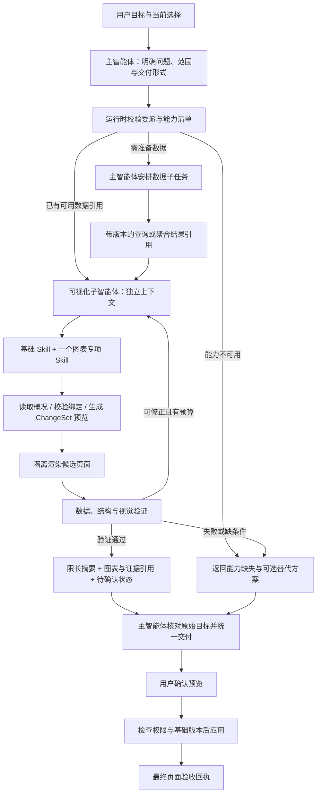

# 可视化子智能体委派链条设计 v1

设计日期：2026-09-13。状态：设计完成，尚未实现本链条、启用或发布。

本文是 [Agent 架构维护入口](./agent-architecture.md) 下的专项设计。以后修改相关角色、Skill、工具、协议或验证逻辑时，必须同步更新本文与主文档的实现状态及变更记录。

2026-09-13 补充：[Hex 可视化路线研究与接入建议](./hex-visualization-research.md) 核对了 Vega-Lite、VegaFusion 与可复用 Skill / Flint 候选。本文 A–C 的最小折线闭环保持原义；新的 Vega 渲染适配器先做独立原型与定义兼容验证，再接入同一委派、预览和验收协议。研究资料不表示候选已经安装或启用。

## 1. 设计决策

采用“主智能体 → 一个可视化子智能体 → 按需加载专项 Skill → 调用受控工具 → 验证 → 结构化回传”的组织方式。折线图、热力图等先作为同一可视化角色的专项 Skill；复杂交互任务经过评测后再考虑独立角色。

主智能体负责目标、数据范围、任务依赖和最终交付。可视化子智能体负责图表选择、绑定、布局和局部修正。Skill 提供专业规则；工具负责实际计算、渲染和生成产物。调度、权限、预算及提交检查由确定性运行时执行。

第一阶段交付一张单序列折线图的完整预览链条。热力图和动态图完成设计及能力缺失处理，分别在后续阶段实现渲染与验收后启用。已有其他图表仍可由原单 Agent 路径处理。

## 2. 源码核对与复用边界

以下路径相对 `site/`；核对日期为本设计日期，仅描述相关代码能力，不代替运行或质量验收。

| 现有模块 | 已有能力 | 本设计需要补充 |
| --- | --- | --- |
| `core/harness/agents/coordinator.ts`、`contracts.ts` | 主智能体与一个只读数据子任务；协议最多一个子任务 | visualization 角色、可视化委派、预览回执；后续数据准备依赖需允许有限的顺序子任务 |
| `core/harness/skills/data-visualization/runtime.ts` | 通用选图、绑定与预览规则，按需加载参考说明 | 子角色内的专项 Skill 选择与加载协议 |
| `core/harness/skill-registry.ts` | 通用 Skill 注册与任务匹配 | 不直接把尚无工具支持的专项能力暴露为可执行能力 |
| `core/models/data-product.ts` | `bar / line / area / pie / donut` 类型 | 热力图与动态行为需要完整扩展模型、Schema、工具参数和渲染器 |
| `components/data-components/BarChart.tsx` | 同一个组件封装多类图表；当前折线使用单个 value 序列 | 首版复用单序列能力；多序列、时间缺口与插值控制需独立验证后扩展 |
| `core/harness/tool-registry.ts` | 数据查询、页面检查、ChangeSet 预览和 EDS 专项制图工具 | 能力清单、结果引用读取、候选预览渲染入口 |
| `core/harness/visual-verifier.ts`、`task-verifier.ts` | 截图、视觉检查、目标与工具证据校验 | 未应用候选 ChangeSet 的隔离渲染；当前 awaitingConfirmation 可将最终视觉验证标为 deferred |
| `core/harness/agents/budget.ts`、`evidence-bus.ts` | 共享账本、取消与证据命名空间 | 为预览渲染及局部修正预留预算，增加产物版本与验收引用 |
| 本地项目与现有数据仓库 | 项目范围的数据、定义与部分结果快照 | 通用的任务产物引用解析接口；不让模型传入项目路径 |

热力图当前未出现在 CHART_TYPES 中。现有图表使用 `isAnimationActive=false`，截图通常禁用动画；已有提示框等局部交互不代表具备时间播放、看板联动或实时订阅能力。

## 3. 目标链条与控制权



图中“数据子任务 → 可视化子任务”为规划中的顺序依赖；当前一个子任务的协议不能直接支持此分支。第一阶段优先接收已准备的数据。缺少聚合或查询结果时返回 needs_data；由主智能体安排数据处理，子智能体不自行递归委派。

主智能体在规划阶段根据所需工具、图表能力和预计上下文开销选择委派，不等待自己失败。纯选图咨询不生成页面变更；明确要求制作或修改图表时才进入预览流程。

## 4. 可视化角色与 Skill

拟新增角色 `visualization`。角色不直接应用 AppSpec，不访问任意路径，不新增外部数据连接；所有工具权限为用户授权、角色范围、本次任务范围的交集。viewer 可以接收只读建议，不能因委派获得写预览权限。

| Skill 标识（拟定） | 触发场景 | 专业规则与验收点 | 启用前提 |
| --- | --- | --- | --- |
| visualization-base | 所有可视化任务 | 明确问题、指标、单位、范围、数据来源；检查标题、可读性与无数据状态 | 复用并整理现有通用 Skill |
| line-chart | 时间或有序趋势 | 时间粒度、真实排序、聚合口径、缺失点、轴范围、点数与标签密度 | 第一阶段仅启用现有渲染器可表达的单序列形式 |
| heatmap | 两个维度与一个数值构成的矩阵 | 坐标顺序、重复坐标聚合、统一色阶、零与缺失区分、图例单位、缺失格展示 | 热力图 Schema、绑定、组件、工具和验证器全部就绪 |
| interactive-chart | 时间播放、筛选联动、实时刷新 | 状态切换、帧顺序、暂停、刷新边界、过期响应、性能与可访问性 | 对应交互模式有实际工具和状态协议支持 |

专项 Skill 是本项目运行时的专业规则包，不需要为每种图表新增一个常驻 Agent。首版每次只加载基础规则和一个匹配的专项包；交付多种图表时按图逐步切换。选择依据包括用户意图、字段类型、数据规模和运行时能力清单；不能只按关键词或模型自述“擅长”决定。

Skill 声明 `id / version / requiredCapabilities / inputRequirements / acceptanceRules`。加载指令不扩大工具权限。未安装的 Skill 或未支持的渲染器返回具体 capability_missing，不能声称图表已生成，也不能悄悄改变用户指定类型。

“动态图”拆为三种能力分别设计：

- 时间播放：固定数据按时间帧切换，可播放、暂停、定位；与实时数据无关。
- 筛选联动：过滤器改变一个或多个图表，统一作用域和条件，防止旧查询覆盖新选择。
- 实时刷新：接入已授权数据更新来源，定义刷新频率、停止订阅、数据新鲜度和迟到数据策略。

需求不能判断属于哪种时，主智能体先澄清关键交互目标。第一批动态扩展优先固定数据的时间播放；实时刷新不在首版范围。

## 5. 任务与回传协议（目标接口）

以下为设计草图，落地时需提供完整 Schema、长度限制与版本兼容。现有 delegateDataTask 空参数协议保持原义；可视化使用独立的委派动作，不通过放宽数据角色权限实现。

```ts
interface VisualizationTask {
  version: 'visualization-v1';
  rootTaskId: string;
  taskId: string;
  objective: string;
  mode: 'recommendation' | 'changePreview';
  chartIntent: 'auto' | 'line' | 'heatmap' | 'interactive';
  dataRefs: string[];
  targetRef: string;          // 当前页面/组件及基础版本的受控引用
  scopeRef: string;           // 服务端绑定身份、项目、授权和数据版本
  constraintsRef: string;     // 指标、筛选、单位、时区、粒度、用户指定类型
  acceptanceCriteria: string[];
  budgetRef: string;          // 来自主任务账本，不单独重置额度
}

interface VisualizationResult {
  taskId: string;
  status: 'completed' | 'awaitingConfirmation' | 'needs_data'
    | 'blocked' | 'failed' | 'cancelled';
  summary: string;
  skills: Array<{ id: string; version: string }>;
  chartRefs: string[];
  changeSetRef?: string;
  evidenceRefs: string[];
  verificationRef?: string;
  dataRequest?: {
    objective: string;
    sourceRefs: string[];
    requiredFields: string[];
  };
  unresolved: string[];
  usage: { modelCalls: number; toolCalls: number; totalTokens: number };
}
```

上述 needs_data 是内部调度状态，不直接添加为现有公开 HarnessState。转换规则：可以继续准备数据则主任务仍为进行中；缺少授权、来源或预算时返回明确 blocked / failed。建议类任务可以 completed；新建或修改图表必须停在 awaitingConfirmation，不能在尚未应用时宣称正式页面已完成。

## 6. 工具边界与候选渲染

| 工具能力 | 复用或新增 | 约束 |
| --- | --- | --- |
| 查看字段、概况和已有语义查询 | 复用 inspectDataset / inspectFields / querySemanticModel | 限定数据源、字段和授权策略 |
| 查看页面与组件 | 复用 inspectAppSpec | 只读取目标页面的必要结构 |
| 生成图表变更 | 复用 createChangeSetPreview / EDS 专项制图工具 | 参数由现有 Schema 校验，只生成预览 |
| 查询图表能力 | 拟新增 getVisualizationCapabilities | 返回已安装并通过验证的类型、属性和交互模式；运行时提供可信清单 |
| 读取任务产物 | 拟新增 readArtifactSummary / readArtifactPage | 检查身份、项目、版本与授权；严格限行 / 限列 / 限字节 |
| 渲染候选预览 | 拟新增 renderVisualizationPreview | 在独立候选 AppSpec 上应用预览并截图，不写正式页面 |
| 验收与修正 | 复用 Verifier 并补充专项检查 | 验收证据绑定相同的数据、图表和候选版本 |

候选渲染入口须由服务端管理，不接受模型提供任意页面 URL 或脚本。预览凭据限定当前身份、项目和任务，支持取消与过期回收。现有截图服务可作为底层能力，仍按 STABLE-RUNTIME 管理。

确认前的数据、结构和候选视觉检查通过后，返回“预览已验证，等待确认”。用户确认时重新检查权限、项目 stateRevision 与目标页面基础版本；存在冲突则重新生成预览。确认是新的一次受控操作，等待期间不一直占用主会话锁或模型请求。

确认后的最终页面验证单独记录。若当前阶段只能 deferred，必须如实显示“最终页面尚未验收”，不能让预览验收结果冒充最终页面验收。

## 7. 控制上下文开销

运行时持有原始数据、候选配置和证据。主智能体保留目标、约束、状态和产物引用；子智能体保留当前图表的局部工作记忆。双方都不默认接收完整工作簿、完整聊天、全部中间输出或图片字节。

拟定初始限制，属于实现与评测起点而非现有保证：

| 项目 | 首版目标 |
| --- | --- |
| 子任务数量 | 同时最多一个可视化任务；每次处理一张图，不支持任意 DAG 或递归委派 |
| Skill 上下文 | 基础包 + 一个专项包；预算不足时先缩减参考材料 |
| 结果摘要 | 最多 1,200 字符，未解决问题最多 5 条，证据引用最多 12 条 |
| 单次样本读取 | 最多 30 行 / 10 列，且不超过 6,000 字符；不足以回答时查询聚合或分页 |
| 预览产物 | 首版一个图表引用和一个 ChangeSet 引用；截图不写入主聊天上下文 |
| 自动修正 | 最多一次局部修正；不得自行扩大数据范围或重试所有步骤 |
| 数据补充 | 最多一次主控数据准备与可视化恢复；第二次仍不足则说明缺口 |

进入子任务前预估已选上下文、工具结果和返工成本，从主账本预留最终汇总及验证额度；不为每个角色复制完整预算。无法容纳时缩小经用户允许的任务范围，或明确受阻。数据下采样、时间聚合、Top N 和归一化属于改变表达的决策，必须保留方法与遗漏信息，不能只为了节省 Token 隐藏异常。

产物引用绑定当前用户、项目、数据版本、语义模型版本、查询条件和候选版本。主智能体需要证据时按引用取精简内容；引用失效或项目切换后不得复用旧结果。持久化复用项目仓库现有约束，通用引用解析器是新增工作，不以文件路径替代引用协议。

## 8. 验收、失败与恢复

| 层次 | 核验内容 | 失败处理 |
| --- | --- | --- |
| 能力 | 请求类型、Skill 和渲染工具都可用 | blocked，并说明缺少能力；替代类型须用户接受 |
| 数据 | 字段、授权、时区 / 时间粒度、排序、指标口径、缺失值、版本 | needs_data 或 blocked，保留具体缺口 |
| 结构 | ChartSpec / ChangeSet 合法，目标和权限正确，无正式页面变更 | failed；不交付伪造成功 |
| 视觉 | 候选确已渲染，坐标、单位、颜色、标签及窄屏可读 | 有预算则局部修正，否则附失败证据 |
| 交互 | 实际执行播放 / 暂停 / 筛选 / 刷新，检查状态与结果一致 | 不用静态截图代替行为验收 |
| 最终交付 | 回答原目标，产物与证据一致，确认状态准确 | 主智能体不能把子任务候选结论直接标为完成 |

折线图必须检查时间顺序与聚合结果。当前渲染器的缺失点、平滑插值或多序列不能表达用户语义时，应先补齐组件能力或返回限制，不能把缺失值填 0，也不能把单序列伪装成多序列。

热力图还应验证色标范围、缺失格与真实零、极值和单位。动态任务需要固定数据与可控制时间的行为测试；截图禁用动画只能帮助静态布局验证，不能证明动画和交互正确。

执行失败只重做失败的候选步骤，保留已验证的数据引用；重试仍扣主预算。取消同时终止读取、候选渲染和验证，迟到结果不更新页面或任务。子智能体只上报公开执行回执，不回传内部推理。

## 9. 落地文件与实施顺序

以下均为拟调整或新增位置，不表示文件已经实现。

| 阶段 | 工作 | 完成判据 |
| --- | --- | --- |
| A：协议与能力门控 | 扩展 agents/contracts、registry、coordinator；建立能力清单、受控产物引用与权限交集 | 不支持的热力 / 动态请求不会被假报成功；单 Agent 与数据委派保持兼容 |
| B：折线图子任务 | 新增 agents/visualization-runner，复用 data-visualization 基础 Skill；新增 line-chart 专项资源 | 已有聚合结果 → 单序列折线图预览 → 主智能体结构化回传 |
| C：候选渲染与验证 | 新增预览渲染适配器；专项检查、一次局部修正、确认版本检查 | 桌面和窄屏候选验收通过；确认前正式页面不变 |
| D：数据依赖 | 由主智能体串行安排数据准备和可视化恢复；扩展当前最多一个子任务的约束 | 数据引用能贯通且不回传全量原始数据；没有重复执行或会话写入 |
| E：热力图 | 新增 Schema、组件、工具、Skill 与色阶 / 矩阵验收 | 缺失值、重复坐标、色标和大矩阵用例通过后才开放能力 |
| F：动态交互 | 先实现固定数据时间播放，再评估筛选联动和实时刷新 | 行为测试、资源清理与性能指标通过后逐项启用 |

现有 `HARNESS_MULTI_AGENT_MODE=single|data` 保持原义。未来开关可以扩展 visualization / auto，但必须同时更新服务端校验、文档、测试与回退方式；本设计不改变配置。

离线用例至少包含：正常趋势、重复日期、时间缺口、不同单位、异常点、超大数据、未授权数据、过期引用、项目切换、候选版本冲突、渲染失败、取消、预算不足、用户拒绝、缺失热力 / 动态能力。再用固定数据、相同目标对比单 / 多 Agent 的正确性、时延、Token 与返工次数。

## 10. 端到端示例

用户：把近 30 天每天的异常次数画成折线图。

1. 主智能体确认时间范围、时区、异常次数口径、当前数据源与目标页面；存在多个合理口径时先补充确认。
2. 有已验证的日聚合结果则引用它；否则由主智能体安排数据准备。数据工具保留来源版本、查询条件、覆盖天数与缺失日期。
3. 可视化子智能体加载基础包与 line-chart，读取结果概况，按时间排序并选择可表达缺失值的方案。
4. 调用预览工具生成标题、坐标轴、单位和数据绑定，使用隔离渲染检查候选页面。
5. 通过后回传限长摘要、图表引用、ChangeSet 引用及验证证据；主智能体展示“折线图预览已生成，等待确认”。
6. 用户确认后检查基础版本并应用，随后记录最终页面验收结果。

本示例是目标行为，不代表当前系统已经具备可视化子智能体。

## 11. 本次交付与变更记录

本次仅完成设计及相关源码边界核对，没有修改 Agent 执行代码、Skill 内容、图表组件或运行开关。未运行模型任务，也不宣称热力图、动态图或候选渲染已实现。

文档结构、代码块和维护入口链接已检查；`npm run docs:agent:check` 通过。以上为文档维护验证，不代表目标链条的运行验收。

| 日期 | 变更 |
| --- | --- |
| 2026-09-13 | 形成可视化委派链条 v1：单角色多 Skill、分阶段渲染支持、独立上下文、产物引用、候选 / 最终两阶段验收与实施清单 |
| 2026-09-13 | 关联 Hex / Vega-Lite / VegaFusion 技术路线研究与 Flint、专项 Skill 候选；保留首张折线闭环，新增渲染器需独立验证后接入 |
