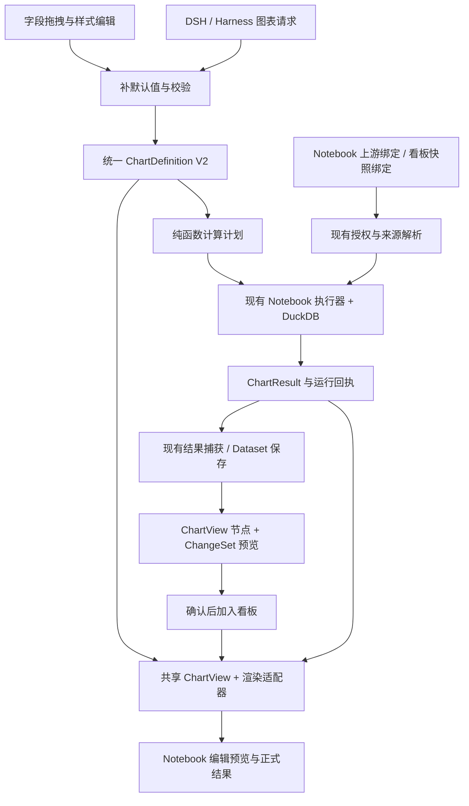

# 图表与分析结果统一架构修改方案

状态：**分批实施：A 阅读、B1 核心、B2 Notebook 完整计算、B3 独立分面之后，B4 改为官方 GraphicWalker 编辑组件，并实现 editNotebookCells.charts 与手动编辑共用的作者入口。仅运行时转换为 V2，持久化仍为既有 Cell / ChartConfig；V2 落盘、多指标、D–E 待实施，未发布 3000。** 日期：2026-09-29。[B4 验收与边界](../verification/native-notebook-chart-2026-09-29.md)，基础见 B2 / B3 报告。

本文是 [Agent 架构主文档](./agent-architecture.md) 的专项提案，不替代其当前实现说明。基于当前工作树（包括未提交的 Graphic Walker 接入），承接 [Hex 实际操作审查](../research/hex-live-audit-2026-09-29.md)。最初仅规划；本次开始 A，实际改动与截图见[验收报告](../verification/visualization-unification-a-2026-09-29.md)。以下 V2 接口、模块路径与迁移流程除明确标记外仍为设计，不代表已经存在。

## 1. 建议决定

按用户后续确认，Notebook 优先直接使用官方 GraphicWalker 编辑组件，不再继续仿写其字段界面；独立 /charts 页暂保留原简洁编辑器。保留 Notebook 执行器、DSH、DuckDB、项目存储、Puck 看板布局和 ChangeSet 确认机制。把工作集中到三个公共契约：**图表定义、图表计算结果、宿主数据绑定**。B4 作者契约解决重复宿主字段派生，不把有限桥接说成全部 IChart 持久化迁移。

目标是：AI 创建的图可在 Notebook 继续拖拽修改，看到的数值与结果表一致，加入看板后保留相同分组、排序和格式。只升级局部能力，不另造一套 BI 平台，也不因前端组件不足立即替换整套执行链。

关于上一轮审查的一项更正：`core/harness/tools/parameter-projection.ts` 的关键词裁剪针对旧 Harness 的 `createNotebookDraft`。当前 DSH 主工作台通过 `server/notebook-tool-bridge.ts` 的 `editParameters()` 从 canonical `editNotebookCellsSchema` 生成目录，并按单元种类筛选，仍包含 `graphicWalker`。所以不能把旧路径行为泛化为“主工作台 AI 默认拿不到 GW”。准确问题是两条入口的配置与提示约定不同、旧图字段和新版字段重复，以及缺少统一的默认创建策略。尚未通过本轮真实模型实验量化哪种图生成更多。

## 2. 当前代码约束

以下是源码事实，不是新方案已落地。

| 当前模块 | 当前行为 | 修改重点 |
|---|---|---|
| `core/chart-editor/config.ts` | 自定义 ChartConfig，同一模块包含 Zod、字段规则、GW 编译与主题；只有一个 Y 字段，固定升序 | 分离领域契约、计算计划和厂商适配 |
| `core/notebook/definition.ts` | chart 同时保存 chartType/categoryField/valueFields 和 graphicWalker，用 superRefine 检查重复字段一致 | V2 只保存一份图表定义，旧格式经兼容读取保留 |
| `core/notebook/graphic-walker.ts` | 用单元/上游 ID 生成 datasetId；旧图转新版默认 sum | 宿主绑定独立；迁移明确原始/汇总语义 |
| `components/chart-editor/ChartCanvas.tsx` | getComputation(dataset.rows) 在浏览器计算，再交 PureRenderer | V2 渲染接收已验证的图表结果，避免第二次业务聚合 |
| `core/notebook/server/execution.ts` | table/chart 均投影上游字段；请求内 outputs 保留完整表，响应展示截断 | V2 chart 在完整、获授权的上游上计算，再截断展示 |
| `core/notebook/contracts.ts` | resultRef 记录运行/版本/来源/完整性；表格预览最多 1000 行 | 为 V2 图增加明确结果语义，保留身份与大小限制 |
| `core/notebook/server/result-capture.ts` | 仅保存动作捕获本次目标完整结果；非跨请求仓库 | 直接复用，不把 resultId 变成公共数据下载地址 |
| `core/notebook/dashboard.ts` | 旧多指标拆成多个 BarChart 节点；绑定独立 Dataset | 新增能完整保存图表定义的看板节点 |
| `core/notebook/dashboard-policy.ts` | 明确拒绝 GW 看板快照 | 在新节点、快照语义与持久化完成后再解除对应限制 |
| `components/registry/component-registry.tsx`、`adapters/puck/*` | registry 提供节点渲染与编辑字段；adapter 有固定 supportedTypes | 增加节点需同步 Schema、类型、转换与往返保存 |
| `core/notebook/live-progress.ts` | 进度只传最多 50 行且有字节限制，正式采用另行核验 | 实时图必须标识有限预览，不把进度片段当完整结果 |
| `components/studio/notebook/NotebookTextResult.tsx` | Markdown 字符串按纯文本显示 | 单独做安全的阅读渲染，与文本求值分离 |

## 3. 目标结构



领域层不依赖 React、Puck 或 GW 的类型。GW 的 `normalize / TerseSpec / PureRenderer` 留在适配层。宿主解析数据权限；渲染器拿不到数据库凭据，也不自己发起查询。首期只有一个正式计算后端，不同时维护浏览器与服务端两套汇总答案。

## 4. 图表定义：计算与显示明确分开

`core/visualization/` 已按 B1 新增以下核心；不引入通用插件框架。实际边界见[本批验收](../verification/visualization-unification-b1-2026-09-29.md)，下文目标结构仍含未实施部分。

| 文件（B1 已创建，除特别标注） | 职责 |
|---|---|
| `definition.ts` | ChartDefinitionV2、字段/指标、排序、筛选、格式 Schema |
| `capabilities.ts` | 已实现图形/通道/聚合组合；供 UI 和 AI 共用 |
| `plan.ts` | 纯函数生成计算计划、结果字段及语义签名 |
| `result.ts` | 图表结果元数据、定义/结果匹配规则 |
| `server/execute.ts` | 经宿主授权的完整输入与查询端口；一次计算与结果核验，未接入 Notebook |
| `migration.ts`（未创建） | 读取旧图、计算迁移差异、生成待确认 V2 |
| `adapters/graphic-walker.ts` | V2 结果与显示配置映射到已安装 GW 公共 API |
| `adapters/materialized-workflow.ts` | 对实际 renderer 请求只允许 raw 投影，禁止二次业务计算 |

概念结构如下；这是接口草案，不是可直接复制的完整 TypeScript 定义。

```ts
type ChartDefinitionV2 = {
  schemaVersion: 2;
  mark: SupportedMark;
  data: {
    mode: 'rows' | 'aggregate';
    dimensions: Dimension[];  // 稳定字段引用、可选日期粒度、输出别名
    measures: Measure[];      // 原始字段/聚合函数/输出别名
    filters: Filter[];        // 首期只支持聚合前筛选
    orderBy: Sort[];          // 字段/指标别名、方向、空值次序、并列规则
    limit?: number;           // 显式 Top N，与意外执行截断分开
    timezone: string;
  };
  encoding: {
    x?: OutputFieldRef;
    y: OutputFieldRef[];
    color?: OutputFieldRef;
    facetX?: OutputFieldRef;
    facetY?: OutputFieldRef;
    tooltip: OutputFieldRef[];
  };
  presentation: {
    title: string;
    axes: AxisPresentation[];
    formats: Record<string, NumberOrDateFormat>;
    palette: Palette;
    legend: LegendPresentation;
    theme: 'inherit' | 'light' | 'dark';
  };
};
```

宿主信息放外面：Notebook 保持 `inputCellId`；看板保存 snapshot Dataset ID、字段映射和来源；独立编辑器引用它选定的 Dataset。通用图表定义不再含 `notebook:${cell.id}:...` 这样的宿主 ID。

必须明确的计算规则：

- `countRows` 不要求字段；`count(field)` 统计非空；`distinctCount(field)` 按明确的 NULL 规则计数。因此订单号是字符串也能拖入“值”区计数。sum/mean/median 仍需合适的数值类型。
- 已汇总指标默认保留数值，不因打开编辑器再 sum。比例/平均值不能自动求和或做未加权平均；首期在上游 SQL/语义模型明确计算，编辑器只引用结果。
- 颜色字段/分面字段如果改变分组粒度，就属于 data 变化；调色板属于 presentation 变化。不能把两者都归为“样式”。
- Tooltip 只能引用已有结果字段。添加会细分分组的字段需显式变更 dimensions；不继续把普通提示字段自动映射到 GW details 而暗改粒度。
- 日期粒度与时区在计算计划里固定，周起始日、纯日期与时间戳的语义有明确测试；V1 原有 UTC 行为迁移时保留。
- 分类序、指标序、保留输入序分别表示。保留输入序需要稳定行序/序号，不能假定 SQL 子查询或渲染器天然保序。
- schema 的表达能力与当前 renderer 的已验收能力分开。可存储多度量不等于第一批 UI 全开放；不支持的组合返回明确能力错误。

V2 采用一个新 chart 分支：同样 `kind: 'chart'`，新增明确的版本判别；分支内只有 `inputCellId + visualization` 等宿主字段，不再同时存 chartType/categoryField/valueFields。旧分支没有版本字段时按 V1 读取；Zod 的同 kind 分支可在 chart 内部使用 union，外层 discriminator 的可行写法需在契约测试中确定，不直接把两个重复 kind 分支塞入现有 discriminatedUnion。

### 数值精度门槛（B 批必须实现，当前未改变计算行为）

- 正式结果保留来源的逻辑类型、精度 / scale 和精确值；不能因当前 DataTable 将 DECIMAL / 大 BIGINT 序列化为字符串，就猜成分类或无条件 `Number(value)`。需要明确的结果类型元数据，不能仅凭字段名字或字符串正则推断。
- 整数转绘图 number 前验证在安全整数范围内并逐值检查；超限值保留精确表格并明确拒绝该数值绘图，不静默舍入。聚合结果也检查，不能只检查输入值。
- 金额先由执行层按明确 decimal 类型计算，正式表格 / 导出 / Tooltip 保留精确字符串和单位。第一版若不能无损验证绘图转换，就返回明确能力错误；后续支持量化时需显式给出单位、有效位与容差，记录于显示元数据，不能让近似浮点值回流成为业务计算输入。
- 日期不是数值精度例外：纯日期与带时区时间戳分开，时间分桶在执行层完成。NULL、零、负值保持不同；NaN / Infinity 明确拒绝。轴缩放 / 百分比显示不改变原始精确值。
- 固定验收样例至少包括：`0.10 + 0.20 = 0.30`、安全整数边界及超界、累加后超界、20 位整数、负金额、NULL 与零、decimal 比例及舍入边界。对比 SQL 正式表、回执、图上值与快照；样例尚未通过前，不宣称金融级精度一致。

## 5. 正式图表数值交给现有执行层

建议由 `core/notebook/server/execution.ts` 对 V2 chart 调用小型编译/执行适配：

1. 从当前 run 的 outputs 取得完整上游表，检查权限来源、字段和完整性；不从浏览器上传一批行作为正式证据。
2. `plan.ts` 生成筛选、时间分桶、分组、聚合、排序及 limit 计划。
3. 服务端新增 `core/visualization/server/execute.ts`，通过现有 `NotebookExecutionDependencies.query` 执行编译 SQL，沿用超时、取消和输入/输出限制。
4. 先计算正式 visual table，再生成有限展示表和回执。渲染与快照用同一 visual table 语义。

SQL 编译器只接受结构化白名单操作；字段须匹配真实元数据，标识符与字面量各自转义，不能让标题或字段显示名成为自由 SQL。首期复用现有查询引擎，新增编译器和语义测试，不直接做远端查询下推。远端上游若已截断，就拒绝把它计算为正式全量图；先让上游 SQL 聚合。当前查询引擎本身的 1000 行结果上限、16 MiB 输入和取消边界不应被顺手放开。

对于超过展示上限但实际完整的输入，必须在服务端展示切片之前计算。对于超过图表结果上限的输出，显式提示加聚合/Top N；Top N 是用户的查询语义，不等于被引擎截断但冒称完整。

### 回执和结果语义

保留 `NotebookResultReference` 的运行身份。建议 V2 chart 的 `table/resultRef` 表示已经准备好的 visual table，并新增有版本的 `visualResult` 元数据，至少包含：`dataDefinitionHash`、`inputResultIds`、`inputRowCount`、`outputRowCount`、聚合/筛选范围与已验证的结果字段。V1 的 resultRef 继续表示旧投影结果，两者通过单元版本判定，不能静默更名。

相应修改 `contracts.ts`、`run-receipt.ts`、`result-availability.ts`、`result-cache.ts`、实时进度投影、工具结果摘要和 Dataset provenance。验收时检查定义 hash、上游来源、runId、revision、accessMode 与当前请求匹配，不能仅靠 “status=success”。

`result-capture.ts` 仍只捕获本次完整目标表，沿用一次发布、复制读取、取消和 dispose。首期不新增全局结果仓库、不增加任意 resultId 查询 API。快照 action 继续重新执行并捕获，明确它是“新运行的快照”；不能声称与旧屏幕结果来自同一次源数据状态。若需要冻结眼前那次运行，后续需单独设计授权的持久结果存储。

### 避免二次聚合

V2 `ChartView` 只接收 materialized visual table。GW 适配输出无业务聚合的配置，筛选和日期分桶已在计算层完成。本地已安装的 GW 类型提供 `aggregate?: boolean`，但“关闭聚合后仍能正确多系列、分面、保序”必须先做适配验证；类型支持不能当作视觉验收。

验证不通过时，该 V2 组合先不开放，并保留旧图读取；不要让服务端与浏览器各算一次后默许不一致。GW 内部为布局执行的只读投影不等于再次业务聚合。旧图仍可由旧渲染器显示直到显式迁移。

2026-09-29 A 批试验：安装版本 0.5.2 的公共 `PureRenderer + normalize + getComputation` 在 `aggregate: false` 下，实际工作流无 aggregate 操作；模拟多系列、双向分面、重复分类、排名、输入序及 UTC 日期 / NULL / 负值 / 零通过。排名需设置 canonical 分类轴的 sort，不能直接依赖 TerseSpec.sort；保留输入序需使用公开 `scales.column.domain`，`sort: none` 本身仍产生字典序。详见验收脚本与报告。分面默认尺寸偏窄，时区 DST / 日期分桶 / 大数精度 / V1 迁移等价仍未验收；试验不是正式 V2 renderer 或存储协议。

### 继续分析图上结果

现有 chart 没有 outputName，`graph.ts` 不允许普通下游把它当命名表。首期不为实现图表重写整个依赖图：提供“保存图表结果为 Dataset”，需要继续分析时显式插入 Data 单元引用该 Dataset，并注明固定结果。现有“输入数据”仍从上游单元查看。后续若支持动态引用图表结果，必须单独扩展 graph、text references、输出名、CellSearch 和身份规则，不能只改 UI。

## 6. 共享显示组件与编辑状态

新增 `components/visualization/ChartView.tsx`，由 Notebook 正式结果、AI 实时预览和看板共同使用。现有 `ChartCanvas.tsx` 的导出、空状态、尺寸管理可以迁入共享组件；字段库与 Data/Style 面板仍属于编辑器，不跟随看板渲染。

把 `ChartEditor.tsx` 逐步改成受控模式：宿主传入 definition、preview、onChange、onApply、onCancel。独立 /charts 页自己负责 localStorage；Notebook 负责 revision 和草稿；看板编辑负责 ChangeSet。共享编辑器不得再次持有另一份正式保存状态。

编辑流程按以下方式验收：

```text
查看正式结果 → 打开编辑副本 → 调整字段/样式 → 预览 → 保存 → 正式图
                                 ↓失败/取消
                            保留原定义和原结果
```

- 纯显示变化可直接在当前已验证结果上预览，不重新跑 SQL/Python。
- 字段、筛选、分组和排序变化触发计算预览：有取消、序号和数据签名，迟到响应不得覆盖新配置；客户端不得伪造成功回执。
- 首个可交付版本可用显式“更新预览 / 保存并运行”，沿用现有完整执行链。不要在尚无授权结果复用服务时，让每次拖动偷偷重跑远端数据库或 Python。完整小数据的本地草稿预览若后续优化，须明确非正式结果，且通过与服务端一致性测试。
- 当前 result-cache 有严格 revision/fingerprint 检查。第一批保留保守失效策略；“样式变更复用正式结果”需另行建立 presentationRevision 与 dataDefinitionHash 的校验，不能直接篡改旧 resultRef.revision 冒充新运行。
- Notebook / 看板画布主题和尺寸由宿主传入。默认折叠字段库，提供放大编辑；在 AI 侧栏展开的 1366px 页面验收布局，不只看独立 /charts 大屏。
- 实时 SSE 的最多 50 行结果只能显示为过程预览；完整图等待正式结果，有限图要显示范围。确认草稿仍走已有整稿核验，不因图已显示而自动采用。

Markdown 修复独立于图表重构，新增 `NotebookRichText` 阅读组件，保留现有 `renderNotebookText` 求值和过期判断。对受限 Markdown 做排版，不启用 raw HTML；动态引用值作为文本节点或经 Markdown 转义插入，避免数据值形成链接/格式。图片/外部嵌入不是本批必需能力。

## 7. AI 改的是图表意图，宿主补足展示默认值

继续沿用 DSH 现有 `cellSearch → editNotebookCells → runNotebookCells → submitNotebookDraft` 和实时过程，不新增独立可视化 Agent，也不接管官方聊天 UI。

增加共享图表请求规范化函数，把精简的字段、指标、分组、图形、排序意图补为 V2。完整 V2 是持久化真值；精简 AI 请求只是操作输入，不能形成第二份持久格式。

- DSH `editParameters/editDescription` 与旧 Harness 的参数投影均使用同一能力表与规范化函数；默认创建 V2 已支持的组合，无需用户提 Graphic Walker。
- 新建时补齐确定的默认值；修改既有图时按稳定 cellId 和 editVersion 处理，只改指定属性，保留未提到的筛选、Tooltip、样式。现有整单元替换契约不能未经版本设计就随意接受不完整 cell。
- 第一批可以继续传完整 canonical cell；如果 Schema 过大，再给原编辑工具新增明确版本的图表命令分支，由服务端先应用到任务草稿，再通过原 canonical schema 校验。避免“一次把所有可视化库参数塞给模型”。
- 运行回执包含图表结果摘要与来源，AI 的“共多少”“占比多少”必须来自真实结果，不能仅从配置标题或已显示截图推断。
- 改颜色只提交展示差异；改分组必须真实重跑并核验。保持原版本冲突、来源权限、取消和整稿确认语义。

需同步的文件包括 `core/harness/server/notebook-tool-bridge.ts`、`core/harness/tools/parameter-projection.ts`、`notebook-cell-tools.ts`、CellSearch 输出、共享能力契约与 `runtime/dsh/notebook-plugin` 的目录/协议测试。先审计导入关系再决定哪些只是适配、哪些确实需要修改。

## 8. 看板先接固定快照，再考虑动态参数 App

第一阶段新增 AppSpec 节点 `ChartView`（建议名），保留旧 `BarChart` 节点读取。新节点保存：图表 V2 的显示定义、物化结果字段、snapshot Dataset 绑定和 provenance。原计算定义可作为追溯元数据，但快照渲染不得再次按它聚合。

必须一起覆盖：

1. `core/models/data-product.ts`、`core/schemas/data-product.ts` 的节点类型与 Schema。
2. `components/registry/component-registry.tsx` 注册，共享 ChartView 渲染。
3. `adapters/puck/types.ts`、`appspec-puck-adapter.ts`、`puck-config.tsx` 的节点与往返保存。
4. `core/notebook/dashboard.ts` 从 V2 完整结果生成一个保留多系列/分组的节点，而非按 valueFields 拆散。
5. `dashboard-policy.ts`、`/api/notebook/run`、Dataset 字段标准化和快照审阅。所有 encoding、排序、Tooltip 的输出字段引用必须通过统一 fieldMappings 重绑定，不能只映射 category/value。
6. ChangeSet 校验、项目读写/备份、导入迁移、便携版本兼容与来源范围选择；新节点绑定的 Dataset 必须能被来源收集器识别。

先保留现有 500 行快照限制；在条件不满足时提示用户聚合，不随意提限。快照保存→取消→确认→撤销→重开均需验证；取消不偷偷删除独立 Dataset，沿用当前语义。

固定快照不会随 Notebook 改动更新。要达到 Hex 式动态 App，后续才新增明确的 Notebook 绑定模式及参数运行器：参数变动触发受授权依赖闭包、结果按同一 run/参数签名发布，防止 KPI 和图表分别显示不同轮次。不在渲染组件里直接发 SQL。这个阶段需要查询权限、来源缺失、失效、取消和发布版本设计，不能把解除 GW 快照禁用当成动态 App 已完成。

## 9. 迁移与回退

- V1 只读适配不落盘；查看旧项目不会自动重写配置，兼容编辑入口保留到覆盖验收完成。
- 迁移旧 Recharts 图先保留“原始行 + 输入序”语义；重复分类、超过原 100 行范围等差异要显示前后行数/分组变化，用户显式保存后才成为 V2。不能默认 sum。
- 迁移已有 GW 图保留现有聚合、筛选与 UTC 语义，并用固定样例核对日期、NULL、count/distinct、median、排序及分面。失败时留在 V1，不伪装成功转换。
- V2 不存重复的旧字段。若需要旧版本导出，仅在无损转换成立时提供，并明确无法表示的能力；不得将不兼容 V2 强行写入旧项目格式。
- 当前 AppSpec 为 schemaVersion 1.0；新增节点/单元不能只改 TS 类型。需决定项目格式版本和最低读取版本，并在入口明确拒绝不支持格式。备份/便携旧客户端不可保证能读 V2，应在启用写入前完成实际跨版本测试。
- 使用一个项目能力开关控制“可创建 V2”；关闭后仍能读取已经保存的 V2。正式启用前保留迁移备份；回退程序不得导致新图被丢弃。不要以关闭 UI 开关代替旧二进制的数据兼容方案。

## 10. 分批实施与验收门槛

| 批次 | 具体交付 | 必须验证 | 依赖 |
|---|---|---|---|
| A：阅读缺陷与适配试验 | Markdown 阅读渲染；当前排序缺陷用样例固定；验证 GW 无二次聚合渲染多系列/分面/排序 | Markdown 表格/动态文本值、旧标题；逆序排名、重复分类、时区与 NULL；适配不通过时保留组合禁用 | 无 |
| B：V2 定义与正式计算 | 统一 Schema、能力、编译、执行、visualResult 回执和兼容读取 | 同一输入图表/结果表/捕获结果一致；截断拒绝；取消、超时、权限、迟到结果、hash/版本不匹配 | A 适配结果 |
| C：Notebook 与 AI 共用 | 受控编辑器，保存/预览衔接；DSH/Harness 共用创建约定 | 普通请求生成可编辑图；连续改分组/颜色保留其他配置；旧图迁移/取消；实时有限结果与正式结果区别 | B |
| D：看板快照 | ChartView 节点、Puck 往返、Dataset 字段映射、ChangeSet | Notebook→看板数值/系列/排序一致，预览取消/确认/撤销/重开，旧项目仍可读 | B、C |
| E：透视分析与动态 App | 多维度、多度量、字符串计数、可选透视表布局；后续动态绑定 | 计数/非空/去重；加权比例；总计不误加平均值；共享参数同轮更新 | 先评估范围，不塞进 A–D |

每批按项目规范运行必要的定向测试、类型与架构检查；有用户可见改动时在 3001 隔离项目留下并实际查看截图，覆盖成功/失败/取消。契约跨多个入口的 B–D 完成后再跑相关广泛回归和构建。真实模型验收与确定性离线工具测试分开记录，不以替身证明模型效果。是否发布 3000 另遵循既有明确发布授权。

实施顺序补充：A 作为 **逐组合的适配硬门槛**，不能以存在 `aggregate` 类型替代实际渲染；不支持的组合保留旧读路或明确禁用。B+C 首个切片只做一张完整结果上的单度量、多系列图：先打通定义 → 执行 → 回执 → Notebook 查看 / 编辑 / 保存恢复，再接 AI 同一契约。复杂分面、多度量、迁移、看板和动态 App 分别验收后开放，不一次铺满界面。首次写入 V2 前必须先验证未知格式拒写与旧客户端不丢数据；关闭创建开关不等于格式回退。

建议首个主线里程碑是 **B+C 的最小纵向切片**：合成 CSV → SQL 汇总 → AI 创建 V2 分组图 → 手动修改字段 → 图表结果表一致 → 保存重开；同时 A 的 Markdown 修复可独立交付。验证通过再做 D，避免先新增十几个界面选项而数据语义继续分裂。

## 11. 本轮验证与未决事项

最初方案阶段完成调用链复核；后续 A 批新增安全 Markdown 阅读、可复现的隔离 GW 适配试验与浏览器验证，未修改 node_modules。验证数字、截图、失败试验及运行状态统一见[本批报告](../verification/visualization-unification-a-2026-09-29.md)，不沿用初稿的“仅文档”作为当前状态。

实施前仍需确认：真实全量服务端计算与试验绘图的一致性、既有 GW count/日期/NULL 与编译 SQL 的迁移等价性、decimal / bigint 精度、项目格式升级与旧便携客户端拒绝 / 回退。A 的有限样例不替代这些批次门槛。
