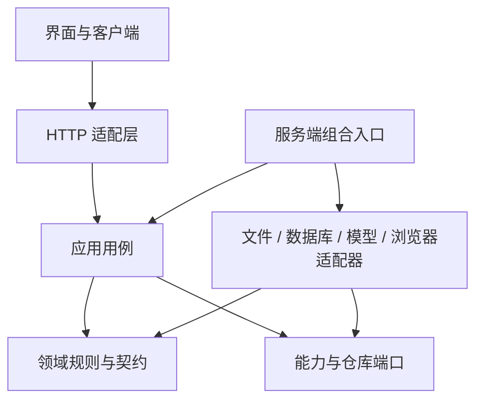

# 项目结构与解耦审查 · 2026-09-22

本次为源码审查与重构建议，尚未实施下述拆分。当前实现仍以 [Agent 架构维护入口](../architecture/agent-architecture.md) 为准；本文不替代该文档，也不代表稳定站已经发布这些能力。

建议沿现有业务模块继续分层，先分离职责、明确接口和依赖方向，再按需要调整目录。项目已有较好的纯逻辑与适配器基础；主要问题集中在几个协调中心承担过多职责。当前阶段适合在同一个应用内完善模块边界。

**审查范围与证据**

- 基于当前工作树，分支 `feature/eds-analysis-dashboard`、HEAD `addff46`，包含审查前已有的未提交改动。阅读运行约定、近期任务记录、架构相关章节及工作台模块说明；重点追踪工作台 → HTTP → Agent / Notebook → 数据与项目存储链路。
- TypeScript AST 扫描 `app/`、`components/`、`adapters/`、`core/`、`fixtures/` 中 350 个 TS/TSX 文件，排除 test/spec/声明文件，22:33:58（北京时间）快照合计 42,599 物理行。统计包含空行、注释、示例与评测源码；行数用于定位审查对象，不是复杂度或拆分质量的判定标准。
- 在上述范围内，排除显式 type-only 导入后，未发现运行时导入循环；未发现 `core` 直接导入 `app/components/adapters` 的声明依赖。该结论不覆盖第三方包、`runtime/` 和 `scripts/` 的 JavaScript，也不解析变量构造的动态导入。
- 实际运行 `npm test -- core/architecture/module-boundaries.test.ts core/datasets/repository-boundary.test.ts core/harness/runtime-boundary.test.ts --maxWorkers=2`：3 文件 / 38 项通过，其中架构边界 33 项；测试包装器另外运行 26 项 Node 工具测试，全部通过。pretest 的 193 文件架构指纹检查通过。审查期间检测到其他任务调整三个 DSH 相关源文件，已复扫并于 22:34 复跑相同检查，结果仍通过；该验证只对应检查时的工作树。
- 扫描脚本与原始结果保留于本机 [.runtime/structure-audit-2026-09-22](../../.runtime/structure-audit-2026-09-22/metrics.json)。它是本次审查证据，不是新增生产检查命令。

**值得保留的既有边界**

| 已有实现 | 可以继续沿用的做法 |
| --- | --- |
| `core/notebook/definition.ts`、`graph.ts`、`run-receipt.ts` | Notebook 定义、依赖分析与回执验证已经有独立所有者，人工和 Agent 共用 |
| `core/notebook/server/execution.ts` 与 `runtime.ts` | 执行依赖显式 query/python/log 端口，默认实现由入口组装 |
| `core/datasets/repository.ts` | Dataset 端口和错误类型已与临时仓库单例分开 |
| `core/connections/server/query-service.ts` 与 `drivers/` | 查询用例和 PostgreSQL / Databricks 驱动分开，授权、并发和超时有明确归属 |
| `core/agent-engines/server/executor.ts`、`runtime/dsh/` | 已有完整引擎选择和独立 SDK 承载边界，DSH 复用 Notebook 工具与执行链 |
| `components/studio/workspace/` | 已拆 assistant/datasets/pages/persistence，控制器工厂可独立测试 |
| `core/projects/state-repository.ts` | 保存队列通过 `ProjectStateWriter` 隔离 HTTP，保留合并、串行修订和冲突冻结 |

后续应扩展这些边界，保留原调用入口作为短期兼容层，避免产生第二份 Schema、第二套执行器或第二个工作区存储。

**优先级与可拆分结构**

P1 表示近期最值得处理；P2 表示在相关模块继续扩展前处理。这里是维护成本与影响范围排序，不是线上故障等级。

| 优先级 | 位置与实测规模 | 当前职责混合 | 建议边界 |
| --- | --- | --- | --- |
| P1 | `core/harness/tool-registry.ts`，2,022 行 | 业务工具实现、目录、任务参数裁剪、授权能力检查、结果压缩和分派 | 工具契约 / 业务工具组 / 目录投影 / 统一执行入口 / 观察压缩 |
| P1 | `components/studio/StudioWorkspace.tsx`，1,384 行、32 处 `useState` | 布局、正式文档、预览、确认撤销、审计、恢复、备份和多个功能协调 | 工作区文档协调 / 变更确认用例 / 恢复用例 / 布局与弹窗 / 页面组合 |
| P1 | Harness `handler.ts`，520 行；Notebook `run/route.ts`，123 行 | HTTP、文件解析、任务生命周期、依赖组装，以及结果转 Dataset 的业务规则 | HTTP 适配 / 用例 / 数据转换政策 / 服务端组装 |
| P1 | `visual-verifier.ts`，895 行；`studio-repository.ts`，435 行 | 中立接口与具体平台实现放在同一文件 | 纯契约与政策 / 应用用例 / 浏览器或服务端适配器 |
| P2 | Harness `runtime.ts`，2,013 行；`context-selector.ts`，1,170 行 | 主循环、故障恢复、终态交付、EDS 回答、意图选择、记忆和提示编排 | 单任务状态 / 阶段执行 / 交付策略 / 上下文选择与投影 |
| P2 | `core/projects/server/store.ts`，391 行 | 路径防护、字节读写、清单事务、引用规则、Dataset 适配、最近项目登记 | 文件适配器 / 清单事务 / 项目用例 / Dataset 适配 / 项目登记 |
| P2，按扩展需要 | Notebook `execution.ts`，208 行；`NotebookPanel.tsx`，375 行 | 类型执行分支与共同运行机制；UI 编辑、运行、确认和展示协调 | 静态类型处理器 / 共用运行外壳；编辑与运行控制 Hook |

**1. 工具注册中心：优先拆出业务工具组**

证据：[工具接口和上下文](../../core/harness/tool-registry.ts#L75)、[注册表](../../core/harness/tool-registry.ts#L1067)、[参数裁剪](../../core/harness/tool-registry.ts#L1476)、[结果压缩](../../core/harness/tool-registry.ts#L1893)、[执行分派](../../core/harness/tool-registry.ts#L1943)。同一文件同时了解 EDS、原件、语义查询、Notebook、看板和 MCP。`scopedToolParameters` 单个函数占 319 行。

建议先形成如下模块，每个文件都是拟新增边界：

```text
core/harness/tools/
  contracts.ts            工具定义、上下文端口、参数错误
  dataset-tools.ts        数据检查与配方相关工具
  workbook-tools.ts       原件检查、检索与 EDS 工具
  notebook-tools.ts       适配既有 notebook-cell-tools
  dashboard-tools.ts      看板预览工具
  semantic-tools.ts       语义查询适配
  catalog.ts              静态目录与按任务筛选
  parameter-projection.ts 提供给模型的参数范围
  observation.ts          有界结果投影
  executor.ts             共同校验与受控分派
```

首批只迁移 `inspectDataset` / `inspectFields` 等只读工具及必要契约，保留 `tool-registry.ts` 重导出。业务工具通过窄上下文取得能力，不反向导入完整注册表。工具 Schema 的同源性、工具名与目录、参数错误类型身份、权限复查和输出预算均保持原有语义。

收益是增加一个领域工具时，可以局部修改和验证。不要在此过程中开放动态插件注册或任意工具执行；目录可展示与执行已授权仍是两层检查。

**2. 工作台：把业务协调从页面组合中抽离**

证据：[Notebook 与快照回调](../../components/studio/StudioWorkspace.tsx#L334)、[启动恢复](../../components/studio/StudioWorkspace.tsx#L505)、[审计与确认](../../components/studio/StudioWorkspace.tsx#L639)、[备份恢复](../../components/studio/StudioWorkspace.tsx#L932)。虽然已有 `workspace/` 模块，主组件仍手动同步正式文档、执行预览、任务、会话、查询记录和 UI 状态。启动恢复与备份恢复存在多组相似的状态赋值。

建议沿现有控制器工厂模式继续拆分：

- `useWorkspaceLayout`：模式、侧栏、助手宽度、弹窗与焦点；只处理展示状态。
- `createWorkspaceChangeActions`：预览、基线核对、应用、取消、撤销和审计；复用原 ChangeSet 执行器。
- `restoreWorkspaceSession`：从已经校验的快照生成恢复所需状态，显式区分启动恢复与备份恢复的会话轮换规则。
- `useWorkspaceDocument`：协调现有文档、执行状态与保存入口，维护它们的同步约束；初期不引入新的全局 Store。

顶层最终负责组装这些模块和渲染。验收重点是过期预览不能采用、取消保留 Puck 编辑稿、切换项目前等待保存、刷新后会话归属正确，以及只有一个正式文档写入路径。将 1,384 行简单搬到一个同样庞大的 Hook，不能解决职责混合。

**3. API：将传输处理、用例和组装分开**

Harness 的 JSON 与 SSE 已复用一个 handler，这一点应保留。当前 [handler](../../app/api/ai/harness/handler.ts#L141) 还拥有 multipart 解析、原件缓存、视觉实现配置和 Live Evaluation 分支；[任务执行闭包](../../app/api/ai/harness/handler.ts#L394) 又负责引擎租约、会话事务、MCP 生命周期、Notebook Runner 组装与环境配置。

建议让路由只处理传输、身份、输入解码、状态码与 JSON/SSE 输出；把 `runAgentTask` 用例移至 Agent 应用层，把凭据、模型、连接、Notebook、视觉与 MCP 的组装放到服务端组合入口。普通任务、可视化实验、Live Evaluation 使用显式的服务端配置档，公开请求仍不能选择受信任评测模式或注入能力。

更适合作为首个小切片的是 [Notebook 结果保存分支](../../app/api/notebook/run/route.ts#L47)。这里目前执行：完整结果读取 → CSV 编码再解析 → 恢复已有字段类型与行值 → 质量统计 → 敏感来源传播 → 存储。123 行中包含大量业务判断，不能仅按文件长度认为路由已经足够薄。

可先抽出 `buildNotebookResultDataset`，保留现有转换算法、字段顺序、质量口径和敏感策略；随后用 `saveNotebookResult` 协调结果访问与持久化。若以后改成直接由有类型表构造 Dataset，应另作行为变更验收，覆盖前导零、高精度数值字符串、布尔、null、宽表、空表、截断结果与授权，不与首次搬迁合并。

人工和 AI 可以复用来源解析机制与构造工具，但应显式保留不同的授权策略；引擎租约、会话 commit/abort、MCP close、取消和幂等的先后关系也必须保留。

**4. 两个具体的跨层依赖：适合先建立清晰端口**

第一处是视觉验证。`runtime.ts` [导入视觉辅助函数](../../core/harness/runtime.ts#L65)，而同一 [visual-verifier.ts](../../core/harness/visual-verifier.ts#L80) 同时定义接口、缺省证据、[Playwright 截图](../../core/harness/visual-verifier.ts#L337)和[视觉模型适配类](../../core/harness/visual-verifier.ts#L574)。因此核心的模块依赖仍能到达具体视觉实现；这不表示导入时就会启动浏览器或发出请求。

建议拆为 `visual/contracts.ts`、`visual/evidence.ts` 与服务端截图 / 视觉模型适配器。Harness 只依赖前两者和 `HarnessVisualVerifier` 端口，HTTP 组合入口注入具体实现。依赖测试应禁止从执行核心到达该具体适配器。

第二处是工作区持久化。[项目契约](../../core/projects/contracts.ts#L3) 为校验工作区导入 `studio-repository.ts`，该文件同时包含 [快照版本与 Schema](../../core/repository/studio-repository.ts#L29)、[迁移和备份](../../core/repository/studio-repository.ts#L179)、[LocalStorage 实现](../../core/repository/studio-repository.ts#L266)与浏览器工厂。当前工厂有 `window` 防护，不能据此宣称已经发生服务端浏览器访问错误；问题是模块职责与可复用契约不一致。

建议建立工作区快照所有者，例如 `core/workspace/contracts.ts`、`snapshot-codec.ts`、`migrations.ts`、`repository.ts`，浏览器实现在 `client/`，项目适配器继续留在 projects。迁移保留 v6、旧备份兼容、诊断剔除与会话轮换；旧入口重导出同一对象。`core/harness/contracts.ts` 的 722 行还可按 request/task/event/model/tool 切分，但保持 Schema 单一来源与已有 JSON 格式。

**5. Harness 主循环与上下文：在外围拆分稳定后处理**

证据：[runTask](../../core/harness/runtime.ts#L563)、[EDS 特定回答](../../core/harness/runtime.ts#L433)、[幂等存储](../../core/harness/runtime.ts#L1937)。上下文模块同时包含 [意图规则](../../core/harness/context-selector.ts#L238)、[工作记忆构造](../../core/harness/context-selector.ts#L641)、[工具计划](../../core/harness/context-selector.ts#L774)和[上下文组装](../../core/harness/context-selector.ts#L904)。

建议先独立幂等存储与错误契约、EDS 回答政策、观察投影和工作记忆；再以一个明确的任务上下文承载状态，分别组织 model step、tool step、verification/finalization。`runtime.ts` 保持可阅读的主执行顺序。上下文选择、提示文本与有界序列化可以独立，但不能各自维护一套工具权限判断。

该项改动风险高于只读工具拆分：预算共享、故障修复次数、授权撤回、取消、事件序号和终态都依赖时序。应针对这些行为建立迁移前后对照；特别保留一次完成事件、完成前验证、无编辑不提交草稿和有编辑需审阅采用。已有 Harness 与 DSH 引擎边界继续有效，不要求两者使用完全相同的循环或交付政策。

**6. 项目存储：分离规则，但保留事务所有权**

证据：[路径防护](../../core/projects/server/store.ts#L32)、[原子编辑入口](../../core/projects/server/store.ts#L114)、[保存状态与引用检查](../../core/projects/server/store.ts#L135)、[Dataset 适配](../../core/projects/server/store.ts#L329)、[项目登记与缓存](../../core/projects/server/store.ts#L349)。

先提取纯规则，例如保存状态引用校验、删除影响、存储元数据规范化；随后分离最近项目登记、Dataset 适配与字节读取。清单读改写、修订比较、独占锁和 compare-before-replace 继续由一个事务入口掌握。不要把原子删除拆成 UI 先改定义、文件模块再改清单等独立步骤。

`ProjectError` 当前还携带 HTTP status；可逐步移至可移植的错误契约并由路由映射。需要精确保留不兼容项目拒写、损坏文件拒恢复、链接路径拒绝、敏感权限复查和跨窗口冲突冻结。该模块涉及持久化，适合在前面的纯边界切片稳定后推进。

**7. Notebook：为扩展保留静态、按类型的模块边界**

已有 `cell-catalog.ts`、`cell-creation.ts`、`cell-presentation.ts`，不需要重建目录。后续若继续增加复杂单元，可把执行分支移入受类型约束的静态处理器表；共同外壳继续负责 DAG、取消、能力检查、来源、结果完整性、日志和 Python 会话关闭。

严格 discriminated union 继续拥有可持久化与可执行种类的定义。浏览器编辑器注册、执行器注册和 Agent 可用目录保持不同职责，显式校验种类完整性；登记一个编辑器不会自动开放执行权限。

`NotebookPanel` 已有自动运行与运行所有权模块，可继续将编辑 / 删除 / 改名确认和运行请求分别收敛到 Hook。这个方向应由单元扩展需求驱动，优先级低于工具中心、工作台和 API 中已出现的职责混合。

**建议的层次与依赖方向（目标结构，尚未实施）**



图中 HTTP 连接是请求路径，其余为依赖或组装关系；浏览器不导入服务端用例实现。前端无副作用的编辑用例可以直接复用可移植领域模块。

保留 `core/notebook`、`core/datasets`、`core/projects`、`core/harness`、`core/agent-engines` 等业务所有者，再在确有需要的模块内部建立 `contracts/domain/application/ports/client/server`。`server` 内应区分用例与基础设施，文件夹名本身不能证明已经解耦。公共模块只容纳稳定、跨领域且不反向依赖业务的契约；已有公共表形状、SQL 预检和有界 HTTP 读取是合适的例子。

每个模块提供窄的公开入口。浏览器入口、服务器入口与纯契约入口分开，不用一个 `index.ts` 同时汇出全部服务端与客户端代码。目录迁移可以逐个模块完成，兼容层最终在调用方迁移后删除。

**实施顺序与每批验收**

| 批次 | 有界交付 | 验收重点 |
| --- | --- | --- |
| 1 | 补齐依赖扫描范围；视觉契约 / 适配器分离 | 扫描 TS/TSX/MTS/MJS 的适用源码，排除安装树；检查核心不再到达具体视觉实现，保留现有视觉验证行为 |
| 2 | 抽离少量只读工具，稳定 tools 契约与执行入口 | 目录、Schema、错误类身份、工具结果和预算保持；不得绕过执行期授权 |
| 3 | 抽出 Notebook 结果 Dataset 构造，再拆 Agent 请求组装 | 类型与质量统计、完整结果限制、敏感传播、JSON/SSE 一致、租约与取消时序 |
| 4 | 工作区快照契约分离，再拆工作台确认与恢复控制器 | v6 备份兼容、单文档写入、过期预览拒绝、取消保留编辑稿、保存失败与重开 |
| 5 | 拆上下文、幂等与主循环阶段 | 事件 / 终态对照、失败修复、授权撤回、预算累计、两引擎兼容 |
| 6 | 项目存储规则和适配分离；按需求拆 Cell 处理器 | 原子写入、修订冲突、损坏 / 不兼容拒写、引用保护、各单元成功失败取消 |

每批先选现有行为测试作基线，再做单一职责抽取；类型、相关测试、架构边界及必要的构建通过后交付。涉及用户可见功能或交互的实现批次，按项目要求在 3001 使用隔离合成项目保留并实际查看成功、失败、取消截图。Agent 相关源码调整时同步唯一架构入口正文和变更记录，再运行 `docs:agent:sync` / `docs:agent:check`。

现有 [module-boundaries.test.ts](../../core/architecture/module-boundaries.test.ts#L15) 只收集五个根目录的 TS/TSX。DSH 的 [broker](../../core/agent-engines/server/tool-broker.ts#L6) 已直接依赖 `runtime/dsh/*.mjs`，视觉模块也使用变量名动态导入 Playwright；这些路径需要补充扫描或明确的动态依赖清单。可以在现有 AST 检查上增加规则，不必立即引入新的依赖分析框架。对迁移中的例外逐条说明，新增代码不得扩大例外范围。

**其他可随任务整理的部分**

- 浏览器验收脚本：`verify-dsh-text-browser.mjs`、`verify-m7-excel-live-browser.mjs` 等有相似的浏览器启动、合成项目保护、截图和报告流程，可抽成 `scripts/testing/` 中的普通辅助函数。场景断言、真实 / 替身证据、收费阶段的一次调用保护仍由具体用例明确拥有。
- 样式：`app/layout.tsx` 与 `globals.css` 统一加载功能样式，主题和布局又依赖载入顺序。后续按功能收拢选择器和局部样式，保留共享色板、布局外壳和 Puck 主题入口；不要把主题规则散入各组件。没有做本次 CSS 冲突或性能测量，不能据此声称已经存在具体视觉故障。
- `models/`、`schemas/`、`repository/` 的通用命名可逐步归回业务所有者。优先挪有实际维护压力的内容，避免在 `shared/` 或 `utils/` 中形成新的大杂烩。

本次没有修改产品代码、运行开关、依赖或持久化格式，也没有调用模型、操作用户项目或发布 3000。未重跑全量业务测试、类型检查与构建，因为交付仅为研究文档；定向检查不能替代未来实际重构的完整验收。没有新增界面功能，因此本次不需要功能截图；性能、打包体积与拆分后的运行行为尚未验证。
