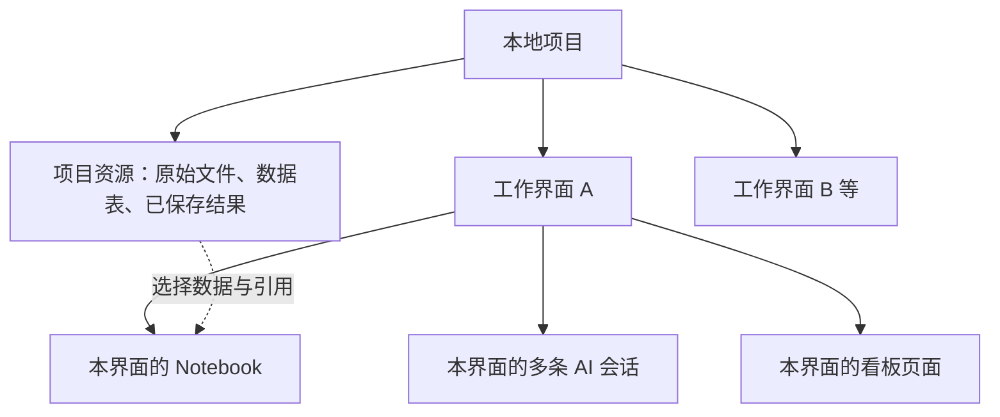

# 网站框架整理 01：工作区与项目

日期：2026-09-28。状态：讨论草案，尚未确认新站结构；没有修改网站代码、实施迁移或发布。依据当前源码静态核查，不代表重新验收了 3000 正式站。

用户计划先重新设计 UI，再逐项迁移功能。本轮只梳理第一部分的对象关系、现有能力和待决策事项；数据管理、AI、Notebook、看板和设置的细节分后续部分讨论。

## 1. 当前源码中的关系

- **本地项目**是保存和重新打开的单位，项目清单保存工作台定义与版本，原件和有类型数据表另存在项目目录。项目列表登记在服务端私有运行目录，列表登记不是项目正文。
- **工作界面**是项目内部的分析内容单位，代码以稳定 `pageId` 关联看板页面、Notebook、会话和部分数据 / 模型选择。支持新增、切换、重命名、删除；删除当前通过预览与确认处理，至少保留一个界面。
- **Notebook 与看板**按界面关联；顶部 AI 工作台 / Notebook / 看板是三种工作视图，切换视图不是新建项目或复制数据。
- **AI 会话**当前已按界面隔离，消息、草稿和当前选择随项目保存；切换界面选择该界面的会话。没有把项目内所有聊天混成同一会话。`docs/local-projects.md` 仍有旧 v6 / 项目级会话说明，本轮以源码和架构中 2026-09-23 的 v7 说明为准，未擅自更新旧文档。
- **数据资源**与界面内容分开：本地项目目录保存文件、数据表和结果；数据引用支持所属界面与共享标记，不能将项目存有该表等同于 AI 自动获准读取。选取和授权的细节留到数据管理部分。
- **语义模型、处理配方与记录**也是保存内容；模型选择存在界面归属，具体设计留到各模块整理，不在本图扩展全部字段。

## 2. 已有操作与边界

| 对象 | 当前已接入的主要操作 | 后续设计需要明确的边界 |
| --- | --- | --- |
| 本地项目 | 新建、按路径打开、最近项目、切换、退出到临时工作区 | 当前项目入口在 Data Browser 的“项目文件夹”，新站入口位置待设计；当前没有在已核查接口中发现项目级改名 / 删除动作，不能把界面改名当成项目改名 |
| 工作界面 | 新增、切换、重命名、删除预览与确认 | 名称容易与整个网站工作区混淆；新站是否继续保留这一层、如何称呼待确认 |
| 保存 | 自动保存状态、切换前等待写入、失败手动重试、版本冲突时保护当前修改 | 窗口已接受编辑不等于磁盘已保存；冲突不能直接用新窗口覆盖 |
| 恢复与备份 | 项目重新打开；工作台 JSON 导出 / 恢复；完整项目目录复制 | JSON 不含全部原件和数据行；完整数据迁移不能只拷 JSON |
| 临时工作区 | 不打开项目也可操作，保留独立浏览器工作台 | 与本地项目持久保存不同；新建空白项目不代表自动搬入全部临时内容 |

这些结论来自源码和既有文档，本轮没有操作真实项目或重跑浏览器验收。

## 3. 保存范围对迁移的影响

| 内容 | 当前保存特征 | 迁移时的要求 |
| --- | --- | --- |
| Notebook、看板、配方、语义模型、可见聊天与部分记录 | 随项目工作台定义保存 | 保留稳定 ID、引用、会话所属界面和版本兼容，不能只复制画面 |
| 导入原件、数据表、显式保存的结果 | 存在项目目录的独立文件中 | 与项目清单一起迁移并验证能重新读取 |
| Notebook 普通运行缓存 | 不作为完整运行结果写入项目清单 | 新站重开时明确区分未运行 / 已持久保存，不能承诺所有输出自动恢复 |
| 未确认草稿 / 预览 | 正式定义与待确认状态不同 | 不能将打开或迁移当成采用变更的授权 |
| 模型密钥、数据库凭据、服务器配置 | 不随项目清单保存 | 新站按配置模块单独接入，不纳入普通项目备份 |
| DSH 服务端原生会话历史 | 私有运行目录维护，与项目里的可见聊天不同 | 保留聊天记录不等于已迁移模型继续对话的内部状态，后续 AI 部分再整理 |

现状是本地单用户模式。本轮不决定将来是否采用云端存储、登录或多人协作，也不假设新旧站可以直接共享浏览器存储。

## 4. 新站结构建议（尚未确认）

用户层级建议为：**工作台入口 → 项目 → 多份分析 → AI / Notebook / 看板视图**。

- “项目”组织一个持续性目标，例如某条产线的数据分析；数据资源在项目范围管理。
- 当前“工作界面”暂建议在新站称为“分析”，例如“报警原因分析”“产量趋势分析”；这只是名称与组织建议，尚未改名或变更数据模型。
- 每份分析先沿用自己的 Notebook、看板和多条会话；多 Notebook / 多看板是否要拆成独立资产，后续按需求决定，不提前扩张迁移范围。
- 入口建议突出项目列表、新建 / 打开和最近使用；项目内部能明确看到当前分析、所选数据与保存状态。具体位置与视觉风格待 UI 设计。
- 迁移先保持现有稳定 ID 和对象关系，单独评估新增 / 改名 / 归档等产品操作，不将未实现的功能列为直接搬迁项。

待用户首先确认：**是否保留“一个项目内有多份独立分析”这一层？** 建议保留，便于同一批项目数据支持不同问题；替代结构是一个项目只承载一份分析，层级更少但拆分主题时需要更多项目。

## 5. 这一部分将来的验收清单（尚未执行）

1. 可新建 / 打开项目，识别当前项目与分析；没有数据时有明确入口。
2. 项目或分析切换后，Notebook、看板、会话及数据选择不串到另一份分析。
3. 保存完成后重开能恢复定义和持久数据，缺失文件与未保存内容有明确反馈。
4. 保存失败或版本冲突时保留编辑并提供恢复路径，不能显示虚假保存成功。
5. 新站读取旧项目后，稳定 ID、引用及会话归属保持一致；普通缓存、已保存结果和未确认草稿明确区分。

## 6. 核查入口

- [本地项目契约](../../core/projects/contracts.ts)：项目清单、文件 / 表目录及动作。
- [项目保存仓库](../../core/projects/state-repository.ts)：待保存、写入、错误与冲突恢复。
- [项目上下文](../../components/studio/projects/LocalProjectsProvider.tsx)、[项目入口](../../components/studio/projects/DataBrowser.tsx)：恢复、切换、新建 / 打开与临时模式。
- [数据产品模型](../../core/models/data-product.ts)、[工作界面管理](../../core/workspaces/workspace-manager.ts)、[界面操作](../../components/studio/workspace/pages.ts)：数据、界面、Notebook 与看板的关联。
- [会话契约](../../core/harness/assistant-sessions.ts)、[聊天协调](../../components/studio/workspace/assistant.ts)：按界面隔离和选择会话。
- [工作台保存契约](../../core/repository/studio-repository.ts)：实际保存字段。
- [本地项目说明](../local-projects.md)、[架构维护入口](../architecture/agent-architecture.md)：存储与运行边界；旧说明和新实现有差异时以上述源码及架构的现行章节为准。

本轮无代码、配置、用户数据或服务变更；只新增讨论文档与任务记录。未运行测试、构建、数据库、模型或页面操作，因为本轮没有实施功能。
