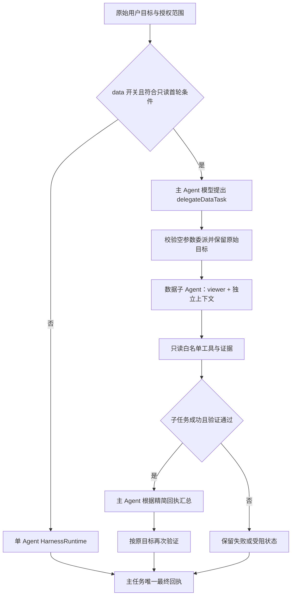

# 当前 Agent 系统框架

整理日期：2026-09-14。依据当前工作区源码与 [架构维护入口](../site/docs/architecture/agent-architecture.md)，包括当天的模型、SQL、Notebook 与保存模块重构。

## 1. 框架分层

| 层级 | 当前职责 | 主要产物 |
| --- | --- | --- |
| Web 工作台 | AI 对话、Notebook、看板、项目资源和可视化测试 | 用户目标、所选上下文、人工确认 |
| 请求与组装 | 解析请求、身份与项目授权、会话锁、幂等、配置依赖 | 当前任务的受限执行上下文 |
| Agent 协调 | 选择单 Agent 路径，或委派只读数据子任务 | 执行任务、父子关系、唯一交付 |
| Harness 执行 | 规划、选工具、运行、观察、校验与有限恢复 | 任务状态、工具事实、候选产物 |
| 模型适配 | 将模型协议映射为统一的决策接口 | 结构化动作与真实用量 |
| 业务执行 | 数据、语义查询、EDS、Notebook、SQL、导出与图表预览 | 结果表、结果引用、ChangeSet |
| 状态与存储 | 正式工作区、项目文件、会话摘要、保存队列和查询日志 | 可恢复定义、版本和审计记录 |

预算、授权复查、取消、证据和事件贯穿执行过程。Agent 提出行动，程序负责工具参数、权限和完成条件的验证。

## 2. 主 Agent 与子 Agent 怎么管理

### 当前默认路径

`Web 请求 → handler → CoordinatedHarness → HarnessRuntime → 模型/工具循环 → 验证 → 回执`

默认 `HARNESS_MULTI_AGENT_MODE=single`。普通任务、追问和页面修改沿用单 Agent 执行。`CoordinatedHarness` 是确定性的协调程序；模型在允许的范围内选择动作，不能自行创建任意角色或扩大权限。

### 当前可选多 Agent 路径

委派条件：首轮复杂只读数据任务；计划工具全部在数据角色白名单内；不涉及页面/视觉修改、配方执行、Notebook、导出、分析计划、外部调用或待承接历史上下文。可用模型调用上限少于 4 次时保持单 Agent。

一个主任务目前最多委派 **一个** 数据子任务，串行运行。子任务不能递归委派，不能修改页面、导出或调用外部 MCP。主子任务可使用同一模型，但输入、工作记忆与证据命名空间独立。

子任务返回精简回复、工作记忆、最近工具观察和证据 ID；主 Agent 不重新接收子任务的全部对话。子任务完成且有实际工具证据、Verifier 通过后，主 Agent 才能汇总；最终汇总还要按原始目标再次验证。

当前没有根据任意专长动态选择专家、根据上下文预计长度自动拆任务、并发调度、跨角色接力或依赖图执行。这些属于下一阶段能力。

## 3. Context Runtime 目前是什么

已经有上下文运行管理能力，主要分布在 `context-selector.ts`、执行器、会话存储和协调器中；目前没有一个包办所有上下文的独立 `ContextRuntime` 类。

| 上下文 | 来源与使用 | 边界 |
| --- | --- | --- |
| 任务上下文 | 原始目标、当前页面、相关数据源/字段、所需工具与 Skill | 按任务挑选，不默认载入全部原始行 |
| 工作记忆 | 已确认字段、已完成步骤、关键统计、失败尝试和待办 | 随循环维护；历史结论需要按本轮事实复核 |
| 工具观察 | 有界工具结果和摘要 | 限制字符、条目与总输入，避免持续堆积 |
| 主会话 | 身份/项目/页面/会话命名空间、最近 10 轮、滚动摘要 | 已建立会话由服务端维护；子任务不写入主会话 |
| 子任务上下文 | 保留原始目标，缩小数据、配方与工具范围 | 清除主会话 ID/历史；权限固定 viewer |
| 大结果 | 数据执行层、Notebook 表格、产物/证据引用 | 已有若干专用引用，尚无统一跨角色产物读取协议 |

输入预算在请求模型前检查。默认复杂任务的单次输入上限为 10,000 字符，简单只读任务为 7,000 字符；总输入和 Token 另有限制，服务配置和任务类型会共同决定有效额度。限制会导致任务受阻或失败，并不会自动生成更多子 Agent。

## 4. 模型、Skill 与工具如何分工

**模型接口。** `HarnessRuntime` 与协调器依赖 `HarnessModel`。`next` 必需，`classifyIntent` 和 `plan` 可选；可选方法缺失时使用已有规则路径。现有 DeepSeek HTTP 请求、模型标识/Token 校验和动作解析集中在服务端适配器，`harness-composition.ts` 注入模型工厂。旧 `deepseek-harness.ts` 是兼容入口，内部委托唯一执行器。

**Skill。** 当前有 `data-visualization`、`eds-analysis`、`dashboard-editing`、`workbook-analysis` 四类项目内 Skill，说明如何处理对应任务，由运行时按需加载。Skill 不等于一个独立 Agent，也不会自动增加渲染器、数据库或新的权限。

**工具。** 当前静态协议有 21 个受控工具名，实际每轮目录会裁剪。工具参数经过 Schema 和授权检查后才调用数据、Notebook 等模块；不是给模型直接开放 shell 或任意代码执行。数据子 Agent 只能使用其中 8 个只读工具。

**事件。** 前端 SSE 展示的是结构化执行事件，不是模型逐 Token 输出。整个主任务保留一个连续事件序列，最终事件携带唯一任务回执；子任务结束不直接关闭用户会话。

## 5. 一次图表生成怎样走完

1. 用户输入图表问题并选择数据上下文。
2. 主 Agent 读取数据概况、确定指标、分组与图表类型。
3. 工具产生经过校验的 `ChangeSet`，任务进入 `awaitingConfirmation`。
4. 浏览器计算数据绑定并展示预览；正式工作台由用户确认后才应用到正式 AppSpec。
5. 保存与审计层记录被采用的工作区状态，模型回复本身不等于页面已经修改。

当前网页图表由 **Recharts** 渲染，支持柱状图、折线图、面积图、饼图、环形图。已有图表组件、数据绑定、预览/确认各自有模块，但尚未完成可替换渲染器的全面解耦。

### 可视化测试页

`/visualization-lab` 使用专用 SSE 入口、48 行固定零售合成数据、独立空画布和独立幂等键。服务端重建上下文，拒绝项目请求头和附件，不继承 Notebook 或主会话，不接入外部 MCP，固定使用现有主 Agent。

收到候选后独立核对图表类型、数据绑定、分组、数值、完整覆盖和顺序；DOM 仅确认图形元素出现。标题、单位、标签、配色及窄屏可读性留给人工评定。测试页没有正式应用按钮，最近 8 次结果在当前标签页保存，可下载 JSON 报告。

原工作台截图服务不能代表测试候选，所以测试入口没有注入该截图验证器。不能把“规则通过”写成“图表视觉质量已通过”。

## 6. Notebook 与 SQL 执行链路

人工编辑与 Agent 草稿共用 `core/notebook/definition.ts` 的定义。当前 8 种单元是 `data`、`semanticQuery`、`table`、`sql`、`warehouseSql`、`chart`、`transform`、`text`。

`定义与依赖图 → executeNotebook → 查询/配方处理 → NotebookTable 与 resultRef → 图表/表格 → 可选 Dataset/看板快照`

`server/execution.ts` 管单元依赖、结果血缘、失败传播与大小限制，通过显式 query/log 接口工作；`server/runtime.ts` 组装默认本地 DuckDB 和查询日志。远端连接查询和授权由请求入口注入。旧 Harness Notebook 契约只重导出同一份定义，没有第二套 Schema。

远端 SQL 由 `ConnectionQueryService` 管授权、并发、超时与返回前撤权复查，通过 `ConnectionDriver` 调 PostgreSQL 或 Databricks。服务由组装入口共享，避免每个请求重建并发额度；驱动实现方言、连接/statement 和取消，公共结果映射保留精确数值与截断标记。

Agent 生成 Notebook 草稿后可以使用同一运行时试运行，用户采用草稿前检查文档版本。Notebook 的依赖图是**单元依赖图**，不能据此宣称已实现多 Agent 依赖图。

## 7. 项目与保存层

| 状态所有者 | 当前责任 |
| --- | --- |
| `StudioWorkspace` | 正式文档、确认/撤销、审计、恢复和 Repository 选择 |
| `useStudioPersistence` / `StudioPersistenceController` | 生命周期适配、快照、可取消的自动保存调度与失败通知 |
| `ProjectStateRepository` | 快照接受、400 ms 合并、串行修订、dirty/冲突冻结 |
| `ProjectStateWriter` / `client.ts` | 对明确的项目 handle/state/revision 执行 HTTP 写入 |
| `LocalProjectsProvider` | 当前项目、保存状态、切换前 flush 与明确放弃 |
| 服务端项目库 | 项目清单、原件、表数据、结果快照与引用保护 |

临时工作区沿用浏览器 v5 状态与临时数据 TTL；本地项目持久保存定义及表数据，项目表没有临时 TTL。`save()` 接受快照并不代表磁盘写入完成，异步状态或 `flush()` 才表达持久完成。主会话、Notebook 查询日志、项目文件和浏览器状态是不同存储，不能混称同一份“Agent 记忆”。

## 8. 证据、预算与边界

- 工具结果进入 Evidence Bus；父子证据带各自标识，验收依赖实际事实和完成条件。
- 主子共享调用、输入与 Token 预算，并预留主 Agent 汇总；失败不重置额度。
- 取消信号传播到执行链；统一截止时间约束迟到结果，避免任务结束后继续写回。
- 失败说明可以解释已完成步骤和缺少条件，但保留 failed/blocked、原始错误与终止代码；自然语言解释不是完整的事实证明。
- 本机项目权限与 viewer/editor 操作权限已有实现；当前仍是本机单用户系统，尚不是公网多租户或企业 RBAC 平台。

完整状态与后续建议见 [03-状态与后续计划.md](03-状态与后续计划.md)。
