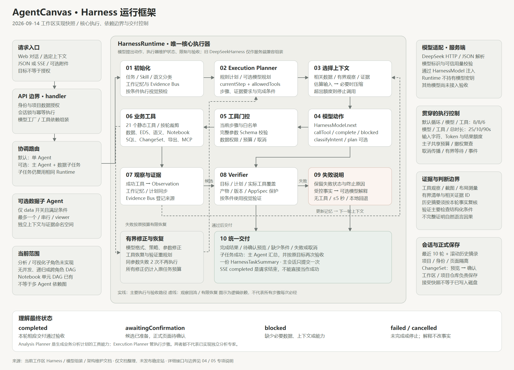

# Harness 运行框架 · 2026-09-14

这是对当前工作区实现的专项整理，补充 [Agent 总框架](01-Agent系统框架.md)。内容包含 9 月 14 日尚未提交的重构；唯一持续维护入口仍是 [agent-architecture.md](../site/docs/architecture/agent-architecture.md)。本文件是日期快照，不表示稳定站已发布。

**当前 Harness 的职责，是把模型提出的行动变成有范围、有预算、可验证、可追踪的任务执行。** 它负责上下文选择、规划约束、工具执行、结果观察、验证、恢复和交付；模型通过统一接口参与决策，业务模块负责实际计算或生成候选产物。

图示是逻辑依赖，框中的能力不一定各自对应独立类。可编辑逻辑图见 [Mermaid 文件](Harness运行框图.mmd)，可缩放展示见 [SVG](Harness运行框图.svg)。

## 1. Agent、模型与 Harness 的关系

| 概念 | 当前实现 | 负责什么 |
| --- | --- | --- |
| 主 Agent / 数据子 Agent | `CoordinatedHarness` 及角色注册 | 在允许范围内委派、执行、验证和汇总；当前最多一个只读数据子任务，串行运行 |
| Harness 执行器 | `HarnessRuntime` | 维护任务状态、执行循环、证据、调用预算、超时、取消和最终结果 |
| 模型接口 | `HarnessModel` | 返回语义分类、计划或结构化下一步动作；不拥有业务数据写入权限 |
| 模型适配器 | `DeepSeekHarnessModel` | 处理提供方 HTTP、模型 ID、Token 用量、JSON 和动作格式 |
| 工具与 Skill | 工具注册表、四类项目内 Skill | 工具执行受控操作；Skill 提供任务方法和领域说明，不等于独立 Agent |

`core/harness/runtime.ts` 是唯一核心执行实现。`core/harness/deepseek-harness.ts` 目前只是旧服务端入口的兼容组装，不是另一套执行循环。默认仍使用单 Agent；可选数据子 Agent 复用同一个 Runtime。

## 2. 从输入到交付的主链路

| 步骤 | 程序行为 | 关键边界 |
| --- | --- | --- |
| ① 请求接入 | AI 工作台通过 JSON 或 SSE API 提交目标、当前界面、选定上下文及可选附件 | 前端角色选择和连接权限声明不能替代服务端身份与授权 |
| ② 服务端准备 | `handler.ts` 解析请求、解析项目仓库、重建授权范围，处理主会话锁与幂等 | 同一会话禁止重叠执行；相同幂等键不能对应不同内容 |
| ③ 依赖组装与路由 | `configureDeepSeekHarness` 注入模型工厂；`CoordinatedHarness` 选择单 Agent 或数据委派 | Runtime 本身不读取模型密钥，也不创建 DeepSeek HTTP 客户端 |
| ④ 初始化 | 创建任务、选择相关数据与 Skill、建立工作记忆、初始计划与 Evidence Bus | 模型客户端可按执行边界惰性创建；可选语义分类参与任务判断 |
| ⑤ 规划 | 按需执行视觉预检；模型具备 `plan` 时尝试动态规划，否则沿用规则计划 | 动态计划仍受现有工具序列与协议约束，不是任意任务 DAG |
| ⑥ 每轮选上下文 | 选择本轮目标、当前步骤、允许工具、近期观察和有限证据，估算输入；必要时压缩 | 压缩后仍超预算会停止，不无限累积历史或扩大额度 |
| ⑦ 模型与工具 | 模型返回 `callTool`、`complete` 或 `blocked`；执行器检查工具是否允许，再验证参数与权限 | `callTool` 不等于工具已经执行成功；不允许绕过 Planner 当前步骤 |
| ⑧ 观察与验收 | 成功工具结果形成 Observation、更新工作记忆/计划并登记证据；候选交付进入 Verifier | 工具失败走有限恢复；模型宣称完成不直接决定成功状态 |
| ⑨ 统一交付 | 生成 `HarnessTaskSummary`，提交主会话，输出终止事件和聊天回复 | 页面变更先产生预览，用户确认后才应用；失败解释不改变任务失败事实 |

执行过程中可以多次往返 ⑥—⑧。模型格式纠正、工具参数纠正、恢复与验证重规划都受原任务总预算约束。

### 两种 Planner 的区别

| 模块 | 用途 | 输出与使用方 |
| --- | --- | --- |
| `execution-planner.ts` | 控制当前任务先执行哪一步、当前能用什么工具、需要哪些证据 | `HarnessExecutionPlan`：步骤、当前步骤、`allowedTools`、状态、计划来源和重规划原因；供 Runtime 执行 |
| `analysis-planner.ts` | 把业务分析目标整理为可校验的分析步骤与交付物 | `createAnalysisPlan` 工具产生分析计划产物，并可衔接 Notebook 草稿 |

Analysis Planner 已有实现，但它不是额外的分析子 Agent。当前尚未实现多角色之间的动态分析调度。

## 3. 上下文与记忆如何管理

上下文能力分布在选择器、Runtime、会话存储及协调器中，当前没有统一包办这些能力的 `ContextRuntime` 类。

| 信息 | 管理位置 | 处理方式 |
| --- | --- | --- |
| 本轮任务上下文 | `context-selector.ts` | 按目标挑选数据源/字段、可编辑节点、工具目录和 Skill，通常不输入完整原始行 |
| 工作记忆 | `buildHarnessWorkingMemory` 与任务回执 | 记录已完成步骤、确认字段、关键统计、待办和失败尝试；供后续轮次使用 |
| 最近工具观察 | Runtime + 上下文选择器 | 保留有限摘要与有界结果；大结果交给领域执行/产物层，不持续追加完整输出 |
| 对话连续性 | `HarnessConversationStore` | 最近 10 轮问答、最多 2,000 字符滚动摘录、最近任务和工作记忆；已知会话以服务端记录为准 |
| 主子任务隔离 | `CoordinatedHarness` | 数据子任务清除主会话 ID/历史，收窄数据与工具范围；不把子任务完整对话写回主会话 |
| 证据上下文 | `HarnessEvidenceBus.modelContext` | 输入有限清单/摘录；避免再次把工具原始结果整份塞回模型 |

会话摘要是确定性的历史摘录，不是额外的模型记忆推理；历史回复不能证明当前数据、权限或计算结果仍有效。会话最多 100 条，30 天未更新的记录在后续访问时清理；配置私有状态目录时可持久化，否则为内存模式。

项目定义、会话摘要、查询日志和工具证据有不同的所有者与保存范围，不能统一称为一份永久记忆。原始工作簿/图片也不会因为聊天记录存在而自动恢复。

## 4. 工具、领域执行与模型适配

当前工具协议包含 21 个静态名称；每轮仅提供当前允许的子集。完整清单见 [模块索引](02-模块与代码索引.md)。主要可分为：

- 数据与工作簿读取：数据概况、字段质量、EDS 汇总、授权原始工作簿扫描/查询。
- 语义与分析：语义指标查询、分析计划、Notebook 草稿、授权连接字段目录。
- 数据处理与交付：表格处理、DataRecipe 预览/验证、Excel 导出。
- 页面预览：页面结构检查、通用 ChangeSet 与 EDS 图表/表格预览。
- 外部能力：通过 `callMcpTool` 进入已配置、已批准的 MCP 工具范围。

四类 Skill 是 `data-visualization`、`eds-analysis`、`dashboard-editing`、`workbook-analysis`。它们按目标和语义选择加载，不自动引入新权限、渲染器或外部连接。

`HarnessModel.next` 为必需方法，`classifyIntent` / `plan` 可选。模型适配在服务端完成，当前文本实现仍是 DeepSeek；已有统一接口不代表其他供应商已经接入或验收。图片经独立视觉能力转换为证据，不是假设文本适配器拥有原生图片能力。

Notebook 和数据库属于业务执行层：Notebook 定义已归入 `core/notebook/definition.ts`，执行用例通过 query/log 接口工作；连接查询服务经 PostgreSQL / Databricks 驱动执行。人工操作和 Agent 使用共用业务能力，但授权和输入检查仍按各自入口执行。数据子 Agent 当前不能执行 Notebook、配方、导出、页面修改或外部 MCP。

## 5. Evidence + Verification 已做到什么

**Evidence Bus 已有实现。** 它登记工具观察、截图及其他执行阶段证据，清单包含 ID、类型、阶段、来源、摘要、时间及可选哈希/相关证据 ID。单次任务回执保留有界 manifest；子任务使用独立命名空间。当前 Bus 是任务内证据管理，不是永久证据数据库，也不是所有产物的统一下载服务。

**Task Verifier 已有实现。** 它按原始目标、计划、实际工具观察及候选产物检查完成条件，包括工具覆盖、结果/产物、语义模型版本和正式 AppSpec 保护等。通过才可接受相应交付；未通过可有限重规划或结束失败。

**Visual Verifier 是可选能力。** 配置且任务需要时使用截图、DOM/布局测量和视觉模型证据。页面变更预览与确认后最终渲染的验收不能混为一谈；`awaitingConfirmation` 不表示正式页面已经改动或最终视觉验收已完成。可视化测试页有独立的合成画布和数值校验，不使用指向另一工作台的截图作为测试图表证据。

目前 Verifier 主要核对结构化条件，不能完整证明自然语言中的每个数字、原因或建议。Evidence 存在、工具成功或模型措辞流畅，都不能单独证明业务结论正确。

## 6. 失败、恢复与自然语言回复

| 机制 | 当前上限或规则 |
| --- | --- |
| 模型 JSON/动作格式修正 | 最多 1 次，格式错误携带的实际用量继续记账 |
| 模型动作策略修正 | 最多 1 次，仍受当前计划和任务预算限制 |
| 工具参数修正 | 最多 1 次 |
| 工具恢复重规划 | 最多 2 次；同一工具相同参数失败 2 次后，不再执行第三次 |
| Verifier 重规划 | 最多 2 次；并非所有失败都会进入此分支 |
| 工具失败后的模型解释 | 条件满足时最多额外 1 次无工具调用；最多 5 秒，同时受剩余时间、调用和上下文额度限制 |

失败解释只使用原始目标与受控失败事实，成功进度来自工具事件和固定说明，不发送原始工具错误或数据行。可接受的解释写入 `resultMessage`；内部 `state`、`error`、`terminationCode` 继续保留。模型解释本身失败、超时、不合规或没有预算，就使用本地说明，不重复请求解释。

接口本身异常、用户取消、严格评测策略禁止解释等情况直接使用相应本地处理。解释调用前仍复查授权；取消可中断解释。前端网络/认证错误也转换为可读说明；当前聊天已有同一说明时不再重复显示红色错误卡，重试明确创建新任务。

例：读取数据集概况成功、后续工具失败时，可以回复“目前只读取到了数据集概况，后续步骤还没有结果”，同时维持失败状态。现有自然语言检查只能拦截明显的成功冒报、泄密和部分无依据诊断，不能充当完整事实核验。

## 7. 预算与状态

以下为源码默认值，**不是每个请求都能用满的额度**；服务端配置、任务复杂度、共享预算及剩余时间共同决定有效限制。

| 执行预算 | 默认值 |
| --- | ---: |
| 循环 / 模型调用 / 工具调用 | 8 / 8 / 6 次 |
| 单次模型 / 单次工具 / 任务总时长 | 25 / 10 / 90 秒 |
| 浏览器等待上限 | 95 秒 |

| 上下文预算 | 简单只读任务 | 多步骤任务 |
| --- | ---: | ---: |
| 单次输入字符 | 7,000 | 10,000 |
| 单次工具观察字符 / 条目 | 2,400 / 12 | 4,000 / 16 |
| 累计输入字符 | 12,000 | 96,000 |
| 累计 Prompt Token | 3,500 | 48,000 |

主子 Agent 使用共享账本，为主 Agent 汇总预留调用；取消传播到子任务。失败不能重置额度；用量未知时保守记账。当前没有自动扩容、自动无限重试或按预计上下文自动拆出更多 Agent。

| `task.state` | 含义 |
| --- | --- |
| `planning` / `executingTool` / `observing` | 仍在规划、工具执行或观察中 |
| `completed` | 本次任务相应交付被接受；不等于所有任务都修改了页面 |
| `awaitingConfirmation` | 候选预览/草稿已准备，等待用户确认 |
| `blocked` | 缺少必要上下文、数据或能力条件 |
| `failed` | 本轮执行、协议、预算或验证未通过 |
| `cancelled` | 本轮已经停止；取消不保证回滚已发生的外部副作用 |

## 8. SSE、会话与正式保存

SSE 当前传输结构化执行事件：开始、上下文、计划、工具、验收、状态和最终回执。终止事件类型 `completed` 只表示请求结束，必须再看 `task.state`；不能把所有终止事件画成绿色成功。协议保留 `answer_delta` 类型，但当前没有输出逐 Token 答案。

幂等缓存是进程内机制，最多 100 条、完成后按 10 分钟 TTL 淘汰；重启后不保证跨进程 exactly-once。相同键可重订阅不代表断网后自动恢复执行。

主会话在任务结束后提交一次，数据子任务不单独写入主会话。正式看板仍通过 ChangeSet 的预览/确认应用，保存交给工作台与项目仓库；`ProjectStateRepository.save()` 接受快照不等于磁盘已经写完，异步状态或 `flush()` 表达持久完成。

## 9. 当前启用与验证边界

- 默认路径是单 Agent；只有服务端 `HARNESS_MULTI_AGENT_MODE=data` 且满足保守路由条件时，才尝试一次只读数据委派。Live 评测与可视化测试页固定单 Agent。
- 分析/可视化独立子 Agent、并发/递归委派、跨角色 DAG 和统一产物读取协议仍为规划。Notebook 单元 DAG 不等于多 Agent DAG。
- 上下文选择、工具、规划和验证仍含业务判断，尚不是完全插件化内核。远端数据库接口已实现，不等于真实 PostgreSQL / Databricks 联调已通过。
- 9 月 14 日最新持久化重构记录的 977 项离线测试、14 项工具测试属于**历史验证**。先前两个复杂真实 Agent 用例未通过；单次真实折线图成功与失败解释小样本通过不能替代整体 Agent 质量评测。
- 本次仅核对源码、文档、图示和链接，不调用模型、不连接数据库、不重跑业务测试或构建。当前整理不包含任何上线操作；稳定站状态以独立发布记录为准。

接口、排查路径与源码链接见 [05-Harness接口与排查索引.md](05-Harness接口与排查索引.md)；本次来源摘要与文档检查结果见 [Harness核对记录.json](Harness核对记录.json)。
