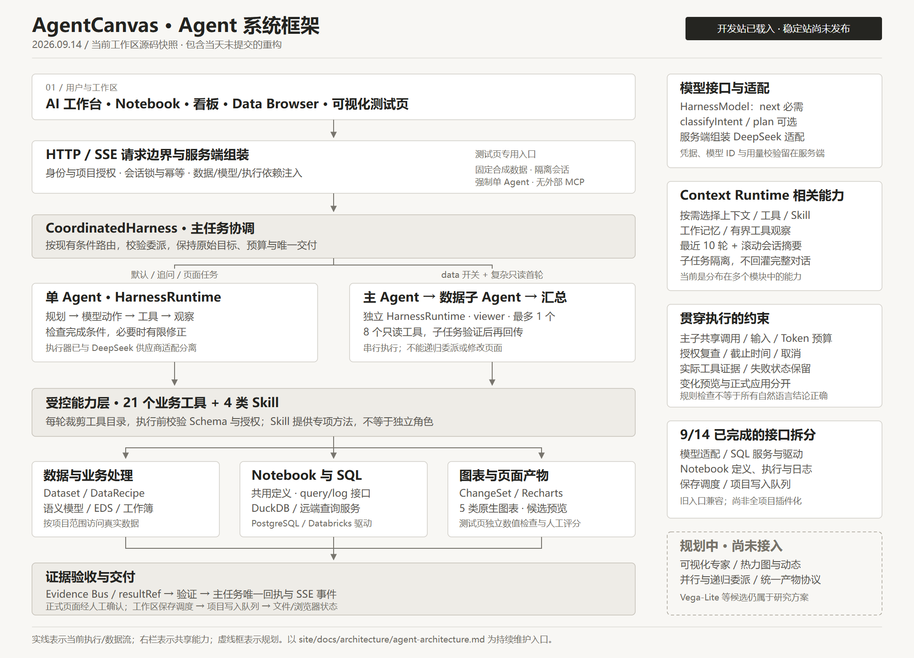

# AgentCanvas 系统框架 · 2026-09-14

本文件夹整理 **2026 年 9 月 14 日工作区中的实际框架**，包含当天尚未提交的重构。当前基线分支为 `feature/eds-analysis-dashboard`，HEAD 为 `15ebdae`；该提交号不能单独代表本次整理的全部代码。

当前系统可以概括为：**Web 工作台 + 主 Agent 执行框架 + 可选只读数据子 Agent + 受控工具与数据执行层 + 证据、确认和持久化。** 模型、数据库、Notebook 执行和保存队列已建立明确接口；分析/可视化专家与并行多 Agent 仍在规划中。

## 阅读入口

| 文件 | 内容 |
| --- | --- |
| [系统框图.png](系统框图.png) | 适合直接查看、展示的总览图 |
| [01-Agent系统框架.md](01-Agent系统框架.md) | 主子 Agent、Context Runtime、执行链路、Notebook 与持久化 |
| [02-模块与代码索引.md](02-模块与代码索引.md) | 模块职责、接口、21 个工具、4 类 Skill 及代码入口 |
| [03-状态与后续计划.md](03-状态与后续计划.md) | 当前能力、开关、历史验证、已知问题与后续顺序 |
| [系统框图.svg](系统框图.svg) / [系统框图.mmd](系统框图.mmd) | 可缩放排版图 / 可编辑 Mermaid 逻辑图 |
| [快照清单.json](快照清单.json) | 整理时间、源码指纹、相关文件摘要与本次检查结果 |
| [04-Harness运行框架.md](04-Harness运行框架.md) | Harness 专项：执行循环、两类 Planner、上下文、证据验证、失败处理、预算与状态 |
| [05-Harness接口与排查索引.md](05-Harness接口与排查索引.md) | 请求/模型/工具/回执接口、源码阅读顺序、常见失败排查与扩展边界 |
| [Harness运行框图.png](Harness运行框图.png) / [SVG](Harness运行框图.svg) / [Mermaid](Harness运行框图.mmd) | 展开核心执行器的专项图示 |
| [Harness核对记录.json](Harness核对记录.json) | 本次 Harness 补充的来源摘要与文档/图示核查记录 |

建议先看框图，再阅读系统框架；需要继续开发时查模块索引。

本次新增的 Harness 专项从已拆分的 `HarnessRuntime` 出发，展开总图中的执行器内部。原 01—03 文档和系统总图保持作为同日总览；两种视角相互补充。

排版框图的主线以 Agent 请求为视角；人工 Notebook、资源管理和看板编辑也直接使用相应业务模块，并不要求每次操作都调用 Agent。

## 这份整理的边界

- 这是按日期保存的文档快照，不是源码备份、可执行安装包或稳定站发布包。
- 唯一持续维护入口仍是 [Agent 架构文档](../site/docs/architecture/agent-architecture.md)。以后架构改变先更新该入口，再按需要产生新的日期快照，避免把这份历史资料当成最新状态。
- 代码链接指向同一工作区的 `site/`；单独复制此文件夹仍可阅读正文和框图，查看源码需要保留原工作区。
- 本次没有调用真实模型或远端数据库，也没有重跑应用测试和构建。文内明确区分本次检查与之前的验收记录。
- 本次只新建文档与图示，并追加根目录 [任务日志](../TASK-LOG.md)；未更改运行配置或发布网站。

